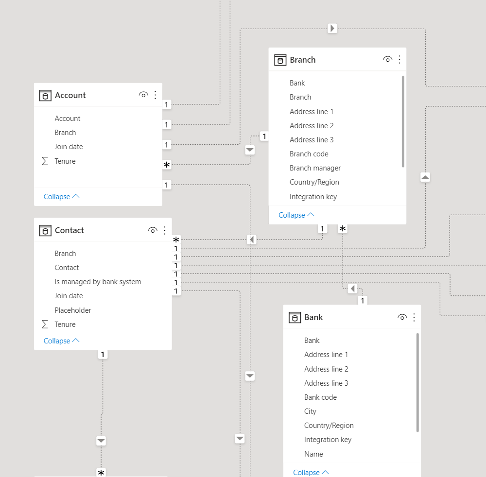

In this exercise, you will learn about the Unified customer profile (UCP) data tables.

The UCP data model is built atop the FinancialServiceCommon and RetailBankingCoreDataModel layers in Dataverse. Visit [FSI docs for Data model link](/common-data-model/schema/core/industrycommon/financialservices/overview/?azure-portal=true) on Microsoft Docs to learn more about the FSI data model.

## Task 1: Understand customer and bank data and relationships

In this task, you will explore the main tables related to Unified customer profile. Select each table name to navigate to the Microsoft Docs page that goes into detail about each table.

### UCP table definitions  

- [Contact](/common-data-model/schema/core/industrycommon/financialservices/financialservicescommondatamodel/contact/?azure-portal=true)(customer): Person with whom a business unit has a relationship, such as customer, supplier, and colleague.

- [Account](/common-data-model/schema/core/industrycommon/financialservices/financialservicescommondatamodel/account/?azure-portal=true): Business that represents a customer or potential customer. The company that is billed in business transactions.

- [Bank](/common-data-model/schema/core/industrycommon/financialservices/financialservicescommondatamodel/bank/?azure-portal=true):                   The bank that the branch is associated with.

- [Branch](/common-data-model/schema/core/industrycommon/financialservices/financialservicescommondatamodel/branch/?azure-portal=true): The branch of the main bank, when borrower applies for a loan at a branch

See next page for the UCP Entity Relationship Diagram.

> [!div class="mx-imgBorder"]
> 

## Task 2: Understand life event data tables and relationships

In this task, you will understand the main tables related to Life event data. Select each table name to navigate to the Microsoft Docs page that goes into detail about each table.

### Life event data table definitions

- [Life Moment](/common-data-model/schema/core/industrycommon/financialservices/retailbankingcoredatamodel/lifemoment/?azure-portal=true): Significant milestones in a customer's personal life, which can impact their financial situation, such as attending college, marriage, having a child, retirement, etc.  

See next page for the Life event data Entity Relationship Diagram.

> [!div class="mx-imgBorder"]
> 

## Task 3: Understand financial data tables and relationships

In this task, you will understand the main tables related to customer financial data, including different types of financial holdings, financial instruments, and customer financial holdings. Select each table name to navigate to the Microsoft Docs page that goes into detail about each table.

### Financial data table definitions

- [Financial holding](/common-data-model/schema/core/industrycommon/financialservices/retailbankingcoredatamodel/financialholding): Accounts, loans, investments, credit lines, and savings accounts held by a customer.

- [FH loan](/common-data-model/schema/core/industrycommon/financialservices/retailbankingcoredatamodel/fh_loan):                                            Loans held by the customer with the financial institution.
  
- [FH saving](/common-data-model/schema/core/industrycommon/financialservices/retailbankingcoredatamodel/fh_saving):                                        Savings accounts held by the customer at the financial institution.
  
- [FH line of credit](/common-data-model/schema/core/industrycommon/financialservices/retailbankingcoredatamodel/fh_creditline): A deposit account holding that allows the holder to make deposits and withdrawals through financial holding instruments. An account can be interest bearing.
  
- [FH investment](/common-data-model/schema/core/industrycommon/financialservices/retailbankingcoredatamodel/fh_investment): A deposit account holding that allows the holder to make deposits and withdrawals through financial holding instruments. An account can be interest bearing.
  
- [FH account](/common-data-model/schema/core/industrycommon/financialservices/retailbankingcoredatamodel/fh_account): A deposit account holding that allows the holder to make deposits and withdrawals through financial holding instruments. An account can be interest bearing.
  
- [Financial holding instrument](/common-data-model/schema/core/industrycommon/financialservices/retailbankingcoredatamodel/financialholdinginstrument): A deposit account holding that allows the holder to make deposits and withdrawals through financial holding instruments. An account can be interest bearing.
  
- [FI direct debit](/common-data-model/schema/core/industrycommon/financialservices/retailbankingcoredatamodel/fi_directdebit): An automated payment system whereby an account holder authorizes a creditor to debit the customer's bank account at regular intervals.
  
- [FI standing order](/common-data-model/schema/core/industrycommon/financialservices/retailbankingcoredatamodel/fi_standingorder): An instruction order from an account holder for a set amount of money to be removed from an account at regular intervals and paid to or transferred to another account.
  
- [FI card](/common-data-model/schema/core/industrycommon/financialservices/retailbankingcoredatamodel/fi_card):                                            An instruction order from an account holder for a set amount of money to be removed from an account at regular intervals and paid to or transferred to another account.
  
- [FI overdraft](/common-data-model/schema/core/industrycommon/financialservices/retailbankingcoredatamodel/fi_overdraft): An extension of credit associated with a checking account allowing the account holder to continue withdrawing funds when an account reaches zero.
  
- [Customer financial holding](/common-data-model/schema/core/industrycommon/financialservices/retailbankingcoredatamodel/customerfinancialholding): Financial holdings owned by the customer.

See next page for the Financial Data Entity Relationship Diagram.

> [!div class="mx-imgBorder"]
> 

## Task 4: Understand connections data tables and relationships

In this task, you will understand the main tables related to customer connections, including groups (for example: households) and relationships. Select each table name to navigate to the Microsoft Docs page that goes into detail about each table.

### Connections data table definitions

- [Group](/common-data-model/schema/core/industrycommon/financialservices/retailbankingcoredatamodel/group/?azure-portal=true): An association of several customers allowing, for example, the representation of households

- [Group member](/common-data-model/schema/core/industrycommon/financialservices/retailbankingcoredatamodel/groupmember/?azure-portal=true): An association between a customer and a Group
  
- [Group Financial Holding](/common-data-model/schema/core/industrycommon/financialservices/retailbankingcoredatamodel/groupfinancialholding/?azure-portal=true): Financial holdings associated with a Group, to be included in the group's total assets and liabilities.
  
- [Relationship](/common-data-model/schema/core/industrycommon/financialservices/retailbankingcoredatamodel/relationship/?azure-portal=true): Denotes an association between one contact to another (not as part of the larger group) where there is not necessarily a direct association of finances. For example, a spouse, lawyer, child, or grandparent.

See next page for the Connections Data Entity Relationship Diagram.

> [!div class="mx-imgBorder"]
> 

