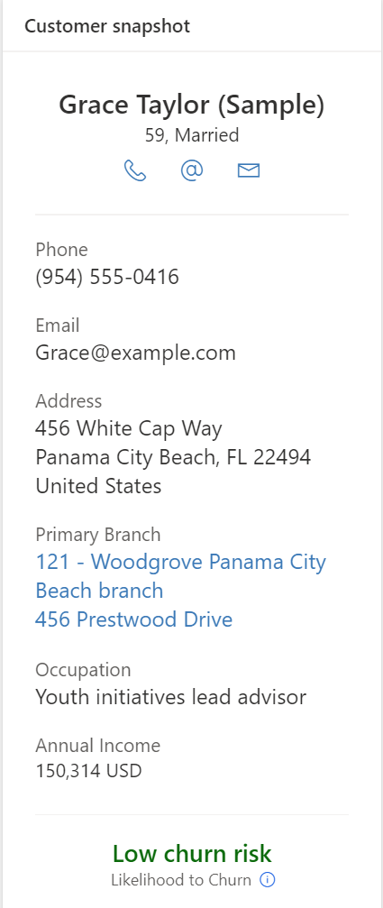
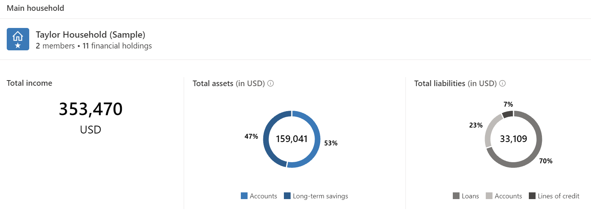

In this exercise, you will launch the Unified customer profile application and navigate through the tabs and controls to understand each component and how it wires to the Data Model behind.

1.  Navigate to [Power Apps](http://make.powerapps.com/?azure-portal=true) in an In-Private or Incognito window.

1.  Select the proper **Environment** in the upper right.

	> [!div class="mx-imgBorder"]
	> 

1.  In Power Apps, select **Apps** in the left sitemap. Select and open **Unified customer profile**.

	> [!div class="mx-imgBorder"]
	> 

1.  It should launch the application in a new tab and you should land in the **Contacts** view showing a list of all contacts.

	> [!div class="mx-imgBorder"]
	> 

1.  Select **Grace Taylor (Sample)** to open up the record in the application. This should launch the **Unified customer profile** form for the customer.

	> [!div class="mx-imgBorder"]
	> 

Now that the UCP form has loaded, we will explore all the tabs on the form and its controls one by one.

## Task 1: Explore the summary tab

The **Summary** tab consists of the below PCF controls that are componentized to provide the flexibility to choose and customize the views you want to develop.

	-   Customer Snapshot
		
	-   Life events
		
	-   Financial Holdings
		
	-   Main Household
		
	-   Cards

1.  Examine the **Customer Snapshot** control. The snapshot of the customer shows personal information (for example, name, demographics, and branch information) and the preferred channel of communication. 

	> [!NOTE]
	> The Customer snapshot area can be enriched with customer intelligence-driven information like churn score. This information is enabled through Customer Intelligence add-in for UCP which will be covered in another lab. 
	
	See the information showing up on the control and the Dataverse table columns it is derived from.

	> [!div class="mx-imgBorder"]
	> 

	| Customer snapshot field                                 | Table column mapping                                             |
	|---------------------------------------------------------|------------------------------------------------------------------|
	|     Grace   Taylor(Sample)                              |     Contact.fullname                                             |
	|     59,Married                                          |     Contact.Birthdate,   Contact.familystatuscode                |
	|     Symbols   for Preferred symbols of communication    |     Contact.preferredcontactmethodcode                           |
	|     Phone                                               |     Contact.telephone1                                           |
	|     Email                                               |     Contact.emailaddress1                                        |
	|     Address                                             |     Contact.address1_composite                                   |
	|     Primary   Branch                                    |     Contact.msfsi_branch                                         |
	|     Occupation                                          |     Contact.jobtitle                                             |
	|     Annual   Income                                     |     Contact.annualincome                                         |

1.  Examine the **Life events** control. It provides insight into the customer and their family's past and future milestones. It can help identify upcoming opportunities, devise personalized offers, and provide a consistent engagement experience. Each category in the Life events area, such as Marital Status, can include multiple Life event entries.

	See the information showing up on the control and the Dataverse table columns it is derived from.

	> [!div class="mx-imgBorder"]
	> 

	| Life event           | Table column mapping                                                                                                                         |
	|----------------------|----------------------------------------------------------------------------------------------------------------------------------------------|
	|     Family           |     msfsi_lifemoment.msfsi_lifemomentcategory           (Only Birthday Life event category maps to Contact.birthdate   field)                |
	|     2   events       |     Number   of Life event records in that Life event Category                                                                            |
	|     Grandchild       |     msfsi_lifemoment.msfsi_lifemomenttype                                                                                                    |
	|     5   years ago    |     Time elapsed since last event in that Life event Category                                                                           |

1.  Examine the **Financial Holdings** control. It provides an at-a-glance view of the customer's relationship with the bank, showing wallet share, assets and liabilities, and other aspects of the customer\'s holdings with the bank. The **Overview** tab in the **Financial Holdings** area provides high-level information on the customer's financial holdings. The default selection is an overview of the customer's assets and liabilities, including relevant alert indicators on the right of the area.

    See the information showing up on the control and the Dataverse table columns it is derived from.

	> [!div class="mx-imgBorder"]
	> 

	| Financial holdings field   | Table column mapping                                                                                                                                                      |
	|----------------------------|---------------------------------------------------------------------------------------------------------------------------------------------------------------------------|
	|     Assets   (Bar)         |     Sum of   positive Balance amounts                                                                                                                                     |
	|     Liabilities   (Bar)    |     Sum of   negative Balance amounts                                                                                                                                     |
	|     Accounts               |     FH_accounts    [sum of balances by type of account; in the summary view this is based on   balance_default (that is, in the bank’s default currency)]                     |
	|     Investments            |     FH_investments     [sum of   balances by type of investment; in the summary view this is based on   balance_default (that is, in the bank’s default currency)]            |
	|     Loans                  |     FH_loans     [sum of   balances by type of loan; in the summary view this is based on   balance_default (that is, in the bank’s default currency)]                        |
	|     Lines   of Credit      |     FH_linesofcredit     [sum of   balances by type of line of credit; in the summary view this is based on   balance_default (that is, in the bank’s default currency)]      |
	|     Long-term   savings    |     FH_longtermsavings     [sum of   balances by type of line of credit; in the summary view this is based on   balance_default (that is, in the bank’s default currency)]    |

1.  Examine the **Household** control. It shows

    See the information showing up on the control and the Dataverse table columns it is derived from.

	> [!div class="mx-imgBorder"]
	> 

	| Household field                     | Table column mapping                                                                                                   |
	|-------------------------------------|------------------------------------------------------------------------------------------------------------------------|
	|     Taylor   Household(Sample)      |     Group.msfsi_Name                                                                                                   |
	|     2   members                     |     Count of   GroupMember.id                                                                                          |
	|     11   financial holdings         |     Count of   GroupFinancialHolding.id (connected to that Group)                                                      |
	|     Total income                    |                                                                                                                        |
	|     Total   assets (in USD)         |     Sum of   positive balances for FinancialHolding.balance_default retrieved via relevant   GroupFinancialHolding)    |
	|     Total   liabilities (in USD)    |     Sum of   negative balances for FinancialHolding.balance_default retrieved via relevant   GroupFinancialHolding)    |
                                 

1.  Examine the **Cards** control. It shows the credit and debit cards held by the customer. It can be enriched with insights such as alerts on expiring cards and cards pending activation.

    See the information showing up on the control and the Dataverse table columns it is derived from.

	> [!div class="mx-imgBorder"]
	> 
	
	| Card field                  | Table column mapping                               |
	|-----------------------------|----------------------------------------------------|
	|     Mastercard              |     msfsi_fi_card.msfsi_cardnetwork                |
	|     Debit                   |     msfsi_fi_card.msfsi_cardtype                   |
	|     Sapphire                |     msfsi_fi_card.msfsi_productname                |
	|     ****   **** ****6785    |     msfsi_fi_card.msfsi_cardnumber                 |
	|     Not   Active            |     msfsi_fi_card.status                           |
	|     Apr   28, 2023          |     msfsi_fi_card.msfsi_expirydate                 |

**Congratulations!** You have explored the Unified customer profile app and its featured data within a customer record.

