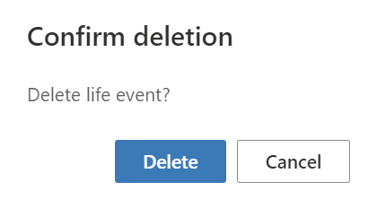

In this exercise, you will add and edit records and then observe how those changes reflect in Unified customer profile. Most of the information in Unified customer profile comes from financial core systems; hence, it's not editable. However, a few edit scenarios are supported and those scenarios are covered in this exercise.

## Task 1: Add, edit, and delete a life event

In this task, you will create a new life event, edit its details, and then delete it.

1.  In the Unified customer profile view that you have been working with, locate the **Life events** control. Select **Add new event**.

	> [!div class="mx-imgBorder"]
	> 

1.  In the dialog that opens, set the following properties and then select the **Add new event** button.

	- **Select category and type** - Residence, Purchase
	
	- **Event date** - Enter any future date 
	
	- **Add additional information** - Bought a new house

	> [!div class="mx-imgBorder"]
	> 

    The add event will display in the **Residence** life event control.

	> [!div class="mx-imgBorder"]
	> 

1.  Select the **Residence** control to view details. Select the **Edit** icon to edit the life event details.

	> [!div class="mx-imgBorder"]
	> 

    A life event edit dialog will appear. Edit any of the details and then observe how it reflects in the **Life events** control.

	> [!div class="mx-imgBorder"]
	> 

1.  You can delete the newly added event by selecting the delete icon.

	> [!div class="mx-imgBorder"]
	> 

1.  Confirm deletion and then select the **Delete** button.

	> [!div class="mx-imgBorder"]
	> 

1.  The change will show on the **Residence** life event control.

	> [!div class="mx-imgBorder"]
	> 

## Task 2: Add, edit, and delete a group

In this task, you will create a new group, edit its group members and group financial holdings, and then you will delete it.

1.  In the Unified customer profile view that you have been working with, select the **Connections** tab.

	> [!div class="mx-imgBorder"]
	> 

1.  Select **+ Create group**.

	> [!div class="mx-imgBorder"]
	> 

1.  In the window that opens, set the following values and then select **Next**.

	- **Group title** - Custom Group
	
	- **Group type** - Custom group

	> [!div class="mx-imgBorder"]
	> 

1.  In the **Group members** search, enter **Abigail Lewis (Sample)** and then select the record that appears in the search results.

	> [!div class="mx-imgBorder"]
	> 

1.  Set the **Role** of Abigail Lewis as **Member** and then select **Next**.

	> [!div class="mx-imgBorder"]
	> 

1.  Select any group financial holdings records and then select **Done**.

	> [!div class="mx-imgBorder"]
	> 

1.  The changes reflect on the **Connections** tab. The newly created group **Custom Group** shows up on the **Groups** section and on the summarized **Financial strength** controls.

	> [!div class="mx-imgBorder"]
	> 

1.  Now that the group is created, you can edit it. Select the **Edit** icon next to the **Custom Group** heading.

	> [!div class="mx-imgBorder"]
	> 

1.  When the **Group edit** dialog opens, select **Group holdings** and then add any **Group financial holdings** record on the grid. When you're finished, select **Done**.

	> [!div class="mx-imgBorder"]
	> 

    The changes will display on the **Connections** tab in the **Group financial holdings** list.

    > [!div class="mx-imgBorder"]
    > 

1. Now that you have added and edited a new group, you can delete it. Select the **Delete** icon in the **Custom Group** area.

	> [!div class="mx-imgBorder"]
	> 

1. In the **Delete group** dialog that opens, select **Delete**.

	> [!div class="mx-imgBorder"]
	> 

   The **Connections** tab will remove the custom group and reset to the previous experience.

   > [!div class="mx-imgBorder"]
   > 

## Task 3: Add, edit, and delete a relationship

In this task, you will create a new relationship, edit its relationship type, and then delete it.

1.  In the Unified customer profile view that you've been working with, select the **Connections** tab.

	> [!div class="mx-imgBorder"]
	> 

1.  Select **+ Add relationship**.

	> [!div class="mx-imgBorder"]
	> 

1. In the search box, enter **Abigail Lewis (Sample)** and then select the record that appears in the search results.

	> [!div class="mx-imgBorder"]
	> 

1. Set the **Relationship type** value to **Lawyer** and then select **Add relationship**.

	> [!div class="mx-imgBorder"]
	> 

   The **Connections** tab will now show the newly added relationship.

	> [!div class="mx-imgBorder"]
	> 

1. Now that you have added the relationship, you can edit it. On the **Relationships** grid on the right, hover your cursor over the contact name record and then select the edit icon.

	> [!div class="mx-imgBorder"]
	> 

1. Set the relationship type to **Accountant** and then select **Save**.

	> [!div class="mx-imgBorder"]
	> 

   The change will now show on the **Relationships** grid.

	> [!div class="mx-imgBorder"]
	> 

1. You can delete the newly added relationship by selecting the delete icon.

	> [!div class="mx-imgBorder"]
	> 

Congratulations, you have now added, edited, and deleted life moments, groups, group financial holdings, and relationships in the Unified customer profile application.

