In this exercise, you will be adding and editing records and see those changes reflect in UCP. Most of the information in UCP comes in from financial core systems and hence is not editable. But a few edit scenarios are supported and those will be covered here.

## Task 1: Add, edit, delete a Life event

In this task, we will create a new life event, edit its details, and then delete it.

1.  In the UCP view we have been working with, locate the Life events control. Select **Add new event**.

	> [!div class="mx-imgBorder"]
	> 

1.  In the dialog box that opens, set the following properties and Select **Add new event** button.

	- **Select category and type:** Residence, Purchase
	
	- **Event date:** Enter any future date 
	
	- **Add additional information:** Bought a new house

	> [!div class="mx-imgBorder"]
	> [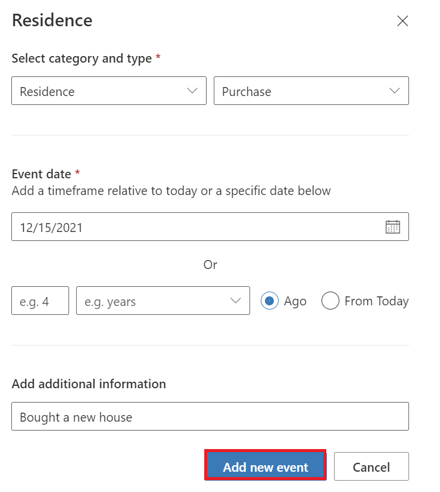](../media/residence-event.png#lightbox)

1.  The add event reflects in the **Residence** Life event control.

	> [!div class="mx-imgBorder"]
	> [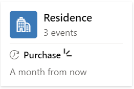](../media/purchase.png#lightbox)

1.  Select the **Residence** control to view details. Select the **Edit** icon to edit the Life event details.

	> [!div class="mx-imgBorder"]
	> 

    Life event edit dialog will pop up, edit any of the details, and see it reflect back in the Life event control.

	> [!div class="mx-imgBorder"]
	> [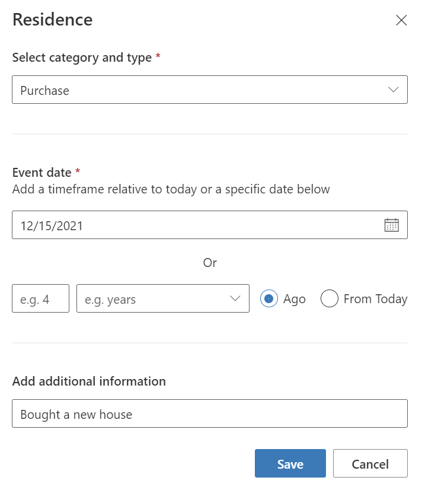](../media/life-event-dialog.png#lightbox)

1.  You can also delete the newly added event by clicking on the delete icon.

	> [!div class="mx-imgBorder"]
	> 

1.  Confirm deletion and Select **Delete** button.

	> [!div class="mx-imgBorder"]
	> [!Screenshot of the confirm deletion message.](../media/confirm-deletion.png)](../media/confirm-deletion.png#lightbox)

1.  The change reflects on the **Residence** Life event control.

	> [!div class="mx-imgBorder"]
	> [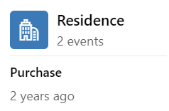](../media/change.png#lightbox)

## Task 2: Add, edit, delete a Group

In this task, we will create a new group, edit its group members, its group financial holdings and then delete it.

1.  In the UCP view we have been working with, Select **Connections** tab.

	> [!div class="mx-imgBorder"]
	> [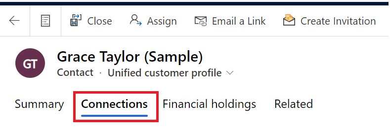](../media/connections-tab.png#lightbox)

1.  Select **+ Create Group**.

	> [!div class="mx-imgBorder"]
	> [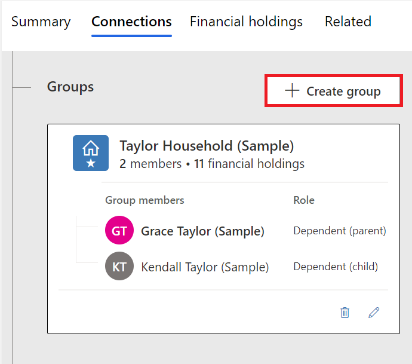](../media/create-group.png#lightbox)

1.  In the window that opens, set the following values and Select **Next**.

	- **Group title:** Custom Group
	
	- **Group type:** Custom group

	> [!div class="mx-imgBorder"]
	> [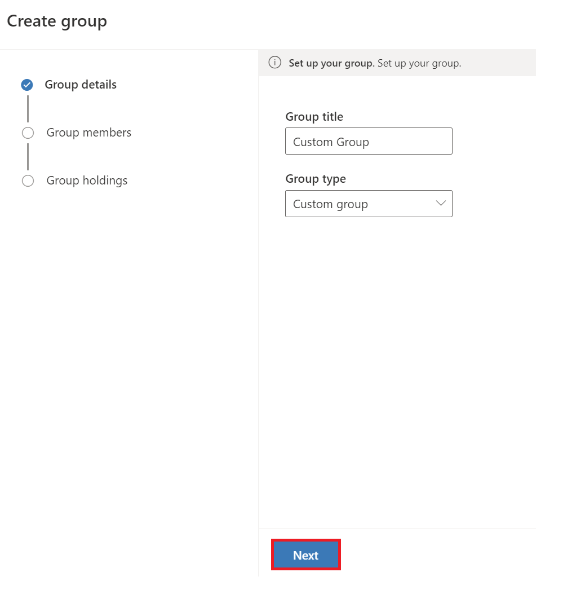](../media/next.png#lightbox)

1.  In the group member search, type in **Abigail Lewis (Sample)** and select the record that appears in the search results.

	> [!div class="mx-imgBorder"]
	> 

1.  Set the **Role** of Abigail Lewis as **Member** and Select **Next**.

	> [!div class="mx-imgBorder"]
	> [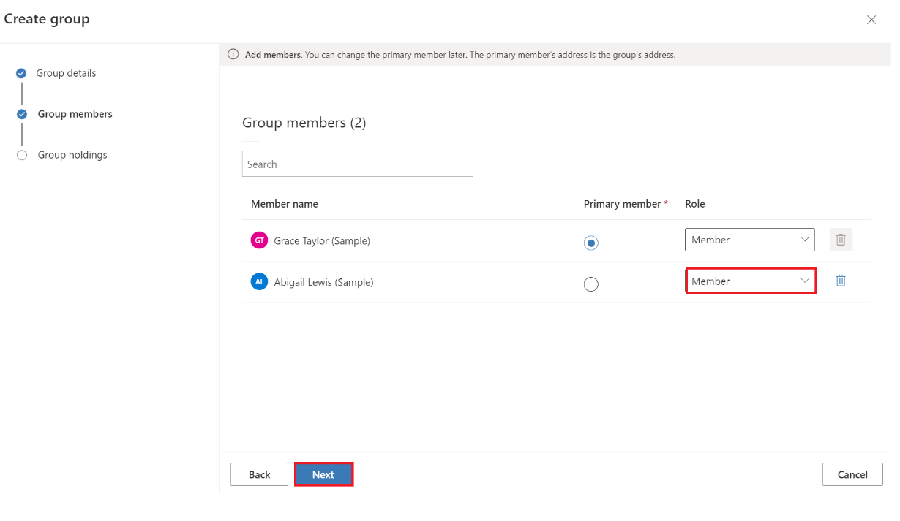](../media/role.png#lightbox)

1.  Select any Group Financial Holdings records and Select **Done**.

	> [!div class="mx-imgBorder"]
	> 

1.  The changes reflect on the **Connections** tab. The newly created group **Custom Group** shows up on the Groups section and on the summarized Financial Strength controls.

	> [!div class="mx-imgBorder"]
	> 

1.  Now that the group is created, we will edit it. Select the **Edit** icon next to the **Custom Group**

	> [!div class="mx-imgBorder"]
	> 

1.  When the Group edit dialog opens up, Select **Group Holdings** and add any Group Financial Holdings record on the grid. Once done, select **Done**.

	> [!div class="mx-imgBorder"]
	> 

1. The changes show up on the **Connections** tab in **Group Financial Holdings** list.

	> [!div class="mx-imgBorder"]
	> 

1. Now that we added and edited a new Group, we will delete it. Select the **Delete** icon next to the **Custom Group**.

	> [!div class="mx-imgBorder"]
	> 

1. In the dialog box that opens, Select **Delete**.

	> [!div class="mx-imgBorder"]
	> 

1. The **Connections** tab removes the **Custom Group** and resets to the previous experience.

	> [!div class="mx-imgBorder"]
	> 

## Task 3: Add, edit, delete a Relationship

In this task, we will create a new relationship, edit its relationship type, and then delete it.

1.  In the UCP view we have been working with, Select **Connections** tab.

	> [!div class="mx-imgBorder"]
	> 

1.  Select **+ Add Relationship**.

	> [!div class="mx-imgBorder"]
	> [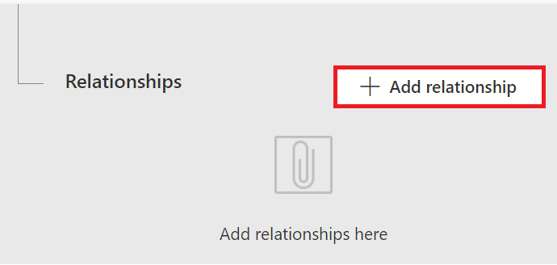](../media/add-relationship.png#lightbox)

1. In the search box, type in **Abigail Lewis (Sample)** and select the record that appears in the search results.

	> [!div class="mx-imgBorder"]
	> [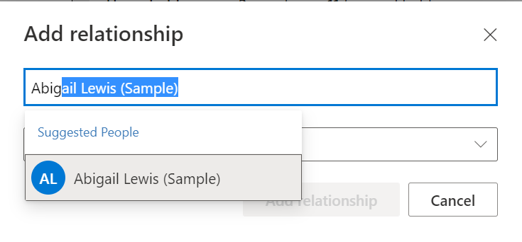](../media/search-box.png#lightbox)

1. Set Relationship type value and Select **Add relationship**.

	- **Relationship type:** Lawyer

	> [!div class="mx-imgBorder"]
	> [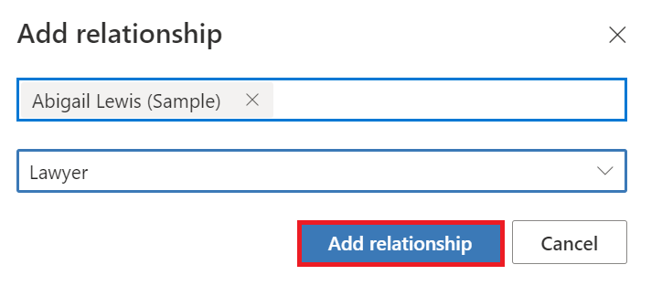](../media/relationship.png#lightbox)

1. The **Connections** tab reflects the newly added relationship.

	> [!div class="mx-imgBorder"]
	> 

1. Now that we added the relationship, we will edit it. On the **Relationships** grid on the right, hover over the contact name record and Select the edit icon.

	> [!div class="mx-imgBorder"]
	> 

1. Set the relationship type to *Accountant* and Select **Save**.

	> [!div class="mx-imgBorder"]
	> 

1. The change reflects on the **Relationship** grid.

	> [!div class="mx-imgBorder"]
	> 

1. Similarly, you can delete the newly added relationship by clicking on the delete icon.

	> [!div class="mx-imgBorder"]
	> 

**Congratulations!** You have now added, edited, and deleted life moments, groups, group financial holdings, and relationships in the UCP application.

