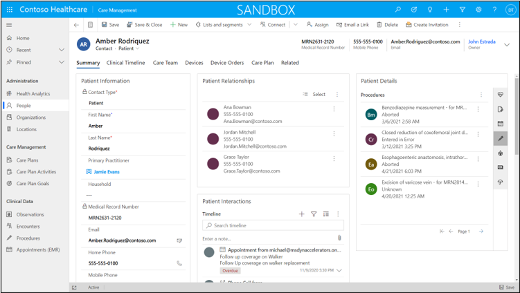
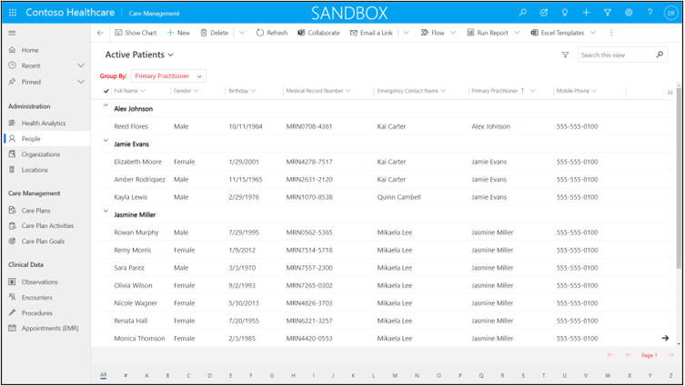
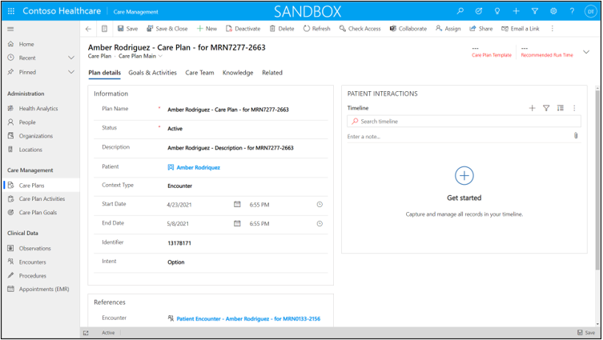

With the Care Management app, healthcare professionals can manage patient healthcare information and events in a central location.

Information that appears in the app can be integrated with electronic medical records (EMR) systems to allow a complete view of patient information.

The Care Management app is separated into the following key areas:

- **Administration**

- **Care Management**

- **Clinical Data**

Care Management is a model-driven app from Microsoft Power Apps that can be configured, modified, or extended as required by a particular medical organization's requirements. The Care Management app's core functionality uses tables from [Common Data Model electronic medical records](https://microsoft.github.io/CDM/SchemaViz.html?initialManifest=manifests/electronicMedicalRecordsAccelerator.manifest.cdm.json&simpleChrome=true&azure-portal=true).

## Administration area

A practitioner would use the **Administration** area to add and update key information into the Care Management app such as people, organizations, and locations.

### Health analytics

Users of the app can get a high-level view of the care plan details and upcoming appointments and tasks by viewing the **Care Coordinator** dashboard. Other dashboards can be configured to combine different assets from the app to allow simple and fast access to critical decision-making information.

### People

The People table is an extension of the Contact table in Common Data Model.

People rows represent patients and medical practitioners.

Regarding patient information, the People table can contain basic contact information and key medical details such as age and gender. The people row is critical to viewing and editing related details such as medical conditions, care team, care plans, and other medical information. The **Timeline** control allows for fast viewing of conditions, medication, appointments, procedures, allergies, claims, and coverages.

> [!div class="mx-imgBorder"]
> 

Medical practitioners can use the People table to view information qualifications and get links to related patients, upcoming appointments, and interactions.

> [!div class="mx-imgBorder"]
> 

### Organizations

The Organizations table is an extension of the Account table in Common Data Model.

In the Care Management app, organization rows represent households, medical organizations, insurance companies, and other organizations that are related to care management.

Care Management users can view location information and related practitioners and contact persons. More related information such as assets, locations, and other medically related data can be accessed from the organization rows.

### Locations

Organizations might have one or more locations that have unique addresses where specific medical practitioners can be associated.

## Care Management area

The **Care Management** area provides a place to track the progress of care management strategies as they relate to specific patients.

### Care plans

A care plan is a plan that is determined by a medical professional, or team of professionals, regarding a strategy and guide for treating a specific patient or patient condition.

With the Care Plan table, you can document the specific care plan for a patient with timelines and relationship to goals, activities, care team, and links to relevant medical information.

### Care plan activities

A care plan activity is a specific action that is related to following a care plan, such as prescribing a specific medication to treat a condition that is defined in the care plan. In the Care Management app, users can create the care plan activities and track them against specific care plan rows and goals. Users of the Care Management app can view a series of activities in one specific location.

### Care plan goals

A care plan goal is a specific targeted outcome of following a care plan. The Care Management app provides medical practitioners with the ability to define care goals and link them to a specific care plan row that is related to a patient. Care plan activities can be linked to goals to measure the progression and results toward achieving the wanted outcomes of the care plan goals.

> [!div class="mx-imgBorder"]
> 

## Clinical Data area

The **Clinical Data** area allows medical practitioners to record various interactions and events as they relate to treating and caring for patients.

### Observations

An observation row allows a medical practitioner to record details about an assessment of a patient's condition or to log specific data points that have resulted from a medical test.

### Encounters

An encounter row can be added for each interaction between a patient and a healthcare practitioner to record dates and times of the interaction. The encounter can be linked to other information that is tracked in the Customer Care app, such as observations and procedures.

### Procedures

A procedure row will allow a medical practitioner to record specific action while delivering a healthcare action. The procedure row can track the time, date, actions, and location of the procedure.

> [!div class="mx-imgBorder"]
> 

### Appointments

An appointment row specifies a meeting between a patient and a medical practitioner for a specific diagnosis or treatment. The appointment could be in-person or virtual over Microsoft Teams. Appointment management ensures that the practitioner has an appropriate way to manage their patient caseloads.

> [!VIDEO https://www.microsoft.com/videoplayer/embed/RWCm39]
