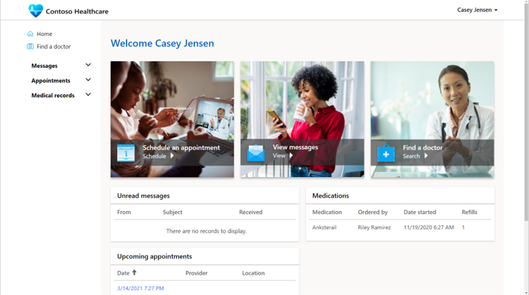
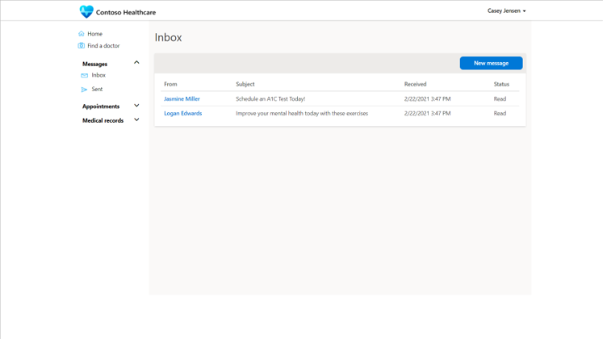
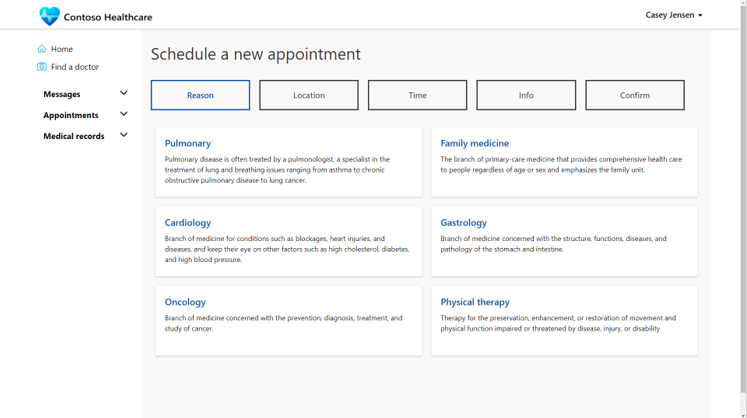

A benefit to medical organizations and their patients is providing self-service capabilities that allow patients to schedule appointments, communicate with their care team, and view their own medical information.

> [!div class="mx-imgBorder"]
> 

The Patient Access portal in Microsoft Cloud for Healthcare is a portals app from Microsoft Power Apps that allows patients to interact with their related information in a more secure and private manner, and it's in the same Microsoft Dataverse location that is used by other Microsoft Cloud for Healthcare apps.

The Patient Access portal can be configured based on the needs of the organization. The patient portal should be simple to navigate and user-friendly, with minimal training or instruction needed.

## Find a doctor

The **Find a doctor** feature in the Patient Access portal shows a list of potentially available medical practitioners that patients can choose from. The portal view can be configured to display contact information or instructions for next steps. The doctor will need to be added to the Dataverse contacts table from one of the apps, such as Care Management, and then flagged as a practitioner to be listed in the directory.

> [!div class="mx-imgBorder"]
> 

## Messages

In the **Messages** section, patients can send and receive messages from their healthcare team. Messages work like email, but the content is protected on the portal for sensitive medical information and communications.

> [!div class="mx-imgBorder"]
> 

## Appointments

In the **Appointments** section, patients can schedule appointments with someone from the care team. The patient can initiate an immediate virtual appointment (which will use Microsoft Teams) or schedule a virtual or in-person clinic visit.

Scheduling an online appointment provides a more efficient way of scheduling an appointment than calling busy switchboards or leaving voice messages. The portal can also prompt the patient to provide key information before an appointment to better equip a medical practitioner's engagement.

> [!div class="mx-imgBorder"]
> 

The scheduled appointment will appear on the medical practitioner's appointment dashboard in the Microsoft Cloud for Healthcare app.

## Medical records

The Patient Access portal gives patients the ability to view their own medical information as it is tracked by the medical practitioners in the Microsoft Cloud for Healthcare apps. The portal offers private views in Dataverse to show the following medical information:

- Medications

- Allergies

- Conditions

- Visit summaries

- Care plans

- Care team

- Coverage

- Devices

> [!div class="mx-imgBorder"]
> 

## Live chat with a medical professional

In the patient portal, patients can use the Microsoft Azure Health Bot to start a chat that can be escalated to a live chat with a medical practitioner by using the Patient Service Center app. The details of the conversation can be tracked against the patient record in Dataverse.

> [!div class="mx-imgBorder"]
> 

> [!VIDEO https://www.microsoft.com/videoplayer/embed/RWCtDU]
