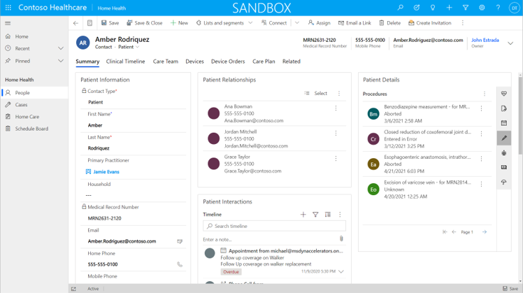
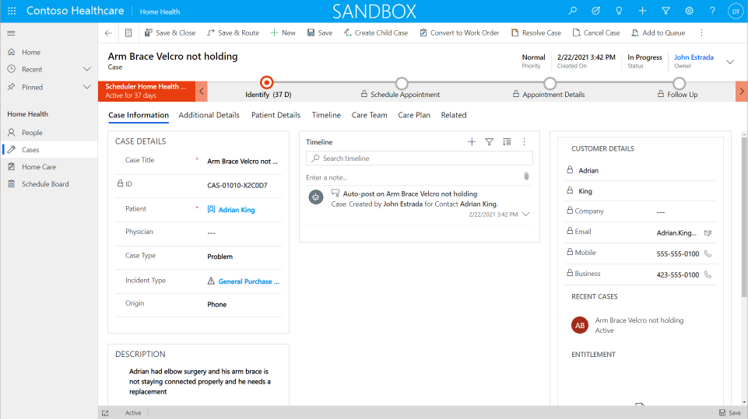
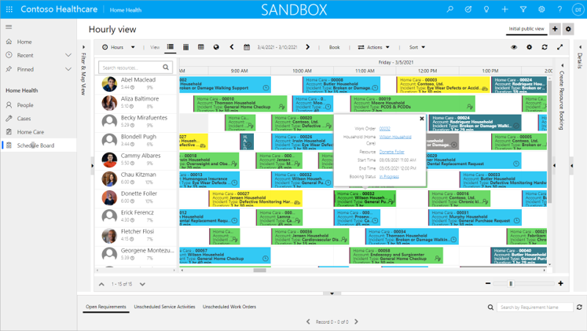

The Home Health app is an extension of the [Microsoft Dynamics 365 Field Service](/learn/modules/dynamics-365-for-field-service/?azure-portal=true) app. This app allows healthcare professionals to schedule healthcare resources for home visits with patients. Administrators can also follow up with patients for appointment reminders and surveys and to track medical cases.

Home Health is a model-driven app from Power Apps that can be configured, modified, or extended as required by a particular medical organization's requirements.

## People

The People table is an extension of the Contact table from Common Data Model. In the Home Health app, the People table contains core contact information and health and medical information about patients. Additionally, the People table can contain information about medical practitioners who are operating from the medical organization.

The information is stored in Dataverse and is accessible to other Microsoft Cloud for Healthcare apps. It can also be integrated with other electronic medical records (EMR) systems by using the FHIR Sync Agent app.

> [!div class="mx-imgBorder"]
> 

## Cases

The Cases table is an extension of the **Case Management** feature in Microsoft Dynamics 365 Customer Service that has been configured for medical and healthcare-related cases. Along with capturing the main details about the case, the Cases table can be linked to the care team, care plan, and other data tracking aspects from other Microsoft Cloud for Healthcare apps, such as Care Management. At-home appointments can be scheduled or *booked* to a case by using the Dynamics 365 Field Service capabilities.

> [!div class="mx-imgBorder"]
> 

## Home Care

The Home Care table is an extension of the Work Order feature in Dynamics 365 Field Service that captures the details and requirements of home care visits. The Home Care form displays medical information about the patient, preferred times and visits, and the care team and care plan information that is managed from the Care Management app in Microsoft Cloud for Healthcare.

## Schedule Board

The Home Health app uses the Universal Resource Scheduling board and further extends the key Dynamics 365 Field Service features such as viewing the team's schedule and bookings and managing and allocating resources to home care work orders.

> [!div class="mx-imgBorder"]
> 

Healthcare practitioners who are to be scheduled for home-based visits are tracked as bookable resources in the Home Health app. Information such as working hours, locations, characteristics, and categories can be tracked against the bookable resource to allow scheduling.

Healthcare practitioners can access their schedule by using the mobile app and can also update the status of the visit and other patient information.

> [!VIDEO https://www.microsoft.com/videoplayer/embed/RWCyT1]
