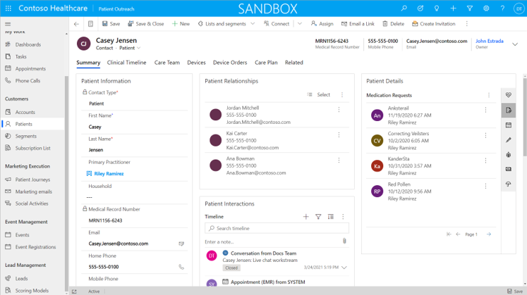
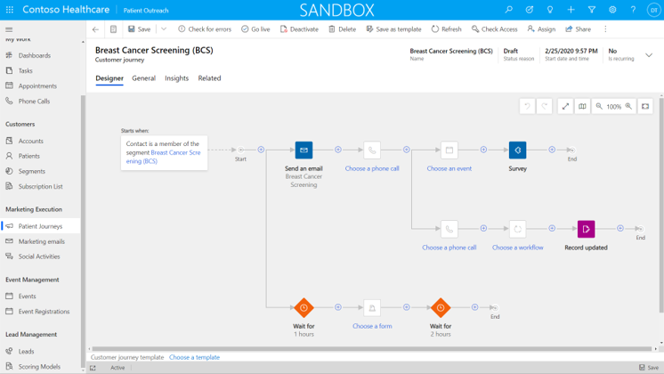
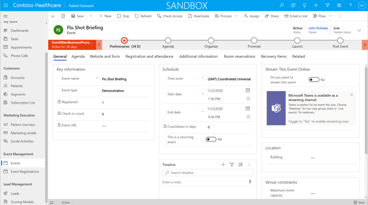

Patient Outreach is an extension of the [Microsoft Dynamics 365 Marketing](/learn/modules/dynamics-365-for-marketing/?azure-portal=true) app that has been extended and tailored to healthcare scenarios. The app allows healthcare organizations to communicate targeted medical and health-related information to specific patient communities. The app runs from a centralized Dataverse environment that you can access from other Microsoft Cloud for Healthcare apps.

The Patient Outreach app is separated into the following key areas:

- **Customers**

- **Marketing Execution**

- **Event Management**

- **Lead Management**

Patient Outreach is a model-driven app from Power Apps that can be configured, modified, or extended as required by a particular medical organization's requirements.

## Customers

The **Customers** section groups together information about related medical organizations, patients, medical practitioners, and other stakeholders.

### Accounts

The Accounts table holds information about households, medical centers, insurance companies, and other related organizations or groups as they relate to healthcare management. The Accounts table is part of [Common Data Model](/common-data-model/?azure-portal=true) and is extended specifically for healthcare applications.

### Patients

The Patients table is an extension of the Contacts table in Common Data Model that is tailored for Microsoft Cloud for Healthcare applications. Key information that is stored about a patient can include standard contact information and links to specific treatments, the care teams, and medical information such as allergies, medications, conditions, and other key information. This information can be used to help you build specific segments for targeted communications.

> [!div class="mx-imgBorder"]
> 

### Segments

A segment extends the Dynamics 365 Marketing segments to allow healthcare practitioners to build up lists of patients to target for specific healthcare-related communications. These segments are based on information such as pre-existing medical conditions, issues, or on other information that is tracked for patients. A dynamic segment will automatically add or remove patients, depending on the criteria that is specified when you were creating the segment.

The Patient Outreach app has prebuilt patient segments that are based on the Healthcare Effectiveness Data and Information Set (HEDIS) industry standard.

### Subscription list

In the **Subscription List** area, patients can subscribe to specific information outreach or communications as they relate to receiving healthcare-related information.

## Marketing execution

In the **Marketing Execution** area, elements of marketing are used for a patient journey.

### Patient journeys

The **Patient Journeys** area offers an outline or a communication plan to provide information to a group of patients that are grouped together in a segment. The patient journey can also begin some initial or follow-up actions, depending on patient interaction with the communications (for example, selecting a link or opening an email).

> [!div class="mx-imgBorder"]
> 

### Marketing emails

The **Marketing emails** section provides a *what you see is what you get* (WYSIWYG) email designer for users of the app to create healthcare-related communication email templates for use in customer journeys.

### Social activities

A healthcare organization might want to convey information to the public and patients through social activities. The **Social Activities** section provides a view of current social activities and sentiment.

## Event management

The **Event Management** section helps capture events for providers and patients.

### Event

The Event table tracks information about in-person and virtual events. In a healthcare scenario, this event could mean information sessions, training, and gathering patients (for example, a Flu Shot event).

> [!div class="mx-imgBorder"]
> 

### Event registrations

In **Event Registrations**, users can track a contact's specific engagement to an event. The registration will provide information such as the registration ID, sessions of interest, and other key information that will develop a list of better management events for staff to attend.

## Lead management

Typically, the **Lead Management** section is designed for sales engagement scenarios, but it can be used in a healthcare scenario to recruit potential patients, volunteers, and the public to engage with a healthcare organization's services and programs.

> [!VIDEO https://www.microsoft.com/videoplayer/embed/RWCyT7]
