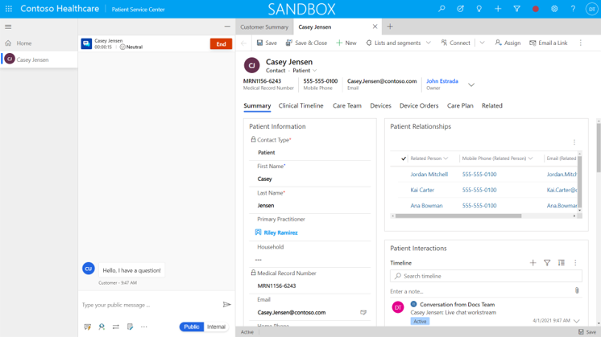
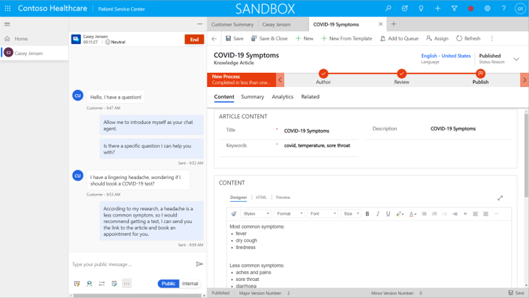
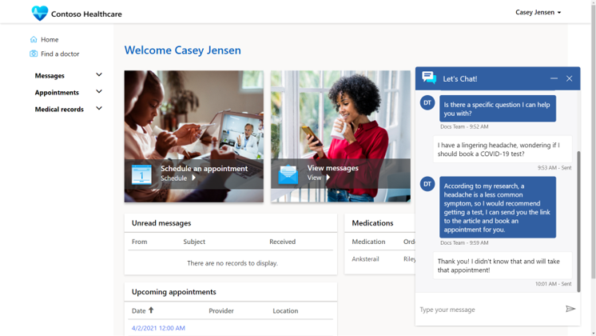
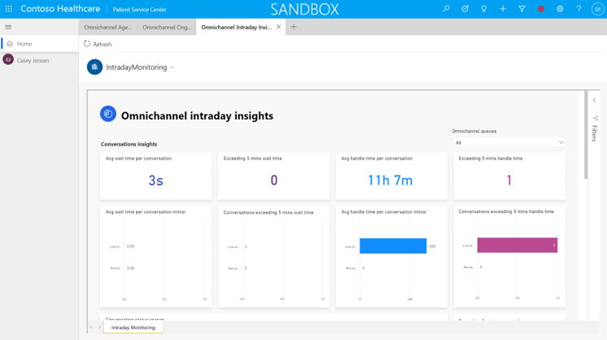

The Patient Service Center app eases communication between healthcare call center agents and patients through channels such as live chat and text message.

The Patient Service Center is an extension of [Microsoft Dynamics 365 Omnichannel for Customer Service](/learn/modules/getting-started-omnichannel/?azure-portal=true). Patient Service Center is a model-driven app from Power Apps that can be configured, modified, or extended as required by a particular medical organization's requirements.

A medical organization (hospital, public health, or other healthcare provider) can provide agent services to patients to get real-time interaction, diagnosis, and advice, which can potentially help avoid time-consuming appointments or misdirected treatments.

## Omnichannel agent dashboard

A healthcare agent will use the Patient Service Center app to monitor incoming communications from patients. For example, an existing patient can start a chat from the Patient Access portal, or the patient can be redirected from the Azure Health Bot after they have exhausted the available automated responses. After the chat has started, the healthcare agent will have access to the patient's contact information, chat transcription history (from Azure Health Bot), and medical details.

> [!div class="mx-imgBorder"]
> 

The agent can accept the chat, or the chat can be diverted to a queue for the next available agent.

The agent can respond by using a series of predefined responses and follow an agent script that is tailored to specific healthcare information. Additionally, the agent has the option of consulting with another agent or passing the conversation to another agent (potentially, a specialist who is better equipped to answer specific questions).

The agent can take a series of actions, such as looking up a knowledge article, opening a case, or setting up an appointment.

> [!div class="mx-imgBorder"]
> 

Patient sentiment can also be tracked so that the agent can respond appropriately.

> [!div class="mx-imgBorder"]
> 

The chat information is stored against the patient record in Dataverse so that other practitioners or advisors can use that information if they are providing treatments or procedures while using other Microsoft Cloud for Healthcare apps or integrated EMR systems.

## Intraday monitoring

A supervisor or manager of a healthcare call center can monitor the performance and analytics of the agents by using the **Omnichannel intraday insights** dashboard. The dashboard can show metrics such as wait times, average conversation length, and other items.

> [!div class="mx-imgBorder"]
> 

> [!VIDEO https://www.microsoft.com/videoplayer/embed/RWCyT8]
