Microsoft Vaccination Management Dashboard offers a dashboard that is created in Microsoft Power BI that enables healthcare program leaders to obtain various insights and establish situational awareness about their vaccination program. They can track cumulative and daily vaccinations, view registrations, bookings, and shipments, and monitor analytics at the site level.

> [!div class="mx-imgBorder"]
> [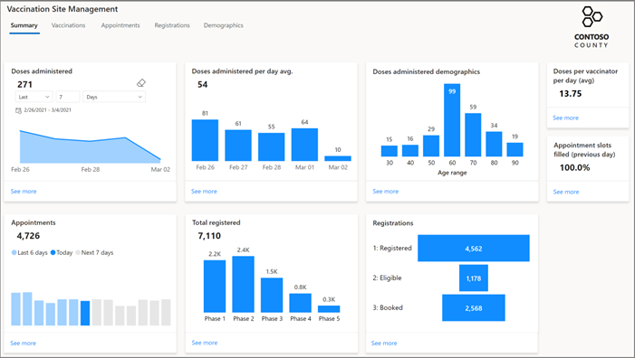](../media/1-vaccination.png)

In this exercise, you will learn how to configure the Microsoft Vaccination Management Dashboard from Microsoft AppSource, connect to your data, and then load the Microsoft Vaccination Management Dashboard in a Power BI online workspace to view the report.

## Install Microsoft Vaccination Management Dashboard from AppSource

In this task, you will retrieve the Microsoft Vaccination Management Dashboard from AppSource and then configure it in Power BI online, where a new workspace and application will be created automatically.

When Microsoft Vaccination Management is more widely available, you can configure the application directly from Microsoft Cloud Solution Center instead of through AppSource, as shown in the following screenshot.

> [!div class="mx-imgBorder"]
> [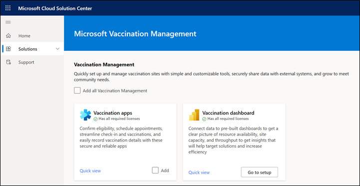](../media/2-cloud-center.png)

For this training, you will retrieve the application from AppSource.

1.  Go to [Microsoft AppSource](https://appsource.microsoft.com/en-US/) and make sure that you are in **Incognito** or **InPrivate** mode.

2.  Search for **vaccination** by using the **Apps** search bar.

    > [!div class="mx-imgBorder"]
    > [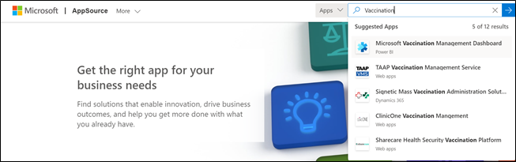](../media/3-app-source.png)

3.  Select **Microsoft Vaccination Management Dashboard**.

    > [!div class="mx-imgBorder"]
    > [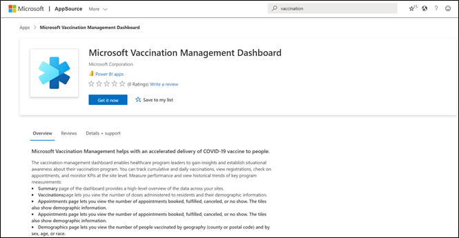](../media/4-dashboard-app.png)

4.  Select the **Get it now** button.

    > [!div class="mx-imgBorder"]
    > [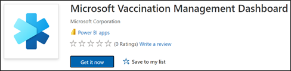](../media/5-get-now.png)

5.  Enter your provided **training user email** if prompted. Select **Sign in**.

    > [!div class="mx-imgBorder"]
    > [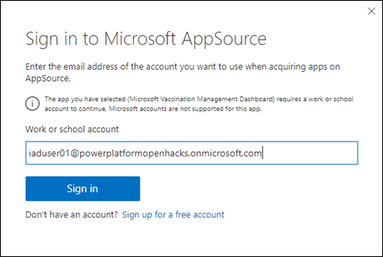](../media/6-sign-in-app.png)

6.  In the prompt, fill in the **Work email** field with your training user email, enter a dummy **Phone number**, select your **Country/region**, and then select the permissions check box. 

    > [!NOTE]
    > If you're in an official training, use the email that is provided to you.

    > [!div class="mx-imgBorder"]
    > [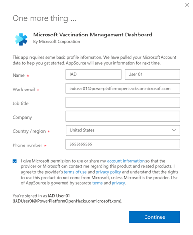](../media/7-app-contact.png)

7.  Select **Continue**.

8.  Power BI online will load and prompt you to install the Power BI app. Select **Install**.

    > [!div class="mx-imgBorder"]
    > [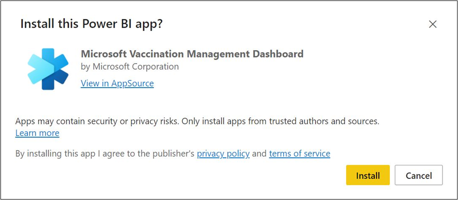](../media/8-install-app.png)

    The app should begin to install.

    > [!div class="mx-imgBorder"]
    > [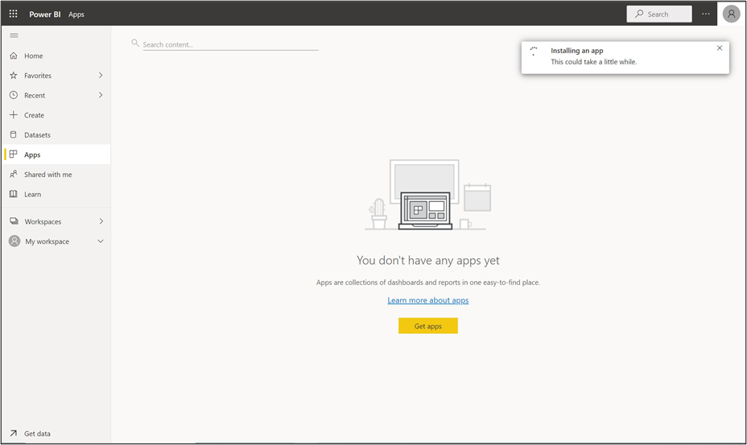](../media/9-install-complete.png)

9. When installation is complete, a prompt will appear, indicating that your app is ready. Select **Go to app**.

    > [!div class="mx-imgBorder"]
    > [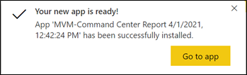](../media/10-go-to-app.png)

10. If you miss the prompt, you can select **Apps** on the left navigation bar and then select your new app.

    > [!div class="mx-imgBorder"]
    > [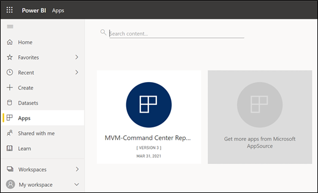](../media/11-select-app.png)

11. The Microsoft Vaccination Management Dashboard Data Model app will open. Select **Connect** to connect the data.

    > [!div class="mx-imgBorder"]
    > [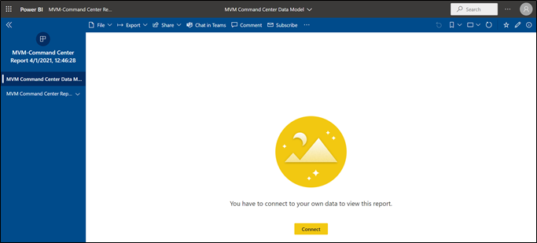](../media/12-connect-app.png)

12. Enter information in the **DataverseName** and **UTCZoneOffset** fields.

    > [!div class="mx-imgBorder"]
    > [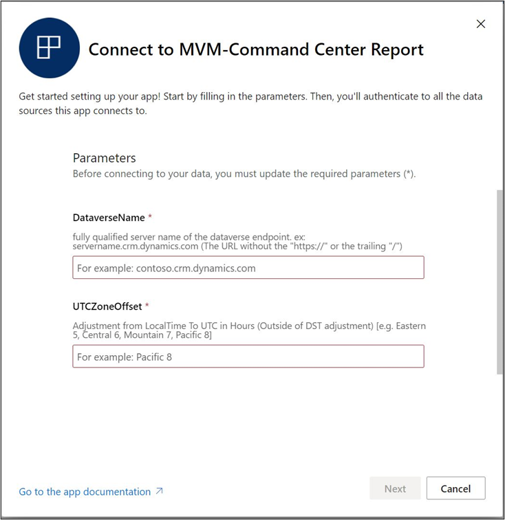](../media/13-command-report.png)

13. To get the Microsoft Dataverse name, go to [Power Apps](https://make.powerapps.com/) and make sure that you are in **Incognito** or **InPrivate** mode.

14. Sign in by using the credentials that are supplied in the training for your user.

15. Select the correct environment from the **Environment** dropdown list in the upper-right corner.

    > [!div class="mx-imgBorder"]
    > [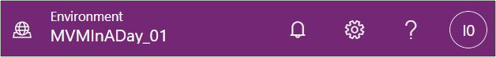](../media/14-select-environment.png)

16. Select **Apps** on the left navigation bar.

    > [!div class="mx-imgBorder"]
    > [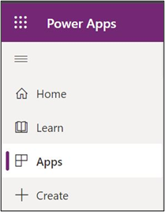](../media/15-apps-selection.png)

17. Find the **Vaccination site management** app and then select the app name.

    > [!div class="mx-imgBorder"]
    > [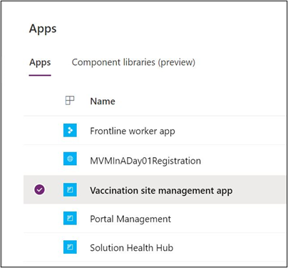](../media/16-site-app.png)

18. When the app has loaded, you can copy the **URL** ending in **crm.dynamics.com** (don't include https://).

    > [!div class="mx-imgBorder"]
    > [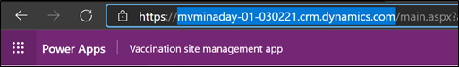](../media/17-url.png)

19. Return to Power BI Desktop and paste the **DataverseName** URL (without https:// and trailing slash).

20. Add your **UTCZoneOffset**, which is the number of hours that your local time is offset from UTC. Depending on location, your value might be negative (for example, PT = 8 and IST = -5.5).

    > [!div class="mx-imgBorder"]
    > [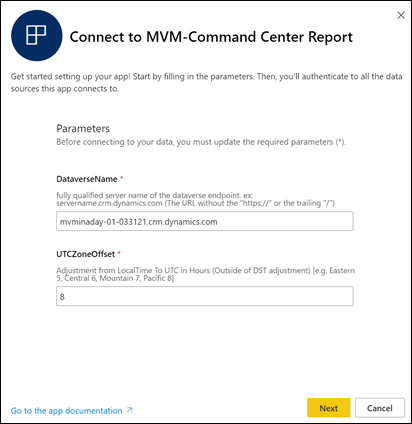](../media/18-command-report.png)

21. Select **Next**.

22. You will be prompted to provide an **Authentication method** to connect. Keep **OAuth2** selected in the dropdown list. Select the **pencil** icon under **Privacy level setting for this data source** to edit the field.

    > [!div class="mx-imgBorder"]
    > [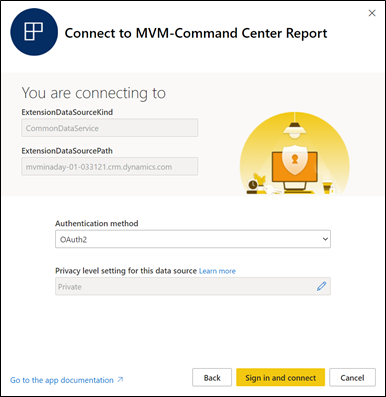](../media/19-report-connect.png)

23. For the **Privacy level setting for this data source** option, select **Organizational**.

    > [!div class="mx-imgBorder"]
    > [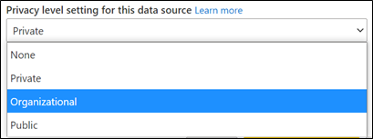](../media/20-privacy.png)

24. Select **Sign in and connect**.

    > [!div class="mx-imgBorder"]
    > [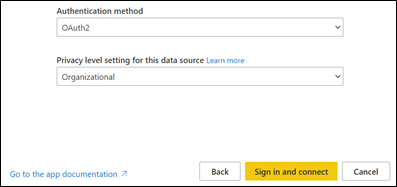](../media/21-sign-in-auth.png)

25. Sign in with your training user credentials.

    A blank report will display on the screen. This file only contains the data model.

    > [!div class="mx-imgBorder"]
    > [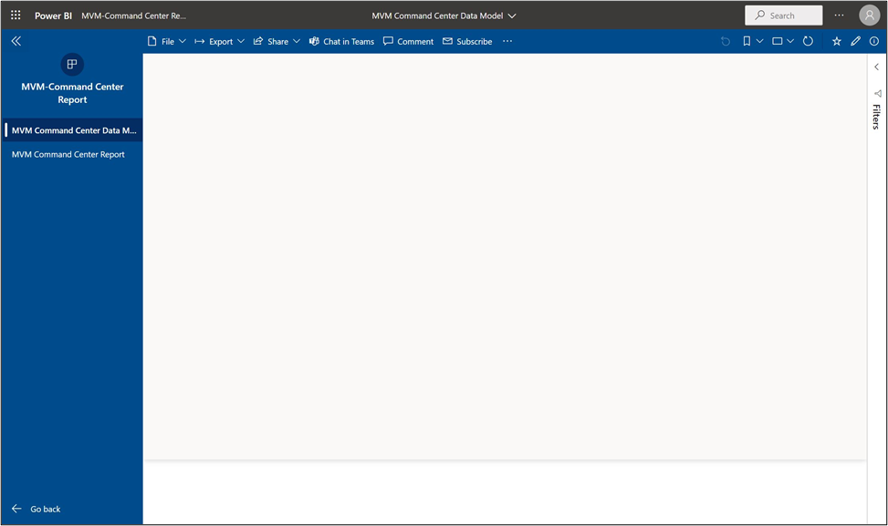](../media/22-blank-report.png)

26. Select the **MVM Command Center Report** option on the left site map. The report should load, and you should see the visualizations highlighted with the data in your environment.

    > [!div class="mx-imgBorder"]
    > 

Congratulations, you have successfully installed the Microsoft Vaccination Management Dashboard from AppSource into a new Power BI workspace in your tenant, and you have now connected to your data.

