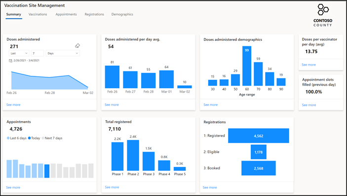
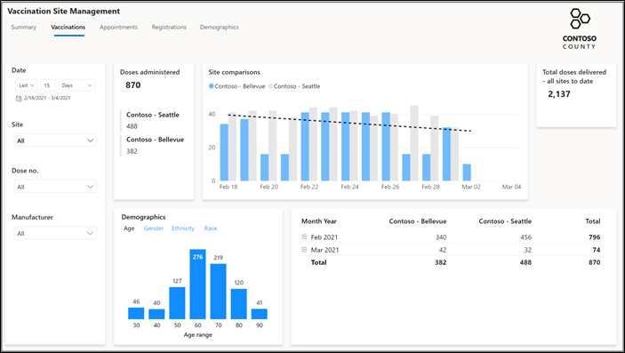
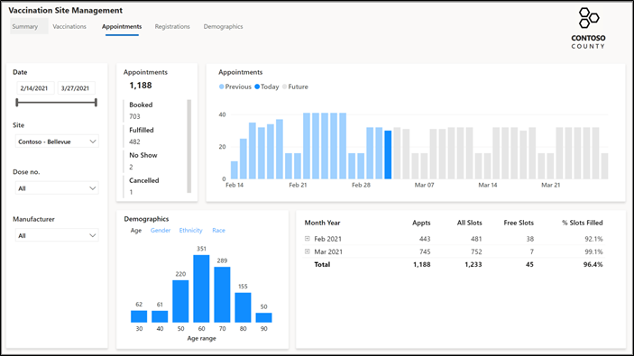
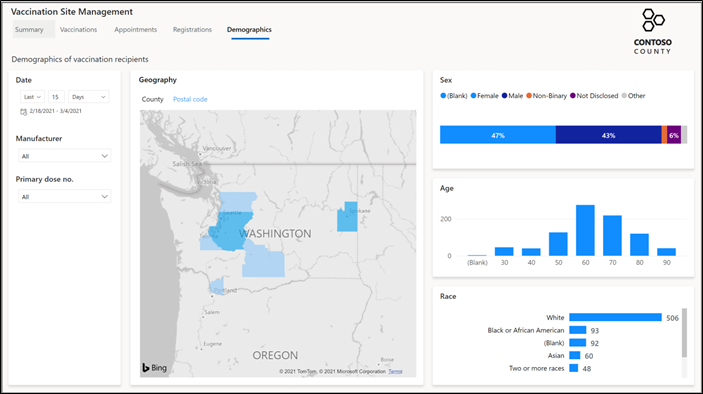

In this exercise, you will navigate the Microsoft Vaccination Management Dashboard and the pages that are created specifically for providing insights about the vaccination program.

### Task 1: Review the Summary page

In this task, you will discover the features on the **Summary** page, which provides a high-level overview of the data across your sites. This data includes the number of doses that are administered each day for last **n** number of days, daily average of the administered doses, age ranges of people who received the doses, and information about registrations and appointments.

> [!div class="mx-imgBorder"]
> 

The **Summary** page provides you with the following features:

- **Filter** - By default, the summary will show the last seven days. You can modify this filter to show a longer or shorter time span of data. When you modify the filter, all visualizations will update accordingly.

- **Tooltips** - You can hover over a visual to see the tooltip for an item, which might have further details.

- **Highlight** - You can select a data point on a visual, and other visualizations will adjust to highlight their associated information. This process is different than filtering because all data is visible; however, some data has been highlighted and emphasized.

- **See more** - Select the **See more** link in each tile to view detailed information on each page. Select **See more** on the **Doses administered per day avg.** visual to go to the **Vaccinations** page.

### Task 2: Explore the Vaccinations page

In this task, you will explore the **Vaccinations** page, which lets you view the number of doses that are administered to residents and their demographic information (age, gender, ethnicity, race) based on the specified date range, site locations, dose number (1 or 2), and vaccine manufacturer. The page also shows a trend line of the vaccinations that are administered at the selected sites.

> [!div class="mx-imgBorder"]
> 

Explore the data on the **Vaccinations** page, and then: 

1. Hover, highlight, and filter what you see in the visuals. 
2. Expand areas that can show more detail. 
3. Navigate to various tabs within visuals, such as the **Demographics** bar chart.

With a small subset of data, it can be more difficult to see trends. As more people are registered, booked for appointments, and have had their vaccinations administered, the report visuals will fill out with more data.

After exploring the **Vaccinations** page, select the **Appointments** tab in the upper part of the Vaccination Site Management dashboard.

### Task 3: Explore the Appointments page

In this task, you will explore the **Appointments** page, which lets you view the number of appointments that are booked, fulfilled, canceled or no show, along with residents' demographic information (age, gender, ethnicity, race) based on the specified date range, site location, dose number (1 or 2), and vaccine manufacturer. You can only view appointment data for a single site at a time.

The page also shows a six-week rolling window (two weeks before the current week and three weeks after the current week) that contains information about the appointments for the selected site and other filters on the left.

> [!div class="mx-imgBorder"]
> 

Explore the data on the Appointments page, and then hover, highlight, and filter what you see in the visuals. Expand areas that can show more detail, and then navigate to various tabs within visuals.

After exploring the **Appointments** page, select the **Registrations** tab in the upper part of the Vaccination Site Management dashboard.

### Task 4: Explore the Registrations page

In this task, you will explore the **Registrations** page, which lets you view the number of people who registered over time (cumulative), the number of people who became eligible, and the number of people who are booked for appointments each day. It also shows registration numbers by residents' demographic information (age, gender, ethnicity, race) and by geography (county or postal code).

You can filter information for single or multiple phases.

> [!div class="mx-imgBorder"]
> 

Explore the data on the **Registrations** page, and then: 

1. Hover, highlight, and filter what you see in the visuals.

2. Expand areas that can show more detail. 

3. Navigate to various tabs within visuals.

4.  Notice the **Geography** map on the form that is powered by Bing Maps, which has zoomed into the given location on the map.

After navigating the **Registrations** page, select the **Demographics** tab in the upper part of the Vaccination Site Management dashboard.

### Task 5: Explore the Demographics page

In this task, you will explore the **Demographics** page, which lets you view the number of people who are vaccinated by geography (county or postal code) and by sex, age, or race.

You can filter information based on the date range, vaccine manufacturer, and the primary dose number (1 or 2).

> [!div class="mx-imgBorder"]
> 

Explore the data on the **Demographics** page, and then:

1. Hover, highlight, and filter what you see in the visuals.

2.  Change the **Geography** map to postal code to see if other areas show up.

Congratulations, you have successfully navigated the Microsoft Vaccination Management Dashboard and its pages to learn about what it has to offer.
