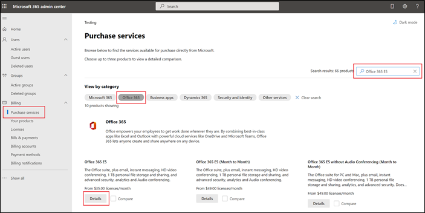
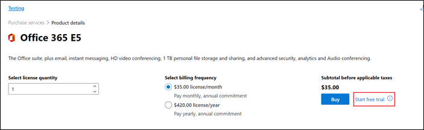
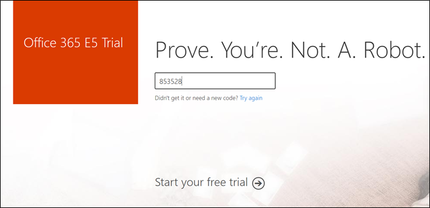
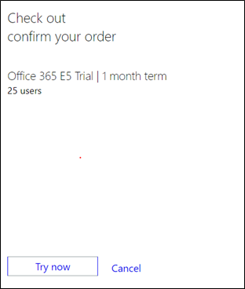
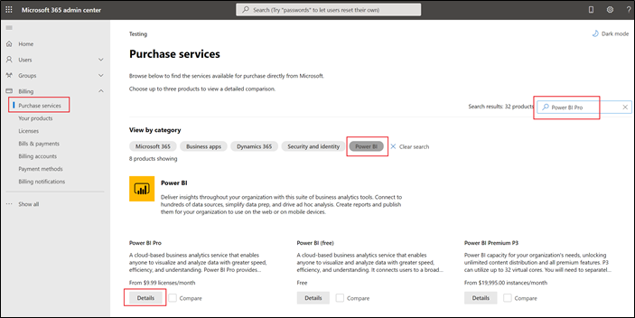
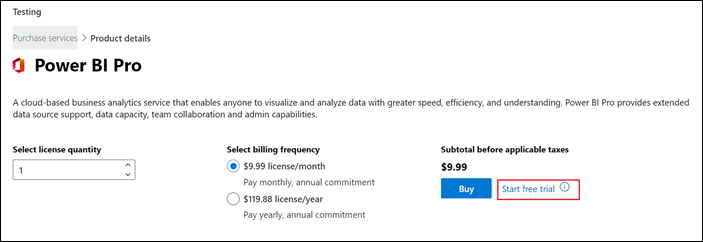
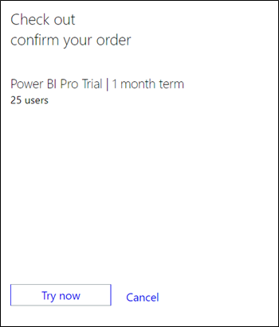

To deploy Microsoft Vaccination Management in a Dataverse environment, you need to add a tenant and the prerequisite licenses.

In this exercise, you will be playing the role of a system administrator and will learn how to create a demo tenant along with the required trial licenses. You can skip this exercise if you have already created a demo tenant and added the trial licenses.

### Task 1: Create a demo tenant

In this task, you will learn how to create a demo tenant along with the required Microsoft Dynamics 365 and Microsoft Power Apps trial licenses. You can skip this task if you already have a tenant.

1.  Open an internet browser in **In-Private** or **Incognito** mode.

2.  Go to <https://trials.dynamics.com> and select **Sign up here**.

    > [!div class="mx-imgBorder"]
    > 

3.  A pop-up window will appear, asking if you are a partner or a Microsoft employee. In this case, you're going to select **No, continue signing up**.

    > [!div class="mx-imgBorder"]
    > 

4.  Enter your email address and then select **Next**.

5.  Select **Set up account**.

    > [!div class="mx-imgBorder"]
    > 

6.  Provide the necessary information. Enter a phone number where you can receive text messages or be called with a verification code to prove that you are not a robot.

    > [!div class="mx-imgBorder"]
    > 

7.  After the code has been verified, you can create your new domain, which will be the unique name that is used to identify your Dynamics 365 tenant. Finish creating your business identity user and then sign up for the trial.

    > [!div class="mx-imgBorder"]
    > 

8.  Set up a User ID and password in your new domain and then select **Sign up**.

    > [!div class="mx-imgBorder"]
    > 

Your Microsoft 365 tenant has been successfully created along with the Dynamics 365 Customer Engagement Plan license that includes a Power Apps license as well.

> [!div class="mx-imgBorder"]
> 

### Task 2: Add prerequisite licenses

In this task, you will learn how to add the other trial licenses (Office 365 E5 for sending/receiving emails and Power BI Pro to deploy and view the Microsoft Vaccination Management dashboards) that are required for you to complete the labs.

1.  Go to <https://admin.microsoft.com> and sign in with the credentials that you created in **Task 1**.

2.  Select **Purchase services** on the left pane and then search for **Office 365 E5** in the **Office 365** category. Select **Details** on Office 365 E5.

    > [!div class="mx-imgBorder"]
    > 

3.  Select **Start free trial**.

    > [!div class="mx-imgBorder"]
    > 

4.  Provide the same phone number that you used while creating the tenant.

    > [!div class="mx-imgBorder"]
    > 

5.  Provide the code and select **Start your free trial**.

    > [!div class="mx-imgBorder"]
    > 

6.  Select **Try now** and then **Continue** to check out the free trial order.

    > [!div class="mx-imgBorder"]
    > 

7.  Go to the **Microsoft 365 admin center** page, select **Purchase services** on the left pane and then search for **Power BI Pro** in the **Power BI** category. Select **Details** on **Power BI Pro**.

    > [!div class="mx-imgBorder"]
    > 

8.  Select **Start free trial**.

    > [!div class="mx-imgBorder"]
    > 

9.  Select **Try now** and then **Continue** to check out the free trial order.

    > [!div class="mx-imgBorder"]
    > 

You have now added Office 365 E5 and Power BI Pro trial licenses. Now, you can assign the new licenses to the required users in the tenant.
