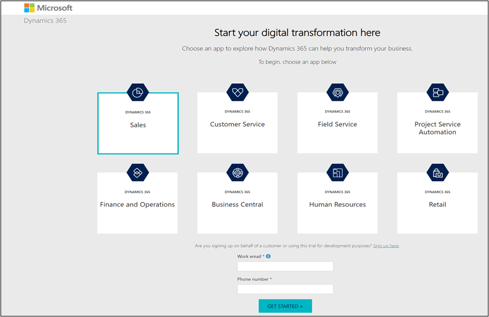
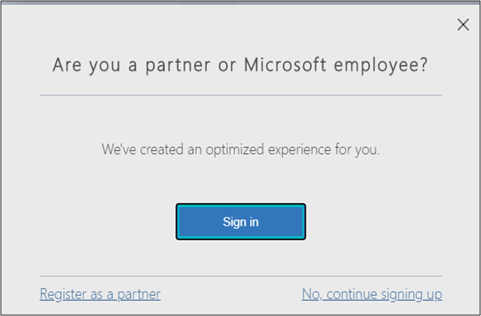
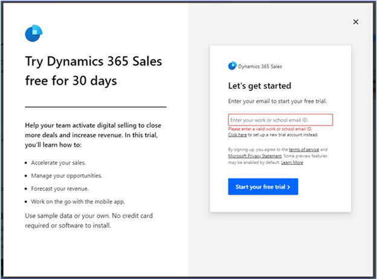
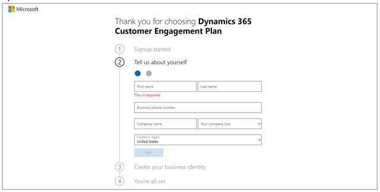
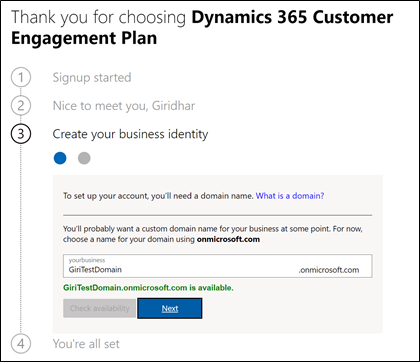
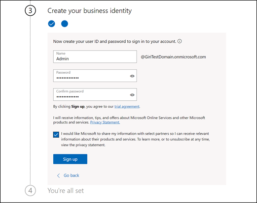
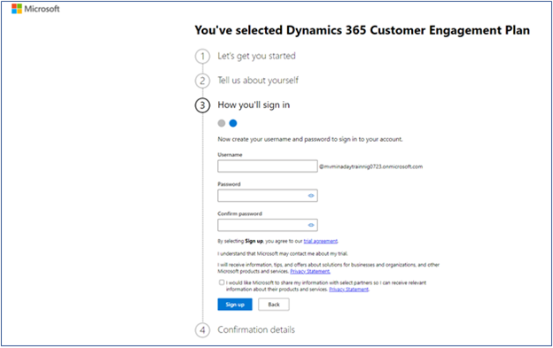
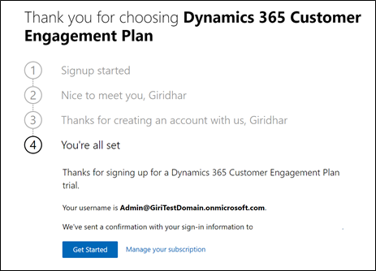
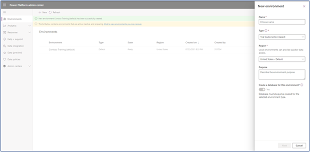
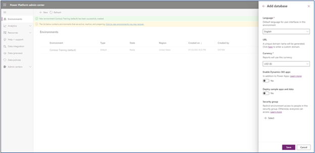

To deploy Microsoft Vaccination Management in a Dataverse environment, you need to add a tenant and the prerequisite licenses.

In this exercise, you will be playing the role of a system administrator and will learn how to create a demo tenant along with the required trial licenses. You can skip this exercise if you have already created a demo tenant and added the trial licenses.

### Task 1: Create a demo tenant

In this task, you will learn how to create a demo tenant along with the required Microsoft Dynamics 365 and Microsoft Power Apps trial licenses. You can skip this task if you already have a tenant.

1.  Open an internet browser in **In-Private** or **Incognito** mode.

2.  Go to <https://trials.dynamics.com>.

    > [!div class="mx-imgBorder"]
    > 

3. Select Try for free in the Dynamics 365 Sales card.  A pop-up window will appear, asking you to enter your email to start your free trial. Leave the Email ID field blank and select **Start your free trial**. 

    > [!div class="mx-imgBorder"]
    > 

4. That will show an error asking to provide a valid work or school email ID with a link below to click to set up a new trial account instead. Select the **Click here** to set up a new trial account instead.

5. This will lead to a new account creation flow. In the next page, enter your Email address.

    > [!div class="mx-imgBorder"]
    > 

6. If the email is already using other Microsoft Services it will throw the following warning.

    > [!div class="mx-imgBorder"]
    > 

7. Select **Create a new account instead**. It will open the following page. Provide the necessary information. Enter a valid phone number where you can receive text message to validate the sign up process.  

    > [!div class="mx-imgBorder"]
    > 

8. Once the verification completes, request a valid domain name and Check Availability.

    > [!div class="mx-imgBorder"]
    > 

9. Setup a username and password and sign up.
    
    > [!div class="mx-imgBorder"]
    > 

10. Your Microsoft 365 tenant has been successfully created along with the Dynamics 365 Customer Engagement Plan license that includes a Power Apps license as well.

    > [!div class="mx-imgBorder"]
    > 

11. Select Get Started. This will open the Power Platform Admin Center where you will create a **New Environment** on which the Microsoft Vaccination Management applications will be installed subsequently. Select a valid name for the Environment.  

    > [!div class="mx-imgBorder"]
    > 

    > [!NOTE] Select United States - Default for region. As of current state, Microsoft Vaccination Management is only available in United States region. 

12.	For **Enable Dynamics 365 apps**, select No. This will ensure no Dynamics 365 applications are installed on the Dataverse Environment. Subsequently only Microsoft Vaccination Management applications will be installed. 

    > [!div class="mx-imgBorder"]
    > 

13. Select **Save**.
