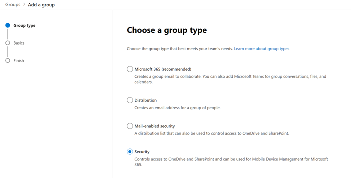
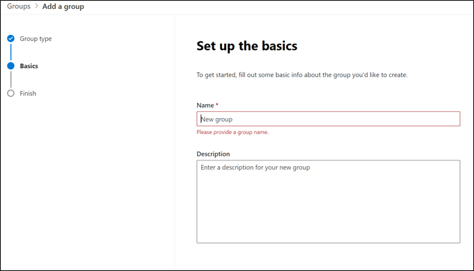
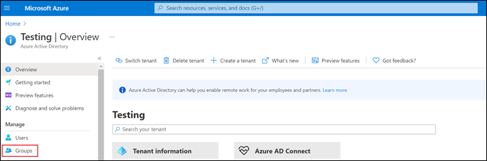
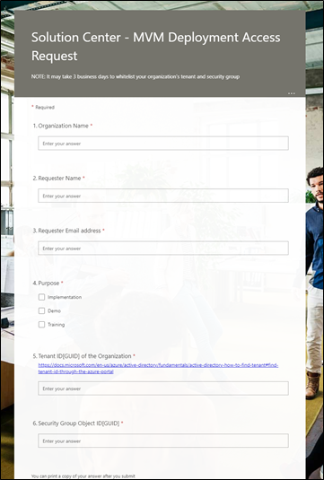

Currently, Microsoft Vaccination Management isn't available for everyone and is only accessible to approved partners and customers.

In this exercise, you will be playing the role of a system administrator and will learn how to place the request to get access to deploy the Microsoft Vaccination Management solution in your tenant.

1.  Go to [https://admin.Microsoft.com](https://admin.microsoft.com/?azure-portal=true). Select **Groups** and then select **Active groups**.

2.  Select **Add a group**.

    > [!div class="mx-imgBorder"]
    > 

3.  Select **Security > Next**.

    > [!div class="mx-imgBorder"]
    > 

4.  Provide a name and description, select **Next**, and then select **Create group**.

    > [!div class="mx-imgBorder"]
    > 

5.  Follow the instructions for [creating groups](/microsoft-365/admin/create-groups/create-groups?view=o365-worldwide#add-members-to-the-group/?azure-portal=true) to add you and other users to the security group. The users in this group will only be able to deploy Microsoft Vaccination Management in an environment. Make sure that the user that you created in Exercise 1, Task 1 is part of this group.

6.  Go to [https://portal.azure.com](https://portal.azure.com/) with the same credentials and then follow the instructions for [find tenant](/azure/active-directory/fundamentals/active-directory-how-to-find-tenant#find-tenant-id-through-the-azure-portal/?azure-portal=true) to retrieve the Tenant ID, which you will be using in later steps.

7.  In Microsoft Azure portal, select **Groups**.

    > [!div class="mx-imgBorder"]
    > 

8.  Copy the Object ID of the newly created security group.

    > [!div class="mx-imgBorder"]
    > 

9.  Go to https://aka.ms/MVMAccess and fill in the required details to add your tenant and security group to the allow list. 

    > [!NOTE]
    > It might take three business days to add your organization's tenant and security group.

    > [!div class="mx-imgBorder"]
    > 

Microsoft will evaluate your request and approve it if your organization is in the approved list.
