In this exercise, you'll configure the Microsoft Cloud for Healthcare Virtual Clinic application. The Virtual Clinic application allows practitioners to use video conferencing in Microsoft Teams to provide high-quality, personalized, and affordable consultations for their patients.

## Task 1: Create a new practitioner specialty for the Patient Portal

In this task, we're going to create a new practitioner specialty for the Patient Portal. Practitioner specialties are used to define the reason why a patient is booking the virtual appointment. They're defined as Codeable Concepts records, with the type of Practitioner Specialty.

Below is an example of the appointment booking screen in the Patient Portal. As the first step in the process, the user must select a reason for their appointment.

> [!div class="mx-imgBorder"]
> 

For an entity that isn't shown directly in an application's sitemap, we can add a new record through Power Apps or Dynamics 365. To create a new practitioner specialty, we'll show you how to create a new Codeable Concepts record in both ways, starting with Power Apps.

1. Go to [https://make.powerapps.com](https://make.powerapps.com/?azure-portal=true).

1. Expand **Dataverse** on the left sitemap and select **Tables**.

    > [!div class="mx-imgBorder"]
    > [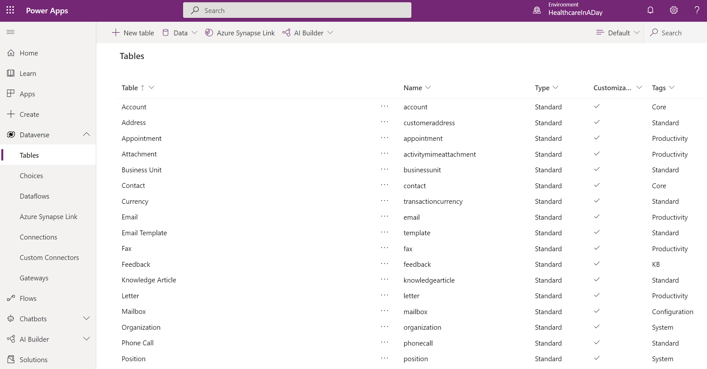](../media/tables.png#lightbox)

1. Switch the view to **Managed**.

    > [!div class="mx-imgBorder"]
    > [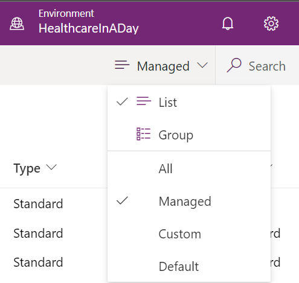](../media/managed.png#lightbox)

1. Search for **Codeable Concepts** table.

    > [!div class="mx-imgBorder"]
    > [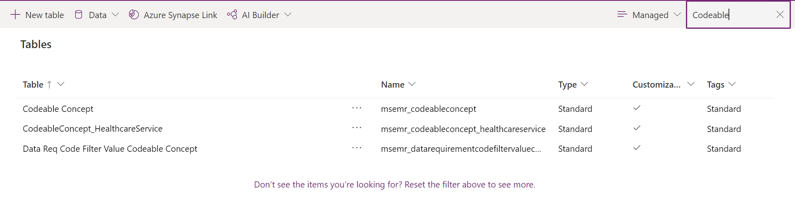](../media/codeable.png#lightbox)

1. Select the Codeable Concepts table and then select the Data tab. You'll likely see no data.

    > [!div class="mx-imgBorder"]
    > [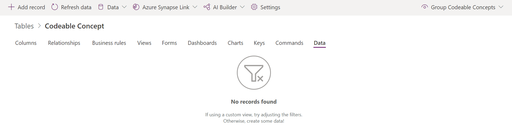](../media/data.png#lightbox)

1. In the upper right, change the view drop-down to show **All columns**. Then you should see data in the system.

    > [!div class="mx-imgBorder"]
    > [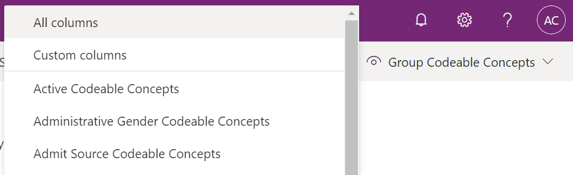](../media/all.png#lightbox)

1. Select **+ Add record**.

    > [!div class="mx-imgBorder"]
    > [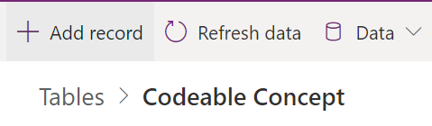](../media/add.png#lightbox)

1. In the new Codable Concept record, fill in the following details.

    1. **Name** - General Medicine

    1. **Text** - General Medicine

    1. **Type** - Practitioner Specialty

    1. **Code** - general

    > [!div class="mx-imgBorder"]
    > [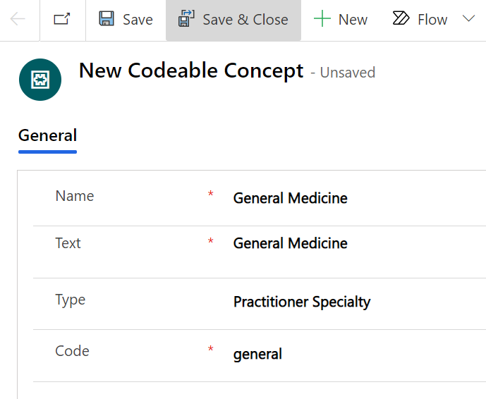](../media/new-record.png#lightbox)

1. Select **Save & Close**.

1. Select **Refresh Data** for our new record to show in the table.
    > [!div class="mx-imgBorder"]
    > [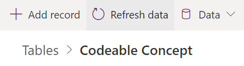](../media/refresh.png#lightbox)

1. Change the view to **Practitioner Specialty Codeable Concepts**.

    > [!div class="mx-imgBorder"]
    > [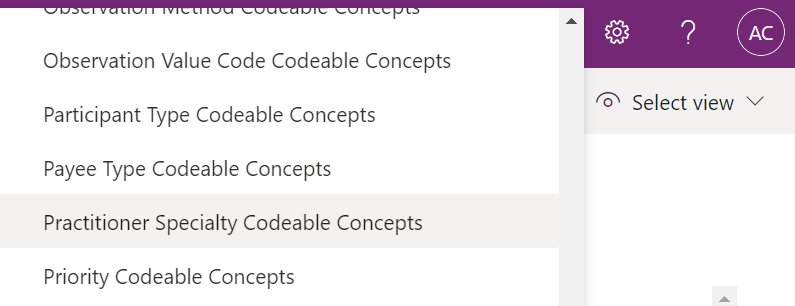](../media/practitioner.png#lightbox)

1. You'll see your new record in the list.

    > [!div class="mx-imgBorder"]
    > [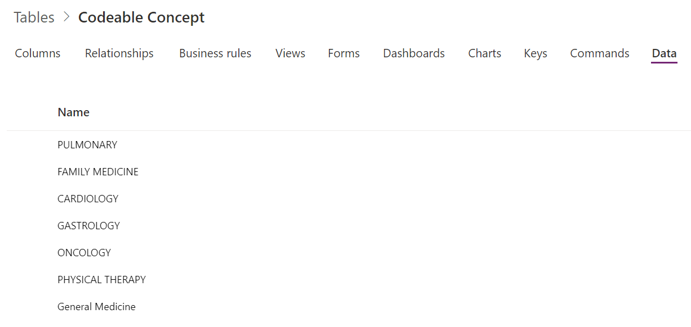](../media/added.png#lightbox)

1. You can also add records through the Dynamics 365 classic UI. We'll show how to do that now. You may skip to the next task if you already have this knowledge.

1. In [https://make.powerapps.com](https://make.powerapps.com/?azure-portal=true), in the upper-right corner, select the **funnel** **icon** which will open **Advanced Find**.

    > [!div class="mx-imgBorder"]
    > [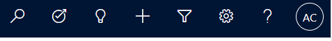](../media/funnel.png#lightbox)

1. In the **Search** box, browse for **Codeable Concepts** and select **Results**.

    > [!div class="mx-imgBorder"]
    > [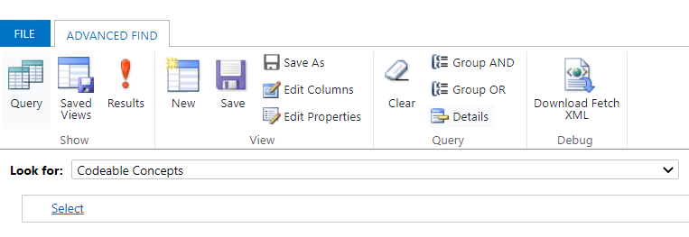](../media/find.png#lightbox)

1. Select **New Codeable Concept**.

    > [!div class="mx-imgBorder"]
    > [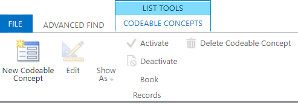](../media/new-code.png#lightbox)

1. In the new Codeable Concept record, fill in the following details and select Save.

    1. **Name** - General Medicine

    1. **Text** - General Medicine

    1. **Type** - Practitioner Specialty

    1. **Code** - general

    > [!div class="mx-imgBorder"]
    > [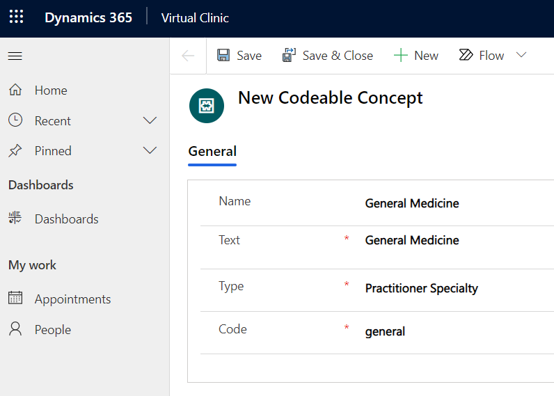](../media/record.png#lightbox)

**Congratulations!** You've created a new practitioner specialty that will now be available for selection as an appointment visit in the Patient Portal.

## Task 2: Enable a practitioner's schedule

In this task, you'll configure the practitioner's schedule to allow patients to book appointments with them in the Patient Portal.

1. In the Virtual Clinic app, change the sitemap area in the lower-left corner from Operations to **Schedule Administration**.

    > [!div class="mx-imgBorder"]
    > [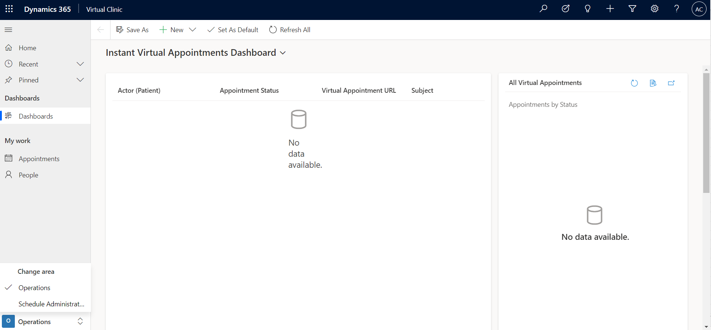](../media/dashboard.png#lightbox)

1. On the sitemap, select **Schedules** and open the **Alex Johnson schedule** record.

    > [!div class="mx-imgBorder"]
    > [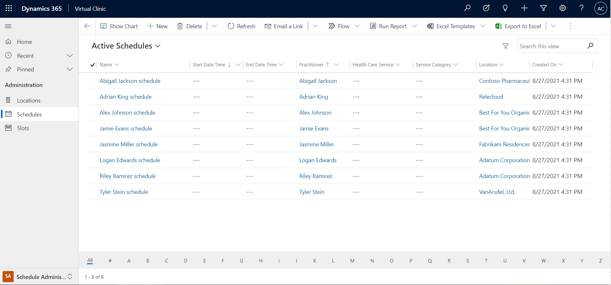](../media/schedules.png#lightbox)

1. Change **Active** from No to **Yes** and select **Save**.

    > [!div class="mx-imgBorder"]
    > [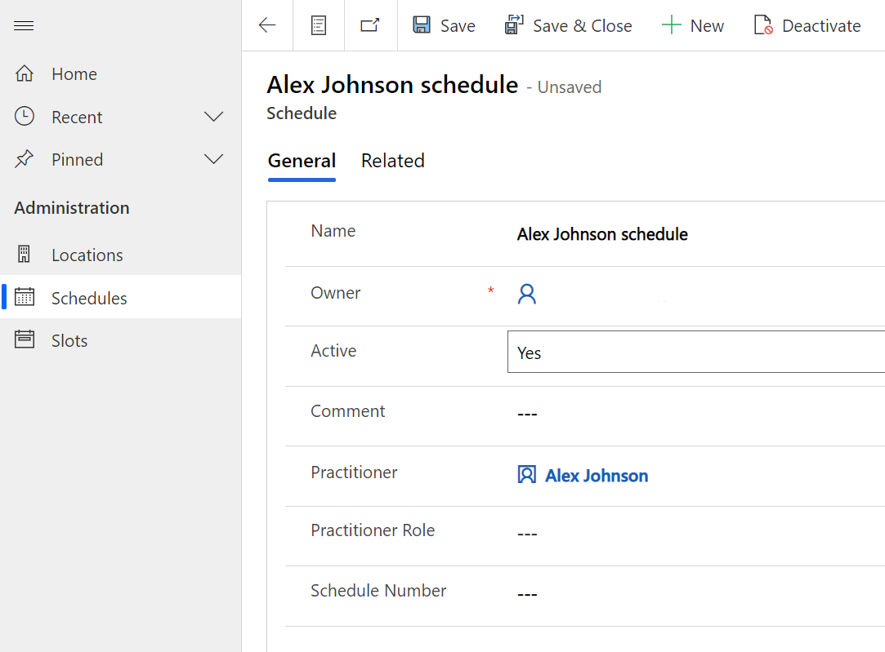](../media/active.png#lightbox)

**Congratulations!** You've enabled a practitioner's schedule to be used for booking virtual appointments.

## Task 3: Configure slots

In this task, we'll configure a new appointment slot to show practitioner's availability. This will allow patients to select an available appointment time slot when booking with a practitioner. Enable Reed's practitioner, Alex Johnson, to be available today at a set time for virtual appointments.

1. In the Virtual Clinic app, select **Slots** on the Site Map and select + **New**.

    > [!div class="mx-imgBorder"]
    > [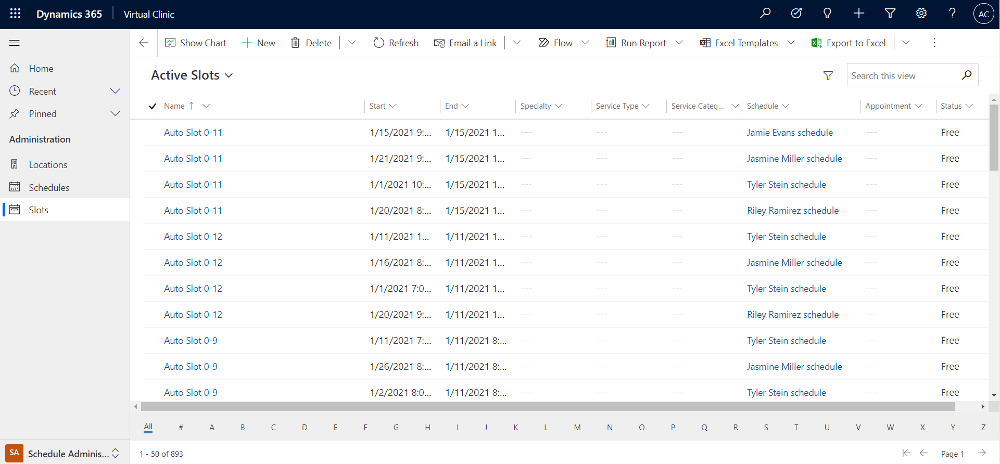](../media/slots.png#lightbox)

1. Fill in the following record details and select **Save & Close**.

    1. **Name** - Alex Johnson Slot

    1. **Start** - Today, at a later time

    1. **End** - Today, an hour after the Start

    1. **Schedule** - Alex Johnson schedule

    1. **Status** - Free

    1. **isVirtual** - Yes

    1. **Specialty** - General Medicine (the practitioner specialty record you created)

    1. **Service** **Category** - General Medicine (same as specialty)

    > [!div class="mx-imgBorder"]
    > 

**Congratulations!** You've created a new virtual slot for Reed to book with his practitioner, Alex Johnson.

## Task 4: Configure Mapped System User on Practitioner Record

In this task, you'll configure the Mapped System User field on the Practitioner record. This field should be set to the system user that maps to the contact record. Set this field to our logged-in user record.

- The Teams meeting is created on this mapped user's calendar (for a Virtual appointment).

- For an Instant appointment, the meeting is created on the Organizer (organizer email for virtual appointments) specified in the Admin settings.

1. Go to [https://make.powerapps.com](https://make.powerapps.com/?azure-portal=true).

1. Select Apps and then open the **Virtual Clinic** application.

    > [!div class="mx-imgBorder"]
    > [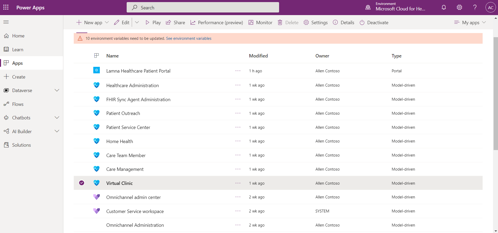](../media/apps.png#lightbox)

1. If you're already in the app from the previous task, switch to the **Operations** area.

    > [!div class="mx-imgBorder"]
    > [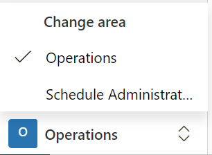](../media/operations.png#lightbox)

1. Select People, change the view from Active Patients to **Active Practitioners**, and open the **Alex Johnson** record.

    > [!div class="mx-imgBorder"]
    > [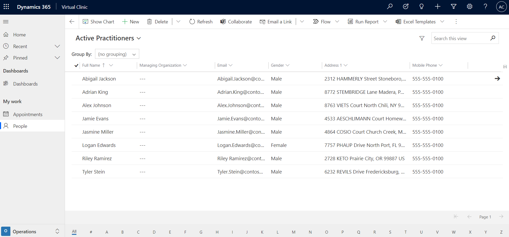](../media/people.png#lightbox)

1. Select **your logged-in user** as the **Mapped System User**.

    > [!div class="mx-imgBorder"]
    > [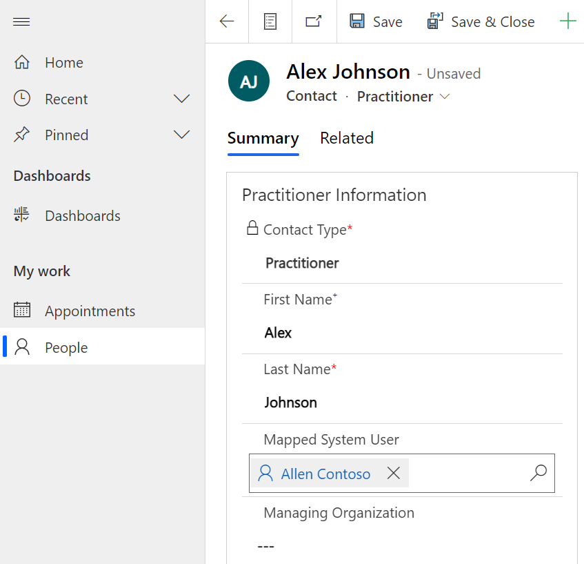](../media/mapped.png#lightbox)

1. Select **Save & Close**.

**Congratulations!** You've mapped the practitioner record to your logged in user so that you can accept the video call when the patient has a virtual visit.

## Task 5: Configure environment variables

In this task, you'll configure the environment variables necessary to generate a Microsoft Teams URL for virtual appointments.

1. Go to [https://make.powerapps.com](https://make.powerapps.com/?azure-portal=true).

1. Go to **Apps** and select **See environment variables** in the top orange bar.

    > [!div class="mx-imgBorder"]
    > [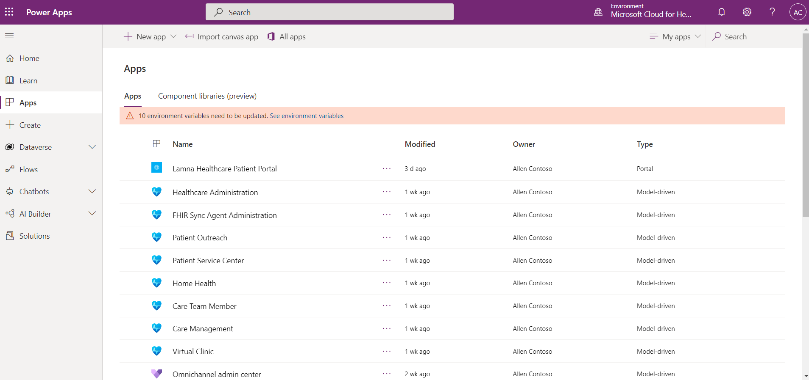](../media/environment.png#lightbox)

1. Scroll down to the bottom to find the **Virtual Visit Secret** and the **Virtual Visit Client ID**. These environment variables are used to authenticate against the Microsoft Graph API to schedule the meeting event. To set these up, we need to create a new Application Registration in Microsoft Azure.

    > [!div class="mx-imgBorder"]
    > 

1. Open a new tab in your internet browser and go to [portal.azure.com](https://portal.azure.com/?azure-portal=true).

1. Search for and select **Azure Active Directory**

    > [!div class="mx-imgBorder"]
    > [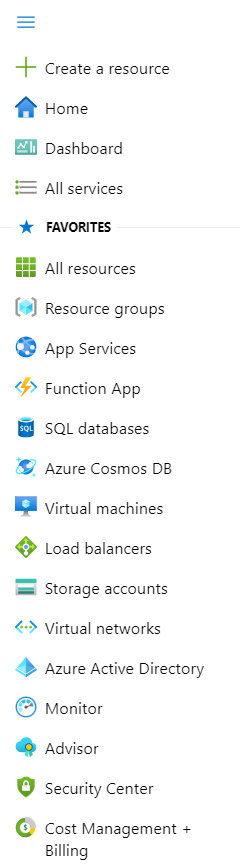](../media/azure.png#lightbox)

1. Select **Add > App registration**.

    > [!div class="mx-imgBorder"]
    > [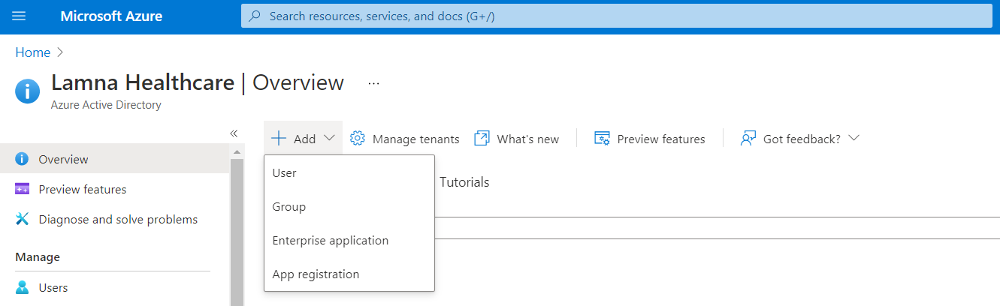](../media/registration.png#lightbox)

1. Name the App, "Lamna Healthcare - Microsoft Teams Identity" and select **Register**. After the App registration is created, set up the API Permissions and Secrets.

    > [!div class="mx-imgBorder"]
    > [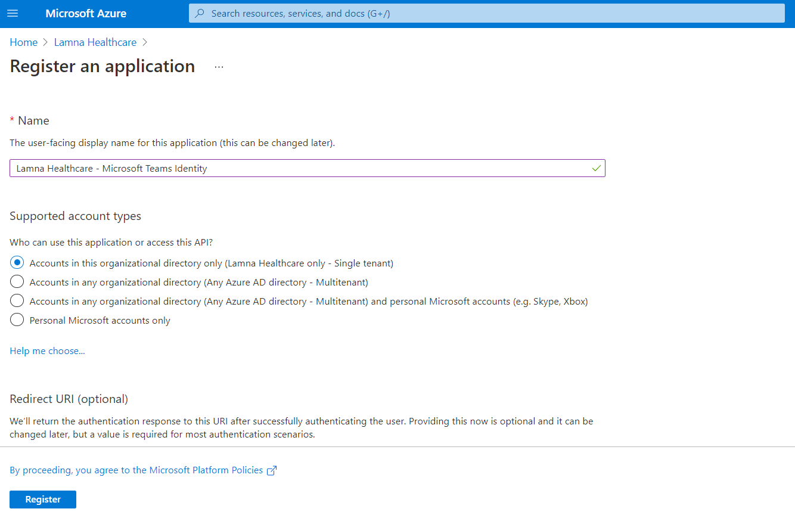](../media/register.png#lightbox)

1. Select **API Permissions**.

    > [!div class="mx-imgBorder"]
    > [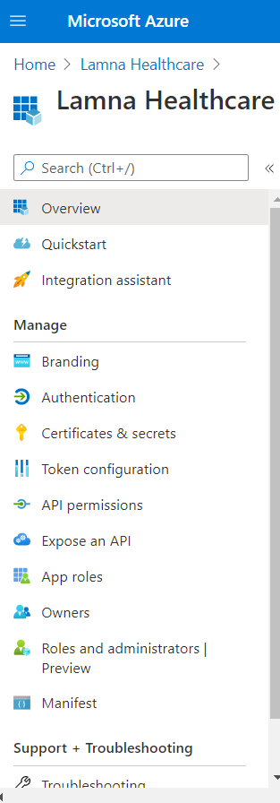](../media/permissions.png#lightbox)

1. Select **Add a permission**.

    > [!div class="mx-imgBorder"]
    > [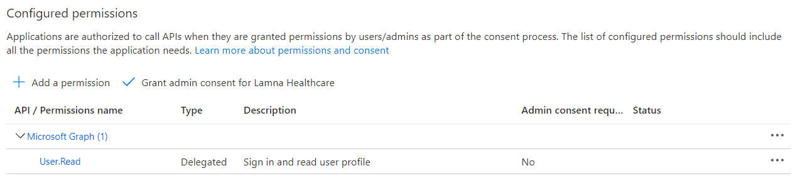](../media/add-permission.png#lightbox)

1. Select **Microsoft Graph**.

    > [!div class="mx-imgBorder"]
    > [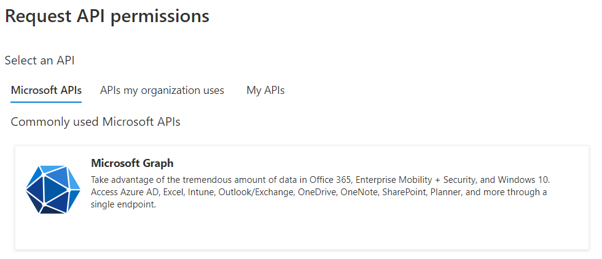](../media/graph.png#lightbox)

1. Select **Application Permissions** and search for "Calendar". Expand **Calendars** and select **Calendars.ReadWrite**. Select **Add permissions**.

    > [!div class="mx-imgBorder"]
    > [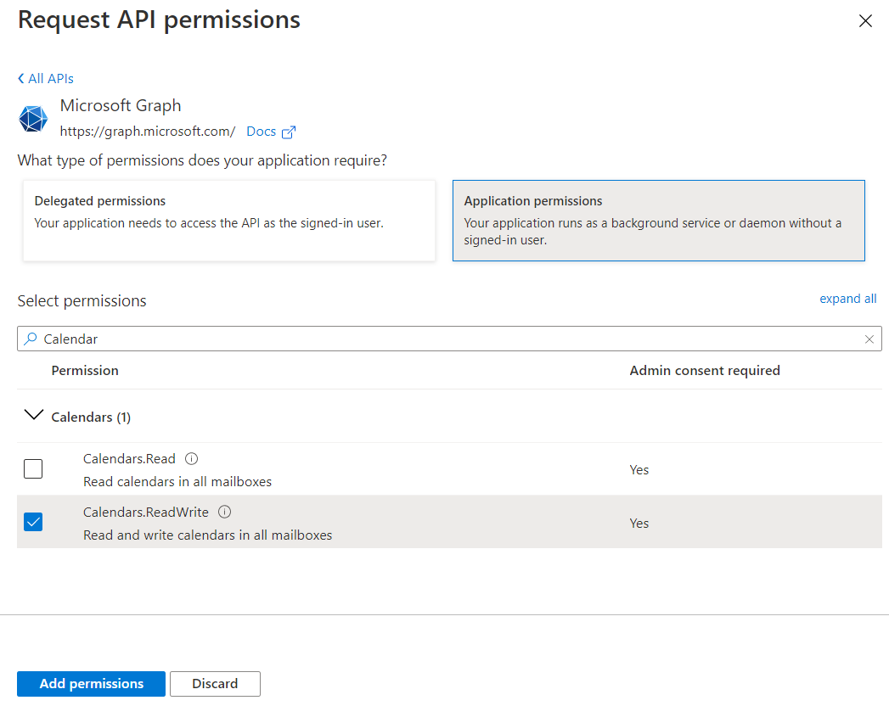](../media/calendars.png#lightbox)

1. Select **Grant admin consent** for the Tenant.

    > [!div class="mx-imgBorder"]
    > [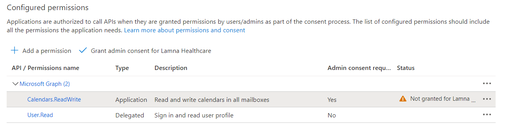](../media/grant.png#lightbox)

1. Select **Yes** to see the granted permissions.

    > [!div class="mx-imgBorder"]
    > [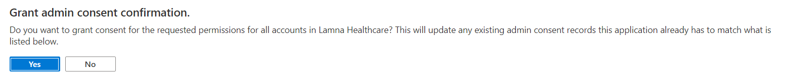](../media/consent.png#lightbox)

    > [!div class="mx-imgBorder"]
    > [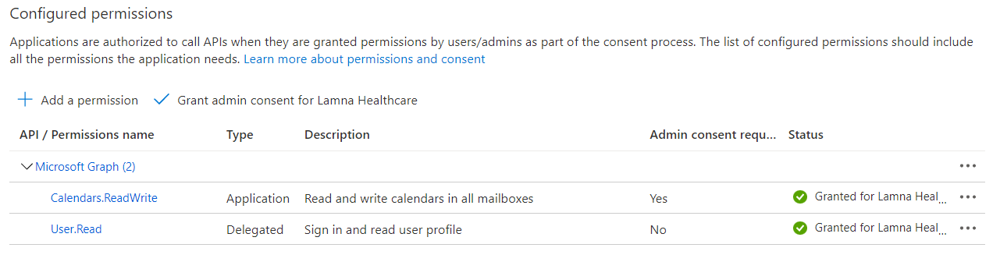](../media/configured.png#lightbox)

1. Obtain the Secret value by selecting **Certificates and secrets** on the left navigation. Then select **+ New client secret**.

    > [!div class="mx-imgBorder"]
    > [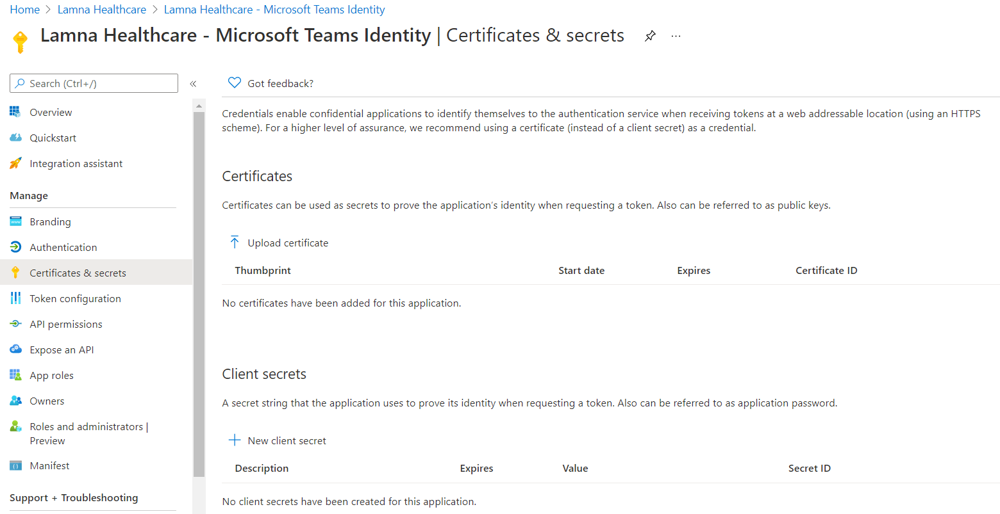](../media/secret.png#lightbox)

1. Enter "Lamna Healthcare - Microsoft Teams Identity secret" for the Description and then select **Add**.

    > [!div class="mx-imgBorder"]
    > [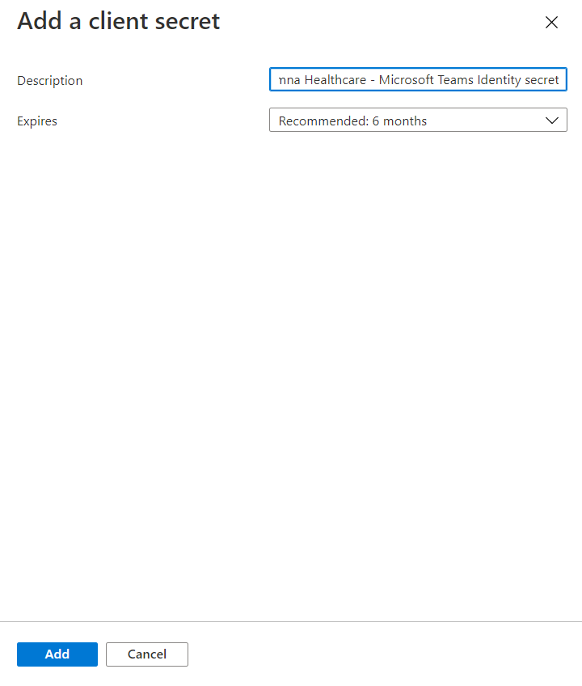](../media/add-secret.png#lightbox)

1. Copy the **Secret Value** and save for later.

    > [!div class="mx-imgBorder"]
    > [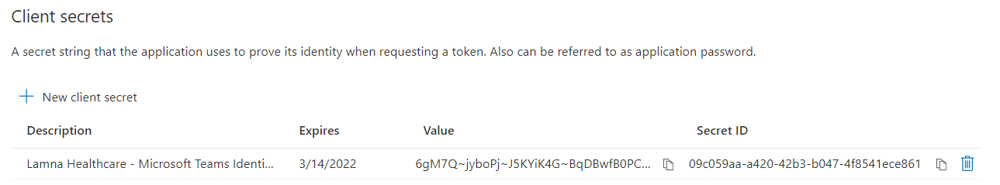](../media/secret-value.png#lightbox)

1. Return to the Application main page, copy the **Application ID** and save for later use.

    > [!div class="mx-imgBorder"]
    > [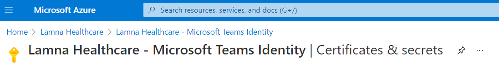](../media/application.png#lightbox)

    > [!div class="mx-imgBorder"]
    > [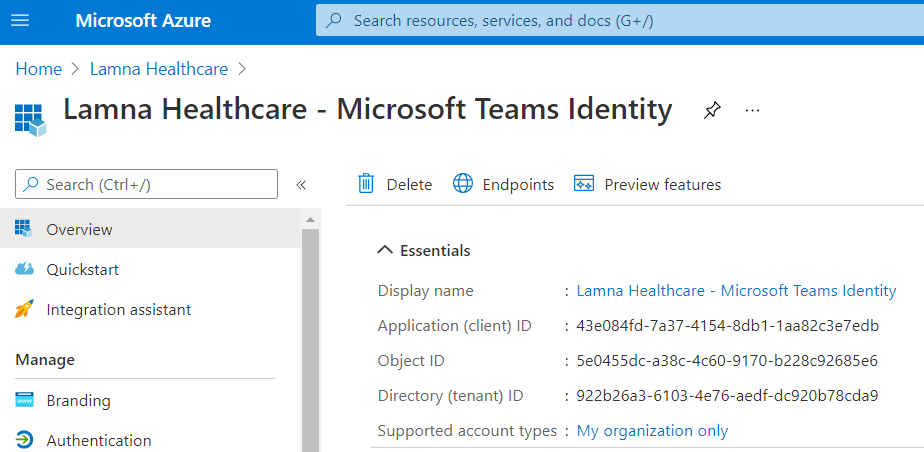](../media/app-id.png#lightbox)

1. Return to the [https://make.powerapps.com](https://make.powerapps.com/?azure-portal=true) tab and enter **both** the **Secret** and **Application IDs** that you copied.

    > [!div class="mx-imgBorder"]
    > [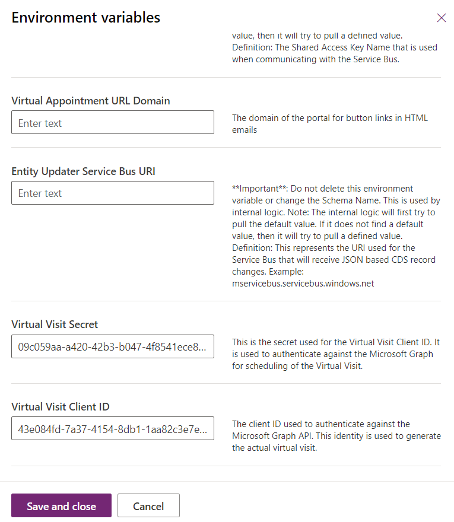](../media/enter-secret.png#lightbox)

1. Finally, enter the email address of your logged in user into the **Virtual Appointment Scheduler Email** field.

    > [!div class="mx-imgBorder"]
    > [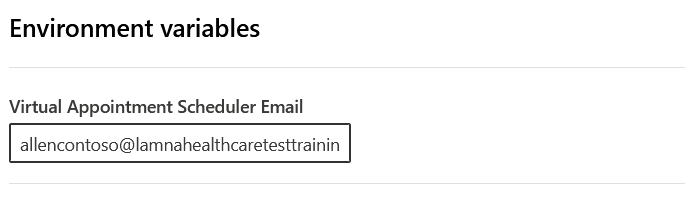](../media/email.png#lightbox)

1. Select **Save and close**.

**Congratulations!** You've obtained the **Virtual Visit Client ID** and **Virtual Visit Secret** combination to be used to authenticate against the Microsoft Graph API to schedule virtual meeting events. You've also entered the email address of a primary event scheduler.

## Task 6: Activate Flows and Connection References

In this task, we'll activate the Flows and Connection References that deployed along with the Virtual Clinic application.

1. Navigate to [https://make.powerapps.com](https://make.powerapps.com/?azure-portal=true).

1. Select **Solutions** and then select **+ New Solution**.

    > [!div class="mx-imgBorder"]
    > [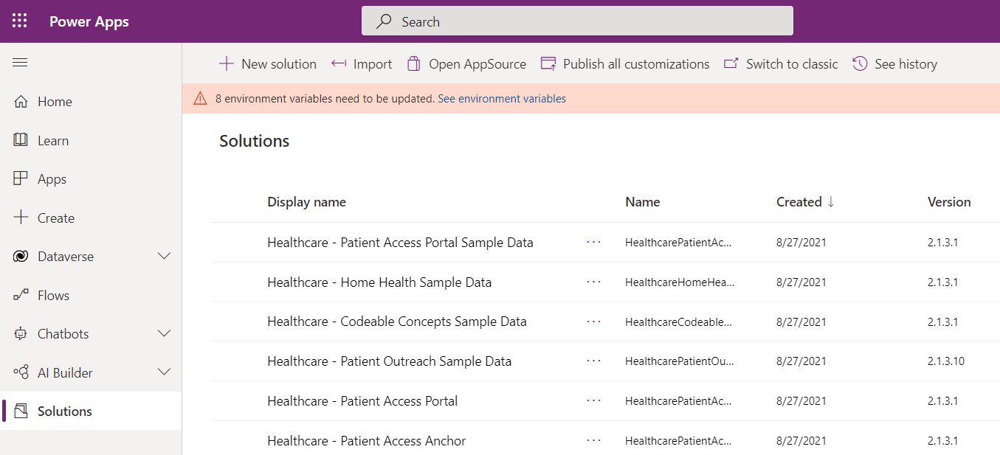](../media/solutions.png#lightbox)

1. Name the solution "LamnaHealthcare", choose the **CDS Default Publisher** and select **Create**.

    > [!div class="mx-imgBorder"]
    > [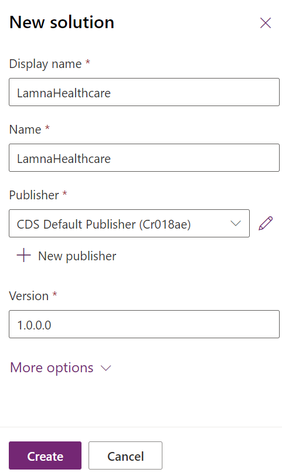](../media/new-solution.png#lightbox)

1. Select the new **LamnaHealthcare** solution and click **Edit**.

	> [!div class="mx-imgBorder"]
	> [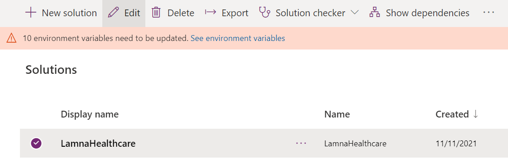](../media/solution-edit.png#lightbox)

1. Select **+ Add existing** and select **Cloud flow** under Automation.

    > [!div class="mx-imgBorder"]
    > [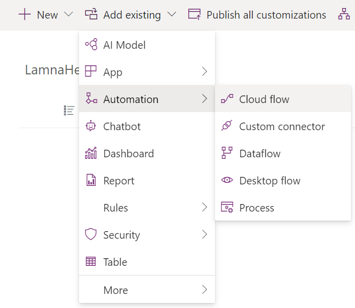](../media/cloud.png#lightbox)

1. Select **CF -> Schedule Teams Meeting for instant and virtual, update record with url and status booked** and select **Add**.

    > [!div class="mx-imgBorder"]
    > [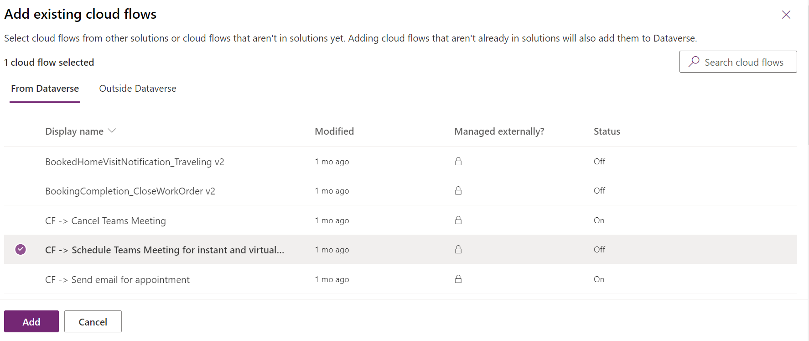](../media/existing.png#lightbox)

1. Select the Cloud flow. Navigate to Details in a new tab on the command bar to open in Power Automate.

    > [!div class="mx-imgBorder"]
    > [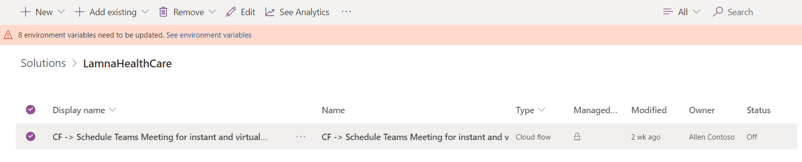](../media/flow.png#lightbox)

1. Under the **Connection References** section, select **Edit**

    > [!div class="mx-imgBorder"]
    > [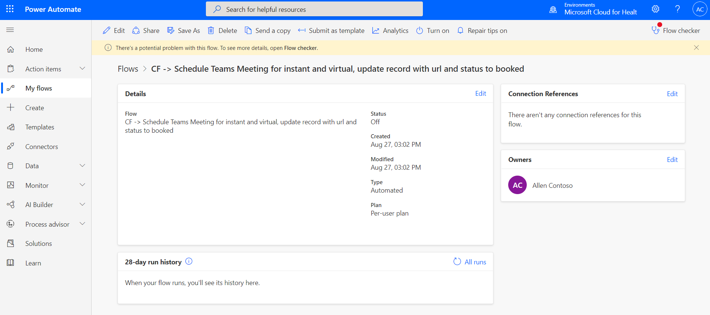](../media/connection.png#lightbox)

1. Select **Edit**.

    > [!div class="mx-imgBorder"]
    > [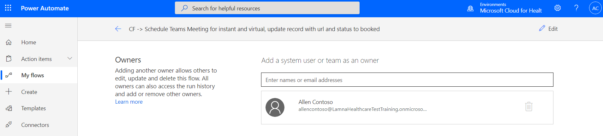](../media/edit.png#lightbox)

1. Select **Sign in** for **Microsoft Dataverse** to create the Connection Reference.

    > [!div class="mx-imgBorder"]
    > [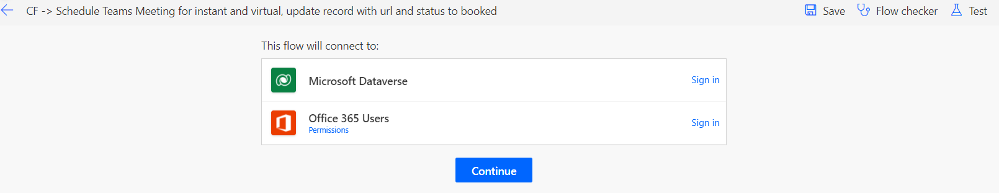](../media/dataverse.png#lightbox)

1. Select **Sign in** for **Office 365 Users** to create the Connection Reference.

   > [!div class="mx-imgBorder"]
   > [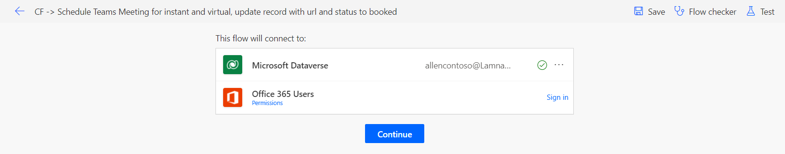](../media/office.png#lightbox)

1. Select **Continue**.

   > [!div class="mx-imgBorder"]
   > [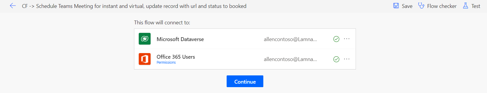](../media/continue.png#lightbox)

1. Select **Save** to commit your updates.

   > [!div class="mx-imgBorder"]
   > [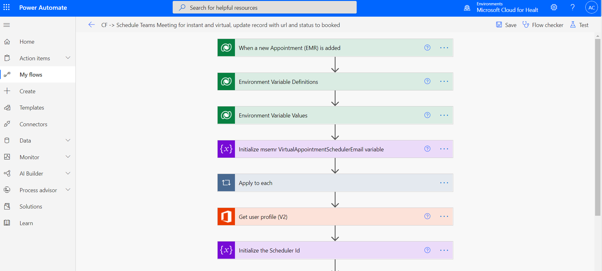](../media/save.png#lightbox)

1. Select the **Back arrow** to return to the flow's main page. Ensure it has completed saving.

   > [!div class="mx-imgBorder"]
   > [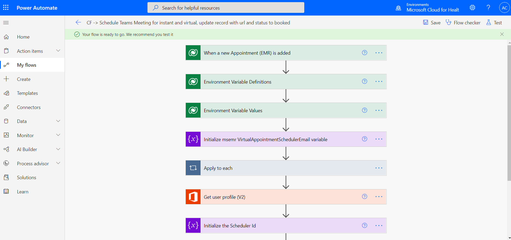](../media/flow-main.png#lightbox)

1. Select **Turn on** to turn on the flow.

    > [!div class="mx-imgBorder"]
    > [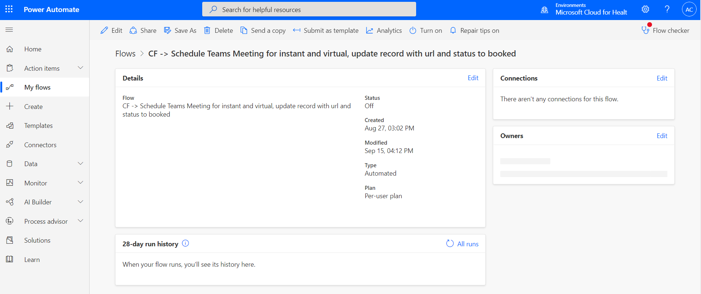](../media/turn-on.png#lightbox)

**Congratulations!** You've set the Connection References and turn on the Cloud flow for creating virtual appointments.
