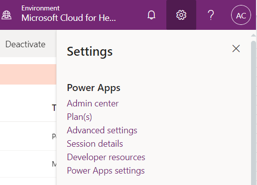
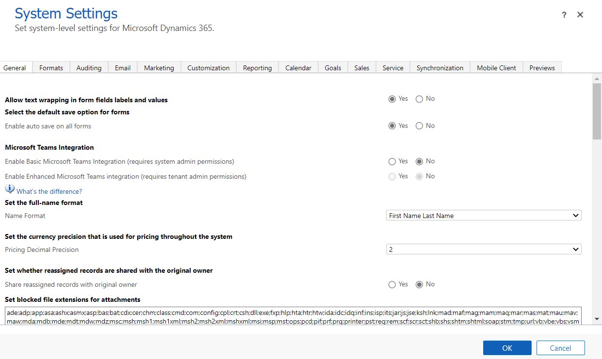
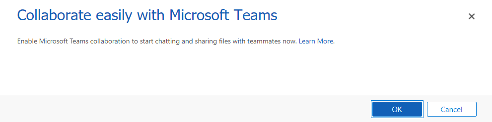
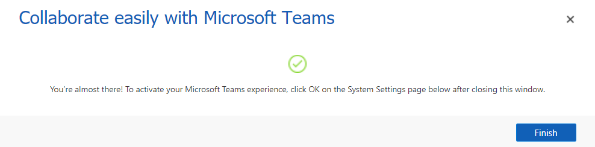
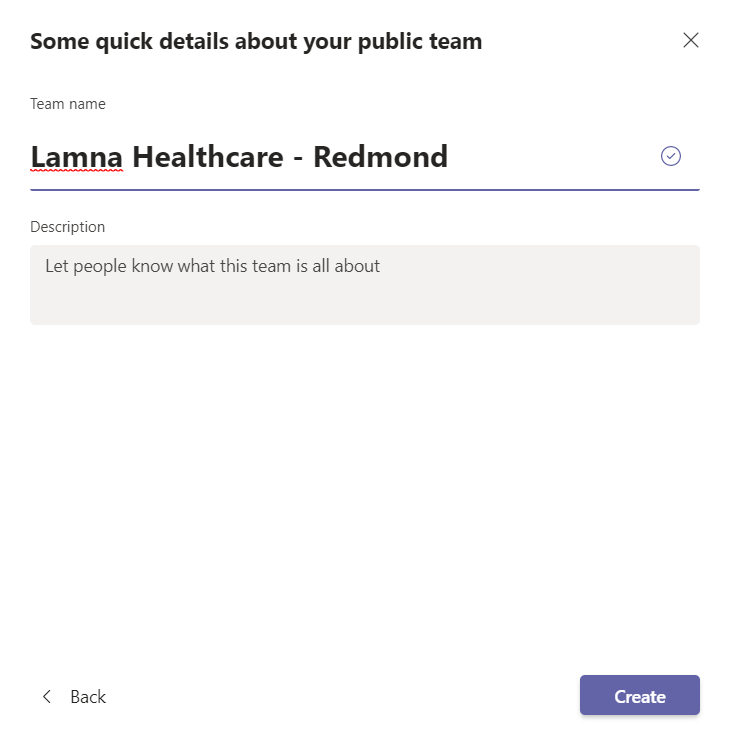
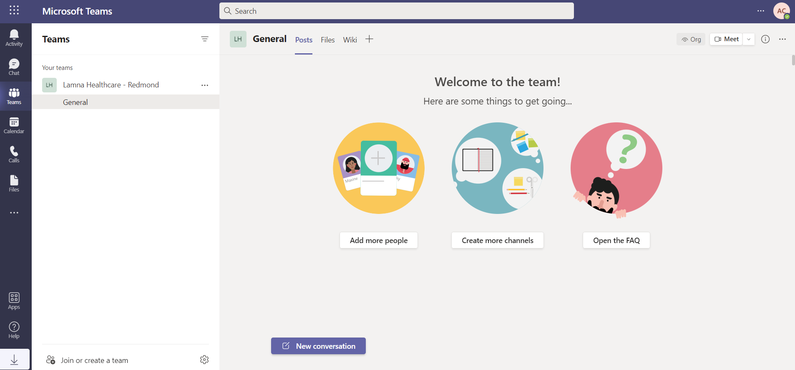
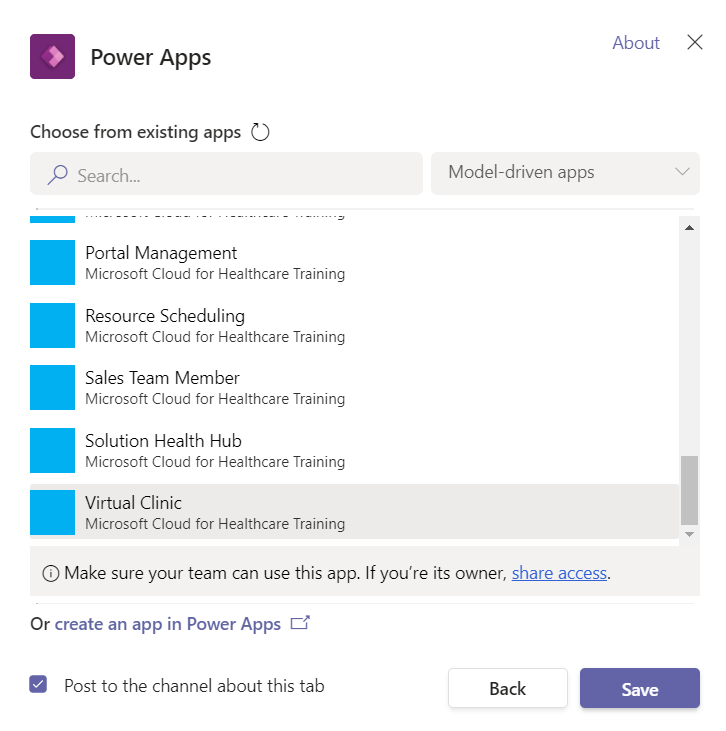
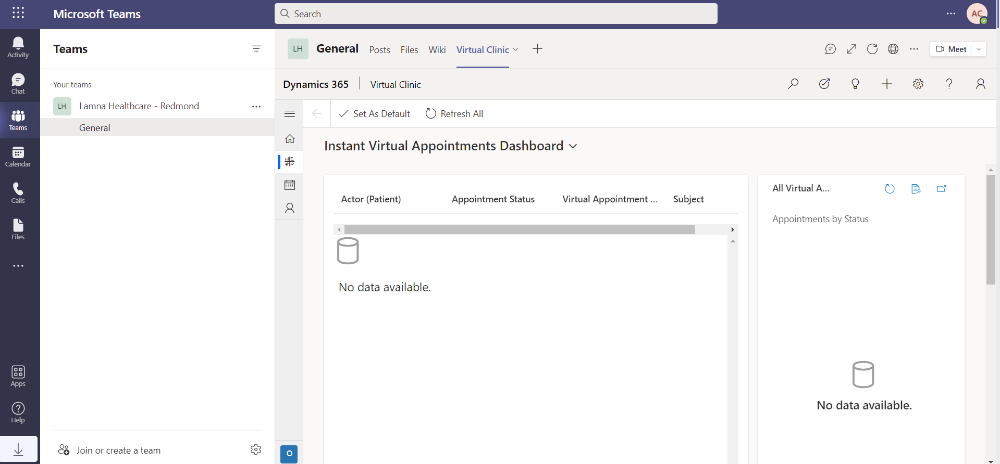

In this exercise, you'll configure integration with Microsoft Teams for Lamna Healthcare Company. Microsoft Teams offers several features useful for hospitals and other healthcare organizations. By integrating Microsoft Cloud for Healthcare with Microsoft Teams, you can improve the collaboration between your care team staff and enhance patient care. You can quickly schedule and conduct virtual visits remotely with patients.

Additionally, your care team can use Microsoft Teams internally to:

- Chat, call, post messages, and communicate as a team

- Store and share files and documents to collaborate

- Use Shifts to create, manage, and share schedules among your staff

## Task 1: Install and set up Microsoft Teams integration

By default, the Basic and Enhanced Microsoft Teams integration is disabled for customer engagement apps in Dynamics 361. Enable Microsoft Teams in Dynamics 365.

1. Go to [https://make.powerapps.com](https://make.powerapps.com/?azure-portal=true).

1. Select the **gear** in the upper-right corner and then select **Advanced Settings**.

   > [!div class="mx-imgBorder"]
   > 

1. Go to **Settings** > **System** > **Administration**.

   > [!div class="mx-imgBorder"]
   > 

1. Go to **System Settings**.

   > [!div class="mx-imgBorder"]
   > 

1. Under Microsoft Teams Integration, switch Enable **Basic** Microsoft Teams Integration over to **Yes**.

   > [!div class="mx-imgBorder"]
   > 

1. When the pop-up opens, select **OK**. This will take several minutes to configure.

   > [!div class="mx-imgBorder"]
   > 

1. When it's done, select **Finish**.

   > [!div class="mx-imgBorder"]
   > 

1. Once back on System Settings, switch Enable **Enhanced** Microsoft Teams integration to **Yes**.

   > [!div class="mx-imgBorder"]
   > 

1. When the pop-up opens, select **OK**.

   > [!div class="mx-imgBorder"]
   > 

1. Another pop-up window will open to grant permissions. Select the user that you're signed in as currently.

   > [!div class="mx-imgBorder"]
   > 

1. Select **Accept**.

   > [!div class="mx-imgBorder"]
   > 

1. Select **Finish**.

   > [!div class="mx-imgBorder"]
   > 

1. You'll now see that both Microsoft Teams Integration settings are set to **Yes**. Select **OK**.

   > [!div class="mx-imgBorder"]
   > 

**Congratulations!** You've enabled Microsoft Teams integration for Dynamics 365.

## Task 2: Embed Virtual Clinic app in Microsoft Teams

In this task, you'll customize the Microsoft Teams experience for a practitioner. Embed the Virtual Clinic app to the Teams channel in your environment.

We'll be utilizing the Microsoft Teams web experience for this task.

1. While logged in to your Microsoft 365 tenant, open a new tab and go to [https://teams.microsoft.com](https://teams.microsoft.com/?azure-portal=true).

1. Select **Next** through the prompts, and then select **Let's Go**.

   > [!div class="mx-imgBorder"]
   > 

1. Select Teams on the left navigation bar and then select **Create Team**.

   > [!div class="mx-imgBorder"]
   > 

1. Select **From scratch**.

   > [!div class="mx-imgBorder"]
   > 

1. Select **Public**.

   > [!div class="mx-imgBorder"]
   > 

1. Call the Team "**Lamna Healthcare - Redmond**" and select **Create**.

   > [!div class="mx-imgBorder"]
   > 

1. Once the Team is created and the **General channel** selected, select the **+** button to add a tab.

   > [!div class="mx-imgBorder"]
   > 

1. Search for "Power Apps" and select **Power Apps**.

   > [!div class="mx-imgBorder"]
   > 

1. Select **Add**.

   > [!div class="mx-imgBorder"]
   > 

1. Select **Model-driven apps** form the drop-down menu, then scroll down and select **Virtual Clinic** and select **Save**.

   > [!div class="mx-imgBorder"]
   > 

1. You'll now see the Virtual Clinic app embedded in Microsoft Teams

   > [!div class="mx-imgBorder"]
   > 

**Congratulations!** You've embedded the Virtual Clinic app in Microsoft Teams.
