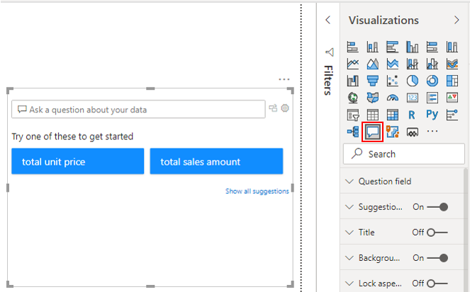
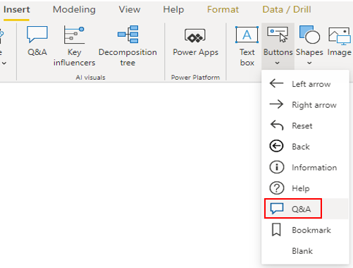
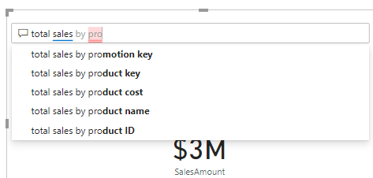
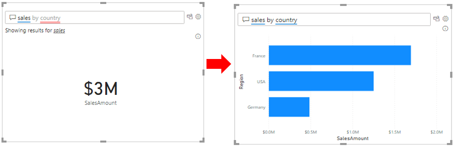
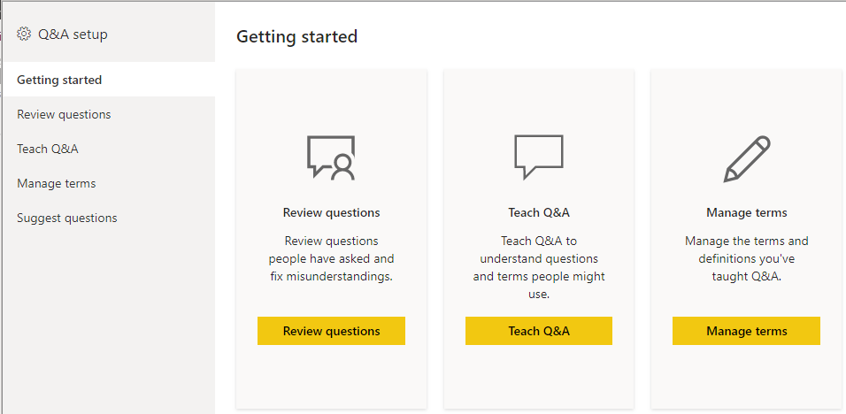
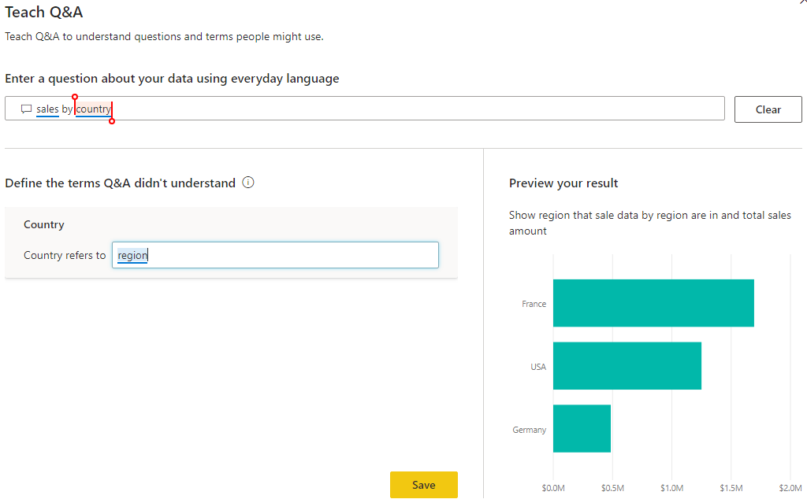
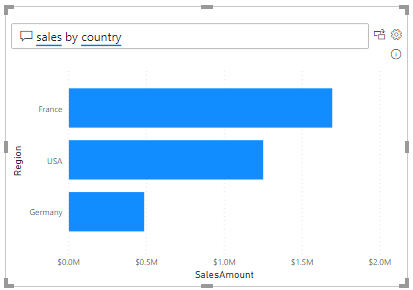
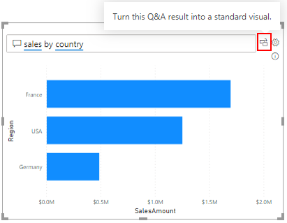

The **Q&A** feature in Power BI lets you explore your data in your own words, by allowing you to ask natural language questions, and then answering those questions for you.

This ability to ask questions is valuable to both you, as the report author, and your report users. It gives you ideas for the type of visuals you can display in your report, and lets you quickly add those visuals. It gives your report users an effective tool they can use to get quick answers to their questions about the data, independently. This self-help aspect to Power BI saves time for everyone involved.

Power BI records all of the questions that are asked, and you can use this information to set up the **Q&A** feature to be more effective. When the **Q&A** feature answers so many questions, you'll have less people coming directly to you looking for those answers.

Suppose you've created a report for the Supply Chain team and the team members now have questions about various other views or insights they are interested in. You are getting inundated with these questions and don't have time to address each one individually. You decide to implement the **Q&A** feature, so that users can ask questions and get answers by themselves.

## Add the Q&A visual to your report canvas

To get access to the **Q&A** feature, you need to add the **Q&A** visual to your report. You can simply double-click anywhere on the white canvas and the visual will appear. Alternatively, you can select the **Q&A** icon on the **Visualizations** pane.

> [!div class="mx-imgBorder"]
> 

The **Q&A** feature is also available as a button, which is a useful option if you want to save space on your report canvas.

> [!div class="mx-imgBorder"]
> 

When the **Q&A** visual or button is added to your report, you can reposition and resize it, and customize its formatting, in the same way you would for any other type of visual or button.

You can start asking questions immediately by selecting one of the suggested questions or typing a question into the question box. As you type, Power BI will automatically display suggestions to help you complete your question.

> [!div class="mx-imgBorder"]
> 

## Set up the Q&A feature

When you have added the **Q&A** visual to your report, you can set up the underlying Q&A feature, so that it becomes better at answering questions about your data. You basically teach the **Q&A** feature to understand people better. This set up can be useful from the outset, so you can get the visual ready for active use. However, set up does not stop there; you can proactively monitor and review the questions that are coming through from users, then and address misunderstandings or common typos. You can also manage the key terms associated with your data, so you can add a library of synonyms that may be used by different users across the organization when asking questions about the data. You can constantly fine-tune the **Q&A** feature, so it provides better answers to your organization's questions.

In this example, you get feedback from users saying that they can't get data on sales by country. You need to test this out, to see what the problem is, so you type the question "*sales by country*" into the question box. The visual does not update; it does not answer your question. As you can see in the following image, the word country is underlined in red. When there is a red underline, Power BI is telling you that it does not understand this term. You know that country is not used in your dataset, you use the term region instead. So that is why the question is not being answered. You need to teach Power BI what you mean by adding a new term to its thesaurus.

> [!div class="mx-imgBorder"]
> 

Select the settings icon to the right of the question box to open the **Q&A** setup window, then select the **Teach** Q&A option.

> [!div class="mx-imgBorder"]
> 

Enter your question again, then select the **Submit** button. In the **Define the terms Q&A didn't understand** section that displays, enter your alternative term, or synonym. In this case, you enter *region*. As you can see in the following image, Power BI displays a preview result, so you can see if this new term will return the results you are looking for. If this is correct, select **Save**.

> [!div class="mx-imgBorder"]
> 

Now when users search for sales by country, Power BI will know that they really mean sales by region, and automatically displays the associated data in the visual.

> [!div class="mx-imgBorder"]
> 

## Build visuals using the Q&A feature

When Power BI answers a question and you find the visual result interesting or helpful, you can add it as a standard visual on your report.

For example, if you review the questions that are being asked and you see that a lot of users are asking the same question, you can make their life easier by adding the answer as a standard visual in the report, so they no longer have to ask the question. Similarly, you can also use the Q&A feature to start building your report, by asking questions and adopting Power BI's suggested visual result formats.

To turn a Q&A result into a standard visual, click the icon next to the question box.

> [!div class="mx-imgBorder"]
> 

The **Q&A** feature is unique in that it does not require knowledge of Power BI to use the visual, users simply have to ask their question and they too can create insightful visuals.
