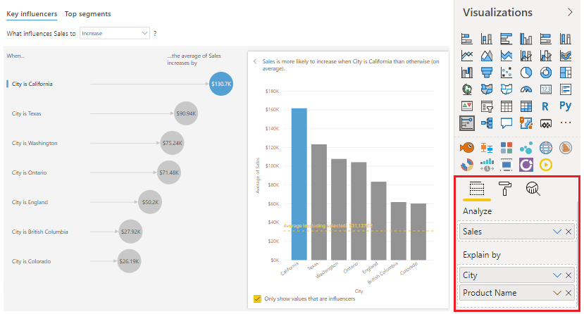

The **Key influencers** visual helps you understand the factors that are affecting a specific metric. It analyzes your data for you, ranks the factors that matter, and then displays those factors as key influencers. The visual also helps you to contrast the relative importance of these factors, meaning that you can build your visuals while understanding what factors impact those visuals and why the visuals appear the way that they do.

In this example, you've built several visuals for the Customer Service team, and now you want to understand the factors that most influence your metrics. Specifically, you want to figure out what factors are affecting the total number of logged tickets. One factor might be the client type and another might be location, but you're uncertain. The **Key influencers** visual will find that information for you.

To establish the key influencers, first add the **Key influencers** visual to your report by selecting the **Key influencers** icon on the **Visualization** pane. Then, populate the visual with the metrics that you want to measure. In this case, you're interested in the logged tickets, so in the **Analyze** field well, you will add the **Sales** field, and in the **Explain by** field well, you will add the **City** and **Product Name** fields. The visual updates according to the fields that you added and then shows the influence that those fields have on your data.

> [!div class="mx-imgBorder"]
> 

You can now use the **What influences...** drop-down list to see what caused the data to decrease or increase. The previous image shows that the sales for California are likely to be USD 130,700.00 higher than sales in other cities.

For more information, see [Create key influencers visualizations](https://docs.microsoft.com/power-bi/visuals/power-bi-visualization-influencers/?azure-portal=true).
