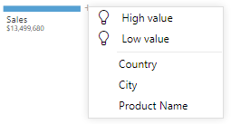
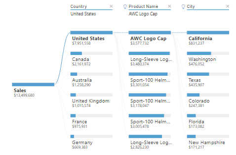

The **Decomposition Tree** visual automatically aggregates your data and lets you drill down into your dimensions, so you can view your data across multiple dimensions. Because the **Decomposition Tree** visual is an AI visual, you can use it for improvised exploration and conducting root cause analysis.

In this example, you've built some visuals for the Supply Chain team but the visuals do not answer all of the team's questions. In particular, the team wants to be able to analyze the percentage of products the organization has on backorder, in other words, the percentage of products that are out of stock. The **Decomposition Tree** visual can help you to do that.

Add the **Decomposition Tree** visual to your report by selecting the **Decomposition Tree** icon on the **Visualization** pane. Then, in the **Analyze** field well, add the measure or aggregate you want to analyze, and the **Explain By** field well, add the dimension(s) that you want to drill down into. In this case, you want to analyze the **Sales** field by drilling down into a number of dimensions, such as **Country, City, and Product** as illustrated in the following image.

> [!div class="mx-imgBorder"]
> 

The visual updates according to the fields you added, and displays the analysis summary result. In this case, the value of sales is $13,499,680. You can then select the "**+**" sign, which will present the drill-down options that you have added. You can select any of the fields in the drop-down list to drill down into the data and see how it contributed into the overall result.

At the top of the list of dimensions you added, you'll see two additional options, marked with lightbulb icons. These options are referred to as *AI Splits* and they'll find high and low values in the data, automatically for you.

> [!div class="mx-imgBorder"]
> 

The AI Splits work by considering all of the available fields and determining which one to drill into to get the highest/lowest value of the measure being analyzed. You can use the results of these splits to find out where you should look next in the data. The following image illustrates the result of selecting the **High value** AI split.

> [!div class="mx-imgBorder"]
> 

For more detailed information on this visual, see [Create and view decomposition tree visuals in Power BI](https://docs.microsoft.com/power-bi/visuals/power-bi-visualization-decomposition-tree/?azure-portal=true).
