In this lab, you will create the **Sales Exploration** report.

In this lab, you learn how to:

-   Create animated scatter charts

-   Use a visual to forecast values

-   Work with the decomposition tree visual

-   Work with the key influences visual

## Create the report

In this exercise, you will create the **Sales Exploration** report.

### Create the report

In this task, you will create the **Sales Exploration** report.

1.  Open the Power BI Desktop, and dismiss the welcome screen.

	> [!div class="mx-imgBorder"]
	> [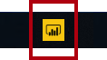](../media/lab-1-ssm.png#lightbox)

1.  Save the file to the **D:\DA100\MySolution** folder, as **Sales Exploration**.

	> [!div class="mx-imgBorder"]
	> [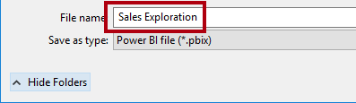](../media/lab-2-ssm.png#lightbox)

1.  Create a live connection to your **Sales Analysis** dataset.

	> [!TIP]
	> Use the **Get Data** command on the **Home** ribbon tab, and then select **Power BI Datasets**.

	> [!div class="mx-imgBorder"]
	> [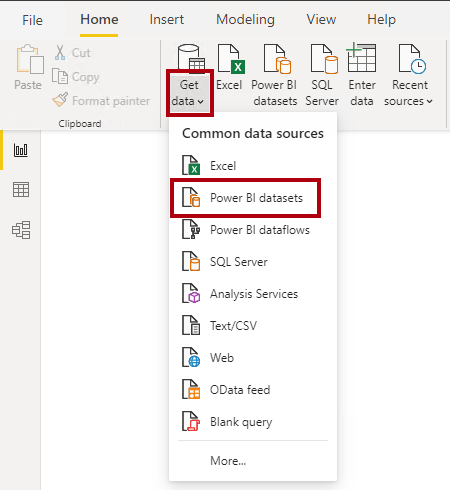](../media/lab-3-ssm.png#lightbox)

You now create four report pages, and on each page you'll work with a different visual to analyze and explore data.

## Create a scatter chart

In this exercise, you will create a scatter chart that can be animated.

### Create an animated scatter chart

In this task, you will create a scatter chart that can be animated.

1.  Rename **Page 1** as **Scatter Chart**.

	> [!div class="mx-imgBorder"]
	> [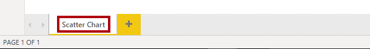](../media/lab-4-ssm.png#lightbox)

1.  Add a **Scatter Chart** visual to the report page, and then reposition and resize it so it fills the entire page.

	> [!div class="mx-imgBorder"]
	> [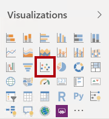](../media/lab-5-ssm.png#lightbox)

	> [!div class="mx-imgBorder"]
	> 

1.  Add the following fields to the visual wells:

	-   Legend: **Reseller | Business Type**
	
	-   X Axis: **Sales | Sales**
	
	-   Y Axis: **Sales | Profit Margin**
	
	-   Size: **Sales | Quantity**
	
	-   Play Axis: **Date | Quarter**

	> [!div class="mx-imgBorder"]
	> [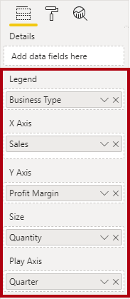](../media/lab-7-ssm.png#lightbox)

	The chart can be animated when a field is added to the **Play Axis** well.

1.  In the **Filters** pane, add the **Product | Category** field to the **Filters On This Page** well.

1.  In the filter card, filter by **Bikes**.

	> [!div class="mx-imgBorder"]
	> 

1.  To animate the chart, at the bottom left corner, click **Play**.

	> [!div class="mx-imgBorder"]
	> [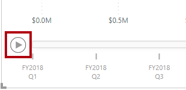](../media/lab-9-ssm.png#lightbox)

1. Watch the entire animation cycle from **FY2018 Q1** to **FY2020 Q4**.

	The scatter chart allows understanding the measure values simultaneously: in this case, order quantity, sales revenue, and profit margin.

	Each bubble represents a reseller business type. Changes in the bubble size reflect increased or decreased order quantities. While horizontal movements represent increases/decreases in sales revenue, and vertical movements represent increases/decreases in profitability.

1. When the animation stops, click one of the bubbles to reveal its tracking over time.

1. Hover the cursor over any bubble to reveal a tooltip describing the measure values for the reseller type at that point in time.

1. In the **Filters** pane, filter by **Clothing** only, and notice that it produces a very different result.

1. Save the Power BI Desktop file.

## Create a forecast

In this exercise, you will create a forecast to determine possible future sales revenue.

### Create a forecast

In this task, you will create a forecast to determine possible future sales revenue.

1. Add a new page, and then rename the page to **Forecast**.

	> [!div class="mx-imgBorder"]
	> [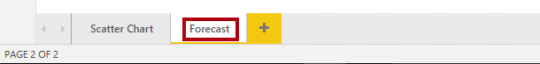](../media/lab-10-ssm.png#lightbox)

1. Add a **Line Chart** visual to the report page, and then reposition and resize it so it fills the entire page.

	> [!div class="mx-imgBorder"]
	> [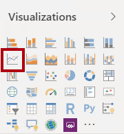](../media/lab-11-ssm.png#lightbox)

	> [!div class="mx-imgBorder"]
	> 

1. Add the following fields to the visual wells:

	-   Axis: **Date | Date**
	
	-   Values: **Sales | Sales**

	> [!div class="mx-imgBorder"]
	> [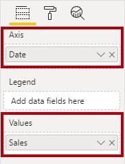](../media/lab-13-ssm.png#lightbox)

1. In the **Filters** pane, add the **Date | Year** field to the **Filters On This Page** well.

1. In the filter card, filter by two years: **FY2019** and **FY2020**.

	> [!div class="mx-imgBorder"]
	> [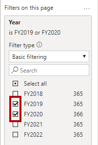](../media/lab-14-ssm.png#lightbox)

	When forecasting over a time line, you will need at least two cycles (years) of data to produce an accurate and stable forecast.

1. Add also the **Product | Category** field to the **Filters On This Page** well, and filter by **Bikes**.

	> [!div class="mx-imgBorder"]
	> [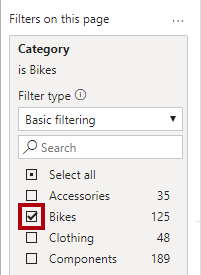](../media/lab-15-ssm.png#lightbox)

1. To add a forecast, beneath the **Visualizations** pane, select the **Analytics** pane.

	> [!div class="mx-imgBorder"]
	> [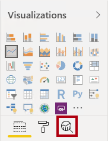](../media/lab-16-ssm.png#lightbox)

1. Expand the **Forecast** section.

	> [!div class="mx-imgBorder"]
	> 

	If the **Forecast** section is not available, it's probably because the visual hasn't been correctly configured. Forecasting is only available when two conditions are met: the axis has a single field of type date, and there's only one value field.

1. Click **Add**.

	> [!div class="mx-imgBorder"]
	> [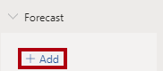](../media/lab-18-ssm.png#lightbox)

1. Configure the following forecast properties:

	-   Forecast length: 1 month
	
	-   Confidence interval: 80%
	
	-   Seasonality: 365

1. Click **Apply**.

	> [!div class="mx-imgBorder"]
	> [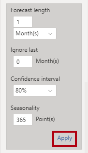](../media/lab-19-ssm.png#lightbox)

1. In the line visual, notice that the forecast has extended one month beyond the history data.

	The gray area represents the confidence. The wider the confidence, the less stable and therefore the less accurate, the forecast is likely to be.
	
	When you know the length of the cycle, in this case annual, you should enter the seasonality points. Sometimes it could be weekly (7), or monthly (30).

1. In the **Filters** pane, filter by **Clothing** only, and notice that it produces a different result.

1. Save the Power BI Desktop file.

## Work with a decomposition tree

In this exercise, you will create a decomposition tree to explore the relationships between reseller geography and profit margin.

### Work with a decomposition tree

In this task, you will create a decomposition tree to explore the relationships between reseller geography and profit margin.

1. Add a new page, and then rename the page to **Decomposition Tree**.

	> [!div class="mx-imgBorder"]
	> [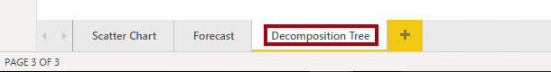](../media/lab-20-ssm.png#lightbox)

1. On the **Insert** ribbon, from inside the **AI Visuals** group, click **Decomposition Tree**.

	> [!TIP]
	> The AI visuals are also available in the **Visualizations** pane.

	> [!div class="mx-imgBorder"]
	> [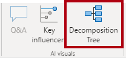](../media/lab-21-ssm.png#lightbox)

1. Reposition and resize the visual so it fills the entire page.

	> [!div class="mx-imgBorder"]
	> 

1. Add the following fields to the visual wells:

	-   Analyze: **Sales | Profit Margin**
	
	-   Explain By: **Reseller | Geography** (the entire hierarchy)

	> [!div class="mx-imgBorder"]
	> 

1. In the **Filters** pane, add the **Date | Year** field to the **Filters On This Page** well, and set the filter to **FY2020**.

	> [!div class="mx-imgBorder"]
	> [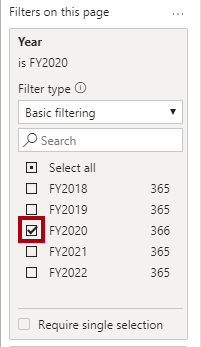](../media/lab-24-ssm.png#lightbox)

1. In the decomposition tree visual, notice the root of the tree: **Profit Margin** at -0.94%

	> [!div class="mx-imgBorder"]
	> [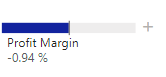](../media/lab-25-ss.png#lightbox)

1. Click the plus icon, and in the context menu, select **High Value**.

	> [!div class="mx-imgBorder"]
	> [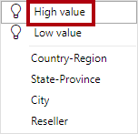](../media/lab-26-ssm.png#lightbox)

1. Notice that the decision tree presents resellers, ordered from highest profit margin.

1. To remove the level, at the top of visual, beside the **Reseller** label, click **X**.

	> [!div class="mx-imgBorder"]
	> [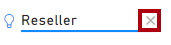](../media/lab-27-ssm.png#lightbox)

1. Click the plus icon again, and then expand to the **Country-Region** level.

1. Expand from the **United States** to the **State-Province** level.

1. Use the down-arrow located at the bottom of the visual for **State-Province**, and then scroll to the lower profitable states.

1. Notice that **New York** state has negative profitability.

1. Expand from **New York** to the **Reseller** level.

1. Notice that it is easy to isolate root cause.

	> [!div class="mx-imgBorder"]
	> [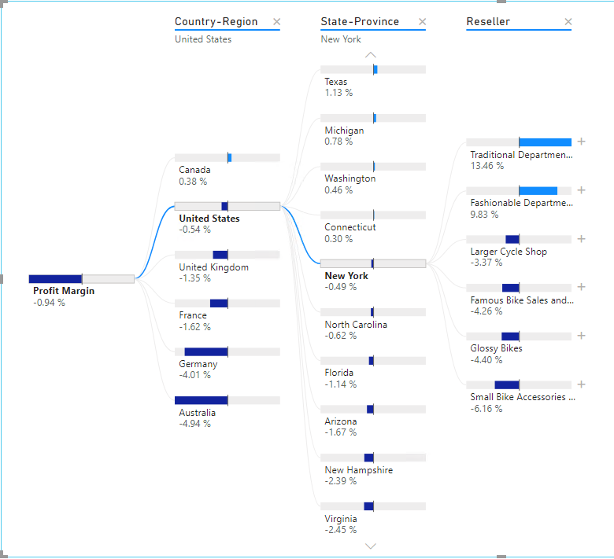](../media/lab-28-ss.png#lightbox)

	**United States** is not producing profit in **FY2020**. **New York** is one state not achieving positive profit, and it's due to four resellers paying less than standard costs for their goods.

1. Save the Power BI Desktop file.

## Work with key influencers

In this exercise, you will use the Key Influencers AI visual to determine what influences profitability within reseller business types and geography.

### Work with key influencers

In this task, you will use the Key Influencers AI visual to determine what influences profitability within reseller business types and geography.

1. Add a new page, and then rename the page to **Key Influencers**.

	> [!div class="mx-imgBorder"]
	> [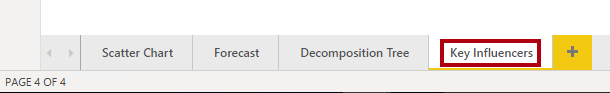](../media/lab-29-ssm.png#lightbox)

1. On the **Insert** ribbon, from inside the **AI Visuals** group, click **Key Influencers**.

	> [!TIP]
	> The AI visuals are also available in the **Visualizations** pane.

	> [!div class="mx-imgBorder"]
	> [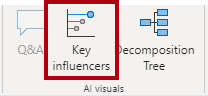](../media/lab-30-ssm.png#lightbox)

1. Reposition and resize the visual so it fills the entire page.

	> [!div class="mx-imgBorder"]
	> 

1. Add the following fields to the visual wells:

	-   Analyze: **Sales | Profit Margin**
	
	-   Explain By: **Reseller | Business Type** and **Reseller | Geography** (the entire hierarchy)
	
	-   Expand By: **Sales | Quantity**

	> [!div class="mx-imgBorder"]
	> [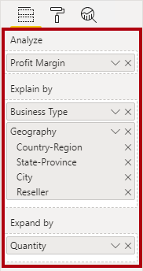](../media/lab-32-ssm.png#lightbox)
			
1. At the top-left of the visual, notice that **Key Influencers** is in focus, and the specific influence is set to understand what includes profit margin to increase.

	> [!div class="mx-imgBorder"]
	> [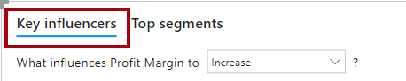](../media/lab-33-ssm.png#lightbox)

1. Review the result, which is that the city of **Bothel** is more likely to increase.

1. Modify the target to determine what influences profit margin to [decrease]{.underline}.

	> [!div class="mx-imgBorder"]
	> [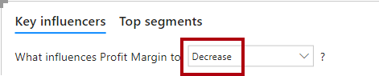](../media/lab-34-ssm.png#lightbox)

1. Review the result.

1. To detect segments, at the top-left, select **Top Segments**.

	> [!div class="mx-imgBorder"]
	> [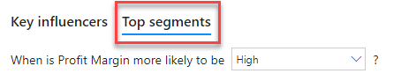](../media/lab-35-ssm.png#lightbox)

1. Notice that the target is now to determine segments when profit margin is likely to be high.

1. When the visual displays the segments (as circles), click one of them to reveal information about it.

1. Review the segment results.

### Finish up

In this task, you will complete the lab.

1. Save the Power BI Desktop file.

1. Select the **Scatter Chart** page.

1. Publish the file to your **Sales Analysis** workspace.

1. Close Power BI Desktop.
