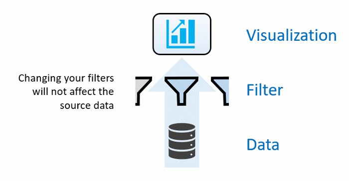
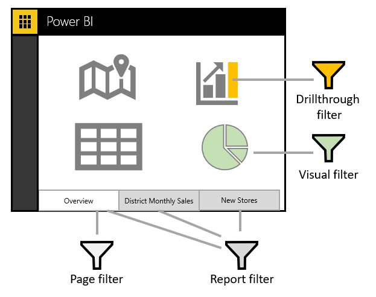
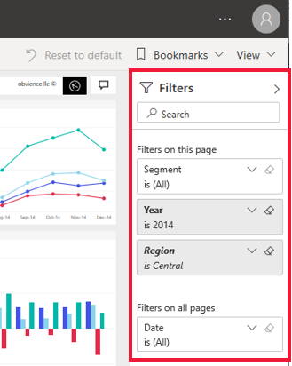
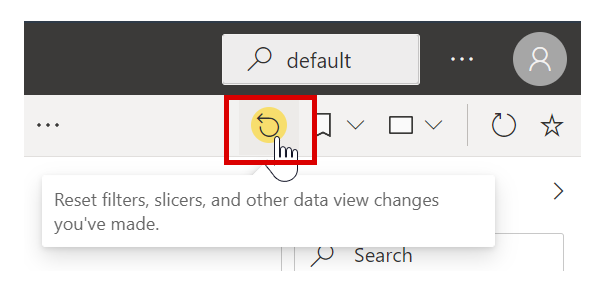
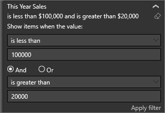
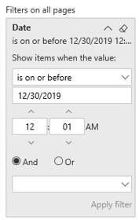
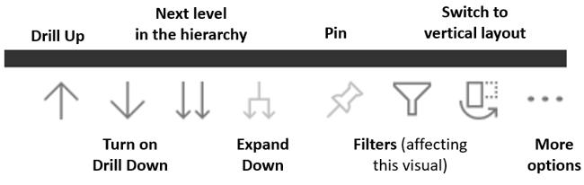
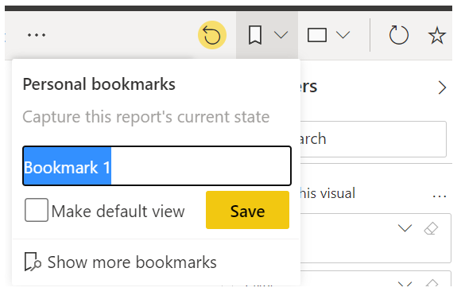
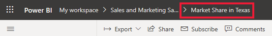

Data is the core of Power BI. As you explore reports, each visual draws its underlying data from sources that often contain far more data than you need. Power BI offers several ways to filter and highlight reports. Knowing how to filter data is the key to finding the right information.

> [!NOTE]
> Filtering only applies to reports, not to dashboards.

> [!Note] 
>  When you filter a visual like a bar chart, you are just changing the view of the data in that visual. You’re not modifying the source data in any way. 

## Slicers

A simple type of filtering that you can use directly on the report page is called a **slicer**. Slicers provide cues to ways you can filter the results in the visuals on a report page. There are several different types of slicers: numeric, categorical, and date. Slicers make it easy to filter all the visuals on the page at once.

If you want to select more than one field, hold the Ctrl key and click additional fields.  

## Explore the Filters pane

Another way to filter data is by opening and modifying filters in the Filters pane. The Filters pane contains filters that were added to the report by the report designer. As a consumer, you can interact with the filters and save your changes but can't add new filters. 

The four types of filters are:
-   **Report** – Applies to all pages in the report.
-   **Page** – Applies to all the visuals on the current report page.
-   **Visual** – Applies to a single visual on a report page. You only see visual level filters if you've selected a visual on the report canvas.
-   **Drillthrough** – Allows you to explore successively more detailed views within a single visual.

For example, in the following screenshot, the designer added three page-level filters: **Segment**, **Year**, and **Region**. Notice that **Year** is currently set to filter to the year 2014. 

You can apply filters on the **Filters** pane, or you can select data directly in the report to narrow by date, category, geography, and so on. 

> [!Note] 
>  You can explore the data by modifying the existing filters. The changes you make are saved for you (not others) with the report, including when you open the report in a mobile app.

When you exit the report, your filters are saved. To undo your filtering and return to the default filtering, slicing, drilling, and sorting that the report author set, select **Reset to default** from the top menu bar.

### Clear a filter

In either advanced or basic filtering mode, select the eraser icon to clear the filter. As you adjust the filter, the search query updates to reflect your choices.

### Advanced mode

Selecting check boxes to apply simple filters is effective, but sometimes you need to apply a filter based on a dynamic range. You might want to filter between two dates, for example, from May 1, 2018 to July 31, 2018. You could filter within a certain number value, for example, sales between $10,000 and $50,000. In these situations, you need advanced mode.

If the values are continuous (not discrete) or represent a range, you can select the field name to open the advanced filter mode. Use the drop-down menu and text boxes to specify a range of values that you want to see.

If the field values represent date or time, you can specify a start and end time when using the Date and Time filters.

### Change how a chart is sorted in a report

In a Power BI report, you can sort most visuals alphabetically or by numeric values of each category. For example, the following chart is sorted by the category **Store name**.

Changing the sort from a category (store name) to a value (sales per square feet) is simple. In this example, you would select the ellipsis (\...) and choose **Sort by \> Sales Per Sq Ft**. Optionally, you might select the ellipsis again and choose **Sort Descending**.

> 

> [!Note] 
> Not all visuals can be sorted. For example, the following visuals cannot be sorted: Treemap, Map, Filled Map, Scatter, Gauge, Card, Multi Row Card, and Waterfall.

### Save changes you make to the sort order

Power BI reports keep the filters, slicers, sorting, and other data view changes that you make. When you leave a report and then return later, your changes are saved. If you want to revert your changes to the report designer's settings, select **Reset to default** from the top menu bar.

### Drill down in a visual

When a visual has a hierarchy, you can drill down to reveal additional details. For example, you might have a visual that looks at Olympic medal count by a hierarchy that is made up of sport, discipline, and event.  

In this example, you might select the **Aquatics** element to see data for swimming, diving, and water polo. Select the **Diving** element to see details for springboard, platform, and synchronized diving events.

If you're unsure of which Power BI visuals contain a hierarchy, hover over a visual. If you see the following drill controls in the top corner, your visual has a hierarchy.

Dates are a unique type of hierarchy. When the report designer adds a date field to a visual, Power BI automatically adds a time hierarchy that contains year, quarter, month, and day.

## Use bookmarks to share insights and build stories 

You can interact with filters and save the changes for yourself only. However, sometimes you might want to share certain filtered views with your team. In those cases, you can create report bookmarks.

Using bookmarks in Power BI helps you capture the currently configured view of a report page, including filtering and the state of visuals. You can return later to that state by selecting the saved bookmark.

To see report bookmarks in action, go to any Power BI report to which you have view or edit access and select the **Bookmarks** drop-down menu on the action bar.

### Create bookmarks

When you've selected the report and view that you like, expand the **Bookmarks** drop-down menu and select **Add personal bookmark**. By default, Power BI will suggest a generic name for your bookmark. You can type in your own name and select **Save**.

After creating a bookmark, you can display it by selecting the bookmark name in the drop-down list. Notice that the breadcrumb for the report will now contain the bookmark that you're currently viewing.

> [!Note] 
> You will be able to create a maximum of 20 bookmarks per report.

### Open and view bookmarks

The report designer will sometimes include bookmarks as part of the report. To view either your personal bookmark or a report bookmark, select the bookmark icon and make your selection. Bookmark icons are listed on the Bookmark pane.

