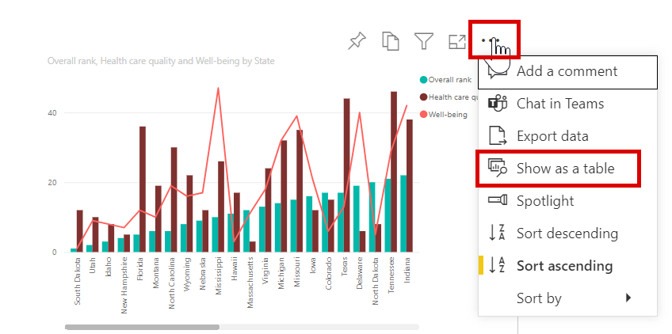
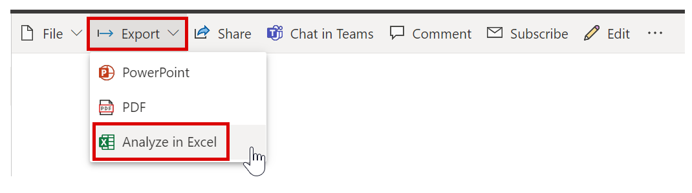
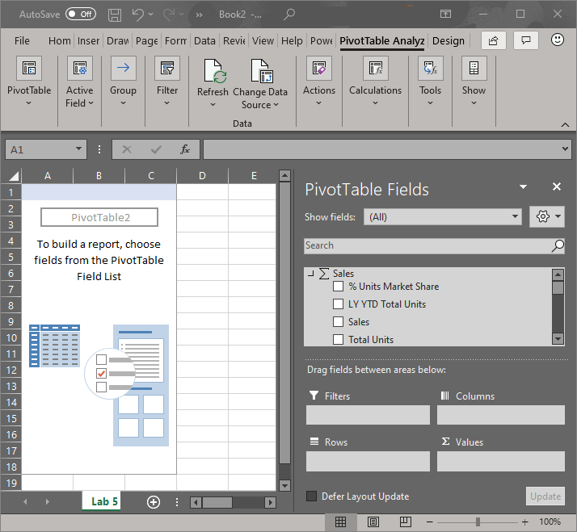

Visuals are created by report and dashboard designers and then shared with consumers. As a consumer, you can choose to show, export, and analyze the data that was used to create each visual.

## Show data

 Power BI visuals are created from data that you can view. When you turn on **Show data**, Power BI displays the data below the visual.

In Power BI, you can open a report and select a visual. To display the data that was used to create the visual, select the visual's **More options** (...) and select **Visual table**.

## Export data to Excel

Occasionally, you might want to use Excel to view and interact with Power BI data. With the **Analyze in Excel** feature, you can do just that. This option also allows you to access PivotTable, chart, and slicer features in Excel based on the dataset that exists in Power BI.

When you select Analyze in Excel from the ellipsis menu (...) that is associated with a report, Power BI creates an Office Data Connection (.ODC) file and downloads it from the browser to your computer.

> [!NOTE]
> Your exported data in Excel is your own copy of the data and will not be updated automatically if the original data is updated.

## Analyze data in Excel

When you open the file in Excel, an empty **PivotTable** and **Fields** list appears with the tables, fields, and measures from the Power BI dataset. You can create PivotTables and charts, and analyze that dataset just as you would with a local dataset in Excel.

> [!NOTE]
> If you'd like to see the data that is used to create a visual, you can export that data to Excel as an .xlsx or .csv file.

