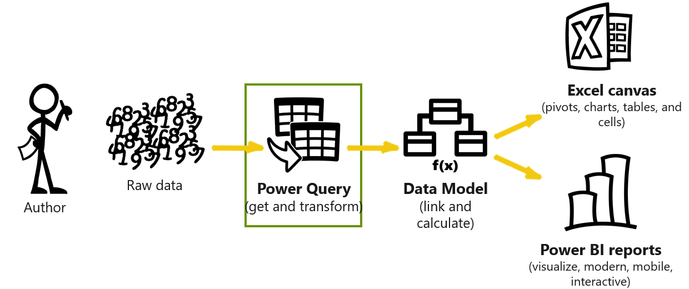

Power Query is a modern Excel technology that answers that question by allowing you to design a series of steps or instructions to convert one or more raw data sources into functional data tables that are usable in reporting and analysis. You can use Power Query to extract, transform, and load data to create a data model. While Power Query is a valuable tool in Excel, it's more seamlessly integrated and works best within Microsoft Power BI Desktop.

&nbsp;
> [!VIDEO https://www.microsoft.com/videoplayer/embed/]

Analytics doesn't exist without data. Within the modern analytics ecosystem, Power Query is the tool to use for the extract, transform, and load (ETL) data integration process. Power Query extracts data from multiple sources, transforms it to suit your needs, and loads it into your data model.

> [!div class="mx-imgBorder"]
> 

As an author (or citizen developer) of a modern analytics solution, your first task is to get your data. Raw data is messy and might come from different systems and sources. Power Query connects to each data source to clean, transform, and shape the data for use in a data model.

By learning about and using Power Query, you will:

- Reduce your data cleaning and preparation workload by half.

- Eliminate errors while editing in spreadsheets, reducing the need for cut/copy/paste actions.

- Replace complicated macros with simple steps.

- Get information to your audience faster.

- Have a simpler no code, low code experience.

- Eliminate repetitive, manual data cleaning steps.

- Focus more on insights and drive actions.

- Connect to different types of data sources seamlessly.

Power Query streamlines and automates the data cleaning and preparation phase, which helps you ensure that the data in your solution stays up to date for reporting and analysis.

Authors use the Power Query user interface to develop a set of steps or logic once. These steps build on each other incrementally and then run against the data with every refresh. Common data cleaning challenges that Power Query handles include:

- Multiple files - Combine files from a folder.

- Crosstab formats - Unpivot and Pivot data from rows to columns or columns to rows.

- Clean and format - Prepare messy data for analysis.

- Data enrichment - Add columns that aren't present in the source data.
