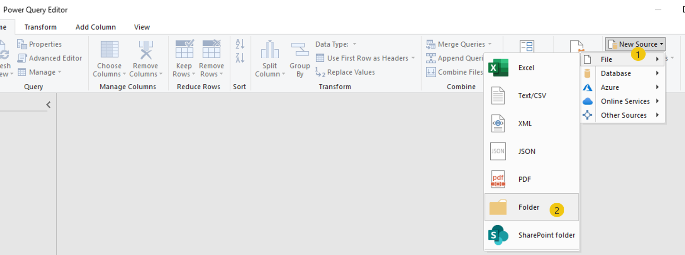
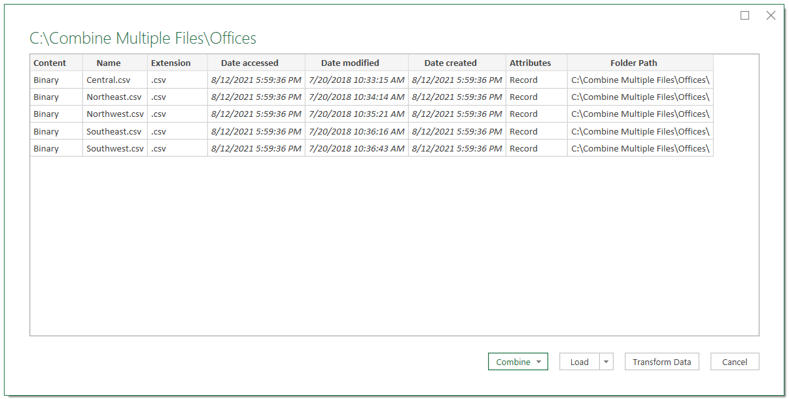
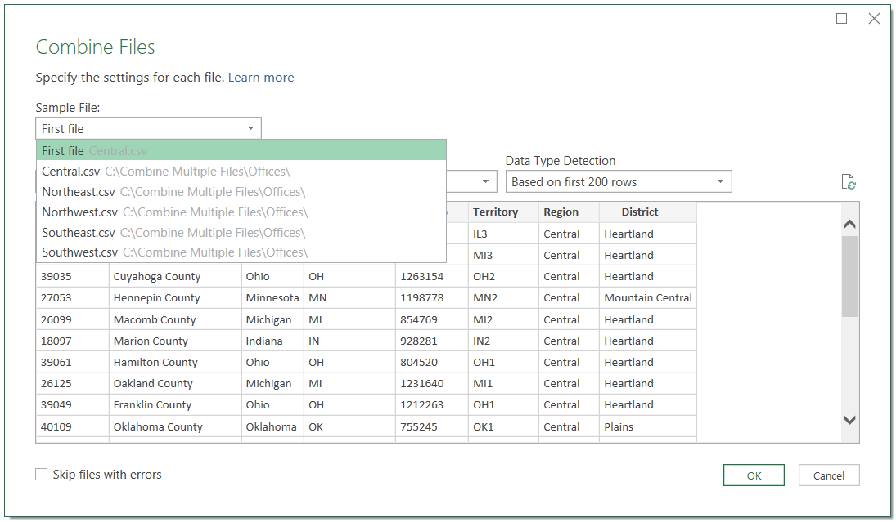
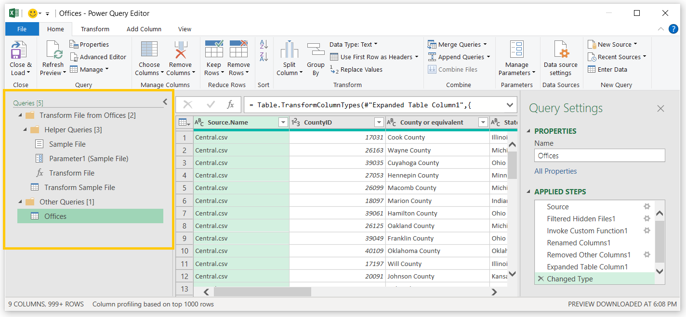
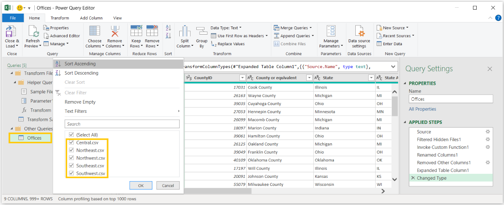

Power Query helps you connect to multiple types of data sources by using near-similar processes for each, including settings and features that are customized to each data environment.

## Import a single file

To import a single file, follow these steps:

1. On the **Data** tab of the Excel ribbon, select the **Get Data** dropdown list.

1. Select **From File**.

1. Select **From Workbook**.

This process will launch a Windows Explorer window, where you can navigate to the folder where the source data is stored and then select the workbook.

> [!div class="mx-imgBorder"]
> 

> [!NOTE]
> You can also select the **From Text/CSV** button to import text or CSV files.

The **Navigator** window will launch, showing the selected file's contents. Most data sources follow this general layout, with different types of objects represented by different icons. For an Excel workbook, the object types include worksheets and tables.

> [!div class="mx-imgBorder"]
> 

Selecting an object will trigger a preview in the data pane on the right side of the screen. You can import multiple objects simultaneously by selecting the **Select multiple items** checkbox in the upper-left corner or by searching for specific objects by using the search box.

After you've selected the data objects that you want, select the **Load** button to create a query that sends the data directly into Excel. Alternatively, you can select the **Transform Data** button to launch Power Query Editor, which will show one or more new queries that reference those data sources.

## Combine multiple files

Power Query can help you combine multiple files of the same file type in the same folder. You can complete this action directly within Excel by going to the **Data** ribbon and then selecting **Get Data > From File > From Folder**, as explained in the previous section. Alternatively, the **Home** tab of the Power Query ribbon includes a **New Source** dropdown list in the upper-right corner that includes the same series of cascading menus.

> [!div class="mx-imgBorder"]
> 

Go to the corresponding file path and select the folder that you want. Power Query will launch a navigation window that lists the objects within the folder and will offer four button options: **Combine**, **Load**, **Transform Data**, or **Cancel**.

> [!div class="mx-imgBorder"]
> 

> [!NOTE]
> Selecting the **Transform Data** button creates a single query that contains only the file system contents that are discovered in the folder.

After you've selected the **Combine & Transform Data** button, Power Query will launch a **Combine Files** navigation window. This wizard will ask you to identify and select a sample file and then select a common feature among your files to combine together.

> [!div class="mx-imgBorder"]
> 

> [!NOTE]
> The **Transform & Combine** option works best with a folder that contains numerous files with different data in an identical format across commonly named objects, such as a Sales worksheet.

After you've selected a feature, such as a common table or sheet name, Power Query will create multiple queries, functions, and parameters in the **Query** pane. These helper queries are referenced behind the scenes to help perform the steps for combining the files. Among these queries will be a **Transform Sample File** query.

> [!div class="mx-imgBorder"]
> 

The **Transform Sample File** query allows you to define operations that should be applied to each file before you append them together in the final results query. Some examples might include unpivoting date fields, filtering subtotals, or creating common column names.

The final results query will be named after the folder that you selected and grouped into the **Other Queries** folder. This query appends the results of applying those steps that are defined within the **Transform Sample File** option against each file from the folder. Other than this append action, Power Query adds a column called Source Name, which will contain the name of the original source file.

Now, you can complete tasks that previously required multiple find and replace actions, copy and paste actions, and any number of other manual adjustments in fewer steps, and you can enhance them with transformations that repeat against new files when the data is refreshed.

> [!div class="mx-imgBorder"]
> 

> [!NOTE]
> The amount of customization that can be applied to a folder import is near limitless, making folders with multiple file types and formats consumable with the correct Power Query mashup.

> [!NOTE] 
> When using Power Query, the logic or Applied Steps set of instructions is saved with the XLSX file. No changes are happening to the SOURCE data files, the source file or system data remains unimpacted. 
