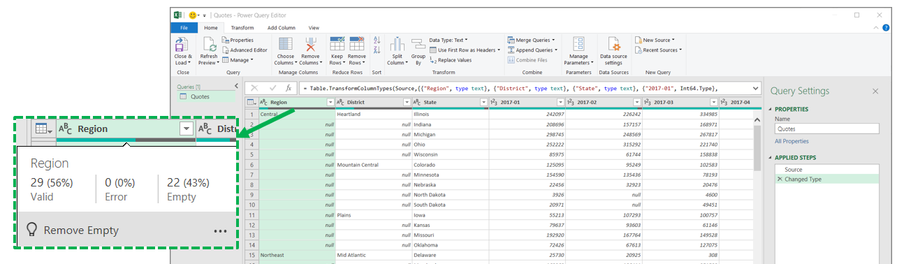
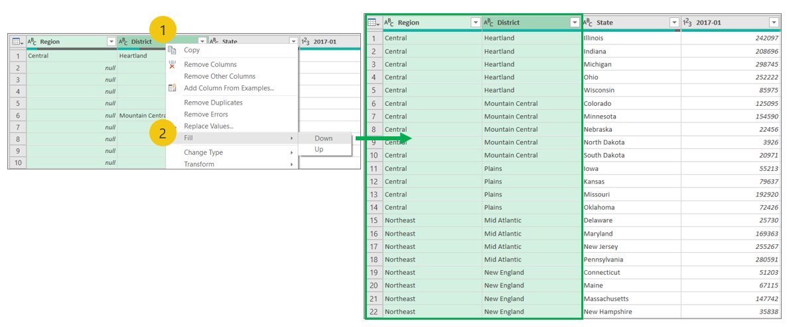
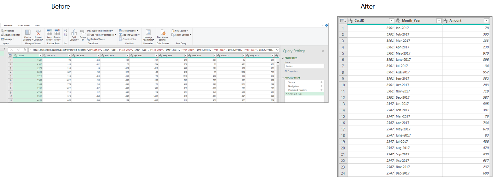
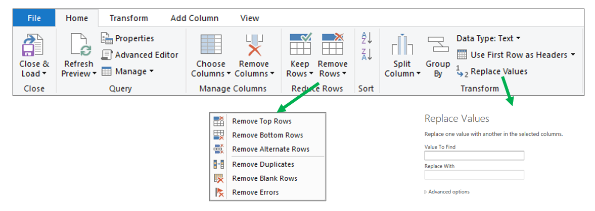
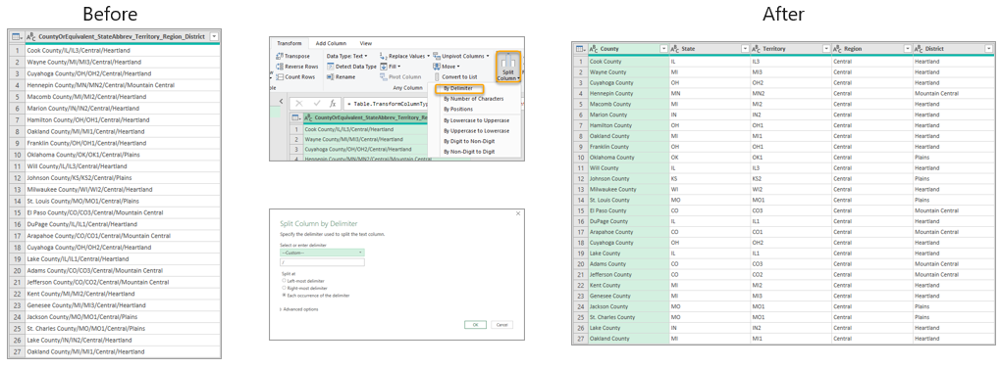
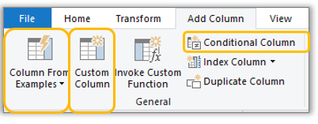
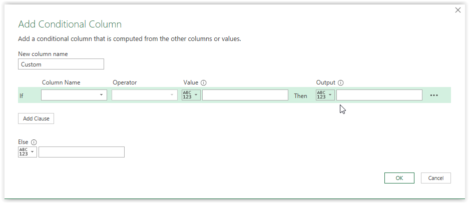
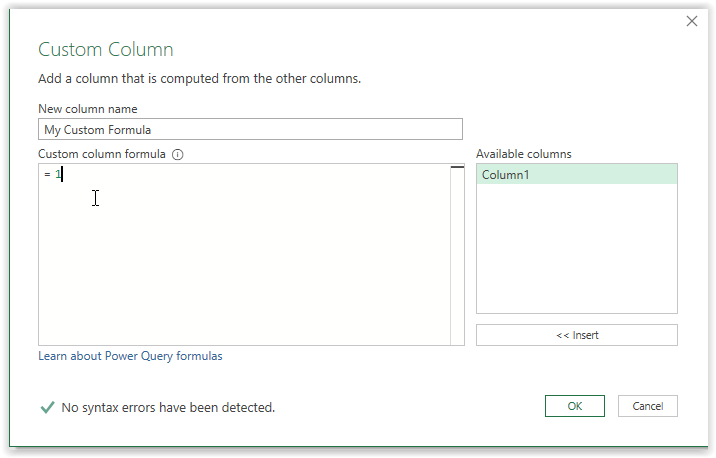

A common example of exported data that needs cleanup would be files that summarize data that includes empty or blank rows.

## Blank or empty rows

When you bring this type of dataset into Power Query, the values for these blank or empty cells will display as nulls.

> [!div class="mx-imgBorder"]
> 

If you hover over the status bar below your column header, the **Column Profiling** status bar will show information that is related to the column's data. In the following screenshot, the table contains 22 empty values indicating that 43 percent of the records contain blank values for the Region column. The user can fill up or down on a column (or multiple columns at the same time), depending on where the subtotals are showing up.

> [!div class="mx-imgBorder"]
> 

If taking this action on multiple columns, you would first select the column headers that you want to update by pressing the **Ctrl** key while left-clicking each column that you want. With your columns selected, right-click the headers to see the column menu editing options. Select **Fill** and then choose whether to apply the value down or up. Selecting the **Down** option is equivalent to finding a non-blank value and then copying it into every blank cell until a new value is found; selecting the **Up** option is the reverse.

> [!div class="mx-imgBorder"]
> 

> [!NOTE]
> The **Fill > Up/Down** options rely on the order of the data. Some database import functions will stream data asynchronously, meaning that the order of the data might not be consistent.

## Crosstab formatting

Tables with *crosstab* formats (for example, region or product row headers and date period column headers) are common for spreadsheets and reports. Visually, crosstab formats organize the data in a way that's easier for most people to understand and absorb the information. While this format might be beneficial for users, it's not ideal for data modeling. Power Query has tools for unpivoting data to transpose it from a short and wide table to long and narrow. Long and narrow datasets are more favorable for creating measures for a data model.

The **Unpivot** functionality introduces a key concept within Power Query functions about how to select the columns on which to perform an operation, whether it's on the selected columns only or on unselected columns. It's up to the author to determine which method is appropriate to the dataset and situation. After you've imported your dataset, select the columns with row headers. Go to the **Transform** tab on the ribbon, select the dropdown list for unpivot columns, and then select **Unpivot other columns**. This process will generate an attribute and a value column that you can rename by double-clicking the column header.

> [!div class="mx-imgBorder"]
> 

## Clean and format data

The home menu has UI buttons that include the common data cleaning techniques, as shown in the following screenshot.

> [!div class="mx-imgBorder"]
> 

The following image is an example of the **Split Column** function (which is similar to **Text to Columns** in Excel).

To split columns, follow these steps:

1. Select the column that you want to split.

1. Select the **Split Column** dropdown list.

1. Select **By Delimiter > Custom**, and then enter a forward slash (**/**).

1. Select **OK**.

> [!div class="mx-imgBorder"]
> 

## Enrich your data

Power Query allows you to add supplemental fields to enable deeper analysis. The **Add Column** menu includes various ways to enhance your current dataset. When you use the button operations on the **Add Column** menu, the results of the operation will be added as a new column in the data **Preview** area of the **Power Query Editor** window.

> [!div class="mx-imgBorder"]
> 

With the **Column From Examples** feature, you can add new columns to your data model by providing one or more example values for the new columns. You can create the new column examples from a selection or provide input based on all existing columns in the table.

Practical reasons for choosing this feature are that it is:

- **User-friendly** - You only need to enter a few examples of what the result should be, and then Power Query will do the rest of the work for you.

- **Quick** - Even if you know how to write the transformations, entering a few examples is faster than developing and testing the logic for your text manipulations.

The **Add Conditional Column** feature allows you to define the IF-THEN-ELSE conditions to display values for a given column based on a series of logical checks with a user-friendly wizard, no parenthesis management required.

> [!div class="mx-imgBorder"]
> 

With the **Custom Column** feature, you can directly write an M expression to create a new column. This option is beneficial for more complex additions that go beyond text manipulation in a **Column From Examples** or a simple **Conditional Column**. With this feature, you can take advantage of M functions that aren't accessible from the ribbon, take advantage of rich intelligence, and let your creativity flow.

> [!div class="mx-imgBorder"]
> 

> [!NOTE]
> Each button selection in Power Query Editor creates an M expression as a step in the Applied Step in the **Query Settings** pane. M is the formula language of Power Query Editor. While it's not required to learn the M formula language to use Power Query, it can be powerful and helpful to learn.
