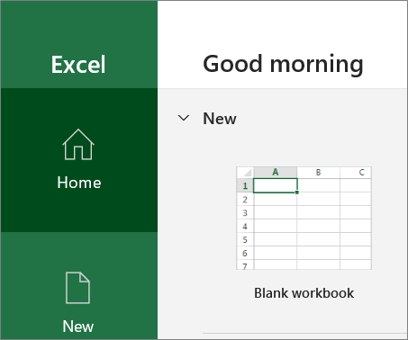
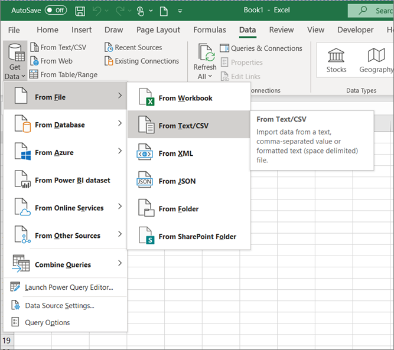
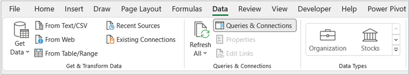
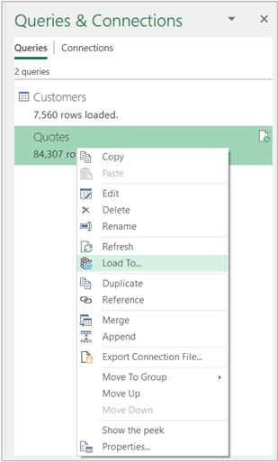

Now is your opportunity to give Power Query a try with this guided, step-by-step use case. Use the provided example data source files to complete the exercises.

## Lab 01 - Analytics in Excel: Use Power Query in Excel

The estimated time to complete this lab is 30 minutes.

In this hands-on learning lab, you will complete the following tasks:

1. Use Power Query to connect to a .csv source data file - Customers
1. Use Power Query transformations to splice a column by delimiter - Customers
1. Use Power Query to connect to an Excel source data file - Quotes
1. Use Power Query transformations to unpivot - Quotes
1. Use Power Query transformations to clean - Quotes

## Lab prerequisites

The following prerequisites and setup must be in place for successful completion of the exercises:

- You must be connected to the internet.
- You must have Microsoft Office installed.
- Sign up for [Microsoft Power BI](https://aka.ms/pbimaiadtraining/?azure-portal=true).
- At a minimum, you should have a computer with two cores and 4 GB of RAM that is running one of the following versions of Windows: Windows 8 / Windows Server 2008 R2 or later.
- If you choose to use Internet Explorer, it will require version 10 or greater. You can also use Microsoft Edge or Google Chrome.
- Verify whether you have a 32-bit or 64-bit operating system to decide if you need to install the 32-bit or 64-bit applications.

  > [!NOTE]
  > 64-bit Excel and Power BI Desktop is best.

   > [!IMPORTANT]
   > Download the student content: Create a folder called **ANALYST-LABS** on the C: drive of your local machine. Download and extract all content from https://aka.ms/modern-analytics-labs to the ANALYST-LABS folder that you created (C:\ANALYST-LABS).
- Download and install Power BI Desktop by using any one of the following options:
  - If you have Windows 10, use Microsoft App Store to download and install Power BI Desktop application.
  - Download and install [Microsoft Power BI Desktop](https://www.microsoft.com/download/details.aspx?id=45331&azure-portal=true).
- If you already have Power BI Desktop installed, ensure that you have the latest version of Power BI downloaded.

## Document structure

Source data or starting files for each lab are located within each lab folder.

- Lab 01 is completed by using Power Query in the **Excel** application.

- Lab 02A and Lab 02B are completed by using **Power BI Desktop** application.

- Lab 03A is completed by using **Power BI Desktop**, **Power BI service**, and **Excel** applications.

- Lab 03B is completed by using **Excel** and **Power BI service** applications.

Each lab comes with step-by-step instructions to follow and contains screen images throughout the instructions. The key actions for each step are identified by **bold** text. Pay attention to notes, tips, and other important information. Each lab contains a completed solution file that can be used as a reference.

## Overview
The estimated time to complete this lab is 30 minutes.
In this lab, you will complete the following tasks:
1. Use Power Query to connect to a CSV source data file - Customers
1. Use Power Query transformations to Split Column by Delimiter - Customers
1. Use Power Query to connect to an XLSX source data file - Quotes
1. Use Power Query transformations to Unpivot - Quotes
1. Use Power Query transformations to Clean - Quotes

    > [!NOTE]
    > This lab has been created based on the sales activities of the *fictitious* Wi-Fi company called SureWi, which has been provided by [P3 Adaptive](https://p3adaptive.com/?azure-portal=true). The data is property of P3 Adaptive and has been shared with the purpose of demonstrating Excel and Power BI functionality with industry sample data. Any use of this data must include this attribution to P3 Adaptive.

## Exercise 1: Use Power Query to connect to CSV - Customers.csv

In this exercise, you will use Excel to connect to a CSV source data file.

### Task 1: Launch Excel

In this task, you will launch a new blank worksheet to get started.

1. Launch Excel.

    > [!div class="mx-imgBorder"]
    > 

1. Create a new blank workbook.
    > [!div class="mx-imgBorder"]
    > 

### Task 2: Use Power Query to connect to CSV

In this task, you will connect to the Customers CSV source data file.
1. Select the **Data** tab on the main Excel ribbon.
1. Select **Get Data > From File > From Text/CSV**.

    > [!div class="mx-imgBorder"]
    > 

1. Go to the **C:\ANALYST-LABS\Lab 01\MAIAD Lab 01 - Data Source - Customers.csv** file.

   The **Preview** area will display a sample of the customer's data, column names, and values.

    > [!NOTE]
    > This example is only a preview of the data.

    > [!div class="mx-imgBorder"]
    > 

1. Select the **Transform Data** button. This will launch the Power Query Editor window.

    > [!NOTE]
    > When you are working in Power Query, it's best to **maximize** the Power Query Editor window – so that you can see a full view of the Power Query window menus, panes, and options.

1. By default, the **Queries** pane on the left side of the Power Query Editor window will be collapsed. Click on the **arrow** in the Queries pane to expand and open the Queries pane.

    > [!div class="mx-imgBorder"]
    > 

1. In the **Queries** pane, right-click the default query name called **MAIAD Lab 01 - Data Source - Customers** and then **Rename** the query to **Customers**.

    > [!div class="mx-imgBorder"]
    > 

    > [!TIP]
    > Queries that will be loaded to use as part of a Data Model should be given a clear, descriptive, user-friendly, noun name that describes what the data represents. For example, Customers, Quotes, Invoices, Products, Geography, etc.

## Exercise 2: Use Power Query transformations to Split Column by Delimiter - Customers

In this exercise, you will use Power Query to extract the First Name from the Contact column.

### Task 1: Use Column from Example

In this task, you will create a new column called **First Name** by using the **Add Column > Column from Examples** transformation to split the **Contact** by a delimiter.

1. From the **Preview** grid, select the **Contacts** column.

1. Then choose from the **Add Column** Tab, the **Column from Examples** down arrow and the **From Selection** option.

    > [!div class="mx-imgBorder"]
    > 

    > [!NOTE]
    > This opens a NEW user interface window called “Add Columns From Examples” – this window looks like the Power Query Preview grid, but it is separate window allowing you to type in the proposed value so that Power Query can identify the pattern and formula to apply achieving the end results.

1. In the **Add Column From Examples** window, in the column called **[Column1]**, type the value **"Hugo"** and then enter.

    > [!div class="mx-imgBorder"]
    > 

    > [!NOTE]
    > After you have pressed the **Enter** key, Power Query will identify if a pattern exists in the data to populate the values for all rows!

1. **Double-click** in the default header called **"Text Before Delimiter"** and rename the new column as **"First Name"**. Select the **OK** button.

    > [!div class="mx-imgBorder"]
    > 

    > [!NOTE]
    > Now, in the Power Query Editor preview grid, you will notice the NEW column called [First Name] – created by parsing out the [First Name] from the [Contact] using the Column from Example transformation!

    > [!div class="mx-imgBorder"]
    > 

## Exercise 3: Use Power Query to connect to XLSX - Quotes.xlsx

In this exercise, you will use Excel to connect to an XLSX source data file.

### Task 1: Connect to XLSX source data from within the Power Query Editor window

In this task, you will start from within the **Power Query Editor** window.

1. From the Power Query **Home** menu, select the **New Source > Excel** file option.

    > [!div class="mx-imgBorder"]
    > 

1. Navigate to the file **C:\ANALYST-LABS\Lab 01\Data Source - Quotes.xlsx**.

1. In the Navigator window, select the worksheet called **"Lab 01 - Quotes"**.

    > [!NOTE]
    > This is ONLY a preview of the data.

    > [!div class="mx-imgBorder"]
    > 

1. Select the **OK** button to load as a second query in the Power Query Editor window.

1. In the **Queries** pane, right-click on the default query name called “Lab 01 - Quotes” to **Rename** the Query to “Quotes”.

    > [!div class="mx-imgBorder"]
    > 

## Exercise 4: Use Power Query to Unpivot - Quotes

In this exercise, you will use Power Query transformations to structure the Quotes data for Power Pivot.

### Task 1: Use First Row as Headers transformation button

In this task, you will move the first row with the column header values to the table header.

On the **Home** menu, select the **Use First Row as Headers** button.

   > [!div class="mx-imgBorder"]
   > 

### Task 2: Use the Unpivot transformation menu option

In this task, you will unpivot the Quotes data.

1. In the **Preview** pane, use a right click on the [CustID] column to display menu options.

1. Then choose the **Unpivot Other Columns** option.

    > [!div class="mx-imgBorder"]
    > 

1. Double-click on the column called [Attribute] to **rename** the column to [QuoteDate].

1. Double-click on the column called [Value] to **rename** the column to [QuoteAmt].

    *Before*

    > [!div class="mx-imgBorder"]
    > 

    *After*

    > [!div class="mx-imgBorder"]
    > 

## Exercise 5: Use Power Query to Clean - Quotes

In this exercise, you will use Power Query transformations to Clean the Quotes data.

### Task 1: Use the Replace transformation

In this task, you will use a replace technique to change the [QuoteDate] to a full date that can be converted to a Date data type.

1. In the Preview window, use a right click on the [QuoteDate] column to display menu options.

1. Next, choose the **Replace Values...** option.

    > [!div class="mx-imgBorder"]
    > 

1. In the Replace Values... UI window:

    1. Enter a hyphen "-" in the **Value To Find** text box.

    1. Enter "/1/" in the **Replace With** text box.

    > [!div class="mx-imgBorder"]
    > 

    3. Select the OK button.

### Task 2: Use the Data Type icon

In this task, you will use the Data Type icon to change the data type from Text to Date.

1. Click on the **ABC** icon that indicates the column is a Text data type.

1. Then choose the **Date** data type option from the data type menu options.

    > [!div class="mx-imgBorder"]
    > 

### Task 3: Close and load to the data model

In this task, you will load the Customers and Quotes tables to the data model.

1. From the **Home** menu, select **Close & Load > Close & Load To...**.

    > [!div class="mx-imgBorder"]
    > 

1. On the Import window, select the **Only Create Connection** radio button.

    > [!div class="mx-imgBorder"]
    > 

1. And check the box next to **Add this data to the Data Model**.

1. Select the **OK** button.

    > [!NOTE]
    > The loaded Tables will be displayed in the Queries & Connections Pane window with total number of rows loaded.

    > [!div class="mx-imgBorder"]
    > 

    > [!NOTE]
    > At the point, we have connected to the data sources using Power Query and we have selected the checkbox option to Add this data to the Data Model. However, we have not actually seen where this data has been loaded to. In the next Lab 02A, we will use Power BI Desktop to Import the Power Query connections, Customer table, and Quote table – to create the Data Model.
    
    > [!NOTE]
    > To edit the Queries and re-launch the Power Query Editor window, Select Data > Queries & Connections to display the Queries & Connections pane.

    > [!div class="mx-imgBorder"]
    > 

    > [!NOTE]
    > When you select Close and Load To… and set the Import Data options for the first time, this is the default setting.  You can always **edit these settings** by doing a right click on the Query in the Queries & Connections Pane, then selecting the Load To… option to display and update the Import Data settings.

    > [!div class="mx-imgBorder"]
    > 

### Task 4: Save the file

In this task, you will save the Excel file with the **Customers** and **Quotes** query connections.

1. From the main Excel ribbon, select **File > Save**.

1. Go to the **C:\ANALYST-LABS\Lab 01** folder and then save the file as **Lab 01 - My Solution.xlsx**.

### Summary

In this lab, you used Power Query in Excel to connect to CSV & XLSX source data files, created a new column using Column from Example, unpivoted & applied transformations in Power Query, loaded source data to a Data Model and Save the Excel file with the data connections.

> [!div class="mx-imgBorder"]
> 
