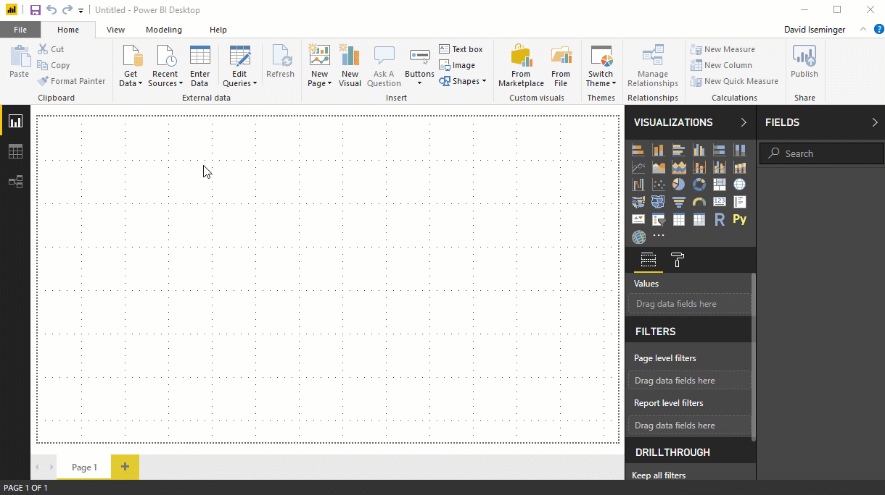
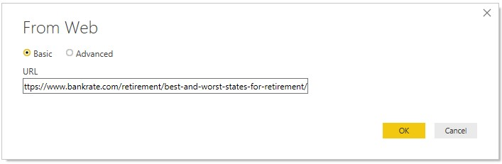
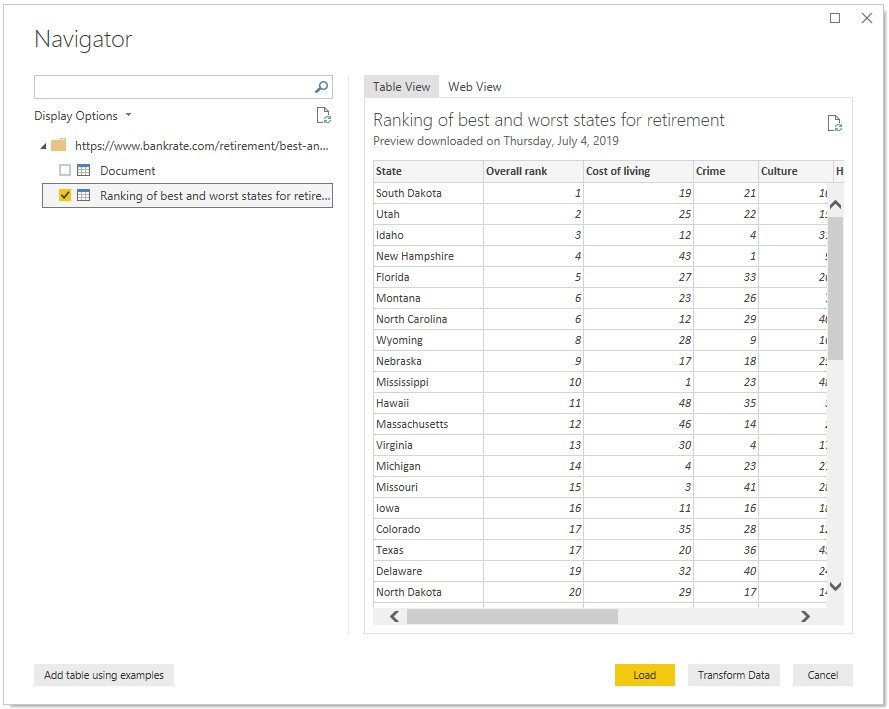
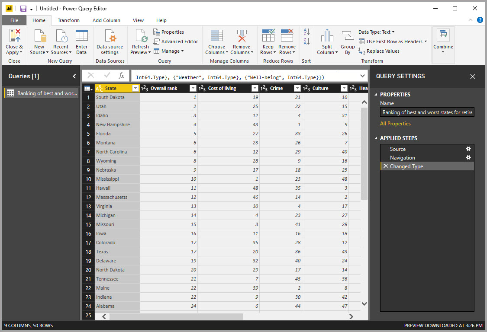

Now that Microsoft Power BI Desktop is installed, you're ready to connect to the ever-expanding world of data. There are *all sorts* of data sources available in the Microsoft Power Query for Excel window. The following image shows how to connect to data by selecting the **Home** tab on the ribbon and then selecting **Get Data \> More**.

In this unit, we'll connect to a couple different **Web** data sources.

Imagine you’re retiring – you want to live where there’s lots of sunshine, low crime rates, and good health care – or perhaps you’re a data analyst, and you want that information to help your customers. For example, maybe you want to help your sunglasses retailer target sales where the sun shines most frequently.

Either way, the following web resource has interesting data about those topics, and more:

[https://go.microsoft.com/fwlink/?linkid=2050811](https://go.microsoft.com/fwlink/?linkid=2050811/?azure-portal=true "best-places-retire-how-state-ranks")

Select **Get Data \> Web**, and paste the address.

When you select **OK**, the **Query** functionality of Power BI Desktop goes to work. Query contacts the web resource, and the **Navigator** window shows what it found on that webpage. In this case, it finds a table (*Table 0*) and the overall web document. We're interested in the table, so select it in the list. The **Navigator** window shows a preview.

At this point, you can edit the query before loading the table, by selecting **Edit** at the bottom of the window. Or, you can just load the table.

When you select **Edit**, Power Query Editor starts, and a representative view of the table is shown. The **Query Settings** pane appears (if it doesn't, select the **View** tab on the ribbon, then select **Show \> Query Settings**). Here's what it looks like.

In Power BI Desktop, you can connect to multiple data sources and combine them to do interesting things. 

In the next unit, we'll adjust the data to make it meet our needs. The process of adjusting connected data is called *shaping*.