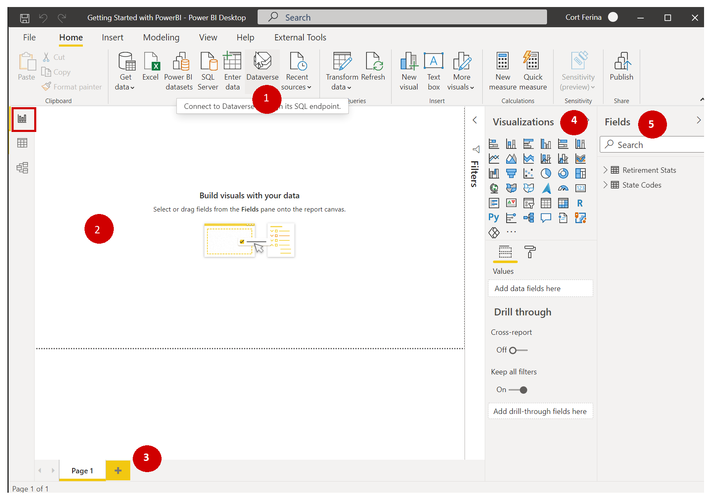
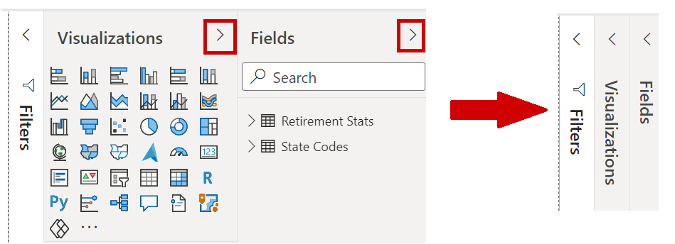
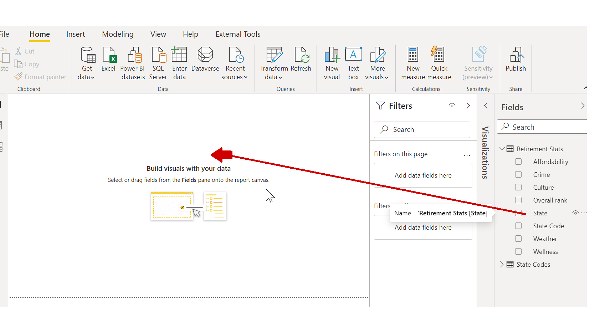
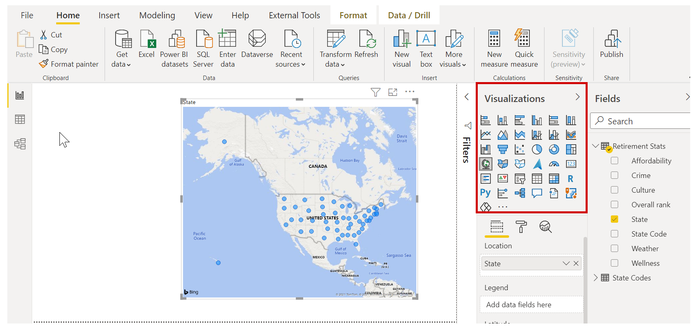
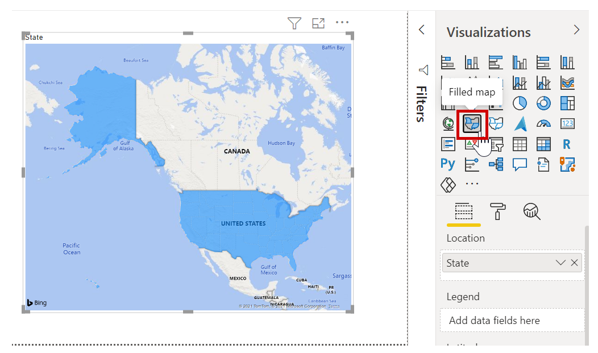
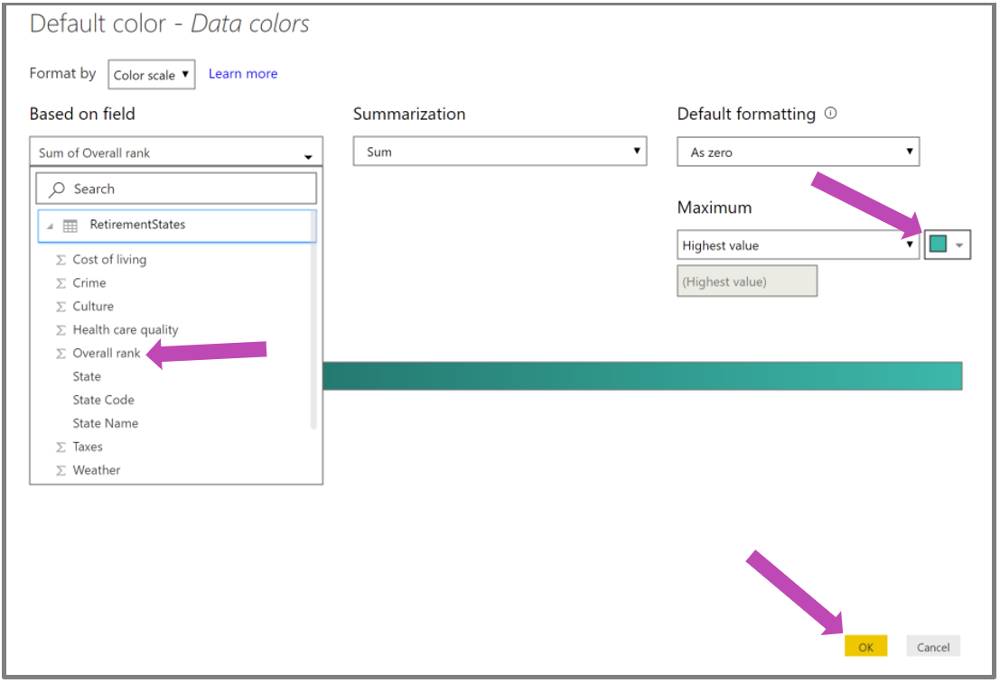
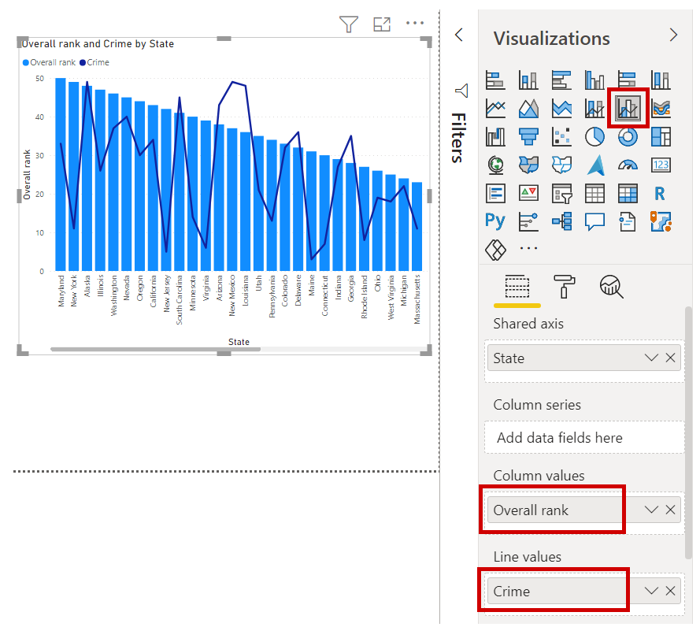
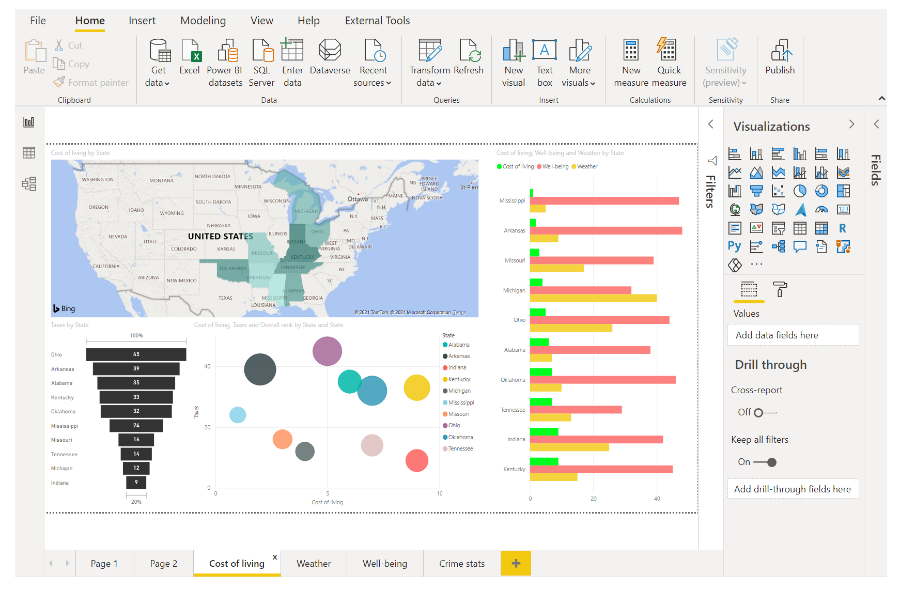

In the previous unit we connected two separate data sources, and shaped and combined those data sources how we wanted it. As a result, we now have a **data model** that we can use as a basis for creating reports. 

That doesn't mean we're stuck forever with that data model. Additional changes can be made in Power Quer Editor after the model is loaded, and you can reload a model to apply any changes you make. But for now this model will do just fine. 

To get started creating a report with this data model we created, we go to **Report** view in Power BI Desktop.

The **Report** view in Power BI Desktop has five main areas:

1. The ribbon, which displays common tasks associated with reports and visualizations
2. The **Report** view, or canvas, where visualizations are created and arranged
3. The **Pages** tab area along the bottom, which lets you select or add a report page
4. The **Visualizations** pane, where you can change visualizations, customize colors or axes, apply filters, drag fields, and more
5. The **Fields** pane, where query elements and filters can be dragged onto the **Report** view, or dragged to the **Filters** area of the **Visualizations** pane
   

The **Visualizations** and **Fields** pane can be collapsed by selecting the small arrow along the edge, providing more space in the **Report** view to build cool visualizations. When modifying visualizations, you'll also see these arrows pointing up or down, which means you can expand or collapse that section, accordingly.

## Create visuals
To create a visualization, just drag a field from the **Fields** list onto the **Report** view. In this case, let’s drag the *State* field from *RetirementStats*, and see what happens.

Look at that... Power BI Desktop automatically created a map-based visualization, because it recognized that the *State* field contained geolocation data.

Notice that in the **Visualizations** pane, I can select different types of visualizations, and in the area below those icons, I can drag fields to different areas to apply a Legend, or otherwise modify the visualization. 

Let's create a few visuals on this first page, and see what happens. I can change the type of any visual by simply selecting it from the canvas, and clicking on a different tile in the **Visualizations** pane. Let's do that - instead of Map (a globe tile icon), select Filled Map (the next tile - looks like states with different colors).

**First visual** - drag the *Overall rank* field, from **Fields**, to the *Color saturation* well in the **Visualizations** pane. 

To adjust the colors used in the map, select the **Format** tab (looks like a paint roller) in the **Visualizations** pane, and expand **Data colors** to adjust

You can adjust the size of the visual by dragging the corners or sides of a selected visual. Let's move that visual to the top left, and create the next visual. Click anywhere on the canvas (not on a visual) to have no visual selected, so you're ready to drag fields and create the next visual.

**Second visual** - drag **State** from **RetirementStats** onto a blank area of the canvas.  Then drag the **State** field, then the **Health care quality** field, and the **Well-being** field onto that same visual. Now let's change that to a **Line and clustered column chart** visual by clicking on that visual tile in the **Visualizations** pane.

We're almost there - in the *Fields* tabm, move **Well-being** field to the *Line values* well. Here's what we have now, shown in the following image.

You can experiment with these as much as you'd like - change visual type, add fields, change colors, arrange on the canvas. All such things are fun, easy to undo, and quick to respond.

Let’s fast-forward a bit, and see what the **Report** view looks like after a handful of visualizations have been added, as well as a few new Report pages. Don't worry, you can see these first-hand. In the summary unit, you'll get a link to download the final .PBIX file, so you can load it onto your local version of Power BI Desktop and see exactly how things came together. 

The first Report page provides a perspective of the data based on *Overall rank*. When we select one of the visualizations, the **Fields and Filters** pane shows which fields are selected, and the structure of the visualization (which fields are applied to the **Shared Axis**, **Column Values**, and **Line Values**).

There are six **Pages** in this Report, each visualizing certain elements of our data.

1. The first page, shown above, shows all states based on *Overall rank*.
2. The second page focuses on the top ten states based on *Overall rank*.
3. For the third page, the best 10 states for cost of living (and associated data) are visualized.
4. Weather is the focus of the fourth page, filtered to the 15 sunniest states.
5. On the fifth page, Community well-being is charted and visualized for the top 15 states.
6. Lastly, crime statistics are visualized, showing the best (and well, the last) ten states.

Here’s what the cost of living-focused Report page looks like.

There are all sorts of interesting reports and visualizations you can create. But what's best about creating reports is sharing them with others. In the next unit, we see just how easy it is to share Power BI reports.

## Adding report pages

All reports  have at least one blank page to begin with. Pages appear in the navigator pane just to the left of the canvas. 

You can add all sorts of visualizations to a page, but it's important not to overdo it. Too many visualizations on a page will make it look busy and difficult to find the right information.

To add a page to your report, just click **New Page** on the ribbon, or select the + button next to the last report page.

Okay, even with just a couple of visuals, you have a report. Let's go to the next unit and learn how we can share these insight-filled reports with others.