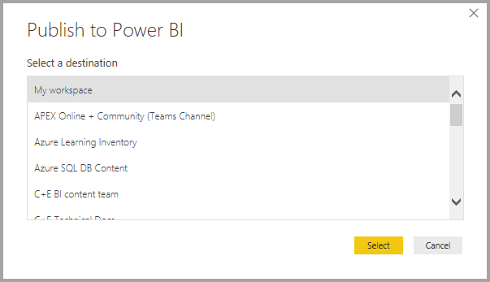
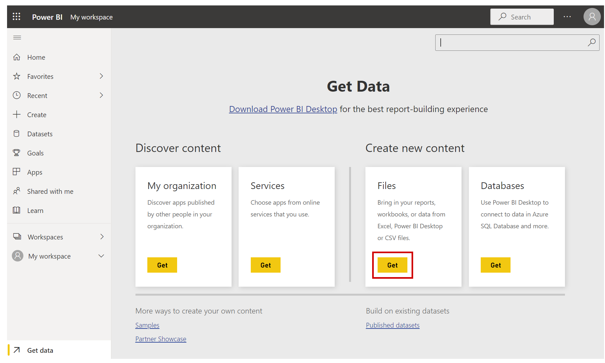
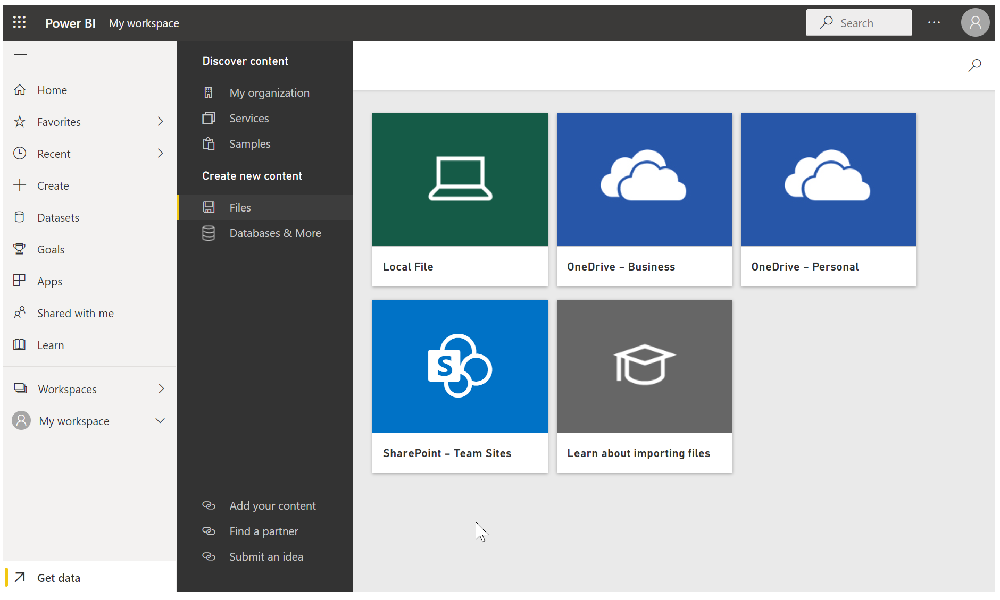
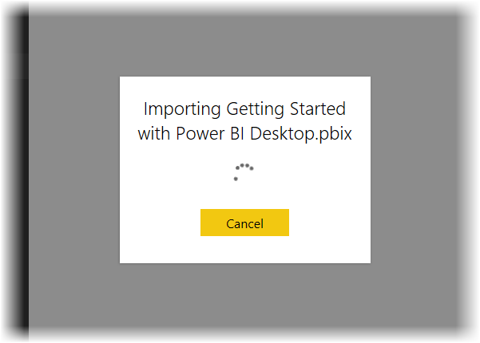
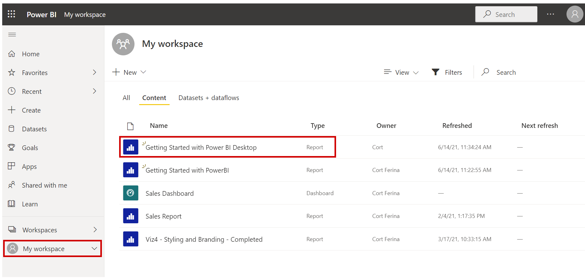
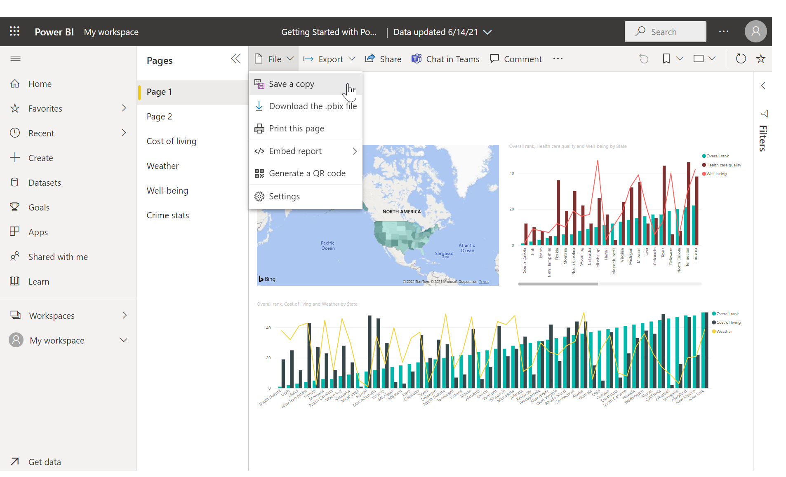
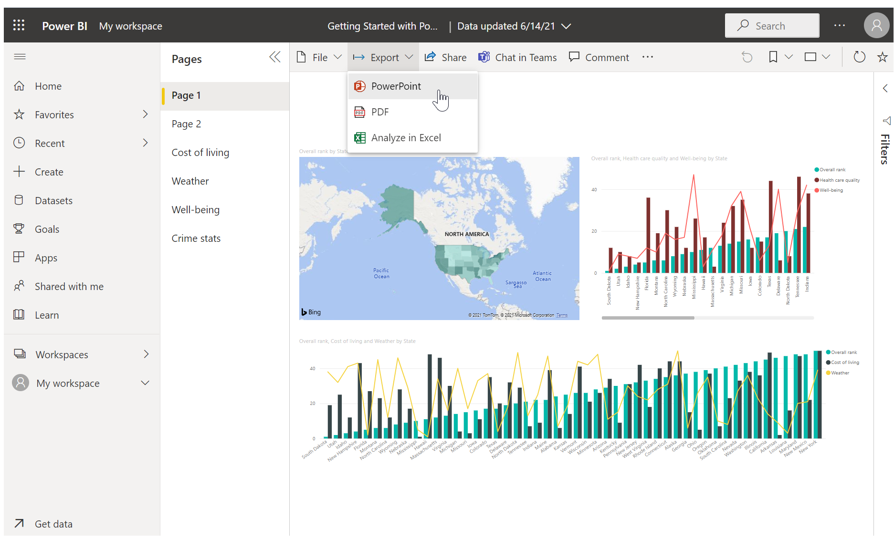
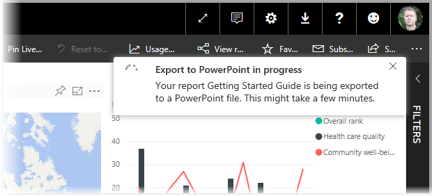

Now that we have a Microsoft Power BI Desktop report that's reasonably complete (or at least ready to move ahead with), we can share it with others by using the **Power BI service**. There are a few ways to share your work in Power BI Desktop. You can publish to the **Power BI service**, upload the .pbix file directly from the Power BI service, or save the .pbix file and send it like any other file. You can also export a report to a Microsoft PowerPoint file, and can even create a PDF file of your report.

## Publish to the Power BI service
First, let's look at publishing directly from Power BI Desktop to the **Power BI service**. On the **Home** tab on the ribbon, select **Publish**.

You might be prompted to sign in to Power BI.

The next window that appears asks for a destination for your published report. You can publish a report to a workspace that's accessible to your entire organization (and therefore share your report with everyone in your organization), or you can publish it to other available workspaces. The workspaces you see depend on the workspaces that are available to you and your organization.

You can also share the report just in your own workspace (called *My Workspace*). From there, you can do more with it in the Power BI service (including sharing it more broadly). In our case, we'll select **My Workspace**.

When you've signed in and the publish process is finished, you'll see the following dialog box.

When you sign in to Power BI, you'll see the Power BI Desktop file you just loaded in the **Dashboards**, **Reports**, and **Datasets** sections of the service.

Another way to share your work is to load it from within the **Power BI service**. The following link opens the **Power BI service** in a browser:

<https://app.powerbi.com>

Select **Get Data** to start the process of loading your Power BI Desktop report.

On the **Get Data** page that appears, you can select where to get your data from. In our case, we'll select **Get** in the **Files** box.

The **Files** view appears. In our case, we'll select **Local File**.

After you select the file, Power BI uploads it.

After the file is uploaded, you can select it. In the Power BI service, select **My Workspace** in the left pane, and then select the **Reports** tab to show all your reports.

When you select the report (by selecting its name), the **Power BI service** shows the first page of it. Along the bottom of the page, you can select any tab to view that page of the report.

You can change a report in the **Power BI service** by selecting **Edit Report** at the top of the report canvas.

To save your report, select **File \> Save As** in the service. 

## Save as PowerPoint file

You can also export your Power BI Desktop report as a PowerPoint deck. That way, you can share your report with others during a PowerPoint presentation. 

In the Power BI service, after the report is loaded, select **File \> Export to PowerPoint (Preview)**.

After the export process is finished, Power BI tell you where the PowerPoint file was saved and lets you know that it's ready to be shared with others.

Now that you know how to create and share reports, you can use your imagination to tell stories with data and share them with your entire organization.

Let's head to the next unit, where we'll wrap things up for this module.