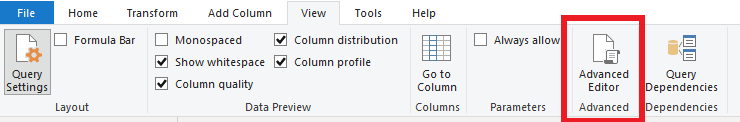
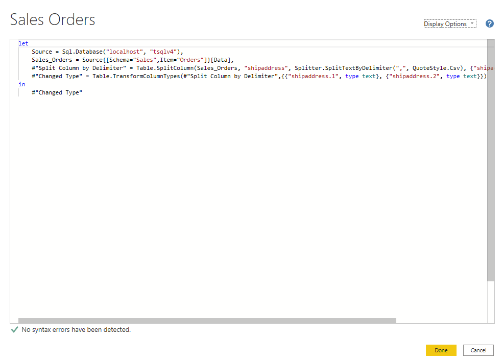

Each time you shape data in Power Query, you create a step in the Power
Query process. Those steps can be reordered, deleted, and modified where
it makes sense. Each cleaning step that you made was likely created by
using the graphical interface, but Power Query uses the M language
behind the scenes. The combined steps are available to read by using the
Power Query Advanced Editor. The M language is always available to be
read and modified directly.  It is not required that you use M code to
take advantage of Power Query. You will rarely need to write M code, but
it can still prove useful. Because each step in Power Query is written
in M code, even if the UI created it for you, you can use those steps to
learn M code and customize it to suit your needs. 

After creating steps to clean data, select the **View** ribbon of Power
Query and then select **Advanced Editor**. 

> [!div class="mx-imgBorder"]
> 

The following screen should appear. 

> [!div class="mx-imgBorder"]
> 

Each Power Query step will roughly align with one or two lines of M
code. You don't have to be an expert in M code to be able to read it.
You can even experiment with changing it. For instance, if you need to
change the name of a database, you could do it right in the code and
then select **Done**. 

You might notice that M code is written top-down. Later steps in the
process can refer to previous steps by the variable name to the right of
the equal sign. Be careful about reordering these steps because it could
ruin the statement dependencies. Write to a query formula step by using
the **in** statement. Generally, the last query step is used as the
**in final data set** result. 
