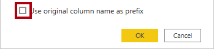
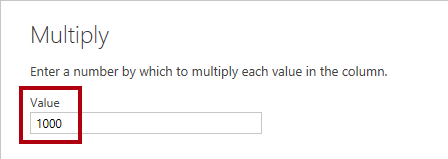

**The estimated time to complete the lab is 45 minutes.**

In this lab, you'll begin to apply transformations to
queries. You'll then apply the queries to
load each as a table to the data model.

In this lab, you learn how to:

- Apply various transformations

- Apply queries to load them to the data model

### Lab story

This lab is one of many in a series of labs that was designed as a complete story from data preparation to publication as reports and dashboards. You can complete the labs in any order. However, if you intend to work through multiple labs, for the first 10 labs, we suggest you do them in the following order:

1. Prepare Data in Power BI Desktop

2. **Load Data in Power BI Desktop**

3. Model Data in Power BI Desktop, Part 1

4. Model Data in Power BI Desktop, Part 2

5. Create DAX Calculations in Power BI Desktop, Part 1

6. Create DAX Calculations in Power BI Desktop, Part 2

7. Design a Report in Power BI Desktop, Part 1

8. Design a Report in Power BI Desktop, Part 2

9. Create a Power BI Dashboard

10. Perform Data Analysis in Power BI Desktop

11. Create a Power BI Paginated Report

## Exercise 1: Load Data

In this exercise, you'll apply transformations to each of the queries created in the previous lab.

### Task 1: Get started

In this task you'll set up the environment for the lab.

> [!IMPORTANT]
> If you are continuing on from the previous lab (and you completed that lab successfully), do not complete this task; instead, continue from the next task.

1. To open the Power BI Desktop, on the taskbar, select the Microsoft Power BI Desktop shortcut.

1. To close the getting started window, in the top-right corner, select **X**.

1. To open the starter Power BI Desktop file, from the **File** ribbon tab, select **Open report**, and then **Browse reports**.

1. In the **Open** window, navigate to the **D:\DA100\Labs\load-data-with-power-query-in-power-bi-desktop\Starter** folder.

1. Select the **Sales Analysis** file and select **Open**.

1. Close any informational windows that may open.

1. Notice the yellow warning message beneath the ribbon.

   The message alerts you to the fact that the queries have not been applied to load as model tables. You’ll apply the queries later in this lab.

1. To dismiss the warning message, at the right of the yellow warning message, select **X**.

1. To create a copy of the file, select the **File** ribbon tab to open the backstage view and select **Save As**.

   > [!div class="mx-imgBorder"]
   > [](../media/lab-6-ssm.png#lightbox)

1. If prompted to apply changes, select **Apply Later**.

1. In the **Save As** window, navigate to the **D:\DA100\MySolution** folder and select **Save**.

1. To open the **Power Query Editor** window, on the **Home** ribbon tab, from inside the **Queries** group, select the **Transform Data** icon.

   > [!div class="mx-imgBorder"]
   > [](../media/lab-10-ssm.png#lightbox)

### Task 2: Configure the Salesperson query

In this task, you'll configure the **Salesperson** query.

1. In the **Power Query Editor** window, in the **Queries** pane,
    select the **DimEmployee** query.

    > [!div class="mx-imgBorder"]
    > [](../media/lab-15-ssm.png#lightbox)

1. To rename the query, in the **Query Settings** pane (located at the
    right), in the **Name** box, replace the text with **Salesperson**,
    and then press **Enter**.

    The query name will determine the model table name. It's recommended to
    define concise, yet friendly, names.

1. In the **Queries** pane, verify that the query name has updated.

    > [!div class="mx-imgBorder"]
    > [](../media/lab-2-ssm.png#lightbox)

    You'll now filter the query rows to retrieve only employees who are salespeople.

1. To locate a specific column, on the **Home** ribbon tab, from inside
    the **Manage Columns** group, select the **Choose Columns**
    down-arrow, and then select **Go to Column**.

    > [!div class="mx-imgBorder"]
    > [](../media/lab-3-ssm.png#lightbox)

    > [!TIP]
    > This technique is useful when a query contains many columns.
    With fewer columns, you can scroll horizontally to locate the column.

1. In the **Go to Column** window, to order the list by column name,
    select the **AZ** sort button, and then select **Name**.

    > [!div class="mx-imgBorder"]
    > [](../media/lab-4-ssm.png#lightbox)

1. Select the **SalesPersonFlag** column, and then select **OK**.

1. To filter the query, in the **SalesPersonFlag** column header, select
    the down-arrow, and then clear the **FALSE** checkbox.

    > [!div class="mx-imgBorder"]
    > [](../media/lab-5-ssm.png#lightbox)

1. Select **OK**.

1. In the **Query Settings** pane, in the **Applied Steps** list,
    notice the addition of the **Filtered Rows** step.

    > [!div class="mx-imgBorder"]
    > [](../media/lab-24-ssm.png#lightbox)

    Each transformation you create results in additional step logic. You can edit or delete steps. You can also select a step to preview the query results at that stage of transformation.

1. To remove columns, on the **Home** ribbon tab, from inside the
    **Manage Columns** group, select the **Choose Columns** icon.

    > [!div class="mx-imgBorder"]
    > [](../media/lab-23-ssm.png#lightbox)

1. In the **Choose Columns** window, to clear all columns, clear
    the **(Select All Columns)** item.

    > [!div class="mx-imgBorder"]
    > [](../media/lab-31-ssm.png#lightbox)

1. To include columns, select the following six columns:

    - EmployeeKey

    - EmployeeNationalIDAlternateKey

    - FirstName

    - LastName

    - Title

    - EmailAddress

1. Select **OK**.

1. In the **Applied Steps** list, notice the addition of another query
    step.

    > [!div class="mx-imgBorder"]
    > [](../media/lab-11-ssm.png#lightbox)

1. To create a single name column, first select the **FirstName** column header.

1. While pressing the **Ctrl** key, select the **LastName** column.

    > [!div class="mx-imgBorder"]
    > [](../media/lab-39-ssm.png#lightbox)

1. Right-click either of the select column headers, and then in the
    context menu, select **Merge Columns**.

    > [!div class="mx-imgBorder"]
    > [](../media/lab-52-ssm.png#lightbox)

    > [!NOTE]
    > Many common transformations can be applied by right-clicking the column header, and then choosing them from the context menu. However, more transformations are available in the ribbon.

1. In the **Merge Columns** window, in the **Separator** dropdown list,
    select **Space**.

1. In the **New Column Name** box, replace the text with
    **Salesperson**.

    > [!div class="mx-imgBorder"]
    > [](../media/lab-14-ssm.png#lightbox)

1. Select **OK**.

1. To rename the **EmployeeNationalIDAlternateKey** column,
    double-click the **EmployeeNationalIDAlternateKey** column header.

1. Replace the text with **EmployeeID**, and then press **Enter**.

    > [!IMPORTANT]
    > When instructed to rename columns, it's important that you rename them exactly as described.

1. Use the previous steps to rename the **EmailAddress** column to
    **UPN**.

    UPN is an acronym for User Principal Name. The values in this column will be used when you configure row-level security in the **Model data in Power BI Desktop, Part 2** lab.

1. At the bottom-left, in the status bar, verify that the query has
    5 columns and 18 rows.

    > [!div class="mx-imgBorder"]
    > [](../media/lab-16-ss.png#lightbox)

    > [!IMPORTANT]
    > **Do not proceed** if your query does not produce the correct result or you'll be unable to complete later labs. If the query columns or rows don’t match, refer back to the steps in this task to fix any problems.

### Task 3: Configure the SalespersonRegion query

In this task, you'll configure the **SalespersonRegion** query.

1. In the **Queries** pane, select the **DimEmployeeSalesTerritory** query.

    > [!div class="mx-imgBorder"]
    > [](../media/lab-54-ssm.png#lightbox)

1. In the **Query Settings** pane, rename the query to
    **SalespersonRegion**.

1. To remove the last two columns, first select the **DimEmployee**
    column header.

1. While pressing the **Ctrl** key, select the **DimSalesTerritory**
    column header.

1. Right-click either of the select column headers, and then in the
    context menu, select **Remove Columns**.

    > [!div class="mx-imgBorder"]
    > [](../media/lab-55-ssm.png#lightbox)

1. In the status bar, verify that the query has 2 columns and 39 rows.

### Task 4: Configure the Product query

In this task, you'll configure the **Product** query.

> [!IMPORTANT]
> When detailed instructions have already been provided for a task that is repeated, the lab steps will now provide more concise instructions. If you need the detailed instructions, you can refer back to the steps of previous tasks.

1. Select the **DimProduct** query.

    > [!div class="mx-imgBorder"]
    > [](../media/lab-20-ssm.png#lightbox)

1. Rename the query to **Product**.

1. Locate the **FinishedGoodsFlag** column, and then filter the column
    to retrieve products that are finished goods (that is, TRUE).

1. Remove all columns, except the following:

    - ProductKey

    - EnglishProductName

    - StandardCost

    - Color

    - DimProductSubcategory

1. Notice that the **DimProductSubcategory** column represents a
    related table (it contains **Value** links).

1. In the **DimProductSubcategory** column header, at the right of the
    column name, select the expand button.

    > [!div class="mx-imgBorder"]
    > [](../media/lab-21-ssm.png#lightbox)

1. To clear all columns, clear the **(Select All Columns)** item.

1. Select the **EnglishProductSubcategoryName** and
    **DimProductCategory** columns.

    > [!div class="mx-imgBorder"]
    > [](../media/lab-22-ssm.png#lightbox)

    By selecting these two columns, a transformation will be applied to join to the **DimProductSubcategory** table, and then include these columns. The **DimProductCategory** column is, in fact, another related table in the data source.

1. Clear the **Use Original Column Name as Prefix** checkbox.

    Query column names must always be unique. When selected, this checkbox
    would prefix each column with the expanded column name (in this case
    **DimProductSubcategory**). Because it's known that the selected columns
    don't collide with columns in the **Product** query, the option is
    deselected.

1. Select **OK**.

   Notice that the transformation resulted in the addition of two columns, and that the **DimProductSubcategory** column has been removed.

1. Expand the **DimProductCategory**, and then introduce only the
    **EnglishProductCategoryName** column.

1. Rename the following four columns:

    - **EnglishProductName** to **Product**

    - **StandardCost** to **Standard Cost** (include a space)

    - **EnglishProductSubcategoryName** to **Subcategory**

    - **EnglishProductCategoryName** to **Category**

1. In the status bar, verify that the query has six columns and 397
    rows.

### Task 5: Configure the Reseller query

In this task, you will configure the **Reseller** query.

1. Select the **DimReseller** query.

    > [!div class="mx-imgBorder"]
    > [](../media/lab-42-ss.png#lightbox)

1. Rename the query to **Reseller**.

1. Remove all columns, except the following:

    - ResellerKey

    - BusinessType

    - ResellerName

    - DimGeography

1. Expand the **DimGeography** column, to include only the following three columns:

    - City

    - StateProvinceName

    - EnglishCountryRegionName

    > [!div class="mx-imgBorder"]
    > [](../media/lab-56-ss.png#lightbox)

1. In the **Business Type** column header, select the down-arrow, and
    then review the items, and the incorrect spelling of warehouse.

    > [!div class="mx-imgBorder"]
    > [](../media/lab-28-ssm.png#lightbox)

1. Right-click the **Business Type** column header, and then select
    **Replace Values**.

    > [!div class="mx-imgBorder"]
    > [](../media/lab-25-ss.png#lightbox)

1. In the **Replace Values** window, configure the following values:

    - In the **Value to Find** box, enter **Ware House**

    - In the **Replace With** box, enter **Warehouse**

    > [!div class="mx-imgBorder"]
    > [](../media/lab-30-ssm.png#lightbox)

1. Select **OK**.

1. Rename the following four columns:

    - **BusinessType** to **Business Type** (include a space)

    - **ResellerName** to **Reseller**

    - **StateProvinceName** to **State-Province**

    - **EnglishCountryRegionName** to **Country-Region**

1. In the status bar, verify that the query has 6 columns and 701
    rows.

### Task 6: Configure the Region query

In this task, you'll configure the **Region** query.

1. Select the **DimSalesTerritory** query.

    > [!div class="mx-imgBorder"]
    > [](../media/lab-64-ssm.png#lightbox)

1. Rename the query to **Region**.

1. Apply a filter to the **SalesTerritoryAlternateKey** column to
    remove the value 0 (zero).

    > [!div class="mx-imgBorder"]
    > [](../media/lab-34-ssm.png#lightbox)

1. Remove all columns, except the following:

    - SalesTerritoryKey

    - SalesTerritoryRegion

    - SalesTerritoryCountry

    - SalesTerritoryGroup

1. Rename the following three columns:

    - **SalesTerritoryRegion** to **Region**

    - **SalesTerritoryCountry** to **Country**

    - **SalesTerritoryGroup** to **Group**

1. In the status bar, verify that the query has 4 columns and 10
    rows.

### Task 7: Configure the Sales query

In this task, you will configure the **Sales** query.

1. Select the **FactResellerSales** query.

    > [!div class="mx-imgBorder"]
    > [](../media/lab-65-ssm.png#lightbox)

1. Rename the query to **Sales**.

1. Remove all columns, except the following:

    - SalesOrderNumber

    - OrderDate

    - ProductKey

    - ResellerKey

    - EmployeeKey

    - SalesTerritoryKey

    - OrderQuantity

    - UnitPrice

    - TotalProductCost

    - SalesAmount

    - DimProduct

    You may recall in the **Prepare data in Power BI Desktop** lab that a small percentage of **FactResellerSales**
    rows had missing **TotalProductCost** values. The **DimProduct** column
    has been included to retrieve the product standard cost, to help fix the
    missing values.

1. Expand the **DimProduct** column, and then include the
    **StandardCost** column.

1. To create a custom column, on the **Add Column** ribbon tab, from
    inside the **General** group, select **Custom Column**.

    > [!div class="mx-imgBorder"]
    > [](../media/lab-37-ssm.png#lightbox)

1. In the **Custom Column** window, in the **New Column Name** box,
    replace the text with **Cost**.

    > [!div class="mx-imgBorder"]
    > [](../media/lab-71-ssm.png#lightbox)

1. In the **Custom Column Formula** box, enter the following expression
    (after the equals symbol):

    > [!NOTE]
    > For your convenience, you can copy the expression from the
    **D:\DA100\Labs\load-data-with-power-query-in-power-bi-desktop\Assets\Snippets.txt** file.

    Power Query

    ```if [TotalProductCost] = null then [OrderQuantity] * [StandardCost] else [TotalProductCost]```

    This expression tests whether the **TotalProductCost** value is missing. If it is, it produces a value by multiplying the **OrderQuantity** value by the **StandardCost** value; otherwise, it uses the existing
    **TotalProductCost** value.

1. Select **OK**.

1. Remove the following two columns:

    - TotalProductCost

    - StandardCost

1. Rename the following three columns:

    - **OrderQuantity** to **Quantity**

    - **UnitPrice** to **Unit Price** (include a space)

    - **SalesAmount** to **Sales**

1. To modify the column data type, in the **Quantity** column header,
    at the left of the column name, select the **1.2** icon, and then
    select **Whole Number**.

    > [!div class="mx-imgBorder"]
    > [](../media/lab-40-ssm.png#lightbox)

    Configuring the correct data type is important. When the column contains
    numeric value, it's also important to choose the correct type if you
    expect to perform mathematic calculations.

1. Modify the following three-column data types to
    **Fixed Decimal Number**.

    - Unit Price

    - Sales

    - Cost

    > [!div class="mx-imgBorder"]
    > [](../media/lab-59-ss.png#lightbox)

    > [!NOTE]
    > The fixed decimal number data type stores values with full precision,
    and so requires more storage space than the decimal number. It's important
    to use the fixed decimal number type for financial values, or rates
    (like exchange rates).

1. In the status bar, verify that the query has 10 columns and 999+
    rows.

    A maximum of 1000 rows is loaded as preview data for each query.

### Task 8: Configure the Targets query

In this task, you'll configure the **Targets** query.

1. Select the **ResellerSalesTargets** query.

    > [!div class="mx-imgBorder"]
    > [](../media/lab-67-ss.png#lightbox)

1. Rename the query to **Targets**.

1. To unpivot the 12-month columns (**M01**-**M12**), first
    multi-select the **Year** and **EmployeeID** column headers.

    > [!div class="mx-imgBorder"]
    > [](../media/lab-44-ssm.png#lightbox)

1. Right-click either of the select column headers, and then in the
    context menu, select **Unpivot Other Columns**.

    > [!div class="mx-imgBorder"]
    > [](../media/lab-48-a-ssm.png#lightbox)

   Notice that the column names now appear in the **Attribute** column,
    and the values appear in the **Value** column.

1. Apply a filter to the **Value** column to remove hyphen (-) values.

    You may recall that the hyphen character was used in the source CSV file to represent zero (0).

1. Rename the following two columns:

    - **Attribute** to **MonthNumber** (No space between the two words. It will be removed later.)

    - **Value** to **Target**

    You'll now apply transformations to produce a date column. The date
    will be derived from the **Year** and **MonthNumber** columns. You'll
    create the column by using the **Columns From Examples** feature.

1. To prepare the **MonthNumber** column values, right-click the
    **MonthNumber** column header, and then select **Replace Values**.

    > [!div class="mx-imgBorder"]
    > [](../media/lab-48-b-ssm.png#lightbox)

1. In the **Replace Values** window, in the **Value To Find** box,
    enter **M**.

1. Select **OK**.

1. Modify the **MonthNumber** column data type to **Whole Number**.

    > [!div class="mx-imgBorder"]
    > [](../media/lab-48-ssm.png#lightbox)

1. On the **Add Column** ribbon tab, from inside the **General** group,
    select The **Column From Examples** icon.

    > [!div class="mx-imgBorder"]
    > [](../media/lab-49-ssm.png#lightbox)

1. Notice that the first row is for year **2017** and month number
    **7**.

1. In the **Column1** column, in the first grid cell, enter
    **7/1/2017**, and then press **Enter**.

    The virtual machine uses US regional settings, so this date is in fact
    July 1, 2017.

1. Notice that the grid cells update with predicted values.

    The feature has accurately predicted that you're combining values from
    the **Year** and **MonthNumber** columns.

1. Notice also the formula presented above the query grid.

    > [!div class="mx-imgBorder"]
    > [](../media/lab-50-ssm.png#lightbox)

1. To rename the new column, double-click the **Merged** column header.

1. Rename the column as **TargetMonth**.

1. To add the new column, select **OK**.

1. Remove the following columns:

    - Year

    - MonthNumber

1. Modify the following column data types:

    - **Target** as fixed decimal number

    - **TargetMonth** as date

1. To multiply the **Target** values by 1000, select the **Target**
    column header, and then on the **Transform** ribbon tab, from inside
    the **Number Column** group, select **Standard**, and then select
    **Multiply**.

    > [!div class="mx-imgBorder"]
    > [](../media/lab-53-ssm.png#lightbox)

    You may recall that the target values were stored as thousands.

1. In the **Multiply** window, in the **Value** box, enter **1000**.

1. Select **OK**.

1. In the status bar, verify that the query has 3 columns and 809
    rows.

### Task 9: Configure the ColorFormats query

In this task, you'll configure the **ColorFormats** query.

1. Select the **ColorFormats** query.

1. Notice that the first row contains the column names.

1. On the **Home** ribbon tab, from inside the **Transform** group,
    select **Use First Row as Headers**.

    > [!div class="mx-imgBorder"]
    > [](../media/lab-58-ssm.png#lightbox)

1. In the status bar, verify that the query has 3 columns and 10
    rows.

### Task 10: Update the Product query

In this task, you'll update the **Product** query by merging the
**ColorFormats** query.

1. Select the **Product** query.

1. To merge the **ColorFormats** query, on the **Home** ribbon tab,
    from inside the **Combine** group, select **Merge Queries**.

    > [!div class="mx-imgBorder"]
    > [](../media/lab-61-ssm.png#lightbox)

    Merging queries allows you to integrate data, in this case from different
    data sources (SQL Server and a CSV file).

1. In the **Merge** window, in the **Product** query grid, select the
    **Color** column header.

    > [!div class="mx-imgBorder"]
    > [](../media/lab-62-ssm.png#lightbox)

1. Beneath the **Product** query grid, in the dropdown list, select
    the **ColorFormats** query.

    > [!div class="mx-imgBorder"]
    > [](../media/lab-63-a-ssm.png#lightbox)

1. In the **ColorFormats** query grid, select the **Color** column
    header.

1. When the **Privacy Levels** window opens, for each of the two data
    sources, in the corresponding dropdown list, select
    **Organizational**.

    > [!div class="mx-imgBorder"]
    > [](../media/lab-63-ssm.png#lightbox)

    Privacy levels can be configured for data source to determine whether
    data can be shared between sources. Setting each data source as
    **Organizational** allows them to share data, if necessary. Private data sources can never be shared with other data sources. It
    doesn't mean that Private data cannot be shared; it means that the Power
    Query engine cannot share data between the sources.

1. Select **Save**.

1. In the **Merge** window, select **OK**.

1. Expand the **ColorFormats** column to include the following two
    columns:

    - Background Color Format

    - Font Color Format

    > [!div class="mx-imgBorder"]
    > [](../media/lab-69-a-ssm.png#lightbox)

1. In the status bar, verify that the query now has 8 columns and
    397 rows.

### Task 11: Update the ColorFormats query

In this task, you'll update the **ColorFormats** to disable its load.

1. Select the **ColorFormats** query.

1. In the **Query Settings** pane, select the **All Properties** link.

    > [!div class="mx-imgBorder"]
    > [](../media/lab-69-ssm.png#lightbox)

1. In the **Query Properties** window, clear the
    **Enable Load To Report** checkbox.

    > [!div class="mx-imgBorder"]
    > [](../media/lab-70-a-ssm.png#lightbox)

    Disabling the load means it won't load as a table to the data model.
    This is done because the query was merged with the Product query, which
    is enabled to load to the data model.

1. Select **OK**.

### Task 12: Finish up

In this task, you'll complete the lab.

1. Verify that you have eight queries, correctly named as follows:

    - Salesperson

    - SalespersonRegion

    - Product

    - Reseller

    - Region

    - Sales

    - Targets

    - ColorFormats (which won't load to the data model)

1. To load the data model, on the **File** backstage view, select
    **Close & Apply**.

    All load-enabled queries are now loaded to the data model.

1. In the **Fields** pane (located at the right), notice the seven
    tables loaded to the data model.

    > [!div class="mx-imgBorder"]
    > [](../media/lab-73-ss.png#lightbox)

1. Save the Power BI Desktop file.

1. If you intend to start the next lab, leave Power BI Desktop open.

You'll configure data model tables and relationships in the **Model data in Power BI Desktop, Part 1** lab.

[!INCLUDE [](../../../includes/power-bi-lab-end.md)]
