## Overview

The estimated time to complete the lab is 45 minutes.

In this lab, you'll begin to apply transformations to
queries. You'll then apply the queries to
load each as a table to the data model.

In this lab, you learn how to:

-   Apply various transformations

-   Apply queries to load them to the data model

Before you start this lab, you will need to open the lab environment link above, and log in to the lab environment. There is no need to provide your own environment, as an environment has been prepared for this lab.

## Load Data

In this exercise, you'll apply transformations to each of the queries.

### Open the solution file

1.  Double-click the Power BI Desktop icon. (This may take a minute or two to open.)

1.  Dismiss the splash screen by selecting **X** to close.

	> [!div class="mx-imgBorder"]
	> [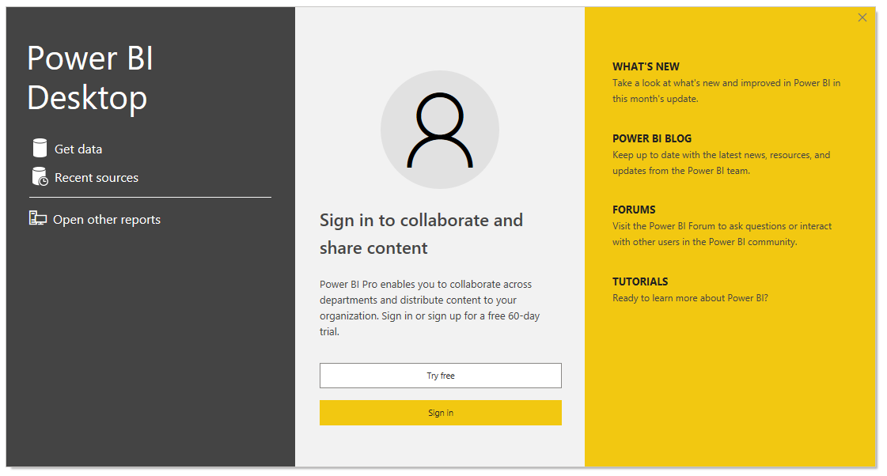](../media/lab-0-ssm.png#lightbox)


1.  From the **File** tab, select **Open report**, and then **Browse reports**.
 
1. You will open **Sales Analysis.pbix** file, which is found in the **D:\DA100\Labs\02-load-data-with-power-query-in-power-bi-desktop\Starter** folder.

### Configure the Salesperson query

In this task, you'll configure the **Salesperson** query.

1.  To open the **Power Query Editor** window, in Power BI Desktop, on the Home ribbon tab, click **Transform Data**. 

1. In the **Power Query Editor** window, in the **Queries** pane,
    select the **DimEmployee** query.

1.  To rename the query, in the **Query Settings** pane (located at the
    right), in the **Name** box, replace the text with **Salesperson**,
    and then press **Enter**.

	The query name will determine the model table name. It's recommended to
	define concise, yet friendly, names.

1.  In the **Queries** pane, verify that the query name has updated.

	> [!div class="mx-imgBorder"]
	> [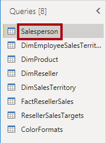](../media/lab-2-ssm.png#lightbox)

	You'll now filter the query rows to retrieve only employees who are salespeople.

1.  To locate a specific column, on the **Home** ribbon tab, from inside
    the **Manage Columns** group, click the **Choose Columns**
    down-arrow, and then select **Go to Column**.

	> [!div class="mx-imgBorder"]
	> [](../media/lab-3-ssm.png#lightbox)

	> [!TIP]
	> This technique is useful when a query contains many columns.
	Usually, you can simply horizontally scroll to locate the column.

1.  In the **Go to Column** window, to order the list by column name,
    click the **AZ** sort button, and then select **Name**.

	> [!div class="mx-imgBorder"]
	> [](../media/lab-4-ssm.png#lightbox)

1.  Select the **SalesPersonFlag** column, and then click **OK**.

1.  To filter the query, in the **SalesPersonFlag** column header, click
    the down-arrow, and then uncheck **FALSE**.

	> [!div class="mx-imgBorder"]
	> [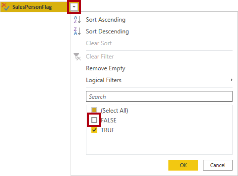](../media/lab-5-ssm.png#lightbox)

1.  Click **OK**.


1.  In the **Query Settings** pane, in the **Applied Steps** list,
    notice the addition of the **Filtered Rows** step.

	Each transformation you create results in additional step logic. It's possible to edit or delete steps. It's also possible to select a step to preview the query results at that stage of transformation.

1. To remove columns, on the **Home** ribbon tab, from inside the
    **Manage Columns** group, click the **Choose Columns** icon.

1. In the **Choose Columns** window, to uncheck all columns, uncheck
    the **(Select All Columns)** item.

1. To include columns, check the following six columns:

	-   EmployeeKey
	
	-   EmployeeNationalIDAlternateKey
	
	-   FirstName
	
	-   LastName
	
	-   Title
	
	-   EmailAddress

1. Click **OK**.

1. In the **Applied Steps** list, notice the addition of another query
    step.

	> [!div class="mx-imgBorder"]
	> [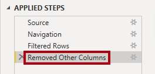](../media/lab-11-ssm.png#lightbox)

1. To create a single name column, first select the **FirstName** column header.

1. While pressing the **Ctrl** key, select the **LastName** column.

1. Right-click either of the select column headers, and then in the
    context menu, select **Merge Columns**.

	Many common transformations can be applied by right-clicking the column header, and then choosing them from the context menu. However, that all transformations and more are available in the ribbon.

1. In the **Merge Columns** window, in the **Separator** dropdown list,
    select **Space**.

1. In the **New Column Name** box, replace the text with
    **Salesperson**.

	> [!div class="mx-imgBorder"]
	> [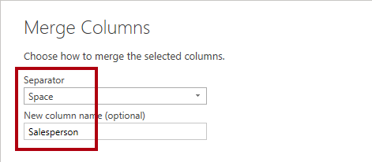](../media/lab-14-ssm.png#lightbox)

1. Click **OK**.

1. To rename the **EmployeeNationalIDAlternateKey** column,
    double-click the **EmployeeNationalIDAlternateKey** column header.

1. Replace the text with **EmployeeID**, and then press **Enter**.

	When instructed to rename columns, it's important that you rename them exactly as described.

1. Use the previous steps to rename the **EmailAddress** column to
    **UPN**.

	UPN is an acronym for User Principal Name. The values in this column will be used when you configure row-level security in **Lab 05A**.

1. At the bottom-left, in the status bar, verify that the query has
    5 columns and 18 rows.

	> [!div class="mx-imgBorder"]
	> [](../media/lab-16-ss.png#lightbox)

	It's important that you do not proceed if your query does not produce the correct result, it won't be possible to complete later labs. If it doesn't, refer back to the steps in this task to fix any problems.

### Configure the SalespersonRegion query

In this task, you'll configure the **SalespersonRegion** query.

1. In the **Queries** pane, select the **DimEmployeeSalesTerritory** query.

1. In the **Query Settings** pane, rename the query to
    **SalespersonRegion**.

1. To remove the last two columns, first select the **DimEmployee**
    column header.

1. While pressing the **Ctrl** key, select the **DimSalesTerritory**
    column header.

1. Right-click either of the select column headers, and then in the
    context menu, select **Remove Columns**.

1. In the status bar, verify that the query has 2 columns and 39 rows.

### Configure the Product query

In this task, you'll configure the **Product** query.

When detailed instructions have already been provided in the labs, the
lab steps will now provide more concise instructions. If you need the
detailed instructions, you can refer back to other tasks.

1. Select the **DimProduct** query.

	> [!div class="mx-imgBorder"]
	> [](../media/lab-20-ssm.png#lightbox)

1. Rename the query to **Product**.

1. Locate the **FinishedGoodsFlag** column, and then filter the column
    to retrieve products that are finished goods (that is, TRUE).

1. Remove all columns, except the following:

	-   ProductKey
	
	-   EnglishProductName
	
	-   StandardCost
	
	-   Color
	
	-   DimProductSubcategory

1. Notice that the **DimProductSubcategory** column represents a
    related table (it contains **Value** links).

1. In the **DimProductSubcategory** column header, at the right of the
    column name, click the expand button.

	> [!div class="mx-imgBorder"]
	> [](../media/lab-21-ssm.png#lightbox)

1. To uncheck all columns, uncheck the **(Select All Columns)** item.

1. Check the **EnglishProductSubcategoryName** and
    **DimProductCategory** columns.

	> [!div class="mx-imgBorder"]
	> [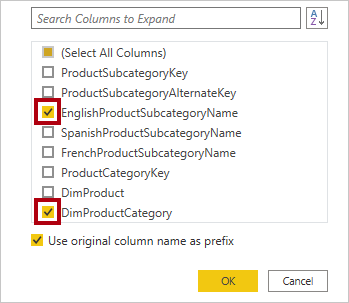](../media/lab-22-ssm.png#lightbox)

	By selecting these two columns, a transformation will be applied to join to the **DimProductSubcategory** table, and then include these columns. The **DimProductCategory** column is, in fact, another related table.

1. Uncheck the **Use Original Column Name as Prefix** checkbox.

	Query column names must always be unique. When checked, this checkbox
	would prefix each column with the expanded column name (in this case
	**DimProductSubcategory**). Because it's known that the selected columns
	don't collide with columns in the **Product** query, the option is
	deselected.

1. Click **OK**.

1. Expand the **DimProductCategory**, and then introduce only the
    **EnglishProductCategoryName** column.

1. Rename the following four columns:

	-   **EnglishProductName** to **Product**
	
	-   **StandardCost** to **Standard Cost** (include a space)
	
	-   **EnglishProductSubcategoryName** to **Subcategory**
	
	-   **EnglishProductCategoryName** to **Category**

1. In the status bar, verify that the query has six columns and 397
    rows.

### Configure the Reseller query

In this task, you will configure the **Reseller** query.

1. Select the **DimReseller** query.

1. Rename the query to **Reseller**.

1. Remove all columns, except the following:

	-   ResellerKey
	
	-   BusinessType
	
	-   ResellerName
	
	-   DimGeography

1. Expand the **DimGeography** column, to include only the following three columns:

	-   City
	
	-   StateProvinceName
	
	-   EnglishCountryRegionName

1. In the **Business Type** column header, click the down-arrow, and
    then review the items, and the incorrect spelling of warehouse.

	> [!div class="mx-imgBorder"]
	> [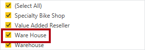](../media/lab-28-ssm.png#lightbox)

1. Right-click the **Business Type** column header, and then select
    **Replace Values**.

1. In the **Replace Values** window, configure the following values:

	-   In the **Value to Find** box, enter **Ware House**
	
	-   In the **Replace With** box, enter **Warehouse**

	> [!div class="mx-imgBorder"]
	> [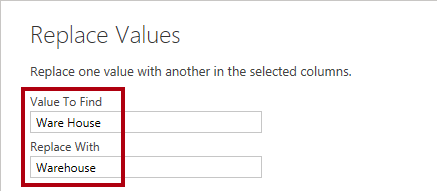](../media/lab-30-ssm.png#lightbox)

1. Click **OK**.

1. Rename the following four columns:

	-   **BusinessType** to **Business Type** (include a space)
	
	-   **ResellerName** to **Reseller**
	
	-   **StateProvinceName** to **State-Province**
	
	-   **EnglishCountryRegionName** to **Country-Region**

1. In the status bar, verify that the query has 6 columns and 701
    rows.

### Configure the Region query

In this task, you will configure the **Region** query.

1. Select the **DimSalesTerritory** query.

1. Rename the query to **Region**.

1. Apply a filter to the **SalesTerritoryAlternateKey** column to
    remove the value 0 (zero).

	> [!div class="mx-imgBorder"]
	> [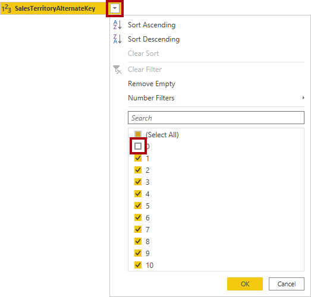](../media/lab-34-ssm.png#lightbox)

1. Remove all columns, except the following:

	-   SalesTerritoryKey
	
	-   SalesTerritoryRegion
	
	-   SalesTerritoryCountry
	
	-   SalesTerritoryGroup

1. Rename the following three columns:

	-   **SalesTerritoryRegion** to **Region**
	
	-   **SalesTerritoryCountry** to **Country**
	
	-   **SalesTerritoryGroup** to **Group**

1. In the status bar, verify that the query has 4 columns and 10
    rows.

### Configure the Sales query

In this task, you will configure the **Sales** query.

1. Select the **FactResellerSales** query.

1. Rename the query to **Sales**.

1. Remove all columns, except the following:

	-   SalesOrderNumber
	
	-   OrderDate
	
	-   ProductKey
	
	-   ResellerKey
	
	-   EmployeeKey
	
	-   SalesTerritoryKey
	
	-   OrderQuantity
	
	-   UnitPrice
	
	-   TotalProductCost
	
	-   SalesAmount
	
	-   DimProduct

	Recall in **Lab 02A** that a small percentage of **FactResellerSales**
	rows had missing **TotalProductCost** values. The **DimProduct** column
	has been included to retrieve the product standard cost, to fix the
	missing values.

1. Expand the **DimProduct** column, and then include the
    **StandardCost** column.

1. To create a custom column, on the **Add Column** ribbon tab, from
    inside the **General** group, click **Custom Column**.

	> [!div class="mx-imgBorder"]
	> [](../media/lab-37-ssm.png#lightbox)

1. In the **Custom Column** window, in the **New Column Name** box,
    replace the text with **Cost**.

1. In the **Custom Column Formula** box, enter the following expression
    (after the equals symbol):

1. For your convenience, you can copy the expression from the
    **D:\DA100\Lab03A\Assets\Snippets.txt** file.

	Power Query
	
	```if [TotalProductCost] = null then [OrderQuantity] * [StandardCost] else [TotalProductCost]```

	This expression tests if the **TotalProductCost** value is missing. If
	it is, produce a value by multiplying the **OrderQuantity** value by
	the **StandardCost** value; otherwise, it uses the existing
	**TotalProductCost** value.

1. Click **OK**.

1. Remove the following two columns:

	-   TotalProductCost
	
	-   StandardCost

1. Rename the following three columns:

	-   **OrderQuantity** to **Quantity**
	
	-   **UnitPrice** to **Unit Price** (include a space)
	
	-   **SalesAmount** to **Sales**

1. To modify the column data type, in the **Quantity** column header,
    at the left of the column name, click the **1.2** icon, and then
    select **Whole Number**.

	> [!div class="mx-imgBorder"]
	> [](../media/lab-40-ssm.png#lightbox)

	Configuring the correct data type is important. When the column contains
	numeric value, it's also important to choose the correct type if you
	expect to perform mathematic calculations.

1. Modify the following three-column data types to
    **Fixed Decimal Number**.

	-   Unit Price
	
	-   Sales
	
	-   Cost

	The fixed decimal number data type stores values with full precision,
	and so requires more storage space than the decimal number. It's important
	to use the fixed decimal number type for financial values, or rates
	(like exchange rates).

1. In the status bar, verify that the query has 10 columns and 999+
    rows.

	A maximum of 1000 rows will be loaded as preview data for each query.

### Configure the Targets query

In this task, you'll configure the **Targets** query.

1. Select the **ResellerSalesTargets** query.

1. Rename the query to **Targets**.

1. To unpivot the 12-month columns (**M01**-**M12**), first
    multi-select the **Year** and **EmployeeID** column headers.

	> [!div class="mx-imgBorder"]
	> [](../media/lab-44-ssm.png#lightbox)

1. Right-click either of the select column headers, and then in the
    context menu, select **Unpivot Other Columns**.

1. Notice that the column names now appear in the **Attribute** column,
    and the values appear in the **Value** column.

1. Apply a filter to the **Value** column to remove hyphen (-) values.

1. Rename the following two columns:

	-   **Attribute** to **MonthNumber** (no space between the two words it will be removed later)
	
	-   **Value** to **Target**
	
	You'll now apply transformations to produce a date column. The date
	will be derived from the **Year** and **MonthNumber** columns. You'll
	create the column by using the **Columns From Examples** feature.

1. To prepare the **MonthNumber** column values, right-click the
    **MonthNumber** column header, and then select **Replace Values**.

1. In the **Replace Values** window, in the **Value To Find** box,
    enter **M**.

1. Click **OK**.

1. Modify the **MonthNumber** column data type to **Whole Number**.

	> [!div class="mx-imgBorder"]
	> [](../media/lab-48-ssm.png#lightbox)

1. On the **Add Column** ribbon tab, from inside the **General** group,
    click The **Column From Examples** icon.

	> [!div class="mx-imgBorder"]
	> [](../media/lab-49-ssm.png#lightbox)

1. Notice that the first row is for year **2017** and month number
    **7**.

1. In the **Column1** column, in the first grid cell, enter
    **7/1/2017**, and then press **Enter**.

	The virtual machine uses US regional settings, so this date is in fact
	July 1, 2017.

1. Notice that the grid cells update with predicted values.

	The feature has accurately predicted that you're combining values from
	two columns.

1. Notice also the formula presented above the query grid.

	> [!div class="mx-imgBorder"]
	> [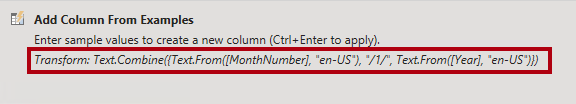](../media/lab-50-ssm.png#lightbox)

1. To rename the new column, double-click the **Merged** column header.

1. Rename the column as **TargetMonth**.

1. Click **OK**.

1. Remove the following columns:

	-   Year
	
	-   MonthNumber

1. Modify the following column data types:

	-   **Target** as fixed decimal number
	
	-   **TargetMonth** as date

1. To multiply the **Target** values by 1000, select the **Target**
    column header, and then on the **Transform** ribbon tab, from inside
    the **Number Column** group, click **Standard**, and then select
    **Multiply**.

	> [!div class="mx-imgBorder"]
	> [](../media/lab-53-ssm.png#lightbox)

1. In the **Multiply** window, in the **Value** box, enter **1000**.

1. Click **OK**.

1. In the status bar, verify that the query has 3 columns and 809
    rows.

### Configure the ColorFormats query

In this task, you'll configure the **ColorFormats** query.

1. Select the **ColorFormats** query.

1. Notice that the first row contains the column names.

1. On the **Home** ribbon tab, from inside the **Transform** group,
    click **Use First Row as Headers**.

	> [!div class="mx-imgBorder"]
	> [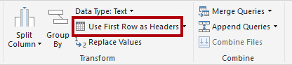](../media/lab-58-ssm.png#lightbox)

1. In the status bar, verify that the query has 3 columns and 10
    rows.

### Update the Product query

In this task, you'll update the **Product** query by merging the
**ColorFormats** query.

1. Select the **Product** query.

1. To merge the **ColorFormats** query, on the **Home** ribbon tab,
    from inside the **Combine** group, click **Merge Queries**.

	> [!div class="mx-imgBorder"]
	> [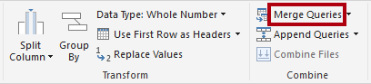](../media/lab-61-ssm.png#lightbox)

	Merging queries allows integrating data, in this case from different
	data sources (SQL Server and a CSV file).

1. In the **Merge** window, in the **Product** query grid, select the
    **Color** column header.

	> [!div class="mx-imgBorder"]
	> [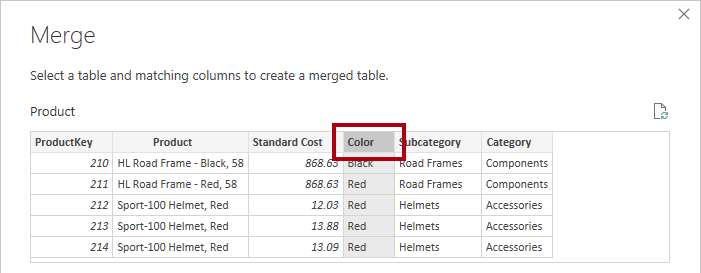](../media/lab-62-ssm.png#lightbox)

1. Beneath the **Product** query grid, in the dropdown list, select
    the **ColorFormats** query.

1. In the **ColorFormats** query grid, select the **Color** column
    header.

1. When the **Privacy Levels** window opens, for each of the two data
    sources, in the corresponding dropdown list, select
    **Organizational**.

	> [!div class="mx-imgBorder"]
	> [](../media/lab-63-ssm.png#lightbox)

	Privacy levels can be configured for data source to determine whether
	data can be shared between sources. Setting each data source as
	**Organizational** allows them to share data, if necessary. Private data sources can never be shared with other data sources. It
	doesn't mean that Private data cannot be shared; it means that the Power
	Query engine cannot share data between the sources.

1. Click **Save**.

1. In the **Merge** window, click **OK**.

1. Expand the **ColorFormats** column to include the following two
    columns:

	-   Background Color Format
	
	-   Font Color Format

1. In the status bar, verify that the query now has 8 columns and
    397 rows.

### Update the ColorFormats query

In this task, you'll update the **ColorFormats** to disable its load.

1. Select the **ColorFormats** query.

1. In the **Query Settings** pane, click the **All Properties** link.

	> [!div class="mx-imgBorder"]
	> [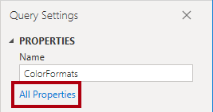](../media/lab-69-ssm.png#lightbox)

1. In the **Query Properties** window, uncheck the
    **Enable Load To Report** checkbox.

	Disabling the load means it won't load as a table to the data model.
	This is done because the query was merged with the Product query, which
	is enabled to load to the data model.

1. Click **OK**.

### Finish up

In this task, you'll complete the lab.

1. Verify that you have eight queries, correctly named as follows:

	-   Salesperson
	
	-   SalespersonRegion
	
	-   Product
	
	-   Reseller
	
	-   Region
	
	-   Sales
	
	-   Targets
	
	-   ColorFormats (which won't load to the data model)

1. To load the data model, on the **File** backstage view, select
    **Close & Apply**.

	All load-enabled queries are now loaded to the data model.

1. In the **Fields** pane (located at the right), notice the seven
    tables loaded to the data model.

	> [!div class="mx-imgBorder"]
	> [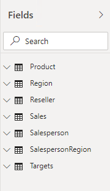](../media/lab-73-ss.png#lightbox)

1. Save the Power BI Desktop file.

1. Leave Power BI Desktop open.

In the next lab, you'll configure data model tables and relationships.

[!INCLUDE [](../../../includes/power-bi-lab-end.md)]
