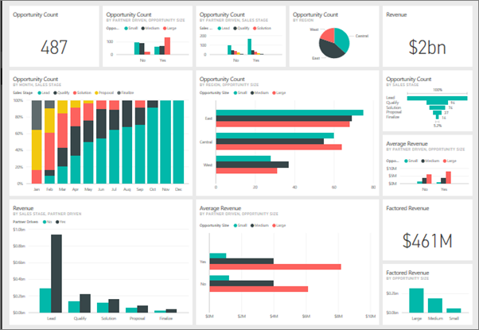
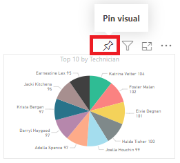
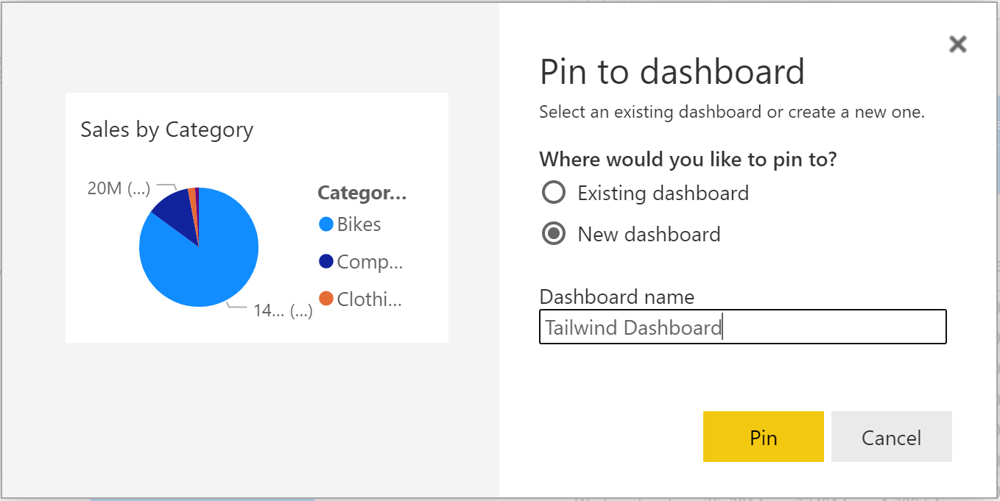
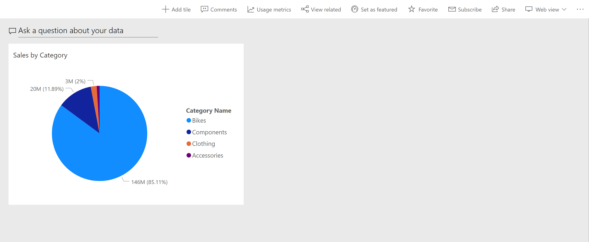
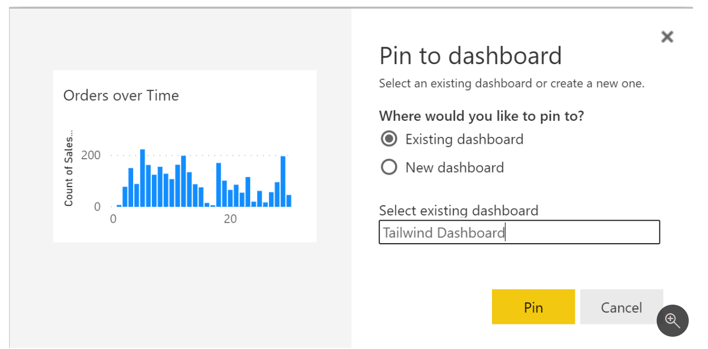
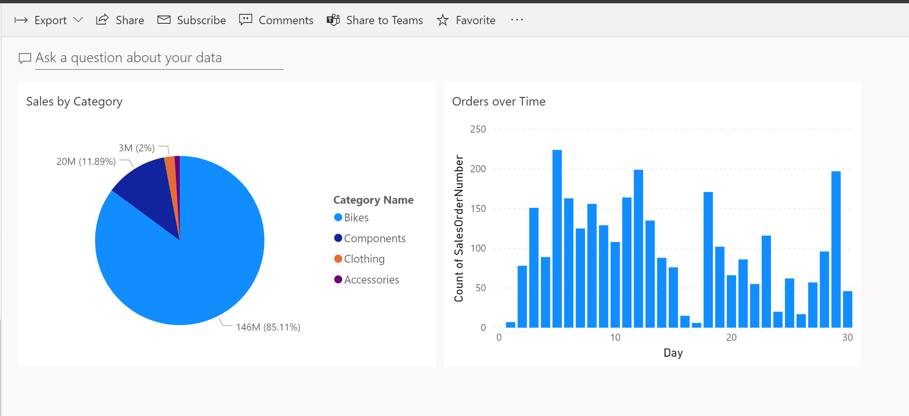

Microsoft Power BI dashboards are different than Power BI reports. Dashboards allow report consumers to create a single artifact of directed data that is personalized just for them. Dashboards can be comprised of pinned visuals that are taken from different reports. Where a Power BI report uses data from a single dataset, a Power BI dashboard can contain visuals from different datasets.

Well-built dashboards capture the main, most important highlights of the story that you are trying to tell. The following screenshot is an example of a well-built dashboard.

> [!div class="mx-imgBorder"]
> 

Power BI dashboards is a feature that is only included in Power BI service. You can also view dashboards on mobile devices, though you can't build them there.

Consider dashboards as the display window at a bakery, where you want people to be able to view the most important items, while inside the shop (and in your reports in Power BI Desktop) is where all ingredients are transformed to produce the display.

## Dashboards vs. reports

When would you want to build a dashboard versus a report? The following list explains the key similarities and differences worth noting when you are determining the right path for you:

-   Dashboards can be created from multiple datasets or reports.

-   Dashboards do not have the **Filter**, **Visualization**, and **Fields** panes that are in Power BI Desktop, meaning that you can't add new filters and slicers, and you can't make edits.

-   Dashboards can only be a single page, whereas reports can be multiple pages.

-   You can't see the underlying dataset directly in a dashboard, while you can see the dataset in a report under the **Data** tab in Power BI Desktop.

-   Both dashboards and reports can be refreshed to show the latest data.

Dashboards allow a user to pin visuals from different reports and datasets onto a single canvas, making it simple to group what's important to the user. Reports, on the other hand, are more focused on being able to visualize and apply transformations to a single dataset. Consider dashboards as the next step that you want to take after building your reports in Power BI Desktop.

Now that you've learned about the background of dashboards and reports, you can learn about dashboards in depth, specifically about their individual components.

## Manage tiles on a dashboard

Tiles are the individual report elements, or snapshots, of your data that are then pinned to a dashboard. Tiles can be sourced from a multitude of places including reports, datasets, other dashboards, Microsoft Excel, SQL Server Reporting Services, and more. When pinning a report element to a dashboard, you create a direct connection between the dashboard and the report that the snapshot came from.

Your first task in this module is to create a basic dashboard. For this scenario, you have created a simple report in Power BI Desktop called **Tailwind Sales**.

## Pin a tile to a dashboard

You've uploaded your reports into Power BI service and are now viewing the report in Power BI service. How do you create a dashboard? You can pin an entire report page, or you can pin individual tiles, both of which will be discussed later.

The pinning process pulls visuals from your report and "pins" them to a dashboard for easy viewing. When you make changes to any of the visuals in the report, changes will be reflected on the dashboard.

To look at a specific visual, consider that you want to pin your tile, **Sales by Category**, onto a new dashboard for easy viewing. You can complete this task by hovering over the visual. In the visual header, select the **Pin Visual** icon, as shown in the following image.

> [!div class="mx-imgBorder"]
> 

After you have selected the icon, a window will appear, where you can choose to pin this visual to a new or existing dashboard. For this example, you want your tile to be on a new dashboard called **Tailwind Dashboard**.

> [!div class="mx-imgBorder"]
> 

After you have selected **Pin**, you will be redirected to your new dashboard, where you have just pinned a tile from your report. You can resize and move this visual around the dashboard by selecting the visual, dragging, and then dropping it.

> [!div class="mx-imgBorder"]
> 

One of biggest benefits of a dashboard is being able to pin a visual that is sourced from a different dataset. The following section explains how you can add a visual onto your **Category** dashboard.

## Pin a tile from a different report

What if you want to pin a visual from a different report (and different dataset) to an existing dashboard? To continue with the scenario, you want to add an **Orders over Time** visual, which is housed in a different report to **Tailwind Dashboard**. You can perform the same procedure in which you hover over the visual in the original report and then select the **Pin** icon. The following window will appear, but this time, you want to pin this visual onto an existing dashboard.

> [!div class="mx-imgBorder"]
> 

When you navigate to your dashboard, notice that both visuals are now pinned, regardless of the underlying dataset.

> [!div class="mx-imgBorder"]
> 

Now that you have learned how to pin individual tiles, you can learn how to pin an entire report page, which will be discussed later in this module.

For more information, see [Introduction to dashboard tiles.](https://docs.microsoft.com/power-bi/create-reports/service-dashboard-tiles/?azure-portal=true)

