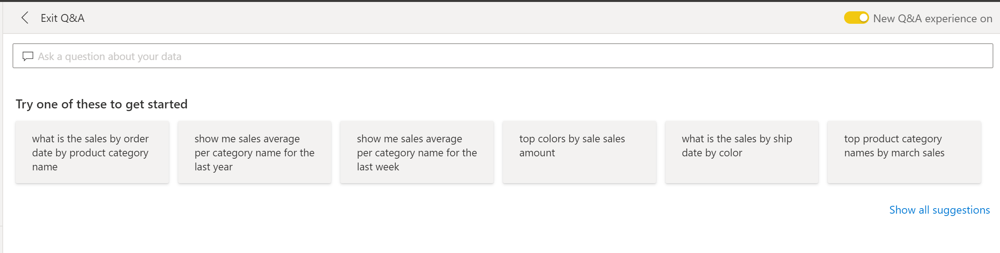
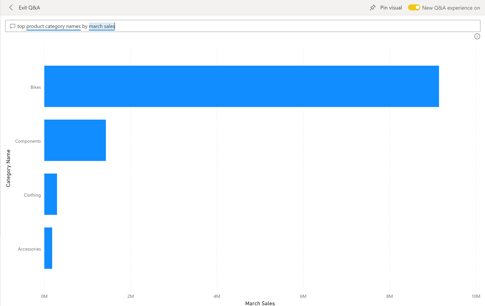
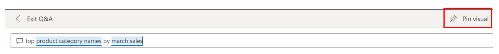

Power BI dashboards are about having a user-friendly experience. Dashboards in Power BI service are comprised of a canvas of interactive tiles, or report elements, that tell a data story.

In this module's scenario, you are developing dashboards at Tailwind Traders. These dashboards are published; however, you begin receiving emails from users who are asking questions about the underlying data and are inquiring if you could build other visuals that are specific to their needs. A few questions might be manageable to answer, but situations might occur where you receive several emails and aren't able to keep up with demand. Power BI solves this problem with the Q&A visual. From the dashboard view, people can ask questions by using the **Ask a question about your data** search bar at the top of the dashboard, which increases engagement between users and the dashboard.

## Q&A feature

The Q&A feature is a tool within Power BI Desktop that allows you to ask natural-language questions about the data.

To locate the Q&A feature, go to your dashboard in Power BI service. Along the top ribbon is the **Ask a question about your data** search box.

> [!div class="mx-imgBorder"]
> 

After selecting this box, you will be routed to the following page.

> [!div class="mx-imgBorder"]
> 

The Q&A visual consists of three main elements:

-   **Question box** - In this element, the user can enter their question about the data. An example of a question could be: What was the average sales amount by category? Entering this question will trigger Power BI's natural-language analysis engine to parse and determine the appropriate data to display.

-   **Pre-populated suggestion tiles** - This element contains tiles with pre-populated suggestions for questions that the user can consider asking. When the user selects one of these tiles, they will be shown analysis. For example, if you select the **top product category named by march sales** tile, you would get the following visual that is converted from the Q&A visual.

	> [!div class="mx-imgBorder"]
	> 

-   **Pin visual** icon - This icon is located in the upper right of the visual, as shown in the following image.

	> [!div class="mx-imgBorder"]
	> 

Selecting the **pin visual** icon will allow you to pin the visual onto a new or existing dashboard, as you have done previously.

With the Q&A feature, you can return to your users with a solution to their questions. Now, they can interact directly with the visual to ask their data questions, which will increase their interactions with the visual and help them save time.
