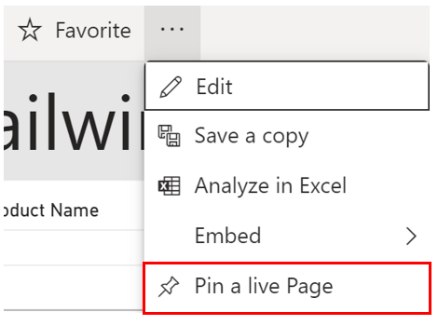
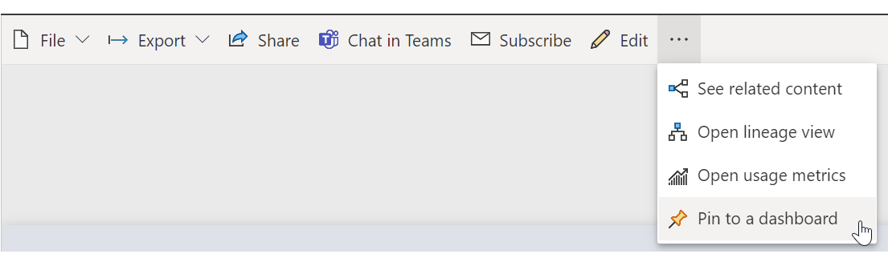
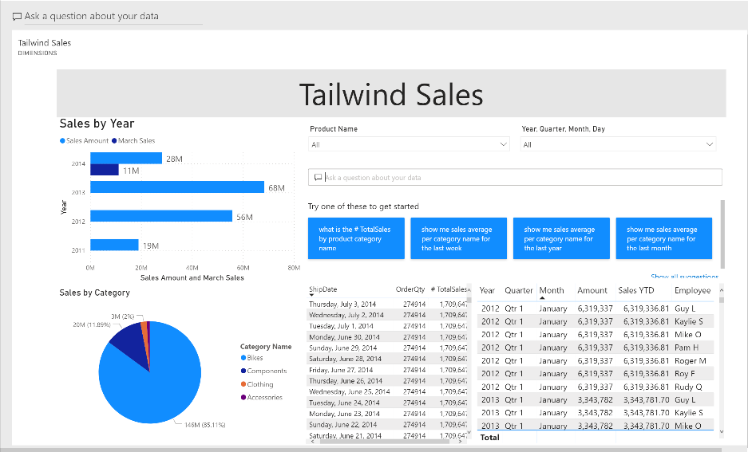

The process of building reports and dashboards is iterative. As data is constantly refreshed and business requirements change, it is expected that your reports and dashboards might also change; both in what filters or slicers you might have and also in what report elements, charts, and cards you have. For this reason, it is crucial that Power BI supports this iterative process. Through Power BI's innate functionality to pin live report pages to a dashboard, you can ensure that you aren't using old data and the visuals on your dashboards reflect changes live.

To continue the module scenario, you have built a few reports for Tailwind Toys. Several months go by, and the business requirements in the Sales team change, where they want you to change and add a few more visuals to the reports. When deploying your reports to Power BI service and creating dashboards, you want to ensure that you won't have to keep publishing new reports and dashboards every time a change occurs. You want to make sure that your changes are shown live. By using the pinning live reports to a dashboard feature from Power BI, you can complete this task in an intuitive manner.

## Pin a live page

When you pin a visual, you can add it to a new or an existing dashboard. You can do the same with entire reports; when you pin a report page, all visuals on the report will be pinned to a dashboard and they are also live, meaning that any changes you make on the report will be immediately reflected on the dashboard that you have pinned the report to.

Pinning a live page is a simple way to pin all visuals at once so that you don't have to do any reformatting on the dashboard. To pin a live page, select the ellipsis (**...**) on the navigation bar of the report and then select **Pin a live Page**.

> [!div class="mx-imgBorder"]
> 

After you have made the selection, you can choose whether you want to pin this report to a new dashboard or an existing one. For this scenario, you want to pin your report to a new dashboard called **Sales Figures**.

> [!div class="mx-imgBorder"]
> 

After selecting **Pin live**, you will be redirected to a new window where you can see your dashboard. On the dashboard, you can modify the visuals as needed. Note that all your slicers and filters still work and that the visuals have the same data as in the report.

> [!div class="mx-imgBorder"]
> 

Any changes that you make to the tickets report will automatically show on the dashboard when the page is refreshed. In Power BI Desktop, you can make changes to your visuals or data as needed and then deploy to the appropriate workspace file, which will update the report and simultaneously update the dashboard as well.

You have now learned how to pin visuals as individual tiles and as entire live report pages. A word of caution: Dashboards are intended to be a collection from various sources, not just as a "launching pad" for reports. We recommend that you pin at the tile level first and foremost, and if needed, the entire report page can also be pinned. Seeing an entire report page in a dashboard tile can be difficult.

For more information, see [Pin an entire report page](https://docs.microsoft.com/power-bi/create-reports/service-dashboard-pin-live-tile-from-report/?azure-portal=true).

