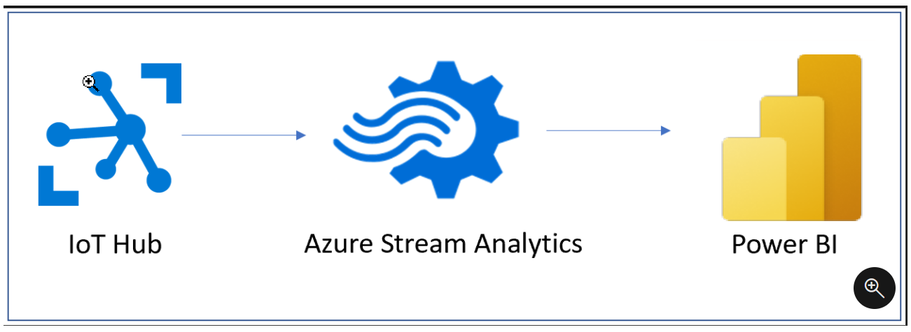
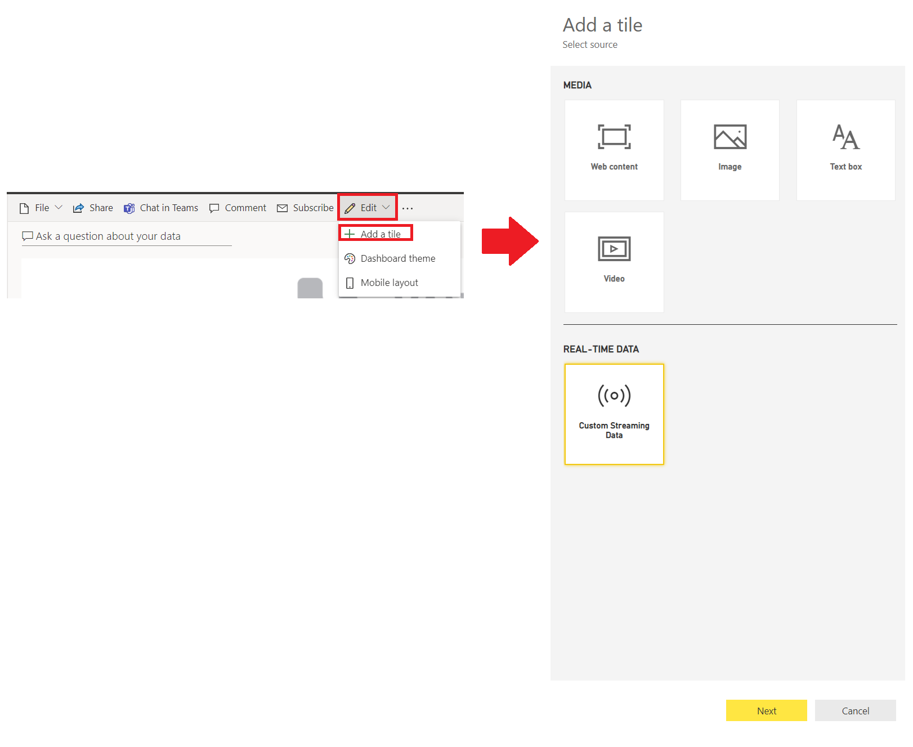
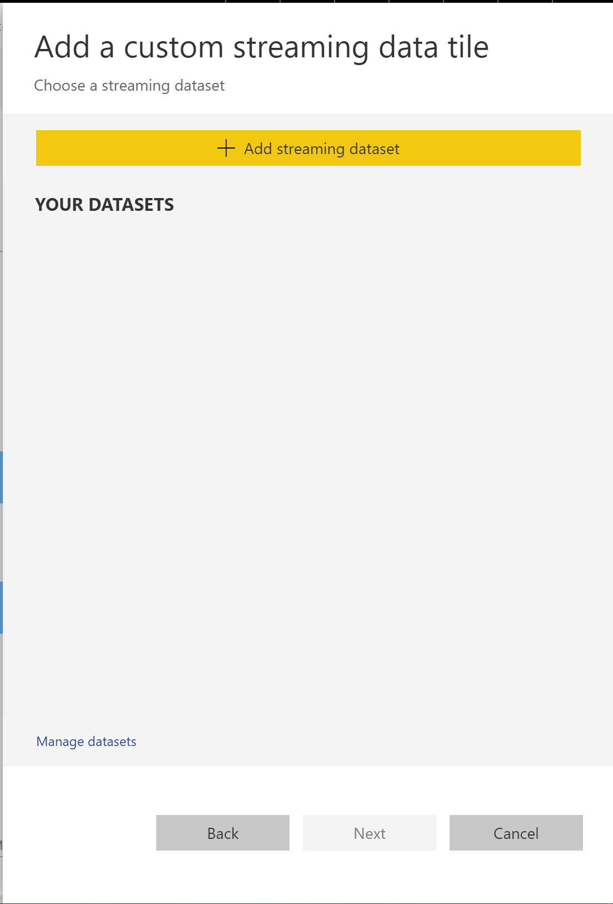

In this data-centric world, it has become increasingly important to have the ability to view how data changes in real time. This ability is particularly important in the context of dashboards; these are the canvases on which you can tell the story of the data, so the ability to show real-time, streaming data on these dashboards can be important to your business. With Power BI's real-time streaming capabilities, you can stream data and update dashboards as soon as the data is logged.

To continue with the module scenario, you are helping Tailwind Traders understand how well their manufacturing floor is operating. The assembly line has machines that are broadcasting a telemetry event each time that they perform their functions. You are collecting those event messages and want to display them with a Power BI visual. Dashboards allow you to use streaming datasets for this purpose.

## Stream in Power BI 

Streaming data can come from a variety of sources, including from social media, factory sensors, service-usage metrics, and other sources that contain a constant stream of data points.

For instance, in the case with Tailwind Traders, sensors on the machines constantly send a stream of telemetry data to the IoT hub, where they will be housed in their native, messy format. From the IoT hub, you can use a stream insight job to aggregate the data, meaning that it will clean the data and quiet the noisy messages. Then, you can retrieve the data into Power BI as a streaming dataset, where you can consume the information and build the pertinent visuals.

> [!div class="mx-imgBorder"]
> 

Data that comes from a streaming dataset is not stored in a Power BI data model; instead, it is stored in a temporary cache. Consequently, you cannot model the data with this type of dataset. The only way to visualize the data from a streaming data source is to create a tile directly on a dashboard and use a custom streaming data source. These tiles are optimized for displaying the data quickly and, because no database exists to pull the data from, these types of tiles have low latency and are best suited for data that doesn't need additional transformations, such as temperature or humidity.

## Visualize real-time data in Power BI 

To visualize streaming data, you need to create a new tile directly on an existing or new dashboard.

To complete this task, go to and open a dashboard and then select **Add Tile**. The following window will appear, where you can select **Custom Streaming Datasets** under **Real-Time Data**.

> [!div class="mx-imgBorder"]
> 

Select **Next**, which will redirect you to the following window where you can choose an existing streaming dataset, or get new streaming datasets, as shown in the following image.

> [!div class="mx-imgBorder"]
> 

After you have selected the new dataset, select **Next**, enter the details for your streaming dataset, and then add a new streaming dataset tile. Streaming dataset tiles can be in the form of line charts, stacked bar charts, cards, and gauges and are formatted similarly to any other kind of tile.

For more information, see [Real-time streaming in Power BI](https://docs.microsoft.com/power-bi/connect-data/service-real-time-streaming/?azure-portal=true).
