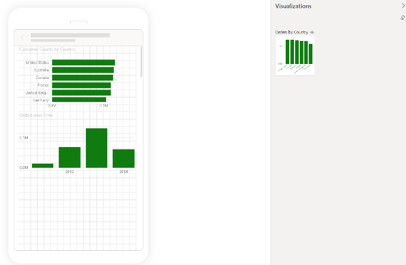
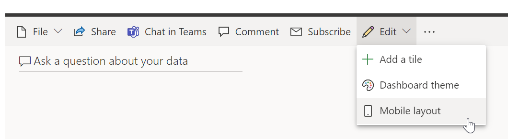
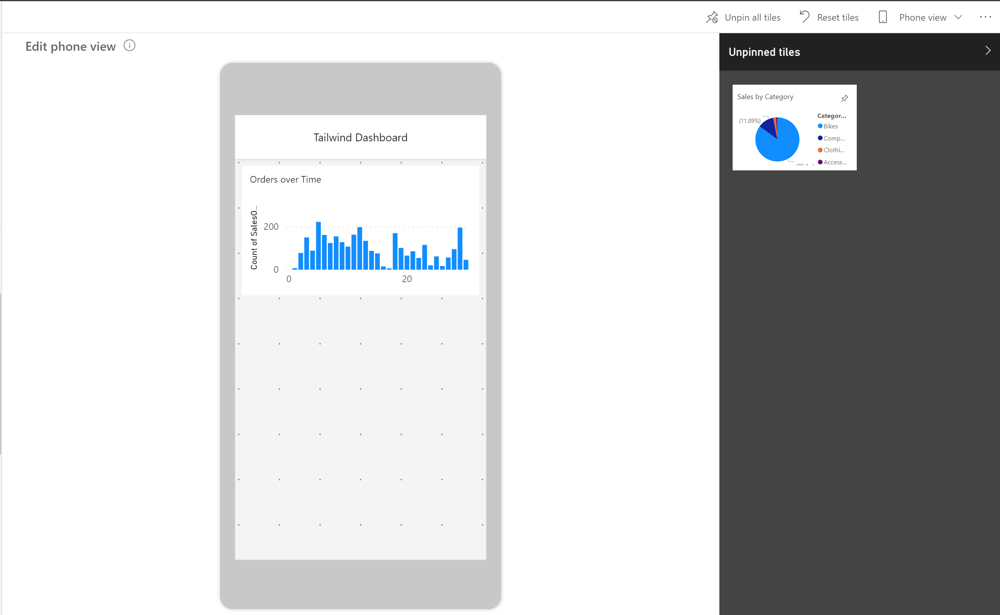

Power BI reports are built in Power BI Desktop and then deployed to Power BI service, where they can be viewed and shared. However, if you are building dashboards for the Sales team at your organization and you receive a requirement that the dashboards should also be viewable on mobile devices, Power BI will help you to set dashboards to mobile view.

To navigate to mobile view in Power BI Desktop, select **View** on the ribbon and then select **Mobile Layout**, which will redirect you to the mobile view, as shown in the following figure.

> [!div class="mx-imgBorder"]
> 

In the mobile view in Power BI Desktop, you are able to accomplish several tasks. This view emulates the view of a user who is looking at visuals on their phone, so you can add visuals to this view, resize them, and change the formatting on them, as shown in the ensuing screenshot. In the June 2020 release of Power BI Desktop, a new grid has been added to this view so that you can orient your visuals with more ease and overlay visuals on top of each other. This feature can be useful if you want to insert a visual on top of an image.

After you have published to Power BI service, you can view your visuals on a mobile device.

Alternatively, you can also optimize your dashboards for mobile view in Power BI service. To see a dashboard in mobile view, select the ellipsis (**...**) on the home ribbon and select **Mobile view**, as shown in the following Sales dashboard.

> [!div class="mx-imgBorder"]
> 

This selection will take you to the following view, where you can choose which tiles that you want to see on the phone view.

> [!div class="mx-imgBorder"]
> 

You can also resize and reorient the tiles and visuals in whichever order you want. This phone view is customizable for each person who uses the dashboard; selecting **Phone view** will allow you to create a new view that you can see on your phone when signing in to Power BI service.

For more information, see [Optimize a dashboard for mobile phones](https://docs.microsoft.com/power-bi/create-reports/service-create-dashboard-mobile-phone-view/?azure-portal=true).
