The development process is an iterative one; it typically requires building out an initial solution, testing the solution in a different environment, going back and making revisions as needed, and eventually releasing a final product. This process is known as a development life cycle. There are many ways this process can take place and in different environments.

Tailwind's Sales team is impressed with the reports you have delivered, and as they continue to leverage the abilities of Power BI, they also want to maintain data and report integrity without slowing development timelines. They want you to create a development pipeline that will be utilized by all teams to develop reports and dashboards. How can you do this in Power BI? Power BI's deployment pipelines will help you accelerate development and minimize errors.

## Deployment pipeline (Premium)

Power BI's deployment pipeline is a feature that manages content in dashboards, reports, and datasets between different environments in the development lifecycle. Here, you can develop and test Power BI content in one centralized location and streamline the process before deploying the final content to your end users. This is a Power BI Premium feature and requires you to be a Capacity admin. There are several advantages to using the deployment pipeline:

-   Increased productivity: Through this feature, you can reuse previous deployment pipelines ensuring that efforts aren't duplicated.

-   Faster delivery of content: report development becomes more streamlined, meaning that it takes less time to get to production.

-   Lower human intervention required and less chance of error: By having the ability to reuse deployment pipelines, there is a lower chance of error associated with moving content from one environment to another.

## Development environments 

Before we begin discussing development pipelines, let's first discuss the different stages in which development and collaboration typically takes place in. Reports and dashboards are built in and iterated upon in a series of controlled stages, or **environments**, where several tasks take place.

-   **Development**: The location in which dashboard developers or data modelers can build out new content with other developers. This is the first stage of the deployment pipeline.

-   **Test**: Where a small group of users and user acceptance testers can see and review new reports, provide feedback, and test the reports with larger datasets for bugs and data inconsistencies before it goes into production.

-   **Production**: Where a wider user audience can use tested reports that are reliable and accurate. This is the final stage of the deployment pipeline.

As a side note, you can choose which one of these development environments you would like to include in your deployment pipeline, according to your business needs. For example, you can choose to only include the Test and Production environments if need be.

With that, let's take a closer look at configuring deployment pipelines in Power BI!

## Configuration of deployment pipelines

Let's say you want to create a deployment pipeline at Tailwind. To configure a deployment pipeline, navigate to Power BI service. Then, on the ribbon at the left-hand side of the page, select **Deployment pipelines,** as seen below.

> [!div class="mx-imgBorder"]
> [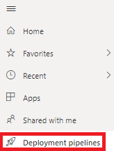](../media/04-deployment-full-8-ss.png#lightbox)

On the resulting page, select **Create a pipeline.** We want to create a deployment pipeline called **SalesPipeline.** Here, add in the **Pipeline name** of **SalesPipeline** and a description, if needed. Once you are ready select **Create.** This will take you to the following screen:

> [!div class="mx-imgBorder"]
> [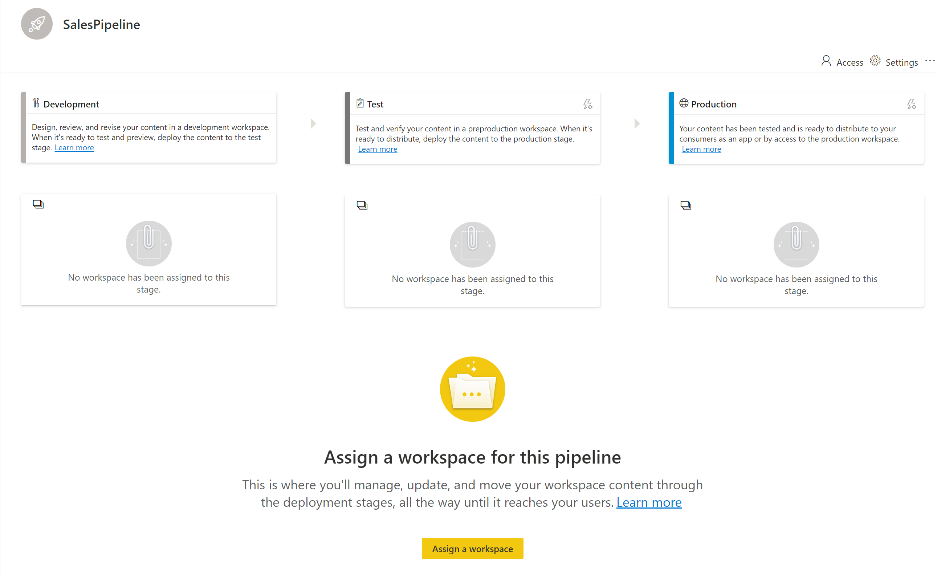](../media/04-deployment-pipeline-page-2-ss.png#lightbox)

This view shows you the steps of the development life cycle: **Development, Test,** and **Production.** To create our pipeline, we need to assign workspaces to each of these stages to facilitate where our reports and dashboards will be housed during each stage. Select **Assign a workspace** to begin.

When we do this, we are taken to the following window, where we can add a workspace, **Tailwind Traders**, to a specific environment, **Development**.

> [!div class="mx-imgBorder"]
> [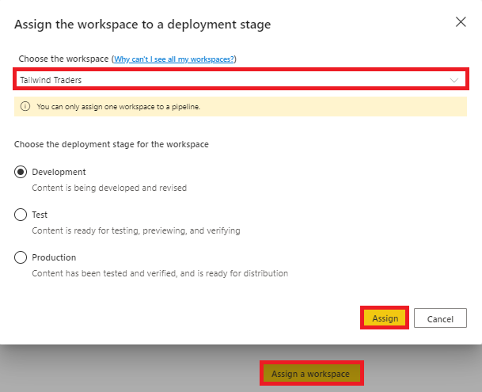](../media/04-report-performance-metrics-4-ss.png#lightbox)

It is important to note that only workspaces assigned to a Premium capacity will appear. Additionally, you can only assign a single workspace to each pipeline. Power BI will auto generate the other two workspaces used in the pipeline. If you already have a Dev/Test/Prod workspace, you will have to pick one to work with. Then, select **Assign.** If this step is successful, you should see the resulting view:

> [!div class="mx-imgBorder"]
> [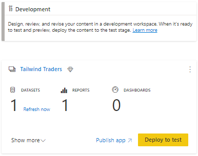](../media/04-deployment-settings-5-ssm.png#lightbox)

Here, I can see how many datasets, reports, and dashboards I have in the current environment, **Development.** At every stage, you have the option to publish the associated workspace as an app by selecting **Publish app.** To view all objects that constitute the workspace press **Show more,** as seen in the following.

## Testing stage

Upon collaborating with my teams and building out a testing-ready report, we are ready to move on to the testing phase and can select **Deploy to test.** A new workspace is created, which by default has the same name as the initial workspace but suffixed with **\[Test\].** You can change this by entering the workspace's settings within the deployment pipeline interface.

Testing should emulate conditions that objects will experience once they are deployed for end users. Therefore, Power BI allows you to change the source of data used during testing. To do this, you will first need to enter the environment's **deployment settings** by selecting the lightning icon as seen below.

> [!div class="mx-imgBorder"]
> [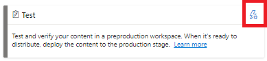](../media/04-deployment-pipeline-1-ssm.png#lightbox)

In the resulting **Settings** window, choose the correct dataset. In our case, we want our **OrdersFigures** dataset to be used for testing, as seen below, but with a different data source. We can do this by creating parameters in Power Query Parameters, which will be discussed in a later module, or by adding a new rule, as we will do here. Under **Data source rules**, select **+ Add rule.**

> [!div class="mx-imgBorder"]
> [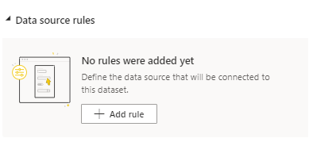](../media/04-change-source-8-ss.png#lightbox)

Here, you can change the data source, which was used in development, to a new source, which is used for testing the reports (**orders.csv** in our example below). Press **Save** at the bottom of the card once you are ready.

> [!div class="mx-imgBorder"]
> [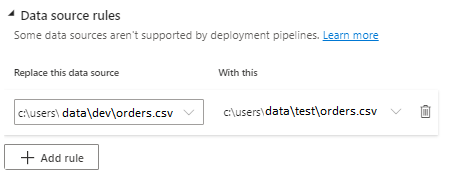](../media/04-add-workspace-3-ssm.png#lightbox)

## Production stage

We are close to completing the pipeline, transitioning from development to testing, and finally to production. We need to create a data source rule for the **OrdersFigures** dataset in the workspace to ensure that we are using production data. In this instance, we are changing our source from the test to the prod folder version of the orders.csv file, as shown below.

> [!div class="mx-imgBorder"]
> [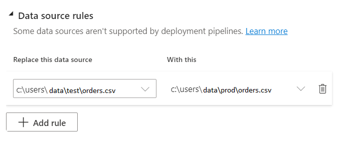](../media/04-change-source-7-ss.png#lightbox)

After performing a dataset refresh, our production workspace is ready. We can package the workspace as an app, which is available for our end users. Currently, our deployment pipeline is as follows:

> [!div class="mx-imgBorder"]
> [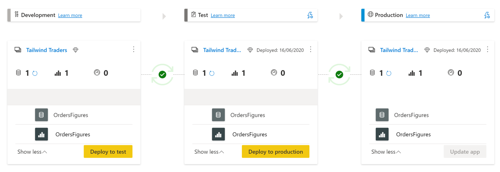](../media/04-deployment-compare-9-ssm.png#lightbox)

With that, we have successfully created a deployment pipeline from the development to the testing phase. Congrats! Let's take a quick look at some additional operations you can conduct in the development pipeline.

## Additional operations in the development pipeline

You have created a deployment pipeline and have begun collaborating with other report developers. You get a notification that one of the other developers has modified a report. You want to be able to see the changes that were done to this report. You can do this by utilizing the **Compare** button, as seen below.

> [!div class="mx-imgBorder"]
> [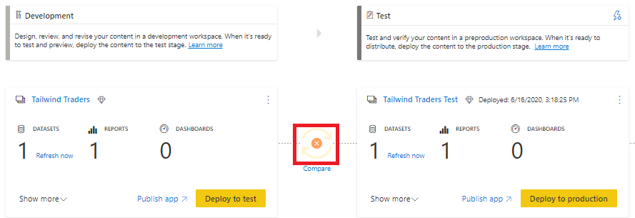](../media/04-deployment-compare-11-ssm.png#lightbox)

If you select **Compare,** this reveals that the **OrdersFigures** report differs between the Development and Test environments.

> [!div class="mx-imgBorder"]
> [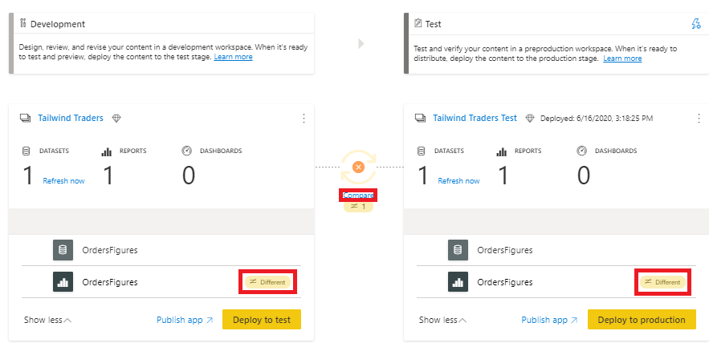](../media/04-data-source-rules-6-ssm.png#lightbox)

The difference is typically registered as added or removed objects. If you decide that the changes shouldn't be deployed to the next phase, you can choose to "ignore" changes. For instance, the other developer has added a report called **AdditionalOrderInfo** in the Development environment, but I do not want to deploy these changes. By selecting a specific report and selecting **Deploy to test**, I can effectively choose which reports I want to move from environment to environment, as seen below.

> [!div class="mx-imgBorder"]
> 

As the message below indicates, only one change will be carried over.

> [!div class="mx-imgBorder"]
> [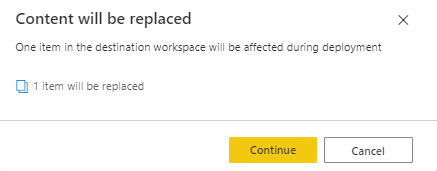](../media/04-dev-life-cycle-3-ssm.png#lightbox)

Exercise caution with this tool. Reports are dependent on their datasets, and if a dataset has changed but you do not deploy it with an associated report, the report will not behave correctly.

With that, we recommend using deployment pipelines in Power BI Service. Not only does this tool ensure that the development life cycle is streamlined, but it also ensures that you can create one centralized location to collaborate, keep track of, and deploy your reports.

If you would like to learn more about implementing pipelines, please refer to [Deployment Pipelines Best Practices](https://docs.microsoft.com/power-bi/create-reports/deployment-pipelines-best-practices/?azure-portal=true).
