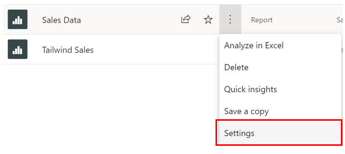
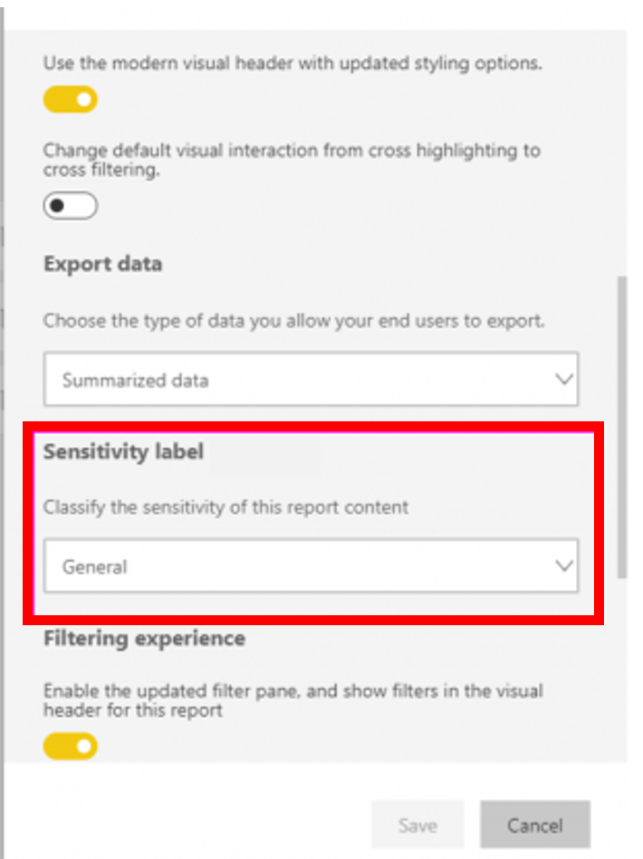
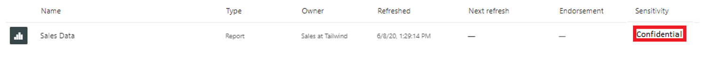
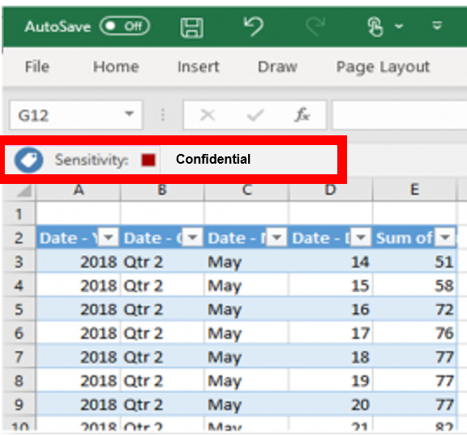

As enterprises grow, so do their data. There are often strict requirements and regulations that must be applied to ensure that this sensitive data is secure. There are a few ways you can do this in Power BI:

-   Use Microsoft sensitivity labels to label dashboards, reports, datasets, and dataflows using the same taxonomy used to classify and protect files in Office 365.

-   Add additional protection measures such as encryption and watermarks when exporting the data.

-   Use Microsoft Cloud App Security to monitor and investigate activities in Power BI.

As more and more reports and dashboards are being added to the Tailwind workspace, concern grows as the Sales team realizes the urgency of securing its data. There's a worry about the possibility of new users exporting data without permission. Sales doesn't want to roll back any reports or dashboards, and have come to you to implement comprehensive security measures that protect data access within and outside of Power BI. This can be done by configuring data protection labels in Power BI. Before we begin, ensure that you have the appropriate licensing, as seen [here](https://docs.microsoft.com/power-bi/admin/service-security-data-protection-overview/?azure-portal=true).

## Sensitivity Labels

Sensitivity labels specify which data can be exported. These labels are configured externally to Power BI, and Power BI allows you to quickly and easily use them in your reports and dashboards. These labels allow you to define and protect content, even outside of Power BI. Datasets, dataflows, reports, and dashboards can all leverage this mechanism. This feature is available to all users in your corporation can use this feature unless exceptions are defined.

Once you have verified your ability to add labels, navigate to any workspace, and choose an object to secure. In this case, I want to add a sensitivity label to **Sales Data.** To do this, navigate to the workspace, and under the ellipsis, select **Settings**.

> [!div class="mx-imgBorder"]
> 

This will take you to a window, where you can assign a sensitivity label to your data. In our case, we have externally configured the following labels, and can now apply them to the data: **None, Personal, General**, **Confidential,** and **Highly confidential.** You can also go to [Microsoft 365 Security Center](https://security.microsoft.com/homepage/?azure-portal=true) and define your own labels there.

> [!div class="mx-imgBorder"]
> 

Let's say I want to assign a **Confidential** label to our **Sales Data** report. When I change this label on the **Settings** pane, it now appears as a label on the report, as seen below.

> [!div class="mx-imgBorder"]
> 

This is crucial when exporting data. Data exported to Excel, PowerPoint, and PDF files will have sensitivity labels enforced. Suppose you wanted to export some data from **Sales Data** into an Excel file. If you are an authorized user, you will see the following Excel view when you export into Excel:

> [!div class="mx-imgBorder"]
> 

However, if you did not have permission you would be denied access to see the data, which ensures that only the appropriate users have access to view the data, making sure your data is secured.

If you are interested in learning more, please refer to [Apply Data Sensitivity Labels in Power BI](https://docs.microsoft.com/power-bi/collaborate-share/service-security-apply-data-sensitivity-labels).

