In this lab, you will explore the three core methods for sharing Power BI content.

In this exercise, you learn how to:

-   Map security principals to dataset roles.

-   Share a dashboard.

-   Publish an app.

## Configure dataset security

In this exercise, you will assign your classroom partner's account to the **Salespeople** role of your dataset.

> [!NOTE]
> The following exercise will require you to sign in to Power BI service. Use your existing account or create a trial account before starting this part of the lab.

### Configure dataset security

In this task, you will use an existing account in the **Salespeople** role of your dataset.

1.  In Microsoft Edge, in the Power BI service, in the Navigation pane, hover the cursor over the **Sales Analysis** dataset, select the vertical ellipsis (**...**), and then select **Security**.

	> [!div class="mx-imgBorder"]
	> [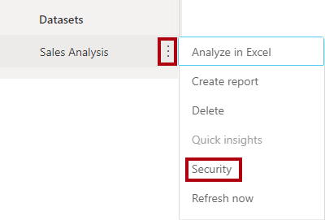](../media/lab-1-ssm.png#lightbox)

1.  On the **Row-Level Security** page, at the left, notice that the **Salespeople** role is selected.

1.  In the **Members** box, enter the account name of your classroom partner. When the name is listed, select it.

	Adding individual accounts is time-consuming and requires considerable maintenance. Consider that the Adventure Works company would likely have a security group that contains all sales people's accounts. This security group would be the only security principal that is mapped to the role.

1.  Select **Add**.

	> [!div class="mx-imgBorder"]
	> [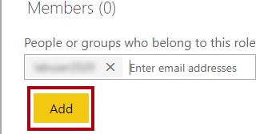](../media/lab-2-ssm.png#lightbox)

1.  At the bottom of the page, select **Save**.

	> [!div class="mx-imgBorder"]
	> 

The account of your classroom partner is now mapped to the **Salespeople** role. Recall that their account is for the salesperson named Pamela Ansam-Wolfe, whose sales performance is measured by the sales of two sales territory regions: US Northwest and US Southwest.

## Share a dashboard

In this exercise, you will share your **Sales Monitoring** dashboard with your classroom partner (and they will share theirs with you).

### Share a dashboard

In this task, you and your classroom partner will each share a dashboard. Then you will open the dashboard that is shared with you.

Work through all task steps together with your classroom partner, on each of your computers.

1.  Open the **Sales Monitoring** dashboard.

1.  On the menu bar, select **Share**.

	> [!div class="mx-imgBorder"]
	> [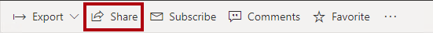](../media/lab-4-ssm.png#lightbox)

1.  In the Share Dashboard pane (located at the right), in the **Grant Access To** box, enter the account name of your classroom partner. When the name is listed, select it.

1.  Review the available options, but do not change them.

1. At the bottom of the pane, select **Share**.

	> [!div class="mx-imgBorder"]
	> 

### Open the shared dashboard

In this task, you and your classroom partner will each open the dashboard that has been shared with you.

1. In the **Navigation** pane, select **Shared with me**.

	> [!div class="mx-imgBorder"]
	> [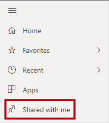](../media/lab-6-ssm.png#lightbox)

1. Notice that the **Sales Monitoring** dashboard is listed.

	> [!div class="mx-imgBorder"]
	> [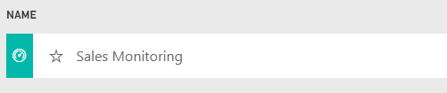](../media/lab-7-ss.png#lightbox)

1. To open the dashboard, select the **Sales Monitoring** dashboard.

1. Notice that the dashboard **Sales YTD** tile value is **$13M**.

	> [!div class="mx-imgBorder"]
	> [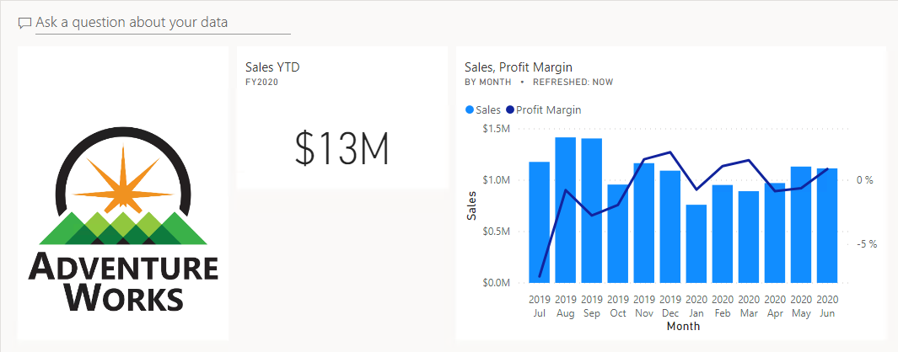](../media/lab-8-ss.png#lightbox)

The **Sales YTD** tile displays a value for US Northwest and US Southwest regions only.

Sharing dashboards (and reports) is achieved and managed by the content owner. Power BI provides a read-only experience to recipients. If the owner enables resharing, recipients can share the content with others.

This approach should be reserved for ad hoc sharing requirements. If you need to share many Power BI items, then publishing an app is a better option. You'll publish your **Sales Analysis** workspace as an app in the next exercise.

## Publish an app

In this exercise, you will publish the contents of your **Sales Analysis** workspace, and then "get" the app published by your classroom partner.

### Publish an app

In this task, you will publish the contents of your **Sales Analysis** workspace, and then "get" the app that is published by your classroom partner.

1. In the Navigation pane, open your **Sales Analysis** workspace.

1. In the Navigation pane, select the name of the workspace.

	> [!div class="mx-imgBorder"]
	> [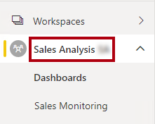](../media/lab-9-ssm.png#lightbox)

1. In the upper-right corner, select **Publish app**.

	> [!div class="mx-imgBorder"]
	> [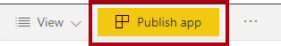](../media/lab-10-ssm.png#lightbox)

1. Notice that the publish app process requires configuration in three tabs: **Setup**, **Navigation**, and **Permissions**.

	> [!div class="mx-imgBorder"]
	> [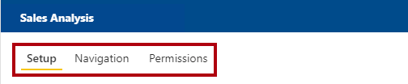](../media/lab-11-ssm.png#lightbox)

1. In the **Description** box, enter **Sales analysis and exploration**.

	> [!div class="mx-imgBorder"]
	> [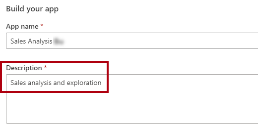](../media/lab-12-ssm.png#lightbox)

1. For the **App Logo**, select **Upload**.

	> [!div class="mx-imgBorder"]
	> [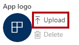](../media/lab-13-ssm.png#lightbox)

1. In the **Open** window, go to the **D:\DA100\Lab12A\Assets\Icons** folder.

1. Select one of the JPG files, and then select **Open**.

1. For the **App Theme Color**, select any color.

1. Select the **Navigation** tab.

	> [!div class="mx-imgBorder"]
	> [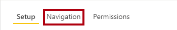](../media/lab-14-ssm.png#lightbox)

1. In the **Navigation** section, notice the workspace content that will be published.

	It is possible to set the order of the workspace content and also add sections and links. Sections are single-level groupings of content (similar to a folder). Links are links to any valid webpage. You won't modify the navigation setup in this lab.

1. Select the **Permissions** tab.

	> [!div class="mx-imgBorder"]
	> [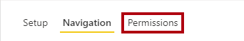](../media/lab-15-ssm.png#lightbox)

1. In the **Specific Individuals or Groups** box, enter the account name of your classroom partner. When the name is listed, select it.

	The **Entire Organization** option can be disabled if the tenant admin has restricted it. In this case, the **Install this App Automatically** option will also be disabled. If the option is enabled, the app could be pushed to all users. You will learn how to "get" the app in the next task.

1. In the lower-right corner of the page, select **Publish app**.

	> [!div class="mx-imgBorder"]
	> 

1. When prompted to publish the app, select **Publish**.

	> [!div class="mx-imgBorder"]
	> 

1. When notified that the app was successfully published, select **Close**.

	> [!div class="mx-imgBorder"]
	> [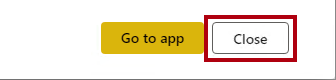](../media/lab-18-ssm.png#lightbox)

### Get the app

In this task, you will "get" the app and explore the its contents.

1. In the Navigation pane, select **Apps**.

	> [!div class="mx-imgBorder"]
	> [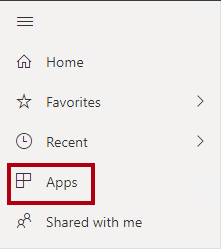](../media/lab-19-ssm.png#lightbox)

1. In the middle of page, select **Get apps**.

	> [!div class="mx-imgBorder"]
	> [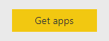](../media/lab-20-ss.png#lightbox)

1. In the AppSource window, for the **Sales Analysis** app that was published by your classroom partner, select the **Get it now** link.

	> [!div class="mx-imgBorder"]
	> [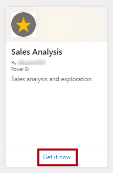](../media/lab-21-ssm.png#lightbox)

1. When the app is added, to open the app, select the app tile.

	> [!div class="mx-imgBorder"]
	> [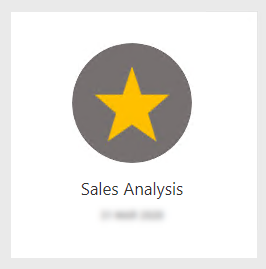](../media/lab-22-ss.png#lightbox)

1. When the app opens, review the Navigation pane (located at the left).

1. Notice that the first item in the Navigation pane has opened.

1. In the Navigation pane, expand **Sales Report** and then select the **Overview** page.

	> [!div class="mx-imgBorder"]
	> [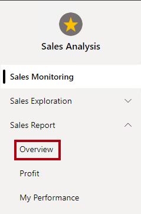](../media/lab-23-ssm.png#lightbox)

1. Notice that the **Region** slicer only displays two regions: the regions that were assigned to Pamela Ansam-Wolfe.

	> [!div class="mx-imgBorder"]
	> [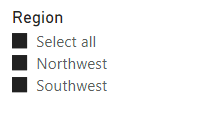](../media/lab-24-ss.png#lightbox)

1. Select the **My Performance** page.

1. Notice that the page displays the sales and targets for Pamela Ansam-Wolfe.

1. Open the **Sales Exploration** report, and then interact with the visuals on each page.

