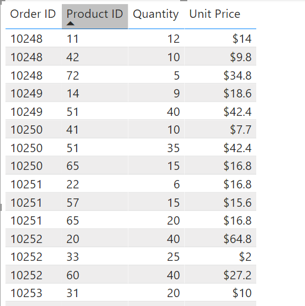
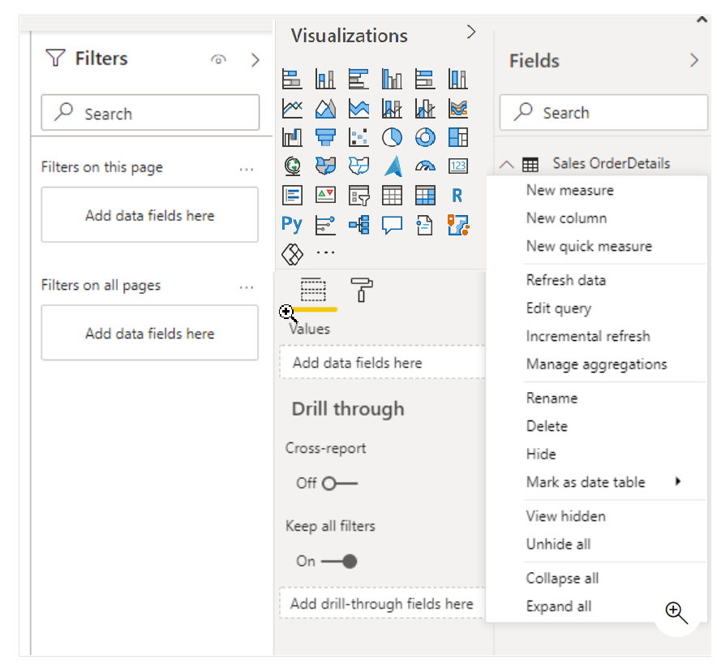
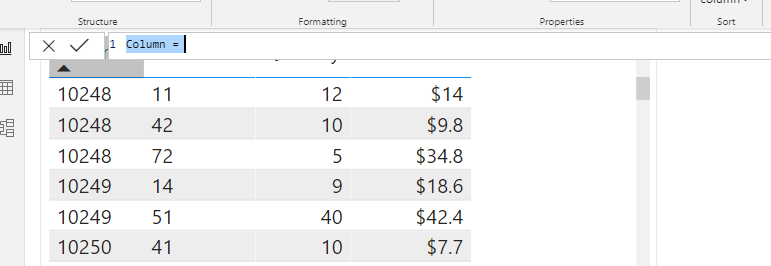
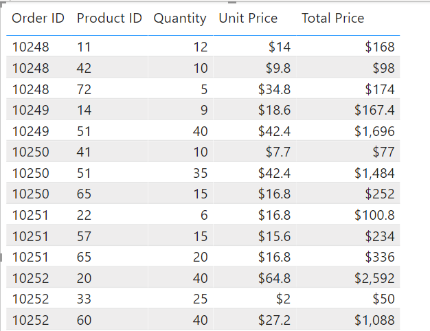
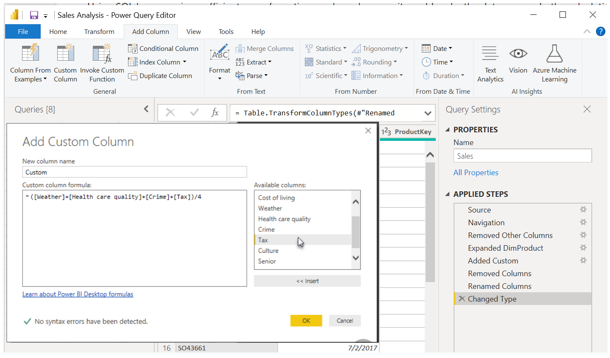
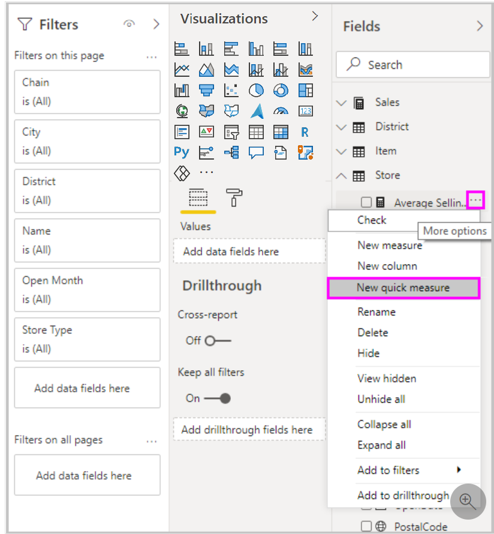
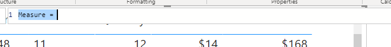
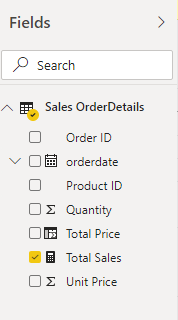

Data Analysis Expressions (DAX) is a programming language that is used throughout Microsoft Power BI for creating calculated columns, measures, and custom tables. It is a collection of functions, operators, and constants that can be used in a formula, or expression, to calculate and return one or more values. You can use DAX to solve a number of calculations and data analysis problems, which can help you create new information from data that is already in your model.

In Power BI, you can use different calculation techniques and functions to create measures or calculated columns. Primarily, you will be able to achieve the same result by using these techniques; however, the key is to know how and when to apply them. By having a basic understanding of when and how to use which technique, you will be able to create robust and high-performance data models.

By the end of this module, you'll be able to: 

-   Build quick measures.

-   Create calculated columns.

-   Use DAX to build measures.

-   Discover how context affects DAX measures.

-   Use the CALCULATE function to manipulate filters.

-   Implement time intelligence by using DAX.

-   Create key performance indicators (KPIs).

## Use calculated columns

DAX allows you to augment the data that you bring in from different data sources by creating a calculated column that didn't originally exist in the data source. This feature should be used sparingly, which will be explained later in this module.

For example, assume that you are importing data from a database that contains sales transactions. Each individual sales transaction has the following columns: **Order ID**, **Product ID**, **Quantity**, and **Unit Price**. Notice that a column doesn't exist for the total sales amount for each order.

> [!NOTE]
> This module is not about data visualization, but it does show data visualization to demonstrate how DAX works. For more information, see the learning path, **Visualize data in Power BI**.  

The following figure shows how the initial shape of the data appears in a Power BI table visual.

> [!div class="mx-imgBorder"]
> [](../media/02-table-visual-ss.png#lightbox)

You can start using DAX by creating a calculated column that multiplies the unit price with the quantity. The calculated column will create a value for each row called Total Price. Create the new column by selecting the ellipsis (**...**) button on the table in the **Fields** list and then selecting **New column**.

> [!div class="mx-imgBorder"]
> [](../media/02-new-column-ss.png#lightbox)

A new DAX formula appears in the formula bar underneath the ribbon at the top.

> [!div class="mx-imgBorder"]
> [](../media/02-new-dax-column-ss.png#lightbox)

You can replace the "Column =" default text with the following example text:

```Total Price = 'Sales OrderDetails'[Quantity] * 'Sales OrderDetails'[Unit Price]```

The value on the left side of the equal sign is the column name. The text on the right side of the equal sign is the DAX expression. This simple DAX expression takes the quantity value and multiplies it with the unit price value for each individual row. It will produce one value for each record in the table. If you drag the new column from the **Fields** list to the visual, you will see the new values.

> [!div class="mx-imgBorder"]
> [](../media/02-new-total-price-ss.png#lightbox)

The previous screenshot shows that DAX is calculating correctly and displaying the results that you wanted.

Calculated columns are materialized in the .pbix Power BI file extension, meaning that each time you add a calculated column, you are increasing the size of the overall file. Having too many calculated columns will slow performance and will cause you to reach the maximum Power BI data size sooner.

## Create a custom column

Three ways to create a custom column in Power BI are:

-   Create the column in the source query when you get the data, for instance, by adding the calculation to a view in a relational database.

-   Create the custom column in Power Query.

-   Create a calculated column by using DAX in Power BI.

You can create a calculated column when you pull the data from the data source. Each data source would have a different technique for completing this action. For instance, if you were pulling data from a relational data source by using a view that was written in the SQL language, it would look like the following example:

```
CREATE VIEW OrdersWithTotalPrice
AS
SELECT unitprice, qty, unitprice * qty as TotalPrice 
FROM sales.salesorders
```

Using SQL language is an efficient way of creating a column because it would make the data source do the calculations for you. In Power BI, the calculated column would appear like any other column.

You can also use Power Query to create a calculated column.

> [!div class="mx-imgBorder"]
> [](../media/02-custom-column-ss.png#lightbox)

The custom column dialog uses the M language to create the new column. M language is out of scope for the purposes of this module.

The third way to create a calculated column is by using DAX in Power BI, as previously demonstrated.

When you create a calculated column by using DAX, you do not need to refresh the dataset to see the new column. In the other methods, you would need a refresh to see changes. This process can be lengthy if you are working with a lot of data. However, this issue is irrelevant because, after columns have been created, they are rarely changed.

The DAX calculated column does not compress as well as the other methods. The other column types do get compressed, which makes the .pbix file smaller and the performance usually faster.

Generally, the earlier you can create a column, the better. It is not considered an optimum practice to use DAX for calculations if you can use a different mechanism.

In addition, one way to avoid using a calculated column is to use one of the X functions, such as SUMX, COUNTX, MINX, and so on. The X functions are beyond the scope of this module; however, they allow you to create measures that are aware of the data in individual rows and calculate totals based on the totals in the row. These functions are called iterator functions because, though they are used in measures, they iterate over the individual rows to do their calculations. An X function will perform better and use less disk space than a calculated column. For more information about X functions, see the [Microsoft documentation](https://docs.microsoft.com/dax/sumx-function-dax/?azure-portal=true). 

## Use measures

Calculated columns are useful, but you are required to operate row by row. However, other situations might require a simpler method. For example, consider a situation where you want an aggregation that operates over the entire dataset and you want the total sales of all rows. Furthermore, you want to slice and dice that data by other criteria like total sales by year, by employee, or by product.

To accomplish those tasks, you would use a measure. You can build a measure without writing DAX code; Power BI will write it for you when you create a quick measure.

Many available categories of calculations and ways to modify each calculation exist to fit your needs. Another advantage is that you can see the DAX that's implemented by the quick measure while jumpstarting or expanding your own DAX knowledge.

## Create a quick measure

To create a quick measure in Power BI Desktop, right-click or select the ellipsis (**...**) button next to any item in the **Fields** pane and then select **New quick measure** from the menu that appears. The **Quick measures** screen will appear.

> [!div class="mx-imgBorder"]
> [](../media/02-quick-measure-ssm.png#lightbox)

In the **Quick measures** window, you can select the calculation that you want and the fields to run the calculation against. For instance, you can select a calculation and the column that you want to operate over. Power BI creates the DAX measure for you and displays the DAX. This approach can be a helpful way to learn the DAX syntax.

For more information, see the [Use quick measures for common calculations](https://docs.microsoft.com/power-bi/desktop-quick-measures/?azure-portal=true) documentation.

## Create a measure

Measures are used in some of the most common data analyses.

To continue with the previous scenario, you want to create a measure that totals your new column for the entire dataset. Similar to how you created a calculated column, you can go to the **Fields** list and select **New measure**.

Text will now appear in the formula bar underneath the ribbon.

> [!div class="mx-imgBorder"]
> [](../media/02-new-measure-ss.png#lightbox)

You can replace the "Measure =" text with the following text:

```Total Sales = sum('Sales OrderDetails'[Total Price])```

The new measure will now appear in the **Fields** list.

> [!div class="mx-imgBorder"]
> [](../media/02-new-measure-fields-ss.png#lightbox)

When you drag Total Sales over to the report design surface, you will see the total sales for the entire organization in a column chart.

> [!div class="mx-imgBorder"]
> [](../media/02-total-sales.png#lightbox)

## Differences between a calculated column and a measure

The fundamental difference between a calculated column and a measure is that a calculated column creates a value for each row in a table. For this reason, the calculated column can only operate over columns that exist in the same table. For example, if the table has 1,000 rows, it will have 1,000 values in the calculated column. Calculated column values are stored in the Power BI .pbix file. Each calculated column will increase the space that is used in that file and potentially increase the refresh time.

Measures are calculated on demand. Power BI calculates the correct value when the user requests it. When you previously dragged the Total Sales measure onto the report, Power BI calculated the correct total and displayed the visual. Measures do not add to the overall disk space of the Power BI .pbix file.

Measures are calculated based on the filters that are used by the report user. These filters combine to create the filter context.
