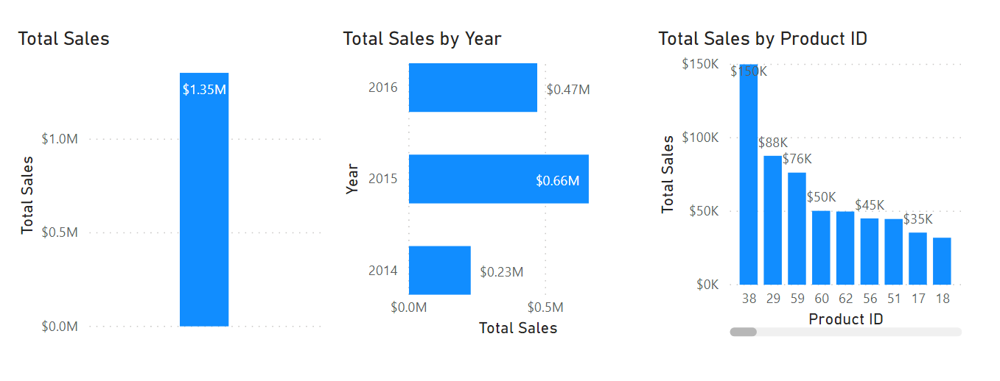
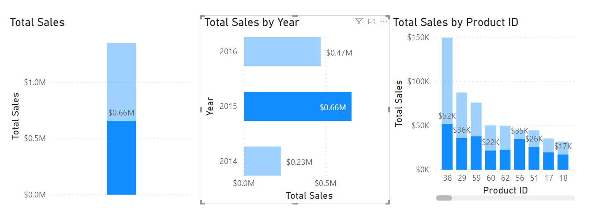

How context affects DAX measures is a difficult concept to comprehend. The ensuing visuals will demonstrate how context affects DAX measures so you can see how they interact together.

The following three visuals use the exact same DAX measure: Total Sales.

> [!div class="mx-imgBorder"]
> [](../media/02-total-sales-visuals-ss.png#lightbox)

Though each visual uses the same DAX measure and, therefore, the same DAX formula, the visuals produce different results. For instance, the first visual shows the Total Sales measure for the entire dataset. In this dataset, Total Sales is USD1.35 million. In the second visual, Total Sales is broken down by year. For instance, in 2014, Total Sales is USD0.23 million. In the third visual, Total Sales is broken down by Product ID.

With Power BI, even though the measure was only defined once, it can be used in these visuals in different ways. Each of the totals is accurate and performs quickly. It is the context of how the DAX measure is used that calculates these totals accurately.

Interactions between visuals will also change how the DAX measure is calculated. For instance, if you select the second visual and then select **2015**, the results appear as shown in the following screenshot.

> [!div class="mx-imgBorder"]
> [](../media/02-filter-context-change-ss.png#lightbox)

Selecting **2015** in the second visual changed the filter context for the DAX measure. It modified the first visual to equal the sales for 2015: USD0.66 million. It also broke down the Total Sales By Product ID, but only shows the results for 2015. Those calculations quickly changed in memory and displayed the results in a highly interactive manner to the user.

The definition of the DAX measure has not changed; it's still the original, as shown in the following example:

```Total Sales = sum('Sales OrderDetails'[Total Price])```

This scenario is a simple way to explain how context works with DAX. Many other factors affect how DAX formulas are evaluated. Slicers, page filters, and more can affect how a DAX formula is calculated and displayed.
