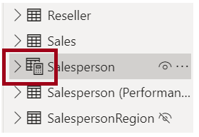
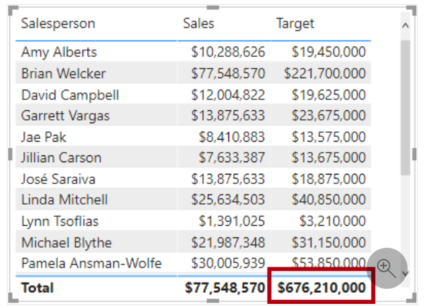

In this lab, you’ll create calculated tables, calculated columns, and simple measures using Data Analysis Expressions (DAX).

In this lab, you learn how to:

* Create calculated tables

* Create calculated columns

* Create measures

## Exercise 1: Create Calculated Tables

In this exercise, you’ll create two calculated tables. The first will be the **Salesperson** table, to allow a direct relationship between it and the **Sales** table. The second will be the **Date** table.

Open the **Sales Analysis.pbix** starter file, which is found in the **D:\DA100\Labs\05-create-dax-calculations-in-power-bi-desktop\Starter** folder.

### Task 1: Create the Salesperson table

In this task, you’ll create the **Salesperson** table (direct relationship to **Sales**).

1. In Power BI Desktop, in Report view, on the **Modeling** ribbon, from inside the **Calculations** group, select **New Table**.

    > [!div class="mx-imgBorder"]
    > [](../media/lab-6-1-ssm.png#lightbox)

1. In the formula bar (which opens directly beneath the ribbon when creating or editing calculations), type **Salesperson =**, press **Shift+Enter**, type **'Salesperson (Performance)'**, and then press **Enter**.

    > [!div class="mx-imgBorder"]
    > [](../media/lab-6-2-ssm.png#lightbox)

<<<<<<< Updated upstream
	For your convenience, all DAX definitions in this lab can be copied from the **D:\DA100\Lab05\Assets\Snippets.txt** file.
=======
    For your convenience, all DAX definitions in this lab can be copied from the **D:\DA100\Lab06A\Assets\Snippets.txt** file.
>>>>>>> Stashed changes

    A calculated table is created by first entering the table name, followed by the equals symbol (=), followed by a DAX formula that returns a table. The table name can’t already exist in the data model.

    The formula bar supports entering a valid DAX formula. It includes features like autocomplete, Intellisense, and color-coding, enabling you to quickly and accurately enter the formula.

    This table definition creates a copy of the **Salesperson (Performance)** table. It copies the data only, however properties like visibility, formatting, etc. aren’t copied.

    > [!TIP]
    > You are encouraged to enter “white space” (i.e. carriage returns and tabs) to layout formulas in an intuitive and easy-to-read format—especially when formulas are long and complex. To enter a carriage return, press **Shift+Enter**. “White space” is optional.

1. In the **Fields** pane, notice that the table icon has a calculator icon as well (denoting a calculated table).

    > [!div class="mx-imgBorder"]
    > [](../media/lab-6-3-ssm.png#lightbox)

    Calculated tables are defined by using a DAX formula that returns a table. It’s important to understand that calculated tables increase the size of the data model because they materialize and store values. They recompute whenever you refresh formula dependencies, as will be the case in this data model when you load new (future) date values into tables.

    Unlike Power Query-sourced tables, calculated tables can’t be used to load data from external data sources. They can only transform data based on what has already been loaded into the data model.

1. Switch to Model view.

1. Notice that the **Salesperson** table is available (take care, it might be hidden from view—scroll horizontally to locate it).

1. Create a relationship from the **Salesperson | EmployeeKey** column to the **Sales | EmployeeKey** column.

1. Right-click the inactive relationship between the **Salesperson (Performance)** and **Sales** tables, and then select **Delete**.

    > [!div class="mx-imgBorder"]
    > [](../media/lab-6-4-ssm.png#lightbox)

1. When prompted to confirm the deletion, select **Delete**.

    > [!div class="mx-imgBorder"]
    > [](../media/lab-6-5-ssm.png#lightbox)

1. In the Salesperson table, multi-select the following columns, and then hide them:

    * EmployeeID

    * EmployeeKey

    * UPN

1. In the diagram, select the **Salesperson** table.

1. In the **Properties** pane, in the **Description** box, enter: **Salesperson related to a sale**

    Recall that descriptions appear as tooltips in the **Fields** pane when the user hovers their cursor over a table or field.

1. For the **Salesperson (Performance)** table, set the description to: **Salesperson related to region(s)**.

    The data model now provides two alternatives when analyzing salespeople. The **Salesperson** table allows you to analyze sales made by a salesperson, while the **Salesperson (Performance)** table allows you to analyze sales made in the sales region(s) assigned to the salesperson.

### Task 2: Create the Date table

In this task, you’ll create the **Date** table.

1. Switch to Data view.

    > [!div class="mx-imgBorder"]
    > [](../media/lab-6-6-ssm.png#lightbox)

1. On the **Home** ribbon tab, from inside the **Calculations** group, select **New Table**.

    > [!div class="mx-imgBorder"]
    > [](../media/lab-6-7-ssm.png#lightbox)

1. In the formula bar, enter the following, and then press Enter:

    ```dax
    Date =  
    ‎CALENDARAUTO(6)
    ```

    > [!div class="mx-imgBorder"]
    > [](../media/lab-6-8-ss.png#lightbox)

    The CALENDARAUTO() function returns a single-column table consisting of date values. The “auto” behavior scans all data model date columns to determine the earliest and latest date values stored in the data model. It then creates one row for each date within this range, extending the range in either direction to ensure full years of data is stored.

    This function can take a single optional argument, which is the last month number of a year. When omitted, the value is 12, meaning that December is the last month of the year. In this case 6 is entered, meaning that June is the last month of the year.

1. Notice the column of date values.

    If the column doesn’t appear, in the **Fields** pane, select a different table, and then select the **Date** table.

    > [!div class="mx-imgBorder"]
    > [](../media/lab-6-9-ss.png#lightbox)

    The dates shown are formatted using US regional settings (that is, mm/dd/yyyy).

1. At the bottom-left corner, in the status bar, notice the table statistics, confirming that 1826 rows of data have been generated, which represents five full years’ data.

    > [!div class="mx-imgBorder"]
    > [](../media/lab-6-10-ss.png#lightbox)

### Task 3: Create calculated columns

In this task, you’ll add additional columns to enable filtering and grouping by different time periods. You’ll also create a calculated column to control the sort order of other columns.

1. On the **Table Tools** contextual ribbon, from inside the **Calculations** group, select **New Column**.

    > [!div class="mx-imgBorder"]
    > [](../media/lab-6-11-ssm.png#lightbox)

1. In the formula bar, type the following, and then press **Enter**:

    ```DAX
    Year =

    "FY" & YEAR('Date'[Date]) + IF(MONTH('Date'[Date]) > 6, 1)
    ```

    A calculated column is created by first entering the column name, followed by the equals symbol (=), followed by a DAX formula that returns a single-value result. The column name can’t already exist in the table.

    The formula uses the date’s year value but adds one to the year value when the month is after June. This is how fiscal years at Adventure Works are calculated.

1. Verify that the new column was added.

    > [!div class="mx-imgBorder"]
    > [](../media/lab-6-12-ssm.png#lightbox)

1. Use the snippets file definitions to create the following two calculated columns for the **Date** table:

    * Quarter
    * Month

    > [!div class="mx-imgBorder"]
    > [](../media/lab-6-13-ssm.png#lightbox)

1. To validate the calculations, switch to Report view.

1. To create a new report page, at the bottom-left, select the plus icon.

    > [!div class="mx-imgBorder"]
    > [](../media/lab-6-14-ssm.png#lightbox)

1. To add a matrix visual to the new report page, in the **Visualizations** pane, select the matrix visual type.

    > [!TIP]
    > You can hover the cursor over each icon to reveal a tooltip describing the visual type.

    > [!div class="mx-imgBorder"]
    > [](../media/lab-6-15-ssm.png#lightbox)

1. In the **Fields** pane, from inside the **Date** table, drag the **Year** field into the **Rows** well.

    > [!div class="mx-imgBorder"]
    > [](../media/lab-6-16-ssm.png#lightbox)

1. Drag the **Month** field into the **Rows** well, directly beneath the **Year** field.

    > [!div class="mx-imgBorder"]
    > [](../media/lab-6-17-ssm.png#lightbox)

1. Next to the matrix visual, select the forked-double arrow icon (which will expand all years down one level).

    > [!div class="mx-imgBorder"]
    > [](../media/lab-6-18-ssm.png#lightbox)

1. Notice that the years expand to months, and that the months are sorted alphabetically rather than chronologically.

    > [!div class="mx-imgBorder"]
    > [](../media/lab-6-19-ss.png#lightbox)

    By default, text values sort alphabetically, numbers sort from smallest to largest, and dates sort from earliest to latest.

1. To customize the **Month** field sort order, switch to Data view.

1. Add the **MonthKey** column to the **Date** table. This formula computes a numeric value for each year/month combination.

    ```dax
    MonthKey = (YEAR('Date'[Date]) * 100) + MONTH('Date'[Date])
    ```

1. In Data view, verify that the new column contains numeric values (for example, 201707 for July 2017, etc.).

    > [!div class="mx-imgBorder"]
    > [](../media/lab-6-20-ssm.png#lightbox)

1. In the **Fields** pane, ensure that the **Month** field is selected (when selected, it will have a dark gray background).

1. On the **Column Tools** contextual ribbon, from inside the **Sort** group, select **Sort by Column**, and then select **MonthKey**.

    > [!div class="mx-imgBorder"]
    > [](../media/lab-6-21-ssm.png#lightbox)

1. In the matrix visual, notice that the months are now chronologically sorted.

    > [!div class="mx-imgBorder"]
    > [](../media/lab-6-22-ss.png#lightbox)

### Task 4: Complete the Date table

In this task, you’ll complete the design of the **Date** table by hiding a column and creating a hierarchy. You’ll then create relationships to the **Sales** and **Targets** tables.

1. Switch to Model view.

1. In the **Date** table, hide the **MonthKey** column.

1. In the **Date** table, create a hierarchy named **Fiscal**, with the following three levels:

    * Year
    * Quarter
    * Month

    > [!div class="mx-imgBorder"]
    > [](../media/lab-6-23-ssm.png#lightbox)

1. Create the follow two model relationships:

    * **Date | Date** to **Sales | OrderDate**
    * **Date | Date** to **Targets | TargetMonth**

1. Hide the following two columns:

    * Sales | OrderDate
    * Targets | TargetMonth

### Task 5: Mark the Date table

In this task, you’ll mark the **Date** table as a date table.

1. Switch to Report view.

1. In the **Fields** pane, select the **Date** table (not field).

1. On the **Table Tools** contextual ribbon, from inside the **Calendars** group, select **Mark as Date Table**, and then select **Mark as Date Table**.

    > [!div class="mx-imgBorder"]
    > [](../media/lab-6-24-ssm.png#lightbox)

1. In the **Mark as Date Table** window, in the **Date Column** dropdown list, select **Date**.

    > [!div class="mx-imgBorder"]
    > [](../media/lab-6-25-ssm.png#lightbox)

1. Select **OK**.

    > [!div class="mx-imgBorder"]
    > [](../media/lab-6-26-ss.png#lightbox)

1. Save the Power BI Desktop file.

    Power BI Desktop now understands that this table defines date (time). This is important when relying on time intelligence calculations. You’ll work with time intelligence calculations in **Lab 06B**.

    > [!NOTE]
    > This design approach for a date table is suitable when you don’t have a date table in your data source. If you have access to a data warehouse, it would be appropriate to load date data from its date dimension table rather than “redefining” date logic in your data model.

## Exercise 2: Create Measures

In this exercise, you’ll create and format several measures.

### Task 1: Create simple measures

In this task, you’ll create simple measures. Simple measures aggregate a single column or table.

1. In Report view, on **Page 2**, in the **Fields** pane, drag the **Sales | Unit Price** field into the **Values** section in matrix visual.

    > [!div class="mx-imgBorder"]
    > [](../media/lab-6-27-ss.png#lightbox)

    Recall that in **Lab 05A**, you set the **Unit Price** column to summarize by **Average**. The result you see in the matrix visual is the monthly average unit price.

1. In the visual fields pane (located beneath the **Visualizations** pane), in the **Values** well, notice that **Unit Price** is listed.

    > [!div class="mx-imgBorder"]
    > [](../media/lab-6-28-ssm.png#lightbox)

1. Select the down-arrow for **Unit Price**, and then notice the available menu options.

    > [!div class="mx-imgBorder"]
    > [](../media/lab-6-29-ssm.png#lightbox)

    Visible numeric columns allow report authors to decide at report design time how a column will summarize (or not). This can result in inappropriate reporting. Some data modelers don’t like leaving things to chance, however, and choose to hide these columns and instead expose aggregation logic defined by measures. This is the approach you’ll now take in this lab.

1. To create a measure, in the **Fields** pane, right-click the **Sales** table, and then select **New Measure**.

    > [!div class="mx-imgBorder"]
    > [](../media/lab-6-30-ssm.png#lightbox)

1. In the formula bar, add the following measure definition:

    ```DAX
    Avg Price = AVERAGE(Sales[Unit Price])
    ```

1. Add the **Avg Price** measure to the **Values** section in the matrix visual.

1. Notice that it produces the same result as the **Unit Price** column (but with different formatting).

1. In the **Values** well, open the context menu for the **Avg Price** field, and notice that it isn’t possible to change the aggregation technique.

    > [!div class="mx-imgBorder"]
    > [](../media/lab-6-31-ssm.png#lightbox)

1. Use the snippets file definitions to create the following five measures for the **Sales** table:

    * Median Price
    * Min Price
    * Max Price
    * Orders
    * Order Lines

    The DISTINCTCOUNT() function used in the **Orders** measure will count orders only once (ignoring duplicates). The COUNTROWS() function used in the **Order Lines** measure operates over a table. In this case, the number of orders is calculated by counting the distinct **SalesOrderNumber** column values, while the number of order lines is simply the number of table rows (each row is a line of an order).

1. Switch to Model view, and then multi-select the four price measures: **Avg Price**, **Max Price**, **Median Price**, and **Min Price**.

1. For the multi-selection of measures, configure the following requirements:

    * Set the format to two decimal places
    * Assign to a display folder named **Pricing**

    > [!div class="mx-imgBorder"]
    > [](../media/lab-6-32-ssm.png#lightbox)

1. Hide the **Unit Price** column.

    The **Unit Price** column is now not available to report authors. They must use the measure you’ve added to the model. This design approach ensures that report authors won’t inappropriately aggregate prices, for example, by summing them.

1. Multi-select the **Orders** and **Order Lines** measures, and configure the following requirements:

    * Set the format use the thousands separator
    * Assign to a display folder named **Counts**

    > [!div class="mx-imgBorder"]
    > [](../media/lab-6-33-ssm.png#lightbox)

1. In Report view, in the **Values** well of the matrix visual, for the **Unit Price** field, select X to remove it.

    > [!div class="mx-imgBorder"]
    > [](../media/lab-6-34-ssm.png#lightbox)

1. Increase the size of the matrix visual to fill the page width and height.

1. Add the following five new measures to the matrix visual:

    * Median Price
    * Min Price
    * Max Price
    * Orders
    * Order Lines

1. Verify that the results look sensible and are correctly formatted.

    > [!div class="mx-imgBorder"]
    > [](../media/lab-6-35-ss.png#lightbox)

### Task 2: Create additional measures

In this task, you’ll create additional measures that use more complex expressions.

1. In Report view, select **Page 1**.

    > [!div class="mx-imgBorder"]
    > [](../media/lab-6-36-ssm.png#lightbox)

1. Review the table visual, noticing the total for the **Target** column.

    > [!div class="mx-imgBorder"]
    > [](../media/lab-6-37-ssm.png#lightbox)

    Summing the target values together doesn’t make sense because salespeople targets are set for each salesperson based on their sales region assignment(s). A target value should only be shown when a single salesperson is filtered. You’ll implement a measure now to do just that.

1. In the table visual, remove the **Target** field.

    > [!div class="mx-imgBorder"]
    > [](../media/lab-6-38-ssm.png#lightbox)

1. Rename the **Targets | Target** column as **Targets | TargetAmount**.

    > [!TIP]
    > There are several ways to rename the column in Report view: In the **Fields** pane, you can right-click the column, and then select **Rename**—or, double-click the column, or press **F2**.

    You’re about to create a measure named **Target**. It’s not possible to have a column and measure in the same table, with the same name.

1. Create the following measure on the **Targets** table:

    ```DAX
    Target =

    IF(

    HASONEVALUE('Salesperson (Performance)'[Salesperson]),

    SUM(Targets[TargetAmount])

    )
    ```

    The HASONEVALUE() function tests whether a single value in the **Salesperson** column is filtered. When true, the expression returns the sum of target amounts (for just that salesperson). When false, BLANK is returned.

1. Format the **Target** measure for zero decimal places.

    > [!TIP]
    > You can use the **Measure Tools** contextual ribbon.

1. Hide the **TargetAmount** column.

1. Add the **Target** measure to the table visual.

1. Notice that the **Target** column total is now BLANK.

    > [!div class="mx-imgBorder"]
    > [](../media/lab-6-39-ssm.png#lightbox)

1. Use the snippets file definitions to create the following two measures for the **Targets** table:

    * Variance
    * Variance Margin

1. Format the **Variance** measure for zero decimal places.

1. Format the **Variance Margin** measure as percentage with two decimal places.

1. Add the **Variance** and **Variance Margin** measures to the table visual.

1. Widen the table visual so all values are displayed.

    > [!div class="mx-imgBorder"]
    > [](../media/lab-6-40-ss.png#lightbox)

    While it appears all salespeople aren’t meeting target, remember that the measures aren’t yet filtered by a specific time period. You’ll produce sales performance reports that filter by a user-selected time period in **Lab 07A**.

1. At the top-right corner of the **Fields** pane, collapse and then expand open the pane.

    > [!div class="mx-imgBorder"]
    > [](../media/lab-6-41-ssm.png#lightbox)

    Collapsing and reopening the pane resets the content.

1. Notice that the **Targets** table now appears at the top of the list.

    > [!div class="mx-imgBorder"]
    > [](../media/lab-6-42-ssm.png#lightbox)

    Tables that comprise only visible measures are automatically listed at the top of the list.

### Finish up

In this task, you’ll complete the lab.

1. Save the Power BI Desktop file.

1. Leave Power BI Desktop open.

In the next lab, you’ll enhance the data model with more advanced calculations using DAX.
