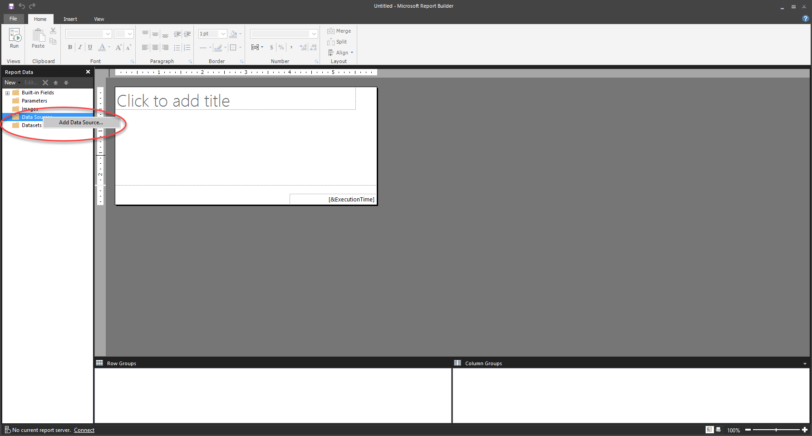
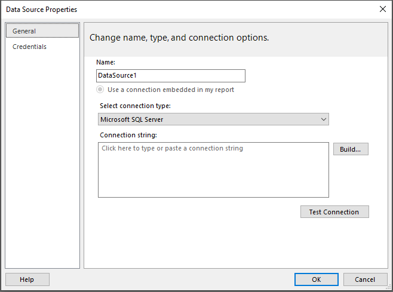
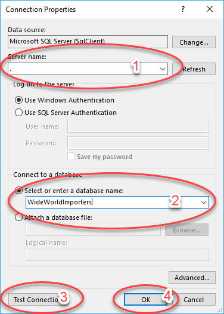
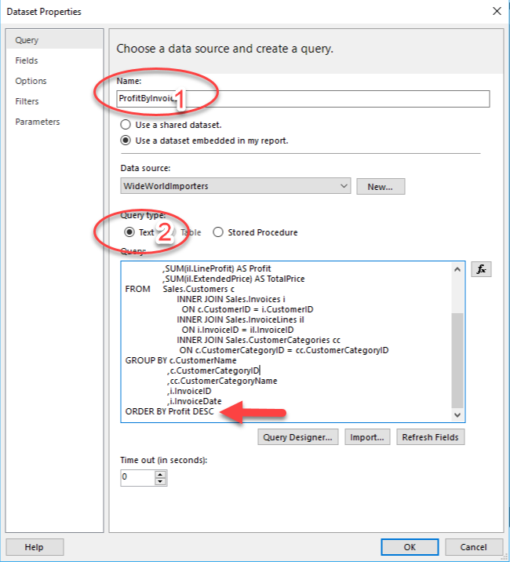

The first step in creating a report is to get data from a data source. Though this process might seem similar to getting data in Power BI, it is different. Power BI paginated reports do not use Power Query when connecting to data sources.

Getting data in a Power BI paginated report does not involve data cleaning steps. In fact, data is not stored in a Power BI paginated report dataset. When data is refreshed on the report, it is retrieved in an unaltered form from the data source, according to the query that was used to retrieve it.

Data can be collected from multiple data sources, including Microsoft Excel, Oracle, SQL Server, and many more. However, after the data has been collected, the different data sources cannot be merged into a single data model. Each source must be used for a different purpose. For instance, data from an Excel source can be used for a chart, while data from SQL Server can be used for a table on a single report. Paginated reports have an expression language that can be used to look up data in different datasets, but it is nothing like Power Query.

Power BI paginated reports can use a dataset from Power BI service. These datasets have used Power Query to clean and alter the data. The difference is that this work was done in Power BI Desktop or SQL Server Data Tools prior to using Power BI Report Builder, which doesn't have that tool in the user interface.

### Create and configure a data source

To retrieve data, open Power BI Report Builder. From the **Getting Started** screen, select **New Report**. You can choose whether to create a report with a table on it, a chart, or a blank report. For the purposes of this example, a blank report has been selected. These choices create a default visual on you're a new report, which can be changed at any time. Next, go to the **Report Data** window, which is typically on the left side of the tool, though it can be moved around.

Right-click the **Data Sources** folder and select **Add Data Source**.

> [!div class="mx-imgBorder"]
> 

On the **General** tab, name the data source.

After naming the data source, choose the correct connection string by selecting the **Build** button.

> [!div class="mx-imgBorder"]
> 

After you have selected **Build**, the **Connection Properties** screen appears. The properties on this screen will be unique for each data source. The following figure is an example of what you might see in the screen. The figure shows the properties of a SQL Server connection that you, the report author, will enter:

1.  Server name

1.  Database name

1.  A button for testing the connection

1.  Select **OK** to continue

    > [!div class="mx-imgBorder"]
	> 

You can also enter username and password information on the **Connection Properties** screen, or you can leave it on the default setting and use your Windows credentials. Select **OK** again.

You've now created a data source.

Generally, authentication is beyond the scope of this course. Typically, you will receive the connection information from your IT department, application specialist, or the software vendor.

### Create and configure a dataset

A data source is the connection information to a particular resource, like SQL Server. A dataset is the saved information of the query against the data source, not the data. The data always resides in its original location.

Right-click **Datasets** in the **Report View** window and select **Add Dataset**. Ensure that the correct data source is selected. This action will run the query against the correct data source.

From the window that displays, you can:

1.  Name the query.

1.  Choose whether to use a text command or a stored procedure.

1.  Enter a query into the text box.

> [!div class="mx-imgBorder"]
> 
