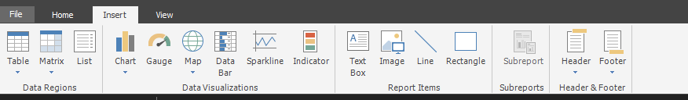
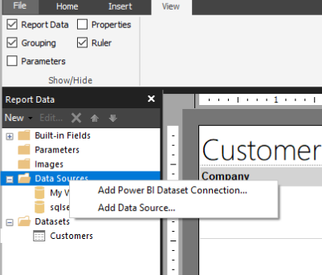
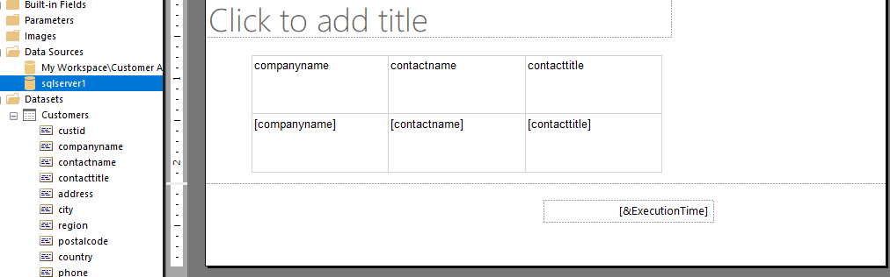
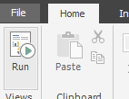
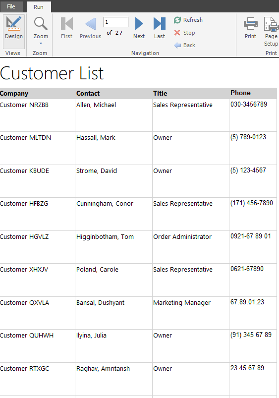
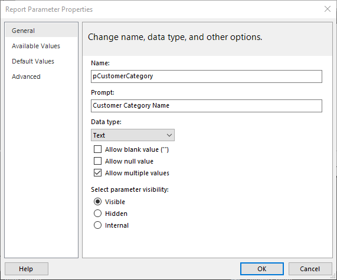
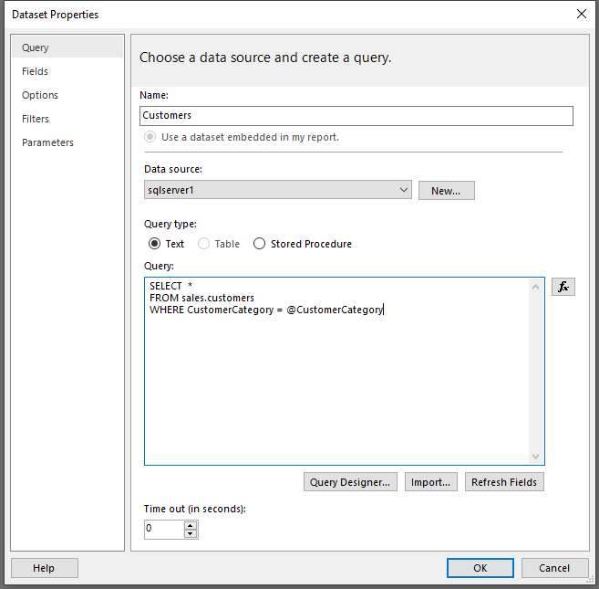

To create a report, you must add a visual to the design surface, similar to what you would do in Power BI Desktop. Select the **Insert** tab from the ribbon at the top to see your options for adding a visual.

> [!div class="mx-imgBorder"]
> 

For the purposes of this example, a table visual has been added to the design surface.

When you select the **Table** drop-down menu, you can choose from two options: **Insert Table** or **Table Wizard**. Select **Insert Table**.

> [!div class="mx-imgBorder"]
> 

You can now draw a table on the design surface. From the **Report data** window, drag fields from the dataset to the table on the design surface.

> [!div class="mx-imgBorder"]
> 

When you have finished, notice that the field is added to the lower portion of the table in the square brackets. The header will also be added. You can rename or apply formatting to the headers, such as bolding or underlining the text.

To test this simple report, select the **Run** button from the **Home** tab in the ribbon.

> [!div class="mx-imgBorder"]
> 

The report will run and display actual data in the table.

> [!div class="mx-imgBorder"]
> 

Notice that some items have changed in the report: a title was entered at the top, table headers were renamed and are in bold font, and a background color was selected on the header. These changes were implemented to help make using the report easier for the report reader.

If you want to return to the design surface, select the **Design** button.

Another aspect of creating a report is to add a parameter. Parameters can be used for different reasons, for example, when you want the user to enter information that displays on a visual on the report. The most popular reason to add a parameter is to affect which data is retrieved from the data source.

Consider the scenario where you are creating a report that retrieves data from a sales database. You only want sales data from between a begin date and an end date. In this case, you would create two parameters and then modify the dataset query to include those parameters in the WHERE clause of the query. Your first step in this situation is to add a parameter.

### Add parameters

To add a parameter, right-click **Parameters** and select **Add Parameter**.

> [!div class="mx-imgBorder"]
> 

On the **General** tab, name the parameter, select the data type, and then choose the prompt that the user will see.

> [!div class="mx-imgBorder"]
> 

On the **Available Values** tab, enter options that the user can choose from. The **Default Values** tab has the initial value of the parameter when the report loads, but it can be changed by the user.

You can also get parameter values from a query. For more information, see the [Microsoft documentation](https://docs.microsoft.com/power-bi/paginated-reports/paginated-reports-parameters/?azure-portal=true) on parameters.

After you have created a parameter, you can use it to interact with the report. If you return to the dataset, you can connect that parameter with the query.

> [!div class="mx-imgBorder"]
> 

The parameter reference starts with the at (**@**) symbol. Add the parameter name to the query text. Now, when the report refreshes, the data will be pulled from the data source according to the WHERE clause and the parameter value.
