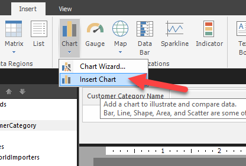
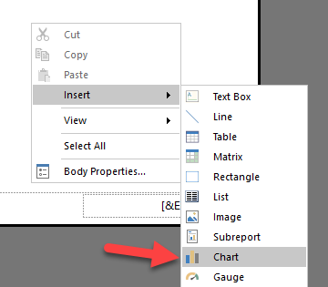
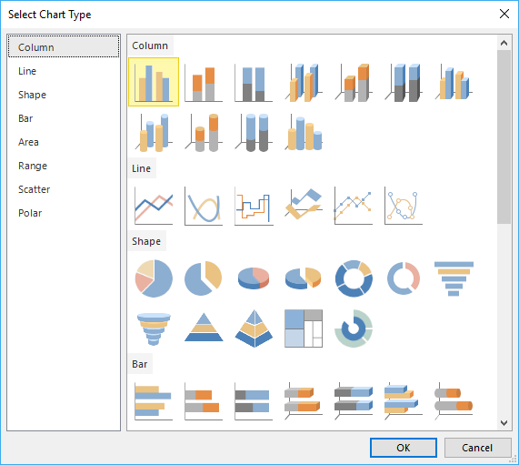
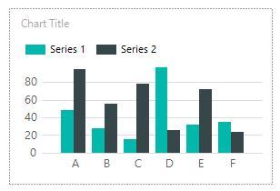
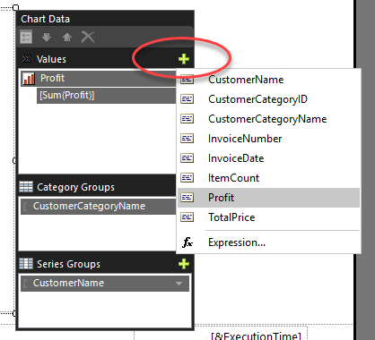

Two ways to add a chart to your report are: Select the **Chart** button, select **Insert Chart**, and then draw your table on the canvas.

Right-click the report canvas, select **Insert**, and then select **Chart**.

> [!div class="mx-imgBorder"]
> 

> [!div class="mx-imgBorder"]
> 

Next, choose the type and style of your chart.

> [!div class="mx-imgBorder"]
> 

After you have selected a chart type, the chart will be added to the design surface.

> [!div class="mx-imgBorder"]
> 

When you select the chart, a new window appears to the right. The **Chart Data** screen allows you to format the chart according to the values and axis properties.

Select the plus (**+**) sign beside each section to select the required columns.

> [!div class="mx-imgBorder"]
> 

For more information on working with charts, you can search Microsoft documentation regarding SSRS reports. All of the material in the SSRS documentation will apply to Power BI paginated reports.
