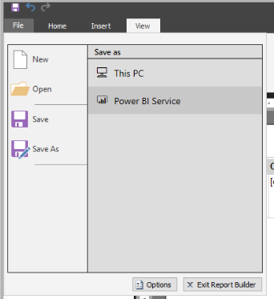

> [!div class="mx-imgBorder"]
> 

To publish your report, select **File >** **Save as** and then select **Power BI Service**. Your report will now appear in Power BI service. For more information, go to [Publish datasets and reports from Power BI Desktop](https://docs.microsoft.com/power-bi/create-reports/desktop-upload-desktop-files/?azure-portal=true).

## Best practices

Creating a report is meant to inform and drive action on the part of the report user. It isn't enough to create a report with sales information on it; the report author should always ask themselves several questions:

-   What purpose is this report for?

-   Who is using the report?

-   How can I help people do a better job?

-   What is the most important information and how can I highlight it?

-   Is this report readable?

-   Can people change the elements that they need to if their questions change?

-   Do I have visuals that are distracting from the core message of the report?

-   Is this report staying focused in a single topic or only a few topics?

-   Am I providing all information that the user expects to see in the report?

Creating good headers and footers is an excellent way to help the user interpret the report. You can provide guidance to the user by documenting why this report was created. Adding a report implementation date and time is an excellent practice. Occasionally, reports are run and then saved. People who are looking at a report will not know that they are looking at an older version unless that fact is highlighted in a footer.

Target the report for your appropriate region. English speakers read top-down, left-to-right. Putting important information, like totals, at the top of the report will highlight that information for English speakers. Europeans read dates differently than users from the US. Localize data formats to the appropriate target user.

In addition to focusing on the visual aspects of the report, a good report author will consider report delivery and data source usage. Good delivery focuses on how the user wants to see the report. Therefore, report authors should ask themselves the following questions to test the appropriate delivery format and ensure that the report is rendering correctly in that format:

-   Does the user want the report sent to them in an email message?

-   Does the user want the report in a printable format?

-   Does the user read the report in a web browser?

Pay attention to the height and width of the report page. Verify that the report is not running off the page when the report renders for the user.

A good report author creates reports that are easy on the data source. If you continue to recall data that you don't need from a data source, you will overburden the data source and affect performance in unpredictable ways. Focusing on only getting pertinent data will help you be a responsible teammate to others who are using the same data.