In this lab, you will use Power BI Report Builder to develop a pixel-perfect paginated report layout that sources data from the **AdventureWorksDW2020** SQL Server database. You will create a data source and dataset, and also configure a report parameter. The report layout will allow data to be rendered over multiple pages, and to be exported in PDF and other formats.

The final report will look like the following:

> [!div class="mx-imgBorder"]
> [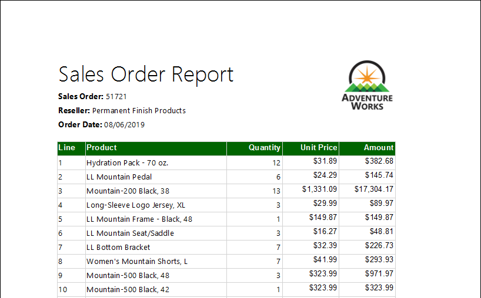](../media/lab-1-ss.png#lightbox)

In this lab, you learn how to:

-   Use Power BI Report Builder

-   Design a multi-page report layout

-   Define a data source

-   Define a dataset

-   Create a report parameter

-   Export a report to PDF

## Getting Started

In this exercise, you will open Power BI Report Builder to create and then save a report.

### Create the report

In this task, you will open Power BI Report Builder to create and then save a report.

1.  To open Power BI Report Builder, on the taskbar, click the **Power BI Report Builder** shortcut.

	> [!div class="mx-imgBorder"]
	> [](../media/lab-2-ssm.png#lightbox)

1.  In the Power BI Report Builder window, to create a new report, in the **Getting Started** window, click **Blank Report**.

	> [!div class="mx-imgBorder"]
	> [](../media/lab-3-ssm.png#lightbox)

1.  To save the report, click the **File** tab (located at the top-left), and then select **Save**.

	> [!div class="mx-imgBorder"]
	> [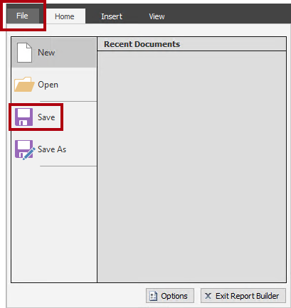](../media/lab-4-ssm.png#lightbox)

1.  In the **Save As Report** window, navigate to the **D:\DA100\MySolution** folder.

1.  In the **Name** box, enter **Sales Order Report**.

1.  Click **Save**.

## Developing the Report Layout

In this exercise, you will develop the report layout, and explore the final report design.

### Configure the report header

In this task, you will configure the report header.

1.  In the report designer, notice the default report layout, which consists of a body region and a report footer region.

	> [!div class="mx-imgBorder"]
	> [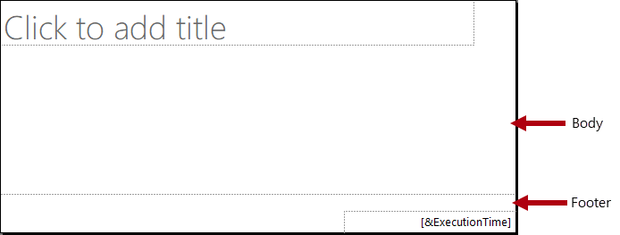](../media/lab-5-ssm.png#lightbox)

	The body contains a single textbox ready for a report title, and the report footer contains a single textbox describing the report execution time.

	The default design will render the report title once, in the body, on the first rendered page. However, you will now modify the report design by adding a report header region, and by moving the report title textbox into this region. This way, the report title will repeat on every page. You will also add an image of the company logo.

1.  To add a report header region, on the **Insert** ribbon tab, from inside the **Header & Footer** group, click **Header**, and then select **Add Header**.

	> [!div class="mx-imgBorder"]
	> [](../media/lab-6-ssm.png#lightbox)

1.  In the report designer, notice that a report header region has been added to the report layout.

1. To select the body textbox, click the "Click to add title" textbox.

1. To move the textbox, click the four-headed arrow icon, and then drag it into the header region to then drop it at the very top-left of the report header region.

	> [!div class="mx-imgBorder"]
	> [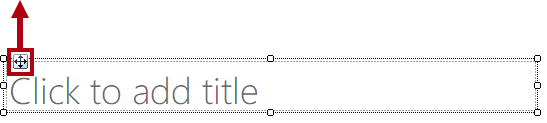](../media/lab-7-ssm.png#lightbox)

1. To modify the report title textbox text, click inside the text box, and then enter: **Sales Order Report**

	To resize the textbox, you will first open the **Properties** pane. For fine-grained control of location and size properties, you will need use the **Properties** pane.

1. On the **View** ribbon tab, from inside the **Show/Hide** group, check **Properties**.

	> [!div class="mx-imgBorder"]
	> [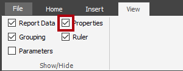](../media/lab-8-ssm.png#lightbox)

1. To select the report title textbox, first click an area outside the textbox, and then click the textbox again.

	The textbox is selected when you see the border of the textbox highlighted and resizing handles (small circles) appear on the border.

1. In the **Properties** pane (located at the right), scroll down the list to locate the **Position** group.

	> [!div class="mx-imgBorder"]
	> [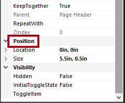](../media/lab-9-ssm.png#lightbox)

	The **Position** group allows setting exact values for the location and size of report items.

	It's important that you enter the values as directed in this lab. Pixel-perfect layout is required to achieve the page rendering at the end of the lab.

1. Within the **Position** group, expand the **Location** group, and ensure that the **Left** and **Top** properties are each set to **0in**.

	The location and size units are in inches because the regional settings of the lab virtual machine is set to the United States. If your region uses metric measurements, centimeters would be the default unit.

1. Within the **Position** group, expand the **Size** group, and then set the **Width** property to **4**.

	> [!div class="mx-imgBorder"]
	> [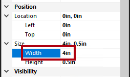](../media/lab-10-ssm.png#lightbox)

1. To insert an image, on the **Insert** ribbon tab, from inside the **Report Items** group, click **Image**.

	> [!div class="mx-imgBorder"]
	> [](../media/lab-11-ssm.png#lightbox)

1. To add the image to the report design, click inside the report header region, to the right of the report title textbox.

1. In the **Image Properties** window, to import from an image file, click **Import**.

	> [!div class="mx-imgBorder"]
	> [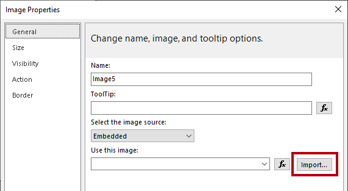](../media/lab-12-ssm.png#lightbox)

1. In the **Open** window, navigate to the **D:\DA100\Data** folder, and then select the **AdventureWorksLogo.jpg** file.

1. Click **Open**.

1. In the **Image Properties** window, click **OK**.

1. In the report designer, notice that the image was added, and is selected.

1. To position and resize the image, in the **Properties** pane, configure the following properties:

	|     Property                        |     Value    |
	|-------------------------------------|--------------|
	|     Position \| Location \| Left    |     5        |
	|     Position \| Location \| Top     |     0        |
	|     Position \| Size \| Width       |     1        |
	|     Position \| Size \| Height      |     1        |
                                 

1. To resize the report header region, first select the region by clicking a blank area of the region.

1. In the **Properties** pane, set the **General | Height** property to **1**.

1. Verify that the report header region contains a single textbox and image, and looks like the following:

	> [!div class="mx-imgBorder"]
	> [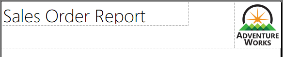](../media/lab-13-ss.png#lightbox)

1. To save the report, on the **File** tab, click **Save**.

	> [!TIP]
	> You can also click the disk icon located at the top-left.

	> [!div class="mx-imgBorder"]
	> [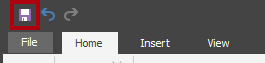](../media/lab-14-ssm.png#lightbox)

You are now ready to configure the report to retrieve a database query result.

### Retrieve data

In this task, you will create a data source and dataset to retrieve a query result from the **AdventureWorksDW2020** SQL Server database.

1. In the **Report Data** pane (located at the left), right-click the **Data Sources** folder, and then select **Add Data Source**.

	> [!div class="mx-imgBorder"]
	> [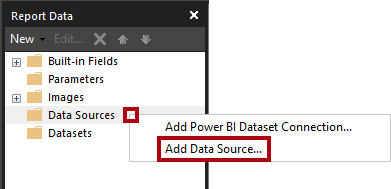](../media/lab-15-ssm.png#lightbox)

	It is possible to retrieve data from cloud or on-premises databases, or a Power BI dataset.

1. In the **Data Source Properties** window, in the **Name** box, replace the text with **AdventureWorksDW2020**.

1. In the **Select Connection Type** dropdown list, notice that **Microsoft SQL Server** is selected.

1. To build the connection string, click **Build**.

	> [!div class="mx-imgBorder"]
	> [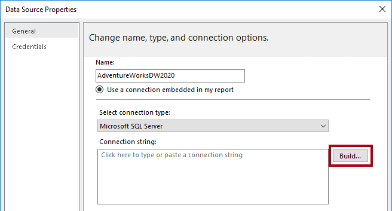](../media/lab-16-ssm.png#lightbox)

1. In the **Connection Properties** window, in the **Server Name** box, enter **localhost**.

	In the labs, you will connect to the SQL Server database by using **localhost**. This isn't a recommended practice, however, when creating your own solutions. It's because gateway data sources cannot resolve **localhost**.

1. In the **Select or Enter a Database Name** dropdown list, select the **AdventureWorksDW2020**.

1. Click **OK**.

1. In the **Data Source Properties** window, click **OK**.

1. In the **Report Data** pane, notice the addition of the **AdventureWorksDW2020** data source.

	> [!div class="mx-imgBorder"]
	> [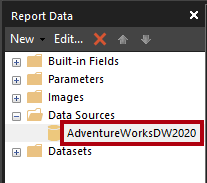](../media/lab-17-ssm.png#lightbox)

1. To create a dataset, in the **Report Data** pane, right-click the **AdventureWorksDW2020** data source, and then select **Add Dataset**.

	> [!div class="mx-imgBorder"]
	> [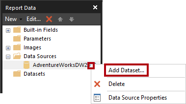](../media/lab-18-ssm.png#lightbox)

	A report dataset is a different in purpose and structure from a Power BI dataset.

1. In the **Dataset Properties** window, in the **Name** box, replace the text with **SalesOrder**.

1. To import a pre-defined query, click **Import**.

	> [!div class="mx-imgBorder"]
	> [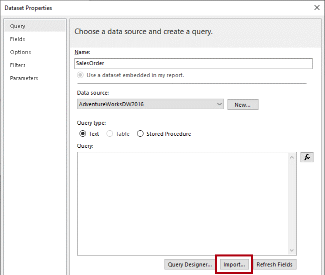](../media/lab-19-ssm.png#lightbox)

1. In the **Import Query** window, navigate to the **D:\DA100\Lab13A\Assets** folder, and then select the **SalesOrder.sql** file.

1. Click **Open**.

1. In the **Query** box, review the query, and be sure to scroll down to the bottom of the query text.

	It is not important that you understand the details of the query statement. It has been designed to retrieve sales order line details. The WHERE clause includes a predicate to restrict the query result to a single sales order. The ORDER BY clause ensures the rows are returned by line number order.

1. Notice the use of **\@SalesOrderNumber** in the WHERE clause, which represents a query parameter.

	> [!div class="mx-imgBorder"]
	> [](../media/lab-20-ssm.png#lightbox)

	A query parameter is a placeholder for a value that will be passed in at query execution time. You will configure a report parameter to prompt the report user for a single sales order number which will then be passed to the query parameter.

1. Click **OK**.

1. In the **Report Data** pane, notice the addition of the **SalesOrder** dataset and its fields.

	> [!div class="mx-imgBorder"]
	> [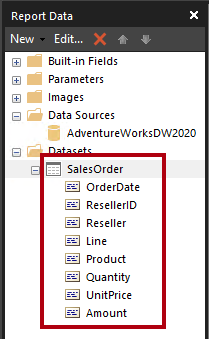](../media/lab-21-ssm.png#lightbox)

	Fields are used to configure data regions in the report layout. They were derived from the dataset query columns.

1. Save the report.

### Configure the report parameter

In this task, you will configure the report parameter with a default value.

1. In the **Report Data** pane, expand the **Parameters** folder to reveal the **SalesOrderNumber** report parameter.

	> [!div class="mx-imgBorder"]
	> [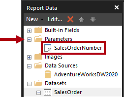](../media/lab-22-ssm.png#lightbox)

	The **SalesOrderNumber** report parameter was added automatically when the dataset was created. This is because the dataset query included the **\@SalesOrderNumber** query parameter.

1. To edit the report parameter, right-click the **SalesOrderNumber** report parameter, and then select **Parameter Properties**.

	> [!div class="mx-imgBorder"]
	> [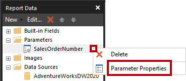](../media/lab-23-ssm.png#lightbox)

1. In the **Report Parameter Properties** window, at the left, select the **Default Values** pages.

	> [!div class="mx-imgBorder"]
	> [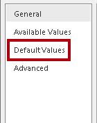](../media/lab-24-ssm.png#lightbox)

1. Select the **Specify Values** option.

	> [!div class="mx-imgBorder"]
	> [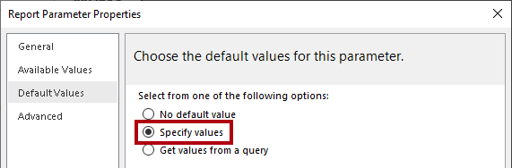](../media/lab-25-ssm.png#lightbox)

1. To add a default value, click **Add**.

1. In the **Value** dropdown list, replace the text with **43659**.

	> [!div class="mx-imgBorder"]
	> [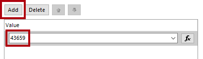](../media/lab-26-ssm.png#lightbox)

	Sales order 43659 is the value you will initially use to test the report design.

1. Click **OK**.

1. Save the report.

You will now complete the report header region design by adding textboxes to describe the sales order.

### Finalize the report header layout

In this task, you will finalize the report header region design by adding textboxes.

1. To add a textbox to the report header region, on the **Insert** ribbon tab, from inside the **Report Items** group, click **Text Box**.

	> [!div class="mx-imgBorder"]
	> [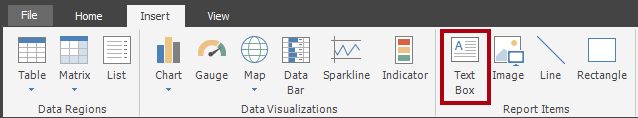](../media/lab-27-ssm.png#lightbox)

1. Click inside the report header region, directly beneath the report title textbox.

1. Inside the textbox, enter **Sales Order:** followed by a space.

1. To insert a place holder, immediately after the space just entered, right-click and then select **Create Placeholder**.

	> [!div class="mx-imgBorder"]
	> [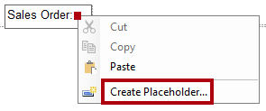](../media/lab-28-ssm.png#lightbox)

1. In the **Placeholder Properties** window, at the right of the **Value** dropdown list, click the **fx** button.

	> [!div class="mx-imgBorder"]
	> [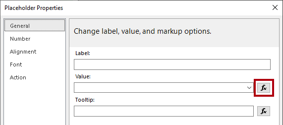](../media/lab-29-ssm.png#lightbox)

	The **fx** button allows entering a custom expression. This expression will be used to return the sales order number.

1. In the **Expression** window, in the **Category** list, select **Parameters**.

	> [!div class="mx-imgBorder"]
	> [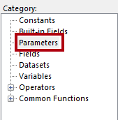](../media/lab-30-ssm.png#lightbox)

1. In the **Values** list, double-click the **SalesOrderNumber** parameter.

1. In the expression box, notice that a programmatic reference to the **SalesOrderNumber** report parameter was added.

	> [!div class="mx-imgBorder"]
	> [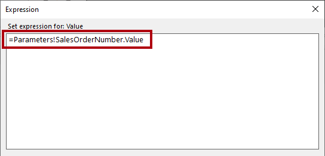](../media/lab-31-ssm.png#lightbox)

1. Click **OK**.

1. In the **Placeholder Properties** window, click **OK**.

1. Click a blank area of the report header region, and then select the new textbox.

1. In the **Properties** pane, configure the following position properties:
                              

	|     Property                        |     Value    |
	|-------------------------------------|--------------|
	|     Position \| Location \| Left    |     0        |
	|     Position \| Location \| Top     |     0.5      |
	|     Position \| Size \| Width       |     4        |
	|     Position \| Size \| Height      |     0.25     |

1. To format part of the textbox text, inside the new textbox, select only the **Sales Order:** text.

	> [!div class="mx-imgBorder"]
	> [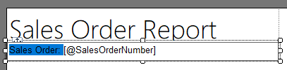](../media/lab-32-ss.png#lightbox)

1. On the **Home** ribbon tab, from inside the **Font** group, click the **Bold** command.

	> [!div class="mx-imgBorder"]
	> [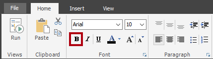](../media/lab-33-ssm.png#lightbox)

1. Add another textbox to the report header region, and then enter the text **Reseller:** followed by a space.

	> [!TIP]
	> You can also add a textbox by right-clicking the canvas, and then selected **Insert | Text Box**.

1. After the space, insert a placeholder, and then set the value of the placeholder to use an expression.

1. In the **Expression** window, in the **Category** list, select **Datasets**.

	> [!div class="mx-imgBorder"]
	> [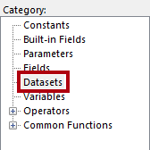](../media/lab-34-ssm.png#lightbox)

1. Base the expression value on **First(Reseller)** value.

1. In the **Properties** pane, configure the following position properties:

	|     Property                        |     Value    |
	|-------------------------------------|--------------|
	|     Position \| Location \| Left    |     0        |
	|     Position \| Location \| Top     |     0.75     |
	|     Position \| Size \| Width       |     4        |
	|     Position \| Size \| Height      |     0.25     |
	                                 

1. Format the **Reseller:** text in bold.

1. Add a third (and last) textbox to the report header region, and then enter the text **Order Date:** followed by a space.

1. After the space, insert a placeholder, and set the value of the placeholder to use an expression based on the **Datasets** category, **First(OrderDate)** value.

	> [!div class="mx-imgBorder"]
	> [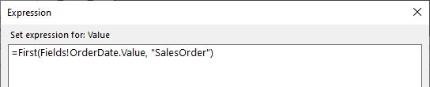](../media/lab-35-ss.png#lightbox)

1. To format the date value, in the **Placeholder Properties** window, select the **Number** page.

	> [!div class="mx-imgBorder"]
	> [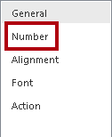](../media/lab-36-ssm.png#lightbox)

1. In the **Category** list, select **Date**.

	> [!div class="mx-imgBorder"]
	> [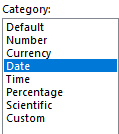](../media/lab-37-ss.png#lightbox)

1. In the **Type** list, select a suitable date format type.

1. In the **Placeholder Properties** window , click **OK**.

1. In the **Properties** pane, configure the following position properties:

	|     Property                        |     Value    |
    |-------------------------------------|--------------|
    |     Position \| Location \| Left    |     0        |
    |     Position \| Location \| Top     |     1        |
    |     Position \| Size \| Width       |     4        |
    |     Position \| Size \| Height      |     0.25     |

1. Format the **Order Date:** text in bold.

1. Finally, click a blank area of the report header region.

1. In the **Properties** pane, set the **Height** property to **1.5**.

1. Verify that the report header region looks like the following:

	> [!div class="mx-imgBorder"]
	> [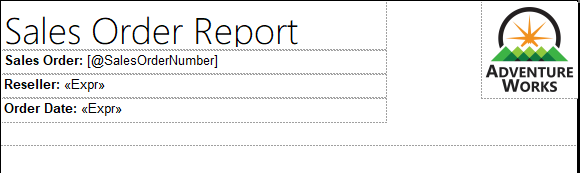](../media/lab-38-ss.png#lightbox)

1. Save the report.

1. To preview the report, on the **Home** ribbon tab, from inside the **Views** group, click **Run**.

	> [!div class="mx-imgBorder"]
	> [](../media/lab-39-ssm.png#lightbox)

	Running the report renders the report in HTML. As the only report parameter has a default value, the report will run automatically.

1. Verify that the rendered report looks like the following:

	> [!div class="mx-imgBorder"]
	> [](../media/lab-40-ss.png#lightbox)

1. To return to design view, on the **Run** ribbon tab, from inside the **Views** group, click **Design**.

	> [!div class="mx-imgBorder"]
	> [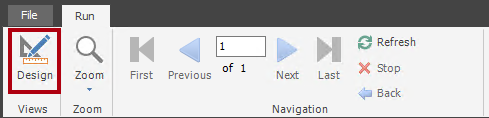](../media/lab-41-ssm.png#lightbox)

You will now add a table to the report body to display a formatted layout of the sales order lines.

### Add a table data region

In this task, you will add a table data region to the report body.

1. On the **Insert** ribbon tab, from inside the **Data Regions** group, click **Table**, and then select **Insert Table**.

	> [!div class="mx-imgBorder"]
	> [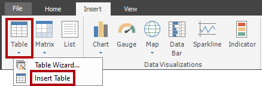](../media/lab-42-ssm.png#lightbox)

1. To add the table, click a blank area inside the report body.

1. In the **Properties** pane, configure the following position properties:

	|     Property                        |     Value    |
	|-------------------------------------|--------------|
	|     Position \| Location \| Left    |     0        |
	|     Position \| Location \| Top     |     0        |
                                 

	The table will display five columns. By default, the table template includes only three columns.

1. To add a column to the table, right-click inside any cell of the last column, and then select **Insert Column | Right**.

	> [!div class="mx-imgBorder"]
	> [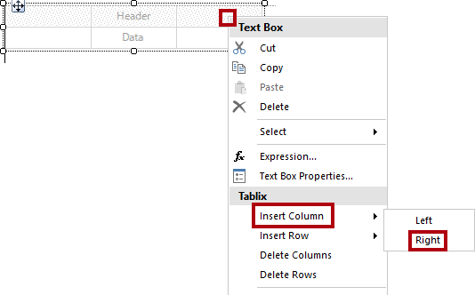](../media/lab-43-ssm.png#lightbox)

1. Repeat the last step to add a second new column.

1. Hover the cursor over the cell in the second row of the first column to reveal the field picker icon.

	> [!div class="mx-imgBorder"]
	> [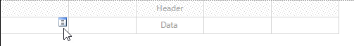](../media/lab-44-ss.png#lightbox)

1. Click the field picker icon, and then select the **Line** field.

	> [!div class="mx-imgBorder"]
	> [](../media/lab-45-ssm.png#lightbox)

1. Notice that the table now includes a text value in the first row (header), and a field reference in the detail row.

	> [!div class="mx-imgBorder"]
	> [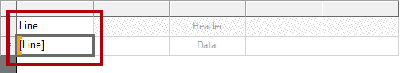](../media/lab-46-ssm.png#lightbox)

1. Add fields to the next four columns, in order, as follows:

	-   Product
	
	-   Quantity
	
	-   UnitPrice
	
	-   Amount

1. Verify that the table design looks like the following:

	> [!div class="mx-imgBorder"]
	> [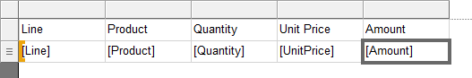](../media/lab-47-ss.png#lightbox)

1. Save the report.

1. Preview the report.

	> [!div class="mx-imgBorder"]
	> [](../media/lab-48-ssm.png#lightbox)

	> [!div class="mx-imgBorder"]
	> [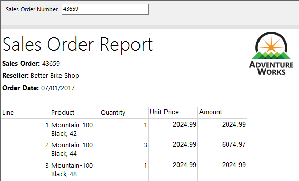](../media/lab-49-ss.png#lightbox)

The table includes a header and 12 sales order line rows. There are many improvements that can be made by formatting the table layout.

In the next task you will:

-   Format the table header by using a background color and bold font style

-   Modify column widths to remove redundant space and to prevent long text values from wrapping

-   Left-justify the first column values

-   Right-justify the last three column values

-   Format currency values using a currency symbol (for USD)

-   Add and format a total row for the table

### Format the table data region

In this task, you will format the table data region.

1. Return to design view.

1. Click any cell in the table to reveal the gray cell guides.

	> [!div class="mx-imgBorder"]
	> [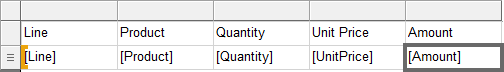](../media/lab-50-ss.png#lightbox)

	The cell guides are there to help you configure entire rows or columns.

1. To format the table header, click the header row guide.

	> [!div class="mx-imgBorder"]
	> [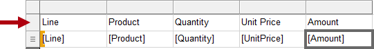](../media/lab-51-ssm.png#lightbox)

	Selecting a row or a column guide selects all cells in the row or column. Each cell is in fact a textbox. Formatting single textbox or a multi-selection of textboxes can then be achieved by using the **Properties** pane, or the ribbon commands.

1. In the **Properties** pane (or the ribbon), configure the following properties:

	|     Property                      |     Value                                                                     |
	|-----------------------------------|-------------------------------------------------------------------------------|
	|     Fill \| BackgroundColor       |     DarkGreen (tip: hover the cursor over each color to reveal its name)    |
	|     Font \| Color                 |     White                                                                     |
	|     Font \| Font \| FontWeight    |     Bold                                                                      |
                               
1. Select the first column guide.

	> [!div class="mx-imgBorder"]
	> [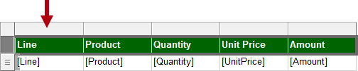](../media/lab-52-ssm.png#lightbox)

1. In the **Properties** pane, set the **Position | Size | Width** property to **0.5**.

1. Set the width of the second column to **2.5**.

1. While pressing the **Ctrl** key, multi-select the last three column header textboxes (**Quantity**, **Unit Price** and **Amount**).

1. In the **Properties** pane (or ribbon), set the **Alignment | TextAlign** property to **Right**.

1. Set the **Line** detail textbox to left align.

	> [!div class="mx-imgBorder"]
	> [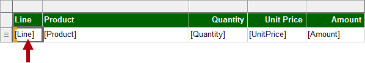](../media/lab-53-ssm.png#lightbox)

1. On the **Home** ribbon tab, from inside the **Number** group, set the last two detail (not header) textboxes (**UnitPrice** and **Amount**) to format with a currency symbol.

	> [!div class="mx-imgBorder"]
	> [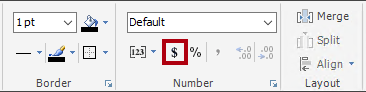](../media/lab-54-ssm.png#lightbox)

1. To add a total row to the table, right-click the **Quantity** detail textbox, and then select **Add Total**.

	> [!div class="mx-imgBorder"]
	> [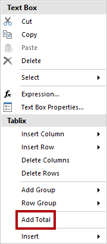](../media/lab-55-ssm.png#lightbox)

1. Notice that a new row, which represents the table footer, has been added, and that the expression will evaluate the sum of **Quantity** values.

1. Repeat the last step to add a total for the **Amount** detail textbox.

1. In the first cell of the table footer row, enter the word **Total**.

1. Format all textboxes in the footer row to format as bold.

1. Verify that the table design looks like the following:

	> [!div class="mx-imgBorder"]
	> [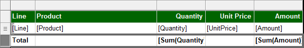](../media/lab-56-ss.png#lightbox)

1. To remove any trailing space after the table, hover the cursor over the dashed line between the report body and report footer region, and then drag upwards to touch the bottom of the table.

	> [!div class="mx-imgBorder"]
	> [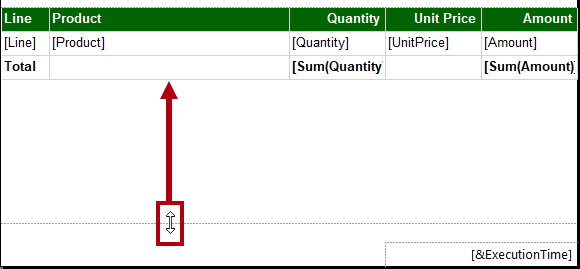](../media/lab-57-ssm.png#lightbox)

1. Save the report

1. Preview the report.

1. Verify that the rendered report looks like the following:

	> [!div class="mx-imgBorder"]
	> [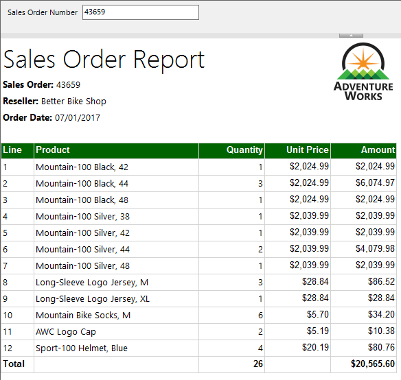](../media/lab-58-ss.png#lightbox)

1. In the **Sales Order Number** parameter box, replace the value with **51721**.

	> [!div class="mx-imgBorder"]
	> [](../media/lab-59-ssm.png#lightbox)

1. To re-run the report, at the right, click **View Report**.

	> [!div class="mx-imgBorder"]
	> [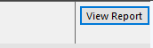](../media/lab-60-ss.png#lightbox)

	This sales order has 72 sales order lines, and so the data will render over many pages.

1. To navigate to the second page of the report, on the **Run** ribbon tab, from inside the **Navigation** group, click **Next**.

	> [!div class="mx-imgBorder"]
	> [](../media/lab-61-ssm.png#lightbox)

1. On page 2, notice that the table header does not appear.

	You will address this issue in the next task.

1. Scroll to the bottom of the page, and then notice that the report footer displays only the execution time.

In the next task, you will improve the footer text by appending the page number.

### Finalize the report design

In this task, you will finalize the report design by ensuring multi-page reports render appropriately.

1. Switch to the design view.

1. To ensure the table header repeats on all pages, first select any textbox of the table.

1. In the **Grouping** pane (located along the bottom of the report designer), at the far right of the **Column Groups**, click the down-arrow, and then select **Advanced Mode**.

	> [!div class="mx-imgBorder"]
	> [](../media/lab-62-ssm.png#lightbox)

1. In the **Row Groups** section, select the first static group.

	> [!div class="mx-imgBorder"]
	> [](../media/lab-63-ssm.png#lightbox)

	This selected the table header row.

1. In the **Properties** pane, set the **Other | RepeatOnNewPage** property to **True**.

	This ensures that the first static group (representing the table header) will repeat on all pages.

1. In the table footer region, right-click the **ExecutionTime** textbox, and then select **Expression**.

	> [!div class="mx-imgBorder"]
	> [](../media/lab-64-ssm.png#lightbox)

1. In the **Expression** window, in the expression box, append a space, followed by **& " | Page " &**, to produce the following:

	```vbscript
	=Globals!ExecutionTime & " | Page " &
	```

1. Ensure that a space follows the last ampersand (&).

1. In the **Category** list, select **Built-in Fields**.

	> [!div class="mx-imgBorder"]
	> [](../media/lab-65-ssm.png#lightbox)

1. To inject the page number value into the expression, in the **Item** list, double-click **PageNumber**.

1. Verify that the complete expression reads as follows:

	> [!div class="mx-imgBorder"]
	> [](../media/lab-66-ss.png#lightbox)

1. Click **OK**.

1. Drag the left side of the textbox to increase the width to the width of the report page.

	> [!div class="mx-imgBorder"]
	> [](../media/lab-67-ssm.png#lightbox)

	The design of the report is now complete. Lastly, you will ensure that the page width is set to exactly six inches, and also remove the report parameter default value.

1. To select the report body, right-click any table textbox, and then select **Select | Body**.

	> [!div class="mx-imgBorder"]
	> [](../media/lab-68-ssm.png#lightbox)

	As the table fills the entire report body, this technique must be used to select the report body.

1. In the **Properties** pane, ensure that the **Position | Size | Width** property is set to **6**.

	It is important the width is not greater than six inches, as rendering to print format would break the table up across multiple pages.

1. In the **Report Data** pane, open the **SalesOrderNumber** report parameter properties.

1. On the **Default Values** page, select the **No Default Value** option.

	> [!div class="mx-imgBorder"]
	> [](../media/lab-69-ssm.png#lightbox)

1. Click **OK**.

1. Save the report.

### Explore the final report

In this task, you will view the report in print layout mode.

1. Preview the report.

1. In the **Sales Order Number** parameter box, enter the value with **51721**

1. On the **Run** ribbon tab, from inside the **Print** group, click **Print Layout**.

	> [!div class="mx-imgBorder"]
	> [](../media/lab-70-ssm.png#lightbox)

	Print layout mode provides a preview of what the report will look like when printed to the strict page size.

1. Navigate to pages 2 and 3.

In this lab, you won't publish the report. Paginated reports can only be rendered in the Power BI service when they are stored in a workspace on dedicated capacity, and when that capacity has the paginated reports workload enabled.

