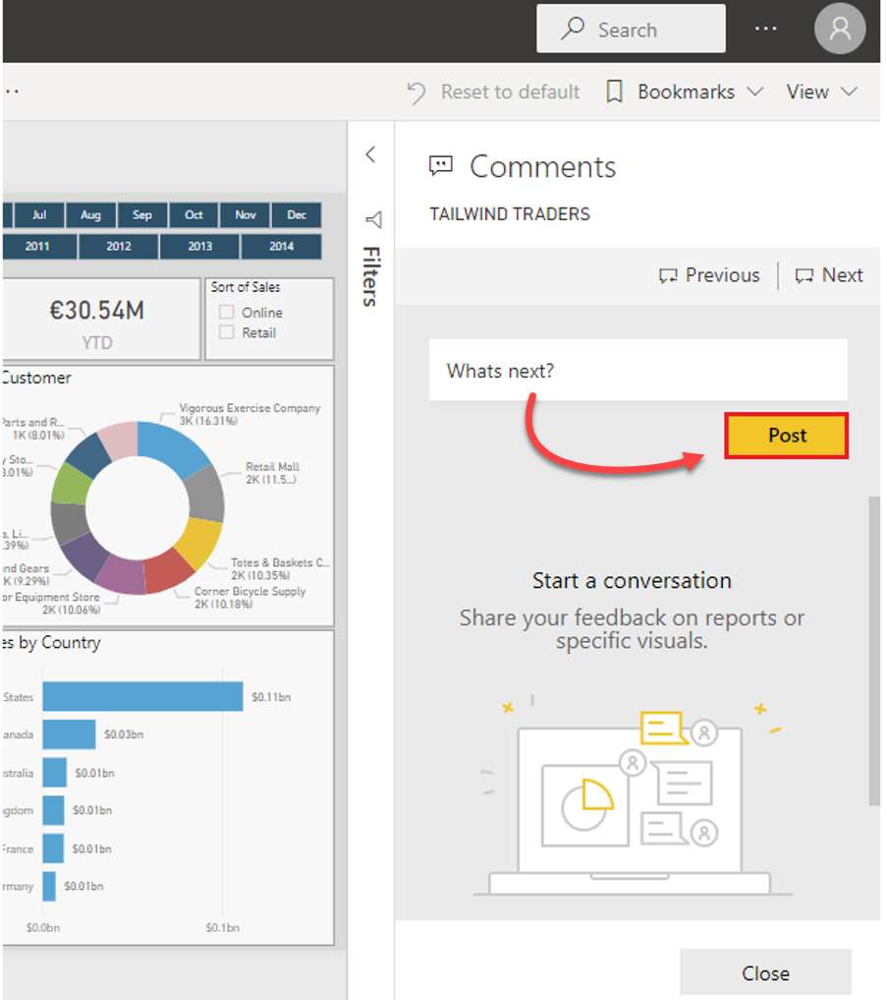
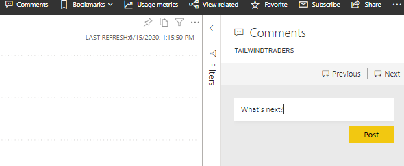

When you publish your report to Power BI web service, the consumers of your report can add comments to it. Comments can be useful for personal comments or for starting a conversation about a report item with your colleagues. For example, users can comment on pages or visuals that they are experiencing issues with, or they could give you suggestions for changes or improvements.

Comments are also available for paginated reports, dashboards, and visuals. Anyone with the right permissions can see those comments. When you add a comment to a specific visual rather than the report as a whole, the context of the comment is clearer and acts like a personal bookmark.

To add or view comments on a report, open the report in Power BI web service. In the upper-right corner, select **Comments**. In the **Comments** pane, you can view existing comments and write your own comments, and then select **Post Comment**.

> [!div class="mx-imgBorder"]
> 

To add a comment from a visual, select the visual in the report to open it in focus mode. Select **Comments** from the top menu and enter your comment in the **Comments** pane that displays.

> [!div class="mx-imgBorder"]
> 
