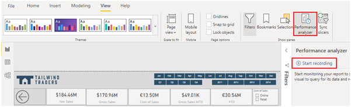
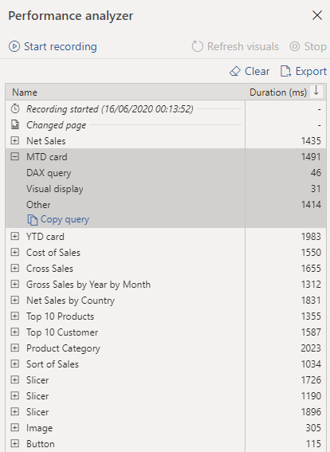
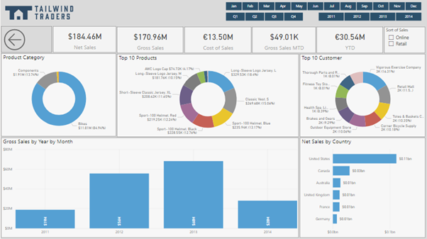

When you have completed creating your report, the performance of that report depends on how quickly data can load onto the report page. You should test out your report in the Power BI Report Server, to see how it works from an end-user perspective. If you experience any issues yourself, or if the report users have reported issues, you need to investigate the cause of those issues, and take measures to tune the report for more optimized performance.

## Analyze performance

To investigate the cause of issues, your first port of call is the **Performance analyzer** tool within Power BI Desktop. **Performance analyzer** allows you to find out how each of your report elements, such as visuals and DAX formulas, are performing. **Performance analyzer** provides you with logs which measure (in time duration) how each of your report elements performs when users interact with them. By looking closely at the durations in the logs, you can identify which elements of the report are the most (or least) resource intensive. You can find where the bottlenecks are and this gives you a good starting point for making changes.

Before you run **Performance analyzer**, ensure you clear the visual cache and data engine cache, otherwise the results will not be accurate. Also, you should set up the report so that it opens on a blank page.

When you have cleared the caches, and opened the report on the blank page, to run the **Performance analyzer**, go to **View** tab, select **Performance analyzer**, and then select **Start Recording**. 

> [!div class="mx-imgBorder"]
> 

Interact with your report as you would expect a user to, then stop the recording. You will see the results of your interactions displaying in the **Performance analyzer** pane as you work. When you are finished, select the **Stop** button. You can then analyze the results in the **Performance analyzer** pane. You will see the performance results of each item in the report, in milliseconds, under the **Duration** column. In the following image, you can see that all of the items on the report take less than two seconds to load, which is not bad. You can expand an item in the list to view more detailed information and identify what exactly is causing the issue, such as the Data Analysis Expressions (DAX) query, the visual display or something else (other).

> [!div class="mx-imgBorder"]
> 

If you want to take a close look at the DAX query, select **Copy query** and then paste it into DAX Studio, for further analysis. DAX Studio is a free, open-source tool provided by a third party that you can download and install on your computer.

## Tune performance

The results of your analysis will identify areas for improvement and highlight items that you need to optimize.

A common reason for poor performance is too many visuals on the same page. In the following image you can see an example of a busy page that contains many visuals.

> [!div class="mx-imgBorder"]
> 

If you identify visuals as the bottleneck leading to poor performance, you can take the following steps to tune the report:

-   Reduce the number of visuals on the report page; fewer visuals means better performance. If a visual is not necessary and does not add value to the end user, should remove it. Rather than using multiple visuals on the page, consider other ways to provide additional details, such as drillthrough pages and report page tooltips.

-   Reduce the number of fields in each visual. The upper limit for visuals is 100 fields, so a visual with more than 100 fields will be slow to load (and look cluttered and confusing). Identify fields that are not valuable to the visual and remove them.

If you find that visuals are not causing the performance issues, you should take a close look at the DAX Query results that are displayed in the **Performance analyzer** pane, and investigate further into those. For example, you might need to look elsewhere in your data model, such as the relationships and columns.

When you have made all your changes to performance tune the report, and you believe the report is performing well from your perspective but some users are experiencing poor performance, there might be other factors impacting on the performance. These factors include the bandwidth, server, firewall, and other external, uncontrollable factors. You might need to speak to the Information Technology (IT) Team in your organization, to see if they can shed any light on why users are experiencing poor performance when using your reports.
